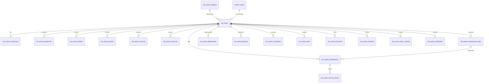
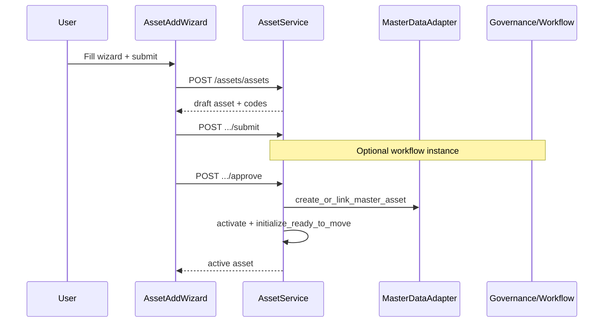

# Asset Management Module — Complete Codebase Analysis

**Scope:** Asset Management only (`apps/api/src/modules/asset/**`, `apps/web` Assets UI).  
**Method:** Source-code inspection only (no design-doc assumptions).  
**API base:** `/api/v1/assets` (mounted in `apps/api/src/shared/router.py` before Master Data).

---

## Table of Contents

1. [Executive Summary](#1-executive-summary)
2. [Backend Analysis](#2-backend-analysis)
3. [Frontend Analysis](#3-frontend-analysis)
4. [Routing Analysis](#4-routing-analysis)
5. [Complete Workflow Analysis](#5-complete-workflow-analysis)
6. [Feature Matrix](#6-feature-matrix)
7. [Missing Features](#7-missing-features)
8. [Code Quality Review](#8-code-quality-review)
9. [Current System Flow](#9-current-system-flow)
10. [Integration Analysis](#10-integration-analysis)
11. [Recommendations](#11-recommendations)
12. [Final Assessment](#12-final-assessment)

---

## 1. Executive Summary

### Overall status

The Asset module is a **substantially implemented** modular-monolith slice (Sprint 15 / ERD_15). It covers registration, custody (assignment/transfer/location), warranty/insurance, maintenance, depreciation with real formulas, disposal/revaluation with Finance posting, audits, documents metadata, checklists, meters, notifications records, reports/export, Excel import, and a rich Next.js workspace UI.

### Approximate completion

| Layer | Completion | Notes |
|-------|------------|-------|
| Database (`asset` schema, 20 tables) | **~95%** | Soft-delete columns present; no DELETE HTTP API |
| Backend APIs + business logic | **~85%** | Full CRUD + lifecycle; governance/workflow gated |
| Frontend workspaces | **~80%** | Dedicated UIs wired to APIs; types/settings shells |
| Background jobs / alerts | **~40%** | Depreciation draft scheduler works; alerts count-only |
| **Overall product** | **~78%** | Usable for core lifecycle; gaps below |

### Major implemented features

- Asset category CRUD + deactivate/reactivate
- Asset registration (create/update) with full Create DTO fields
- Submit / approve / reject / cancel / reopen / resubmit
- Master-asset link on approve (`C-01`)
- Assignment issue/return (wizard + workspace) with custodian sync
- Transfer with location history + master sync
- Maintenance plans (activate/pause/resume/close) and work orders
- Depreciation calculate (SL / WDV / UoP), post, reverse, period generate-run
- Disposal / revaluation with Finance journal posting
- Excel bulk import (`POST /assets/import`)
- Reports catalog/run/export
- QR/barcode UI (client-side QR to self-service URL)
- Operations dashboard + inventory list with filters/export
- Permission seed (85 codes) + roles; router permissions aligned

### Missing or incomplete

- Soft-delete / hard DELETE HTTP endpoints
- Multipart file upload for documents (URI metadata only)
- Backend QR image generation/persistence API
- Celery alert tasks do not dispatch notifications
- FE `asset-types` and `settings` are static shells
- No Next.js route middleware; FE RBAC mostly inventory-only
- Orphan `asset-registration-workspace.tsx` (not routed)
- Inventory-import page not in locked sidebar nav
- Check-in/check-out as separate visitor-style flow — **not present** (assignment/return covers custody)

### Production readiness

**Not fully production-hardened**, but **core happy paths are operational** for an internal ERP beta: register → approve → assign/transfer → maintain → depreciate → dispose, with Finance posts and optional workflow governance.

**Production readiness score: 7 / 10** (see §12).

---

## 2. Backend Analysis

### 2.1 Database

**Schema:** `asset`  
**Prefix:** `ast_`  
**Migrations:** `0245` (schema) → `0246`–`0264` (tables) → `0265` (permissions) → `0266` (workflow seeds)  
Paths: `apps/api/alembic/versions/0245_create_asset_schema.py` … `0266_seed_asset_workflows.py`

#### Tables (20 business models)

Exported from `apps/api/src/modules/asset/models/__init__.py`:

| Table | Model | Purpose |
|-------|-------|---------|
| `ast_asset_category` | `AstAssetCategory` | Taxonomy + default life/method + GL UUID refs |
| `ast_asset` | `AstAsset` | Operational register |
| `ast_asset_component` | `AstAssetComponent` | Sub-assemblies |
| `ast_asset_assignment` | `AstAssetAssignment` | Custody issue/return |
| `ast_asset_transfer` | `AstAssetTransfer` | Branch/dept/employee moves |
| `ast_asset_location` | `AstAssetLocation` | Location history trail |
| `ast_asset_warranty` | `AstAssetWarranty` | Warranty coverage |
| `ast_asset_insurance` | `AstAssetInsurance` | Insurance policies |
| `ast_asset_maintenance_plan` | `AstAssetMaintenancePlan` | Preventive schedules |
| `ast_asset_maintenance` | `AstAssetMaintenance` | Work orders |
| `ast_asset_service_history` | `AstAssetServiceHistory` | Post-maintenance history |
| `ast_asset_depreciation` | `AstAssetDepreciation` | Period depreciation runs |
| `ast_asset_disposal` | `AstAssetDisposal` | Disposal / write-off |
| `ast_asset_revaluation` | `AstAssetRevaluation` | Book-value revaluation |
| `ast_asset_audit` | `AstAssetAudit` | Physical verification |
| `ast_asset_document` | `AstAssetDocument` | Document metadata |
| `ast_asset_checklist` | `AstAssetChecklist` | Checklist JSON items |
| `ast_asset_meter_reading` | `AstAssetMeterReading` | Usage meters |
| `ast_asset_notification` | `AstAssetNotification` | Notification records |
| `ast_asset_report` | `AstAssetReport` | Report snapshots |

Also: `AstDocumentSequence` (numbering helper; not in the 20 export list).

#### Shared columns (mixins)

`apps/api/src/modules/asset/models/mixins.py` + `apps/api/src/database/mixins.py`:

- Audit: `created_at`, `created_by`, `updated_at`, `updated_by`
- Tenant / company isolation; soft delete: `is_deleted`, `deleted_at`, `deleted_by`
- Version optimistic locking
- Transaction entities: required `branch_id`

#### Relationships (ER)



Cross-module FKs (examples on `ast_asset`): `master.master_asset`, `master.master_product`, `master.master_vendor`, `master.master_employee`, `organization.org_department`, `foundation.wf_instance`.  
Procurement/inventory/project IDs are **UUID columns without FKs** (architecture isolation).

#### Enums / constraints

Domain enums: `apps/api/src/modules/asset/domain/enums.py` (status machines for all entities).  
DB `CheckConstraint`s mirror statuses/types (e.g. asset_type `fixed|consumable|digital|leased`, depreciation methods `straight_line|wdv|units_of_production`).

#### Indexes

Common indexes on FKs, `status`, document numbers, unique `(company_id, asset_code)` / document numbers, depreciation period uniqueness with `idempotency_key`.

---

### 2.2 Backend structure

```text
apps/api/src/modules/asset/
├── router.py                 # Aggregates sub-routers → prefix /assets
├── routers/__init__.py       # ~2512 lines — all HTTP handlers
├── schemas.py                # ~1257 lines — Pydantic DTOs
├── permissions.py            # 85 permission codes + role bundles
├── dependencies.py           # Pagination, require_permission re-exports
├── tasks.py                  # Celery tasks
├── domain/                   # enums, exceptions, entities, value_objects
├── models/                   # SQLAlchemy ORM
├── repository/               # Scoped repositories + code sequences
├── service/                  # Application services
│   ├── engines/              # Status + calculation engines
│   ├── governance_service.py # WorkflowService wrapper
│   ├── asset_operational_status_service.py
│   ├── asset_excel_import_service.py / excel_import_engine.py
│   └── ...
└── adapters/                 # master_data, finance, organization, payroll
```

**Flow:** Router → Service → Engine / Adapter → Repository → DB  
**Facade:** `AssetApplicationService` aggregates services (routers usually construct services directly).

---

### 2.3 APIs (summary)

All require JWT + `require_permission(...)`. Envelope: `APIResponse { message, data }`.  
Full paths: `/api/v1/assets/...`

#### Collections & primary operations

| Collection | Methods | Lifecycle / special | Status |
|------------|---------|---------------------|--------|
| `/asset-categories` | GET list/get, POST, PATCH | deactivate, reactivate | ✅ |
| `/assets` | GET list/get, POST, PATCH | submit, approve, reject, cancel, reopen, resubmit | ✅ |
| `/assets/dashboard-summary` | GET | Ops KPIs | ✅ |
| `/assets/import` | POST | Excel bulk import | ✅ |
| `/assets/registration/prefill` | GET | GRN prefill helper | ✅ |
| `/assets/{id}/information-portal` | GET | Portal payload | ✅ |
| `/assets/{id}/self-service` | GET | Self-service payload | ✅ |
| `/assets/discovery/*` | GET/POST | Discovery parse/apply | ✅ |
| `/asset-components` | CRUD-like | tree, history, replace, dispose | ✅ |
| `/asset-assignments` | CRUD | submit/approve/reject/cancel/reopen/resubmit/return | ✅ |
| `/asset-transfers` | CRUD | submit/approve/reject/cancel/reopen/resubmit | ✅ |
| `/asset-locations` | GET/POST/PATCH | complete | ✅ |
| `/asset-warranties` | CRUD | activate/extend/expire | ✅ |
| `/asset-insurances` | CRUD | activate/renew/expire/close | ✅ |
| `/maintenance-plans` | CRUD | activate/pause/resume/close | ✅ |
| `/asset-maintenances` | CRUD | submit/approve/…/schedule/start/complete | ✅ |
| `/service-histories` | GET/POST | — | ✅ |
| `/asset-depreciations` | GET/POST/PATCH | generate-run, calculate, post, reverse | ✅ |
| `/asset-disposals` | CRUD | submit…/post | ✅ |
| `/asset-revaluations` | CRUD | submit…/post | ✅ |
| `/asset-audits` | CRUD | start/complete/cancel | ✅ |
| `/asset-documents` | CRUD | supersede/archive | ✅ |
| `/asset-checklists` | CRUD | complete/cancel | ✅ |
| `/meter-readings` | CRUD | void | ✅ |
| `/asset-notifications` | CRUD | archive/mark-read/mark-sent/mark-failed | ✅ |
| `/reports` | CRUD + catalog/dashboard/run/export/generate/finalize | ✅ |

**No `DELETE` routes** in `routers/__init__.py`.

#### Representative request/response

**Create asset** — `POST /assets/assets`  
Permission: `asset.asset:create`  
Body (`AssetCreate` in `schemas.py`): required `branch_id`, `asset_name`, `asset_category_id`, `asset_type`, `purchase_date`, `purchase_cost`; optional serial/barcode/QR/RFId, valuation, links to product/vendor/dept/custodian/PO/GRN/etc.  
Response: `AssetResponse` (codes, status, workflow fields, version, …).

**Finance post** — e.g. `POST /assets/asset-depreciations/{id}/post`  
Body `FinancePostRequest`: `debit_account_id`, `credit_account_id`, optional `fiscal_year_id`.

**Validation:** Pydantic schemas + engine state checks (`Invalid*State` → conflict) + DB check constraints.  
**AuthZ:** per-route permission strings; seeded roles `ASSET_MANAGER`, `ASSET_EXECUTIVE`, `ASSET_AUDITOR`, `ASSET_ADMIN` (`0265_seed_asset_permissions.py`).  
**Errors:** `NotFoundException`, `ForbiddenException`, `ConflictException` / domain invalid-state.

---

### 2.4 Business logic (implemented)

| Concern | Implementation | Evidence |
|---------|----------------|----------|
| **Creation** | Numbering (`DocumentNumberService`), scope validation, audit | `asset_service.py` |
| **Update** | Field patch + version bump in repos | repositories |
| **Deletion** | Soft-delete **columns only**; no API soft/hard delete | mixins; no DELETE routes |
| **Assignment** | Approve activates custody: updates asset custodian/dept/branch, master sync, operational `assign` | `assignment_service.py` |
| **Return** | Clears custodian when matching; operational return action | same |
| **Transfer** | Snapshots from_*; on approve updates asset + marks prior location historical + new location row + master sync | `transfer_service.py` |
| **Status / lifecycle** | Engines + optional `AssetGovernanceService` → `WorkflowService` | `governance_service.py` |
| **Operational status** | `AssetOperationalStatusService.initialize_ready_to_move` / `apply_action` | after approve/assign/dispose |
| **Depreciation** | Real math SL/WDV/UoP; post updates `current_book_value`; reverse restores | `asset_depreciation_engine.py`, `depreciation_service.py` |
| **Disposal** | Post → Finance + dispose asset + mark master disposed | `disposal_service.py` |
| **Maintenance** | Full WO lifecycle + plan activate/pause/resume/close | services + routers |
| **History / audit** | Foundation `AuditService` on key ops; operational status audit events; service history table | multiple services |
| **QR / Barcode** | Stored as string fields on asset; **no generation API** | schemas/models |
| **Documents** | Metadata (`storage_uri`, `content_hash`); **no multipart upload** | document model/service |
| **Import** | `POST /assets/import` → Excel import service/engine | `asset_excel_import_service.py` |
| **Export** | Report export endpoints | reports router |

---

### 2.5 Background jobs

`apps/api/src/modules/asset/tasks.py`:

| Task | Behavior |
|------|----------|
| `maintenance_due_alerts` | Counts active plans — **no notify** |
| `warranty_expiry_alerts` | Counts — **no notify** |
| `insurance_expiry_alerts` | Counts — **no notify** |
| `depreciation_scheduler` | **Creates draft rows** via `generate_period_run` when tenant/company/user UUIDs passed; does not calculate/post |
| `asset_audit_reminders` | Lists planned audits |
| `retry_finance_posting` | Lists failed depreciations — **no auto-post** |

---

## 3. Frontend Analysis

### 3.1 Page inventory

| Route | Component | Purpose |
|-------|-----------|---------|
| `/assets` | `AssetOperationsContainer` | Operations dashboard |
| `/assets/assets` | `AssetInventoryContainer` | Asset list / inventory |
| `/assets/assets/new` | `AssetAddWizard` | Create wizard |
| `/assets/assets/[assetId]` | `AssetDetailWorkspacePage` | Detail tabs |
| `/assets/asset-assignments` | `AssetAssignmentWorkspace` | Assignment register |
| `/assets/asset-assignments/new` | `AssignmentWizardContainer` | Issue wizard |
| `/assets/asset-assignments/return` | `ReturnWizardContainer` | Return wizard |
| `/assets/inventory-import` | `ExcelImportContainer` | Excel import |
| `/assets/information-portal/[assetId]` | `AssetInformationPortalView` | Info portal |
| `/assets/self-service/[assetId]` | `AssetSelfServiceView` | Self-service |
| `/assets/[resource]` | Dedicated workspaces (see below) | Domain screens |

**Layout:** `apps/web/src/app/(app)/assets/layout.tsx` → `AssetsModuleSidebar`.

### 3.2 Resource workspaces (`[resource]/page.tsx`)

| Resource | Workspace | Forms / tables / actions | API wiring |
|----------|-----------|--------------------------|------------|
| `asset-categories` | `AssetCategoryWorkspace` | CRUD + deactivate | ✅ |
| `asset-assignments` | `AssetAssignmentWorkspace` | Filters, modal forms, submit/approve/return | ✅ |
| `asset-transfers` | `AssetTransferWorkspace` | Create + workflow actions | ✅ |
| `asset-maintenances` | `AssetMaintenanceWorkspace` | Create + schedule/complete | ✅ |
| `asset-disposals` | `AssetDisposalWorkspace` | Create + approve/post (SoD notes) | ✅ |
| `asset-depreciations` | `AssetDepreciationWorkspace` | Period run, calculate, post | ✅ |
| `asset-revaluations` | `AssetRevaluationWorkspace` | Lifecycle | ✅ |
| `asset-audits` | `AssetAuditWorkspace` | Start/complete | ✅ |
| warranties / insurance / plans / locations / service-histories / checklists / meters / documents / components / notifications | Matching `*-workspace.tsx` | List + create/actions | ✅ (via `assets-service.ts`) |
| `reports` | `AssetReportsWorkspace` | Catalog, run, export | ✅ |
| `qr-barcode` | `AssetQrWorkspacePage` | Search + print QR | Lookup API; QR client-side |
| `asset-types` | `AssetTypesWorkspace` | Static PRD types table | ❌ shell |
| `settings` | `AssetSettingsWorkspace` | Static governance notes | ❌ shell |
| `locations` / `departments` | `AssetOrgMasterWrapper` | Org master read | Org APIs |

### 3.3 Screen patterns (common)

- **State:** React local state (`useState`/`useEffect`); no Redux for assets
- **API:** `resourceService` + specialized services in `apps/web/src/services/assets-service.ts` (~1736 lines)
- **Auth UX:** `isAuthenticated()` skips fetches; 401 messaging; **no hard route guard**
- **Permissions:** Inventory uses `useUserPermissions().can` mapped in `navigation/inventory-permissions.ts`; empty permission set → `can()` returns **true** (demo-friendly)
- **Loading / errors:** Per-workspace loading flags and `ApiClientError` handling
- **Pagination / sorting:** Mixed — some server list params; many client filters/search on loaded sets
- **Dialogs:** Card overlays / workspace panels more than Radix dialogs in several flows

### 3.4 Screens that do **not** exist as separate products

| Expected screen | Reality |
|-----------------|---------|
| Dedicated “Asset Edit” page | Edit via wizard/detail/workspace forms, not a separate `/edit` route |
| Check-in / Check-out (visitor-style) | **Missing** — assignment return covers custody return |
| Backend-driven QR generation page | Client QR only |
| Settings / Asset Types backends | UI shells only |

### 3.5 Orphan / legacy UI

- `asset-registration-workspace.tsx` — create/update/action capable but **not mounted** by any `page.tsx` (inventory + add wizard replaced it)
- `assets-dashboard.tsx` / `assets-workspace-nav.tsx` — older patterns; current home is `AssetOperationsContainer` + sidebar from `config/assets.ts`

---

## 4. Routing Analysis

### 4.1 Backend API routes

Mounted: `api_v1_router.include_router(asset_router)` with prefix `/assets` → **`/api/v1/assets/...`**.  
Handlers: `apps/api/src/modules/asset/routers/__init__.py`.  
Each route uses `Depends(require_permission("asset...."))`.

### 4.2 Frontend routes

Next.js App Router under `apps/web/src/app/(app)/assets/` (list in §3.1).  
Sidebar: locked `assetManagementNav` in `apps/web/src/config/assets.ts`.  
Programmatic nav: `components/assets/navigation/asset-navigation.ts`.

### 4.3 Navigation flow (typical)

```text
/assets (dashboard)
  → /assets/assets (inventory)
      → /assets/assets/new (register)
      → /assets/assets/{id} (detail)
          → assignment / transfer / maintenance / QR / portal links
  → /assets/asset-assignments[/new|/return]
  → lifecycle & compliance resources via sidebar
```

### 4.4 Protected routes / RBAC

| Layer | Behavior |
|-------|----------|
| Backend | Hard permission checks on every handler |
| Frontend `(app)/layout.tsx` | Shell only — **no auth redirect** |
| Next middleware | **No `middleware.ts` asset guard found** |
| Inventory FE | Optional `can(permission)` for menu/actions |
| Other workspaces | Rely on API 403 |

---

## 5. Complete Workflow Analysis

### 5.1 Asset creation → approval



**DB:** `ast_asset` status draft→submitted→approved→active; `master_asset_id` set; operational status ready.

### 5.2 Assignment / return (custody)

1. Issue wizard or workspace → `POST /asset-assignments` (draft)  
2. submit → approve → service sets custodian on asset + master; operational `assign`  
3. Return wizard/action → `POST .../return` → clear custodian when applicable  

**Not implemented:** separate visitor check-in/out.

### 5.3 Transfer

Create transfer (snapshots from_*) → submit/approve → update asset branch/dept/custodian → prior `ast_asset_location` historical + new current row → master sync.

### 5.4 Maintenance

Plan activate/pause/resume/close; WO submit/approve/schedule/start/complete; optional service history records.

### 5.5 Depreciation

1. Create row or `POST .../generate-run` / Celery draft generation  
2. `calculate` → engine writes amount + book_value_after  
3. `post` + GL accounts → Finance journal; asset `current_book_value` updated  
4. Optional `reverse`  

### 5.6 Disposal

submit → approve → `post` → Finance + asset disposed + master disposed + operational complete.

### 5.7 History / reporting / notifications

- Audit logs via Foundation audit on key operations  
- Reports run/export via `/reports/*`  
- `ast_asset_notification` CRUD + mark-sent/failed — **scheduled Celery alerts do not write notifications**

### 5.8 Import / QR

- Excel: FE validate → `POST /assets/assets/import`  
- QR: FE encodes self-service URL with `qrcode.react`; may PATCH `qr_code` string on asset

---

## 6. Feature Matrix

| Feature | Backend | Frontend | API | UI | Fully Working | Missing |
| ------- | ------- | -------- | --- | -- | ------------- | ------- |
| Categories | ✅ | ✅ | ✅ | ✅ | ✅ | — |
| Asset list / inventory | ✅ | ✅ | ✅ | ✅ | ✅ | Server-side advanced sort varies |
| Asset create wizard | ✅ | ✅ | ✅ | ✅ | ✅ | — |
| Asset detail | ✅ | ✅ | ✅ | ✅ | ✅ | — |
| Asset edit | ✅ | ✅ | ✅ | ✅ | 🟡 | No dedicated `/edit` route |
| Soft / hard delete | 🟡 columns | ❌ | ❌ | ❌ | ❌ | DELETE/soft-delete API + UI |
| Submit / approve / reject | ✅ | ✅ | ✅ | ✅ | ✅ | — |
| Workflow governance | ✅ gated | 🟡 settings shell | ✅ | 🟡 | 🟡 | Settings not configurable in UI |
| Assignment issue/return | ✅ | ✅ | ✅ | ✅ | ✅ | — |
| Transfer + location history | ✅ | ✅ | ✅ | ✅ | ✅ | — |
| Check-in / check-out | ❌ | ❌ | ❌ | ❌ | ❌ | Not in product |
| Maintenance plans / WOs | ✅ | ✅ | ✅ | ✅ | ✅ | — |
| Depreciation calc/post | ✅ | ✅ | ✅ | ✅ | ✅ | Auto-post Celery |
| Disposal / revaluation | ✅ | ✅ | ✅ | ✅ | ✅ | — |
| Audits / checklists / meters | ✅ | ✅ | ✅ | ✅ | ✅ | — |
| Documents metadata | ✅ | ✅ | ✅ | ✅ | 🟡 | File binary upload |
| Excel import | ✅ | ✅ | ✅ | ✅ | ✅ | Not in locked sidebar |
| Reports / export | ✅ | ✅ | ✅ | ✅ | ✅ | — |
| QR / barcode | 🟡 fields | ✅ client QR | ❌ gen API | ✅ | 🟡 | Server-side QR API |
| Asset types catalog | ❌ | 🟡 shell | ❌ | 🟡 | ❌ | Static PRD types only |
| Settings | 🟡 flags in code | 🟡 shell | ❌ | 🟡 | ❌ | Admin UI |
| Notifications delivery | 🟡 table | ✅ workspace | ✅ CRUD | ✅ | 🟡 | Celery→notify |
| FE route middleware | N/A | ❌ | N/A | ❌ | ❌ | Soft auth only |
| Master asset identity | ✅ | via approve | ✅ | indirect | ✅ | Dual `/assets` namespaces |

Legend: ✅ Complete · 🟡 Partial · ❌ Missing

---

## 7. Missing Features

### Backend

- Soft-delete / cancel-as-delete HTTP endpoints despite `SoftDeleteMixin`
- Multipart document upload / DMS binary integration
- QR/barcode image generation service
- Celery tasks that create `ast_asset_notification` or call Foundation notification engine
- Auto-retry Finance posting (task lists only)
- Dedicated check-in/check-out domain (if required by business)

### Frontend

- Hard protected routes (middleware / layout redirect)
- Consistent FE permission gates outside inventory
- Asset Types & Settings real backends
- Sidebar entry for `/assets/inventory-import`
- Remove or rewire orphan `asset-registration-workspace.tsx`

### Validation / security gaps

- Empty FE permissions → allow-all (`use-user-permissions`)
- Cancel/reopen permissions often reuse `:create` (coarse)
- Guest can load `(app)` pages; data fails only at API

### Incomplete integrations

- PO/GRN/inventory UUID refs without automated capitalisation pipeline beyond prefill helper
- Alert schedulers not integrated with notification delivery

### TODOs / dead code

- No significant `TODO`/`FIXME` markers under `modules/asset` at analysis time
- Dead/orphan: `asset-registration-workspace.tsx` (unrouted)
- Legacy dashboard/nav components coexist with operations sidebar

---

## 8. Code Quality Review

| Area | Assessment |
|------|------------|
| Folder structure | Clear Clean Architecture layering; large single `routers/__init__.py` (~2.5k lines) is a maintainability smell |
| Naming | Consistent `ast_` / `Asset*Service` / workspace naming |
| Reusability | Shared `resourceService`, engines, adapters; FE services layer strong |
| Separation of concerns | Engines for rules; adapters for cross-module — good |
| Performance | Some list endpoints may still load then paginate; inventory export re-lists — watch large tenants |
| Error handling | Domain exceptions + API client errors — solid |
| Security | Backend RBAC strong; FE soft — gap |
| Scalability | Schema isolation good; Celery present but underused for alerts |
| Maintainability | Schemas/services grew productively; split routers by resource recommended |
| Tests | FE has inventory/operations/wizard/import tests; backend test coverage not exhaustively audited here |

**Code smells**

1. Monolithic router file  
2. Dual UI eras (operations sidebar vs older dashboard components)  
3. Permission reuse for cancel/reopen  
4. Demo-open FE permission fallback  
5. Unrouted registration workspace duplicate

**Single source of truth recommendations**

- Operational register: `asset.ast_asset` (not master list for lifecycle)  
- Identity: `master.master_asset` linked on approve  
- Finance posting: only via `AssetFinanceAdapter` / `PostingService`  
- FE navigation: `config/assets.ts` `assetManagementNav`  
- FE API access: `services/assets-service.ts` (+ `resourceService`)

---

## 9. Current System Flow

```text
User
  → Next.js Assets UI (workspace / wizard)
  → assets-service / resourceService (Bearer token)
  → FastAPI /api/v1/assets/...
  → require_permission + TenantContext
  → *Service (scope, numbering, governance, operational status)
  → *Engine (status / depreciation math)
  → Adapters (Master Data / Finance / Org / Payroll) when needed
  → *Repository (tenant/company/branch, is_deleted=false)
  → PostgreSQL schema asset (+ master / finance journals)
  → APIResponse
  → UI state refresh (list reload / selected doc panel)
```

**Example — approve asset**

1. User clicks Approve in wizard/workspace  
2. `POST /api/v1/assets/assets/{id}/approve`  
3. `AssetService.approve` → engine approve → master link → activate → `initialize_ready_to_move` → audit  
4. FE reloads asset → shows active / ready-to-move  

---

## 10. Integration Analysis

| Module | Interaction |
|--------|-------------|
| **Foundation** | Auth, RBAC permissions, `WorkflowService` via `AssetGovernanceService`, `AuditService`, `wf_instance` FKs |
| **Organization** | Company/branch scope; departments; optional org locations via location rows / org master wrapper |
| **Master Data** | `master_asset` create/link/dispose; employees, products, vendors |
| **Finance** | Journals via `PostingService.post_system_journal` for depreciation/disposal/revaluation; GL account UUIDs on category |
| **Payroll** | Optional labor cost hint adapter (read-only) |
| **Procurement / Inventory** | UUID refs (`purchase_order_id`, `grn_id`, receipt/issue); GRN prefill helper — **no FKs / no peer ORM writes** |
| **Project / MFG / Quality** | Optional UUID refs only |
| **Notifications** | Local `ast_asset_notification` + governance notifications when workflow enabled — Celery alerts not wired |
| **Reports / BI** | Asset report catalog/run/export endpoints + FE reports workspace |
| **Users** | `TenantContext.user_id` for audit; recipient_user_id on notifications |
| **Tickets / Helpdesk** | **No direct Asset→Helpdesk integration found** in this module |

---

## 11. Recommendations

### High priority

1. Add Next.js auth guard (middleware or `(app)` layout redirect)  
2. Close FE permission allow-all when permissions empty  
3. Soft-delete or archive APIs aligned with DBS soft-delete policy  
4. Wire Celery expiry tasks to Foundation notification + `ast_asset_notification`  
5. Document multipart upload or integrate Document Management module  
6. Split `routers/__init__.py` into per-resource router files  

### Medium priority

7. Implement Settings UI against `workflow_governance_settings` / feature flags  
8. Decide Asset Types: real API catalog vs remove shell  
9. Add inventory-import to locked sidebar; remove or route orphan registration workspace  
10. Server-side QR payload signing/generation if offline scanning requires it  
11. Expand FE RBAC to assignment/transfer/disposal action buttons  

### Low priority

12. Unify legacy `assets-dashboard` vs operations dashboard  
13. Harden Celery `retry_finance_posting` to optional auto-repost with idempotency  
14. SQL-level pagination/filter consistency across all list endpoints  
15. Broader backend automated tests for governance + depreciation edge cases  

---

## 12. Final Assessment

### Overall implementation status

**Mature beta / near-GA for core fixed-asset lifecycle** inside the modular monolith. Database and API surface are rich; FE workspaces are largely wired; remaining gaps are deletion policy, binary documents, alert delivery, hard FE auth, and a few UI shells.

### Fully functional

- Registration wizard, inventory, detail  
- Assignment issue/return (including wizards)  
- Transfers with location history  
- Maintenance plans & work orders  
- Depreciation calculate/post/reverse + period generate  
- Disposal/revaluation Finance posting  
- Excel import, reports export  
- Categories, warranties, insurance, audits, components, meters, checklists, notification records  

### Partially implemented

- Workflow governance (backend gated; settings UI shell)  
- QR (client-only generation)  
- Documents (metadata without file upload)  
- Celery jobs (draft depreciation yes; alerts/retry incomplete)  
- FE security (soft auth / partial RBAC)  

### Missing

- Soft/hard delete APIs  
- Check-in/check-out product flow  
- Asset Types / Settings backends  
- Route middleware  
- Notification dispatch from schedulers  

### Workflow maturity

**High** for register → approve → assign/transfer → maintain → depreciate → dispose.  
**Medium** for automated compliance alerts and admin configuration.  
**Low** for binary DMS and visitor-style check-in/out.

### Production readiness score

| Dimension | Score /10 |
|-----------|-----------|
| Data model | 9 |
| API completeness | 8.5 |
| Business rules depth | 8 |
| Frontend coverage | 8 |
| Security (E2E) | 6 |
| Ops automation | 4 |
| **Overall** | **7 / 10** |

### Recommended next milestones

1. **Security hardening** — FE middleware + real permission enforcement  
2. **Document binaries** — upload pipeline  
3. **Alerting** — Celery → notifications  
4. **Admin settings** — governance toggles UI  
5. **Cleanup** — router split, remove orphans, nav for import  
6. **Delete/archive policy** — implement soft-delete API consistently  

---

## Appendix A — Key file paths

| Area | Path |
|------|------|
| API mount | `apps/api/src/shared/router.py` |
| Router aggregate | `apps/api/src/modules/asset/router.py` |
| Handlers | `apps/api/src/modules/asset/routers/__init__.py` |
| Schemas | `apps/api/src/modules/asset/schemas.py` |
| Permissions | `apps/api/src/modules/asset/permissions.py` |
| Asset service | `apps/api/src/modules/asset/service/asset_service.py` |
| Assignment / transfer / depreciation / disposal | `apps/api/src/modules/asset/service/*_service.py` |
| Depreciation engine | `apps/api/src/modules/asset/service/engines/asset_depreciation_engine.py` |
| Governance | `apps/api/src/modules/asset/service/governance_service.py` |
| Excel import | `apps/api/src/modules/asset/service/asset_excel_import_service.py` |
| Celery | `apps/api/src/modules/asset/tasks.py` |
| FE services | `apps/web/src/services/assets-service.ts` |
| FE module config | `apps/web/src/config/modules.ts`, `apps/web/src/config/assets.ts` |
| FE routes | `apps/web/src/app/(app)/assets/**` |
| FE workspaces | `apps/web/src/components/assets/**` |
| ERD / FRD (design refs) | `docs/06_ERD/ERD_15_Asset_Management.md`, `docs/02_FRD/FRD-12-Asset-Management-Domain.md` |

---

*Analysis reflects the repository state at generation time. Prefer this document over earlier Asset analyses that described stub Create DTOs and read-only FE — those gaps have largely been closed in the current code.*
