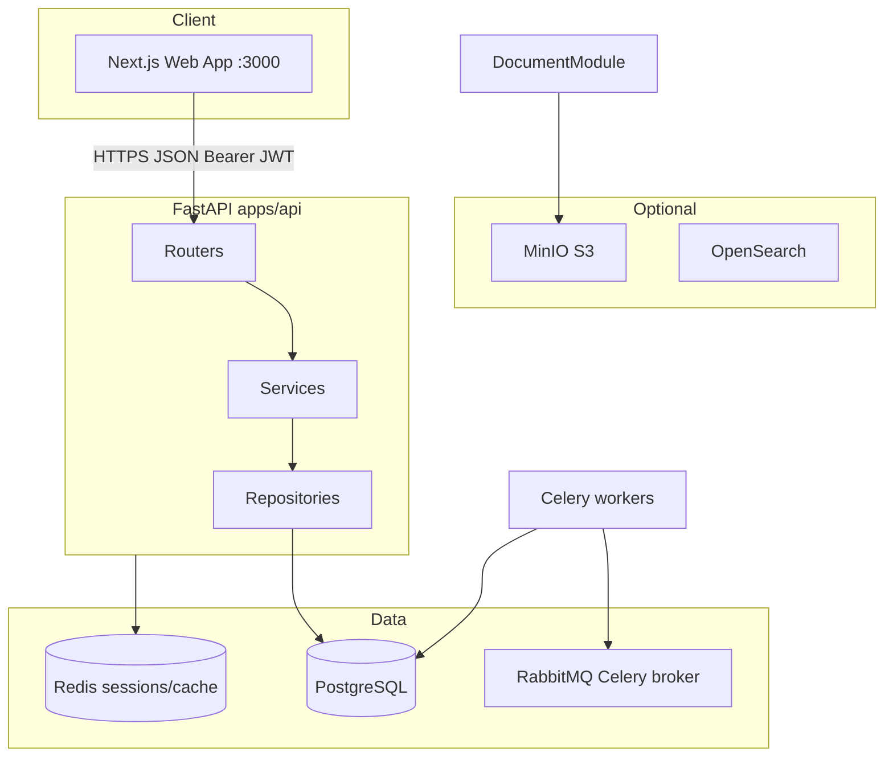
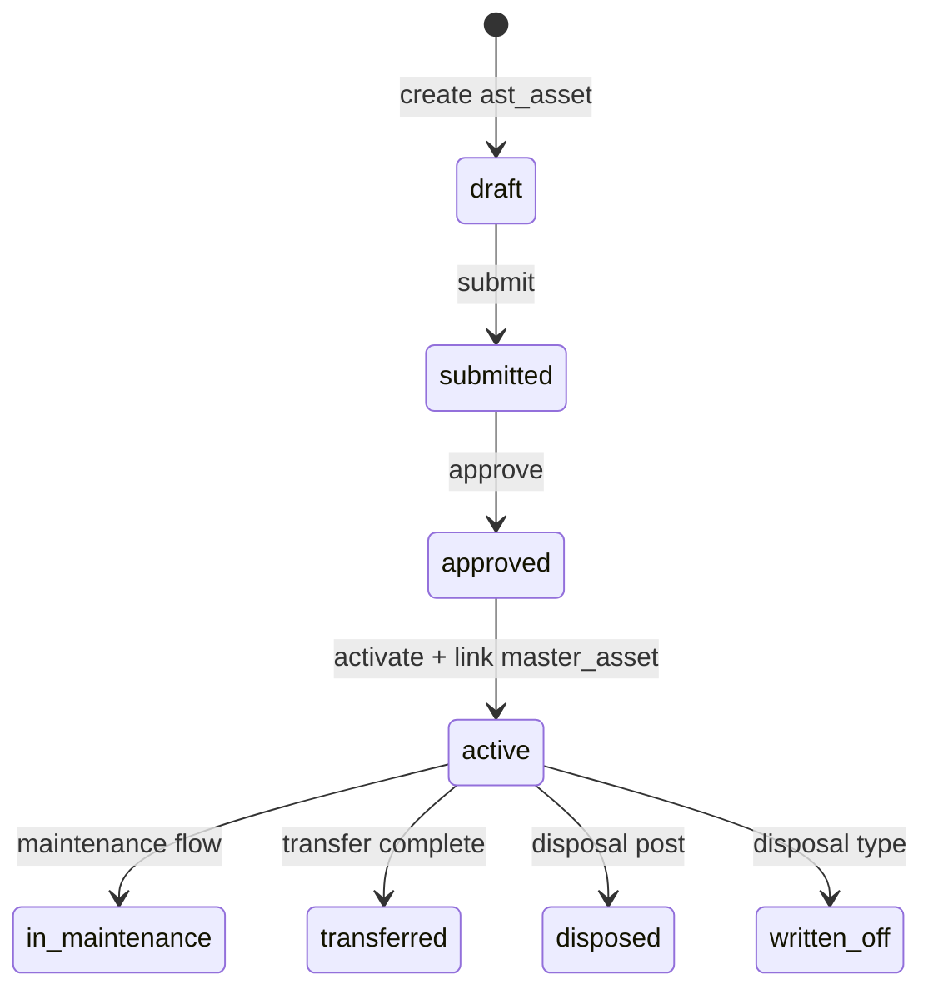
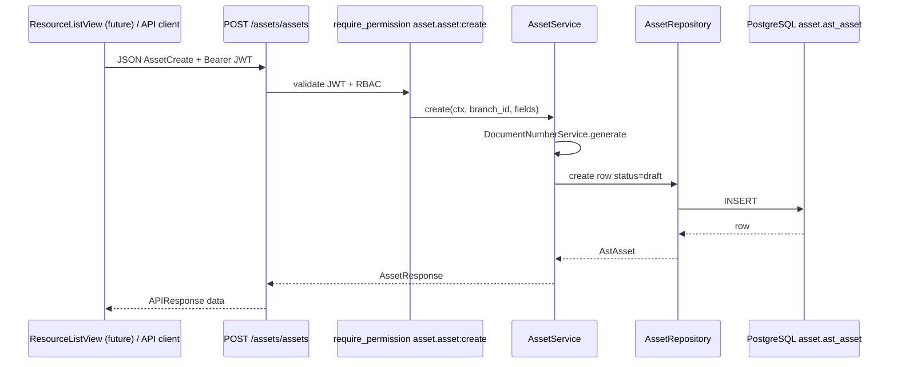
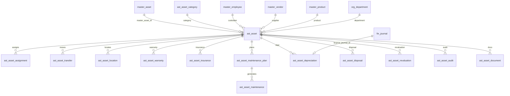
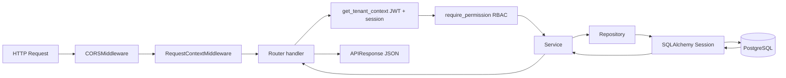

# Enterprise ERP Platform — Codebase Architecture & Feature Analysis

**Generated from repository implementation** (FastAPI + Next.js modular monolith).  
**Stack note:** This project does **not** use Express, NestJS, or Prisma. Backend is **Python 3.13+ / FastAPI / SQLAlchemy 2.0 / Alembic / Pydantic v2 / Celery**. Database is **PostgreSQL** with schema-per-domain tables.

---

## Table of Contents

1. [High-Level Project Architecture](#1-high-level-project-architecture)
2. [Complete Module Analysis](#2-complete-module-analysis)
3. [Asset Module (Deep Dive)](#3-asset-module-deep-dive)
4. [Backend Analysis](#4-backend-analysis)
5. [Frontend Analysis](#5-frontend-analysis)
6. [API Documentation (Asset Module)](#6-api-documentation-asset-module)
7. [Database Analysis](#7-database-analysis)
8. [Authentication & Authorization](#8-authentication--authorization)
9. [End-to-End Feature Flows](#9-end-to-end-feature-flows)
10. [Dependency Analysis (Asset)](#10-dependency-analysis-asset)
11. [Change Impact Analysis (Asset)](#11-change-impact-analysis-asset)
12. [Improvement Suggestions](#12-improvement-suggestions)

---

## 1. High-Level Project Architecture

### 1.1 Overall architecture

| Aspect | Implementation |
|--------|----------------|
| Pattern | Clean Architecture, DDD, **modular monolith** |
| API versioning | `/api/v1` (`apps/api/src/core/constants.py`) |
| Request flow | **Router → Service → Repository → Database** (mandatory) |
| Multi-tenancy | `tenant_id`, `company_id`, `branch_id` on transactional data |
| Identity / audit | UUID PKs, audit columns, soft delete, optimistic `version` |
| Docs baseline | `docs/01_BRD` … `docs/05_ARCHITECTURE_LOCK`, ERDs in `docs/06_ERD` |

### 1.2 Repository layout

```text
enterprise-erp/
├── apps/
│   ├── api/                 # FastAPI backend (src/, alembic/, scripts/)
│   └── web/                 # Next.js 16+ admin UI
├── docs/                    # BRD, FRD, SDD, DBS, ERD, releases
├── design-system/           # UI tokens (MASTER + page overrides)
├── docker-compose.yml       # Postgres, Redis, RabbitMQ, MinIO, OpenSearch
├── .env.example             # Shared env template
└── README.md
```

**Not present in this repository:** mobile apps (native), separate visitor/host/reception apps, Visitor PWA, face recognition, standalone meeting-room product. CRM includes **meetings** as sales activities, not physical room booking.

### 1.3 Monorepo / applications

| Application | Path | Role |
|-------------|------|------|
| API | `apps/api` | REST API, workers, migrations |
| Web | `apps/web` | B2B admin / ERP shell |
| Infra (local) | `docker-compose.yml` | Data and queue dependencies |

There is **no** shared npm/Python package workspace at root; coupling is via API contracts and `apps/web/src/config/modules.ts` mirroring API routers.

### 1.4 Communication diagram



### 1.5 Build & run

| Component | Command (from README) |
|-----------|------------------------|
| Infra | `docker compose up -d` |
| API | `cd apps/api && uvicorn main:app --reload --host 0.0.0.0 --port 8000 --app-dir src` |
| Migrations | `cd apps/api && alembic upgrade head` |
| Web | `cd apps/web && npm install && npm run dev` |
| Workers | `celery -A workers.celery_app worker` (optional) |

### 1.6 Environment variables (root `.env.example`)

| Area | Key examples |
|------|----------------|
| App | `APP_NAME`, `ENVIRONMENT`, `DEBUG`, `LOG_LEVEL` |
| DB | `DATABASE_URL`, `POSTGRES_*` |
| Redis / Celery | `REDIS_URL`, `CELERY_BROKER_URL`, `CELERY_RESULT_BACKEND` |
| Auth | `JWT_SECRET_KEY`, `JWT_ACCESS_TOKEN_EXPIRE_MINUTES`, `SESSION_TTL_SECONDS` |
| Frontend | `NEXT_PUBLIC_API_URL`, `NEXT_PUBLIC_DEMO_EMAIL` (in `apps/web/.env.local`) |

### 1.7 Backend module registration

All domain routers aggregate in `apps/api/src/shared/router.py` → `api_v1_router`. **Asset router is registered before master-data** so paths like `/assets/asset-categories` are not captured by master-data’s `/assets/{asset_id}`.

---

## 2. Complete Module Analysis

### 2.1 Shared implementation pattern (every domain module)

Each backend module under `apps/api/src/modules/<name>/` typically contains:

| Layer | Responsibility |
|-------|----------------|
| `routers/` or `routers/*.py` | Thin HTTP handlers, Pydantic bodies, `require_permission` |
| `service/` | Business rules, engines, adapters to other modules |
| `repository/` | SQLAlchemy queries, tenant/company/branch scoping |
| `models/` | SQLAlchemy ORM (infrastructure only) |
| `schemas.py` | Pydantic v2 request/response DTOs |
| `domain/` | Enums, entities, exceptions (no ORM) |
| `permissions.py` | Permission catalog tuples for seeding |
| `adapters/` | Cross-module ports (no direct peer ORM writes) |
| `tasks.py` | Celery task stubs (many modules) |

Frontend pattern for most operational modules:

| Piece | Location |
|-------|----------|
| Module registry | `apps/web/src/config/modules.ts` (`erpModules`) |
| Routes | `apps/web/src/app/(app)/<module>/` |
| Generic list UI | `ResourceListView` → `resourceService.list(apiPath)` |
| Module dashboard | `components/<module>/<module>-dashboard.tsx` |
| Dedicated services | e.g. `finance-service.ts`, `crm-service.ts` (where UX exceeds generic lists) |

**State management:** React client state in components; **no** Redux/Zustand/React Query in the traced generic module pages. Auth tokens in client storage (`apps/web/src/lib/auth.ts`).

### 2.2 Module catalog (API prefix → purpose)

| Module | API prefix | Purpose (from code + docs) |
|--------|------------|----------------------------|
| **Health** | `/health` | Service and DB health |
| **Foundation** | `/auth`, `/tenants`, `/users`, `/roles`, `/permissions`, `/workflows`, `/notifications`, `/audit`, `/settings` | Auth, RBAC, workflow engine, notifications, audit, settings |
| **Organization** | `/companies`, `/branches`, `/departments`, … | Legal entity and org hierarchy |
| **Asset** | `/assets/*` | Fixed-asset lifecycle (operational register in `asset` schema) |
| **Master Data** | `/employees`, `/customers`, `/vendors`, `/products`, `/assets` (master), … | Shared masters including `master.master_asset` (C-01 identity) |
| **Finance** | `/finance/*` | GL, journals, AR/AP, fiscal, asset accounting hooks |
| **Sales** | `/sales/*` | Quotations, orders, deliveries, pricing |
| **Procurement** | `/procurement/*` | Requisitions, RFQ, PO, GRN, vendor invoices |
| **Inventory** | `/inventory/*` | Stock, bins, transfers, valuation |
| **Manufacturing** | `/manufacturing/*` | BOM, routings, production orders |
| **Quality** | `/quality/*` | Inspection plans and results |
| **CRM** | `/crm/*` | Leads, opportunities, quotes, companies, tasks, meetings |
| **HR** | `/hr/*` | Employees (operational), leave, attendance, performance |
| **Payroll** | `/payroll/*` | Payroll runs, salary structures |
| **Recruitment** | `/recruitment/*` | Candidates, onboarding |
| **Projects** | `/projects/*` | Projects, tasks, budgets, timesheets |
| **Service** | `/service/*` | Field service, work orders, SLAs |
| **Helpdesk** | `/helpdesk/*` | Tickets, knowledge base |
| **Documents** | `/documents/*` | Document management (storage integration) |
| **GRC** | `/grc/*` | Risk, compliance, policies |
| **Analytics** | `/analytics/*` | Datasets, metrics, alerts |
| **Integration** | `/integration/*` | Connectors, webhooks, sync |
| **Ecommerce** | `/ecommerce/*` | Online store, carts, orders |
| **Portal** | `/portal/*` | External portal dashboards/messages |

### 2.3 Features **not** implemented as separate products

The following appear in generic ERP checklists but **have no application code** in this repo:

- Visitor management, host app, reception app, check-in/out, invitations, face recognition
- Dedicated meeting-room booking module (CRM has **meetings** as CRM entities)
- Mobile native apps

### 2.4 Cross-module interaction rules (Architecture Lock)

- UI never calls the database directly.
- Modules use **adapters** and UUID references; Asset ERD forbids FKs to `proc_*`, `inv_*`, etc. for acquisition refs.
- Finance GL posting for assets uses `PostingService.post_system_journal()` only (`asset/adapters/finance_port.py`).

---

## 3. Asset Module (Deep Dive)

**Canonical spec:** `docs/06_ERD/ERD_15_Asset_Management.md`, FRD-12.  
**Code root:** `apps/api/src/modules/asset/`  
**API mount:** `/api/v1/assets`  
**PostgreSQL schema:** `asset`, table prefix `ast_`

### 3.1 Purpose and business workflow

| Concept | Implementation |
|---------|----------------|
| **Why** | Track physical/digital assets from registration through custody, maintenance, valuation, disposal, and audit |
| **C-01 identity** | Platform asset identity remains `master.master_asset`; `ast_asset` is the **operational lifecycle register** linked via `master_asset_id` on approve |
| **Workflow** | Draft → submit → approve on key transactions (asset register, assignments, maintenance, disposal, revaluation); status enums enforced in ORM `CheckConstraint` |
| **Finance** | Depreciation, disposal, revaluation can **post** journals via finance adapter; stores `finance_journal_id` on asset financial rows |



### 3.2 Backend structure

```text
modules/asset/
├── router.py              # Aggregates sub-routers under /assets
├── routers/__init__.py    # All HTTP endpoints (single file)
├── schemas.py             # Pydantic create/update/response models
├── dependencies.py        # Pagination, re-exports foundation RBAC
├── permissions.py         # ASSET_PERMISSIONS catalog
├── models/                # 20 ast_* SQLAlchemy models
├── repository/            # AstScopedRepository + per-entity repos
├── service/               # Per-aggregate services + engines/
├── adapters/              # finance_port, master_data_port, organization_port, payroll_port
├── domain/                # enums, entities, exceptions
└── tasks.py               # Celery stubs (alerts, scheduler counts)
```

**There are no “controllers”** — FastAPI route functions in `routers/__init__.py` call services directly.

### 3.3 Domain aggregates (20 tables)

| # | Model | Table | Primary role |
|---|--------|-------|----------------|
| 1 | `AstAssetCategory` | `ast_asset_category` | Category catalog + default GL/depr defaults |
| 2 | `AstAsset` | `ast_asset` | Operational asset register |
| 3 | `AstAssetComponent` | `ast_asset_component` | Sub-components / BOM-like parts |
| 4 | `AstAssetAssignment` | `ast_asset_assignment` | Custody to employee/dept/project |
| 5 | `AstAssetTransfer` | `ast_asset_transfer` | Branch/dept/employee moves |
| 6 | `AstAssetLocation` | `ast_asset_location` | Location history / current flag |
| 7 | `AstAssetWarranty` | `ast_asset_warranty` | Warranty policies |
| 8 | `AstAssetInsurance` | `ast_asset_insurance` | Insurance policies |
| 9 | `AstAssetMaintenancePlan` | `ast_asset_maintenance_plan` | Preventive schedules |
| 10 | `AstAssetMaintenance` | `ast_asset_maintenance` | Maintenance work orders |
| 11 | `AstAssetServiceHistory` | `ast_asset_service_history` | Service log lines |
| 12 | `AstAssetDepreciation` | `ast_asset_depreciation` | Depreciation periods + finance link |
| 13 | `AstAssetDisposal` | `ast_asset_disposal` | Disposal / write-off |
| 14 | `AstAssetRevaluation` | `ast_asset_revaluation` | Book value adjustments |
| 15 | `AstAssetAudit` | `ast_asset_audit` | Physical verification |
| 16 | `AstAssetDocument` | `ast_asset_document` | Document metadata (`storage_uri`, not file upload API) |
| 17 | `AstAssetChecklist` | `ast_asset_checklist` | Checklists (JSON items) |
| 18 | `AstAssetMeterReading` | `ast_asset_meter_reading` | Usage meters |
| 19 | `AstAssetNotification` | `ast_asset_notification` | In-module notification rows |
| 20 | `AstAssetReport` | `ast_asset_report` | Report snapshot / metrics JSON |

**Common columns** (via mixins in `models/mixins.py` + `database/mixins.py`):

- `tenant_id`, `company_id`, (`branch_id` on transactions)
- `created_at`, `created_by`, `updated_at`, `updated_by`
- `is_deleted`, `deleted_at`, `deleted_by` (soft delete)
- `version` (optimistic locking on updates in repositories)

### 3.4 Key `ast_asset` fields and relationships

| Column | Type / FK | Notes |
|--------|-----------|--------|
| `asset_category_id` | FK → `asset.ast_asset_category` | Required |
| `master_asset_id` | FK → `master.master_asset` | Set on approve via `AssetMasterDataAdapter` |
| `product_id` | FK → `master.master_product` | Optional catalog link |
| `supplier_vendor_id` | FK → `master.master_vendor` | Supplier |
| `department_id` | FK → `organization.org_department` | Optional |
| `custodian_employee_id` | FK → `master.master_employee` | Optional |
| `purchase_order_id`, `grn_id`, `inventory_*`, `project_id`, `production_order_id`, `quality_inspection_id` | UUID, **no FK** | Cross-module refs only |
| `barcode`, `qr_code`, `rfid_tag` | string | Stored fields; **no** QR/barcode generation API traced |
| `workflow_instance_id` | FK → `foundation.wf_instance` | Workflow hook |

### 3.5 Service layer highlights

| Service | File | Notable behavior |
|---------|------|------------------|
| `AssetService` | `service/asset_service.py` | Create with doc number; submit/approve; on approve creates/links `master_asset` |
| `DepreciationService` | `service/depreciation_service.py` | `calculate`, `post` → `AssetFinanceAdapter.post_depreciation` |
| `DisposalService` / `RevaluationService` | respective files | Workflow + finance post |
| `AssignmentService` | `service/assignment_service.py` | submit/approve/return |
| `TransferService` | `service/transfer_service.py` | `complete` |
| `MaintenanceService` | `service/maintenance_service.py` | submit/approve/complete |
| `AssetAuditService` | `service/asset_audit_service.py` | `complete` |
| Engines | `service/engines/asset_*_engine.py` | Status transitions, validation rules |

Repositories extend `AstScopedRepository` (`repository/base.py`): tenant filter, company filter for non-admin users, optional branch scoping.

### 3.6 Asset API surface (no DELETE routes)

All routes live in `modules/asset/routers/__init__.py`. **There are no HTTP DELETE handlers** for asset aggregates in this file; master-data assets **do** expose DELETE for `master.master_asset`.

Standard response wrapper: `APIResponse<T>` (`shared/schemas.py`): `success`, `message`, `data`, optional `errors`.

Pagination query params: `page` (≥1), `page_size` (1–200, default 25). Optional `company_id` filter on list endpoints.

#### Endpoint map (full path = `/api/v1/assets` + suffix)

| Resource | GET list | GET one | POST create | PATCH update | Actions (POST) |
|----------|----------|---------|-------------|--------------|----------------|
| `/asset-categories` | ✓ | ✓ | ✓ | ✓ | — |
| `/assets` | ✓ | ✓ | ✓ | ✓ | `/submit`, `/approve` |
| `/asset-components` | ✓ | ✓ | ✓ | ✓ | — |
| `/asset-assignments` | ✓ | ✓ | ✓ | ✓ | `/submit`, `/approve`, `/return` |
| `/asset-transfers` | ✓ | ✓ | ✓ | ✓ | `/complete` |
| `/asset-locations` | ✓ | ✓ | ✓ | ✓ | — |
| `/asset-warranties` | ✓ | ✓ | ✓ | ✓ | — |
| `/asset-insurances` | ✓ | ✓ | ✓ | ✓ | — |
| `/maintenance-plans` | ✓ | ✓ | ✓ | ✓ | — |
| `/asset-maintenances` | ✓ | ✓ | ✓ | ✓ | `/submit`, `/approve`, `/complete` |
| `/service-histories` | ✓ | ✓ | ✓ | ✓ | — |
| `/asset-depreciations` | ✓ | ✓ | ✓ | ✓ | `/calculate`, `/post` |
| `/asset-disposals` | ✓ | ✓ | ✓ | ✓ | `/submit`, `/approve`, `/post` |
| `/asset-revaluations` | ✓ | ✓ | ✓ | ✓ | `/submit`, `/approve`, `/post` |
| `/asset-audits` | ✓ | ✓ | ✓ | ✓ | `/complete` |
| `/asset-documents` | ✓ | ✓ | ✓ | ✓ | — |
| `/asset-checklists` | ✓ | ✓ | ✓ | ✓ | — |
| `/meter-readings` | ✓ | ✓ | ✓ | ✓ | — |
| `/asset-notifications` | ✓ | ✓ | ✓ | ✓ | — |
| `/reports` | ✓ | ✓ | ✓ | ✓ | — |

**Finance post body** (`FinancePostRequest` in schemas): `debit_account_id`, `credit_account_id`, optional `fiscal_year_id`.

#### Example request lifecycle (create operational asset)



### 3.7 Permissions

Defined in `modules/asset/permissions.py` — 57 permission codes (e.g. `asset.asset:read`, `asset.depreciation:post`). Seeded via Alembic seed migrations and `scripts/seed_all_permissions.py`.

Role bundles: `ASSET_EXECUTIVE_PERMISSIONS`, `ASSET_MANAGER_PERMISSIONS`, `ASSET_AUDITOR_PERMISSIONS`, `ASSET_ADMIN_PERMISSIONS`.

### 3.8 Master Data vs Asset module (critical distinction)

| Aspect | Master Data `master.master_asset` | Asset `asset.ast_asset` |
|--------|-----------------------------------|-------------------------|
| API | `GET/POST/PUT/DELETE /api/v1/assets` | `GET/POST/PATCH /api/v1/assets/assets` |
| Router file | `master_data/routers/assets.py` | `asset/routers/__init__.py` |
| Permission | `master.asset:*` | `asset.asset:*` |
| Purpose | C-01 identity stub | Full lifecycle register |
| Delete | HTTP DELETE supported | No DELETE route in asset routers |

**Routing order:** `asset_router` is mounted **before** `master_data_router`. Subpaths like `/assets/assets` are handled by the asset module. `GET /api/v1/assets` (empty suffix after `/assets`) is handled by **master-data** list assets.

### 3.9 Celery / background jobs

`modules/asset/tasks.py` registers stub tasks that **count** rows (maintenance plans, warranties, insurances, draft depreciations, planned audits, failed depreciations). They do **not** send emails or create notifications in the traced code.

### 3.10 Frontend (Assets module)

| Path | Component | Behavior |
|------|-----------|----------|
| `/assets` | `AssetsDashboard` | KPIs from `loadAssetsOverview()` |
| `/assets/[resource]` | `ResourceListView` | Generic table for each `modules.ts` resource |
| Layout | `assets/layout.tsx` | Workspace chrome + nav |

**Registered UI resources** (`modules.ts` keys):  
`asset-categories`, `assets`, `asset-components`, `asset-assignments`, `asset-transfers`, `asset-locations`, `asset-warranties`, `asset-insurances`, `maintenance-plans`, `asset-maintenances`, `asset-depreciations`, `asset-disposals`, `asset-audits`, `meter-readings`.

**Backend resources with no dedicated nav entry in `modules.ts`:**  
`service-histories`, `asset-revaluations`, `asset-documents`, `asset-checklists`, `asset-notifications`, `reports` (API exists; UI not in module registry).

#### `ResourceListView` capabilities (all asset list pages)

| Feature | Implemented? |
|---------|----------------|
| List + refresh | Yes — `resourceService.list(apiPath)` |
| Client-side filter | Yes — search box over displayed columns |
| Pagination | **No** — does not pass `page`/`page_size` query params |
| Create / edit forms | **No** — read-only table |
| Workflow actions (submit/approve/post) | **No** — `resourceService.action` exists but unused here |
| Import/export Excel/PDF | **No** |
| File upload | **No** |
| Detail pages | **No** — no `[row_id]` routes under `/assets` |

`assets-service.ts` only supports dashboard aggregation (`loadAssetsOverview`), not CRUD.

#### Dashboard flow

1. User opens `/assets` (authenticated shell).
2. `AssetsDashboard` calls `loadAssetsOverview()` → parallel `safeList` for 14 API paths.
3. Computes counts (open maintenances, warranties expiring, book value sums, etc.).
4. Errors per endpoint surface as `partial` overview with `errors[]`.

### 3.11 CRUD and feature matrix (what exists vs missing)

| Capability | Backend | Frontend (Assets UI) |
|------------|---------|------------------------|
| Create asset (operational) | POST `/assets/assets` | Not in ResourceListView |
| Read list/detail | GET list + GET `/{row_id}` | List only (generic) |
| Update | PATCH | Not exposed |
| Delete (soft) | Repository support; **no asset HTTP DELETE** | No |
| Submit / approve asset | POST actions | No UI |
| Assignments / return | POST actions | No UI |
| Transfer complete | POST | No UI |
| Maintenance workflow | POST | No UI |
| Depreciation calculate/post | POST | No UI |
| Disposal / revaluation post | POST | No UI |
| Audit complete | POST | No UI |
| Documents | Metadata CRUD; `storage_uri` string | No UI; **no multipart upload** |
| Barcode/QR | Columns on `ast_asset` | No generator/scanner |
| Bulk import/export | Not found | No |
| Asset history | `ast_asset_location`, service history table | List-only if nav added |
| PO/vendor linking | UUID fields on `ast_asset` | Display only if in API response columns |

### 3.12 Relationship diagram (implementation)



**Consumers of asset data (adapters / UUID refs):**

| Module | Integration |
|--------|-------------|
| Finance | `AssetFinanceAdapter`, `finance/asset_accounting_service.py` |
| Service | `service/adapters/asset_port.py` (UUID stub) |
| Master Data | `AssetMasterDataAdapter` on approve |
| Payroll | `asset/adapters/payroll_port.py` (read-oriented port) |

---

## 4. Backend Analysis

### 4.1 Application entry

- `apps/api/src/main.py`: FastAPI app, CORS, `RequestContextMiddleware`, exception handlers, mounts `api_v1_router` at `/api/v1`.

### 4.2 Request lifecycle



### 4.3 Middleware and errors

- Request logging with `request_id` (`middleware/request_context.py`).
- Domain exceptions mapped in `core/exceptions.py` to HTTP status (401/403/404/422, etc.).

### 4.4 Validation

- Pydantic v2 models on request bodies (`schemas.py` per module).
- DB constraints via SQLAlchemy `CheckConstraint` on enums and amounts.

### 4.5 Logging

- `core/logging.py` + `python-json-logger` structured logs.

### 4.6 File uploads

- Asset documents store `storage_uri` / `content_hash` — **no** traced multipart upload endpoint in asset module. Document module may use MinIO for general documents.

### 4.7 Real-time

- **No Socket.IO** in repository.

### 4.8 Notifications

- Foundation notification templates/events; asset has `ast_asset_notification` table and `NotificationService` for in-domain rows — not wired to Foundation notification engine in traced create paths.

### 4.9 Queues

- Celery + RabbitMQ + Redis result backend (`workers/celery_app.py`).

---

## 5. Frontend Analysis

### 5.1 Stack

- Next.js 16 App Router, TypeScript, Tailwind, ShadCN-style UI (`components/ui`).
- Fonts/layout: `AppShell`, module workspace nav components.

### 5.2 Routing

- Public: `/login`
- Authenticated app: `(app)` route group with modules under `/foundation`, `/finance`, `/assets`, etc.
- **No Next.js `middleware.ts`** traced — auth gating is client-side (`isAuthenticated()` in components).

### 5.3 API layer

- `apiClient` + `resourceService` + module-specific services (`services/*.ts`).
- Base URL: `NEXT_PUBLIC_API_URL` (default `http://localhost:8000/api/v1`).

### 5.4 Auth flow (client)

1. `/login` → `authService.login` → stores access/refresh tokens.
2. `apiClient` attaches `Authorization: Bearer`.
3. On 401, attempts `/auth/refresh`; clears tokens on failure.
4. `authService.me` for profile (used in shell).

### 5.5 Module screen → API mapping (Assets)

| Screen | API paths |
|--------|-----------|
| `/assets` dashboard | 14× `GET /assets/...` lists |
| `/assets/assets` | `GET /assets/assets` |
| `/assets/asset-categories` | `GET /assets/asset-categories` |
| … | per `modules.ts` `apiPath` |
| Master data `/master-data/md-assets` | `GET /assets` (master list) |

Finance module includes `asset-transactions` resource pointing at finance asset accounting APIs (separate from operational asset module).

---

## 6. API Documentation (Asset Module)

**Authentication:** Bearer JWT on all endpoints (`HTTPBearer`).  
**Authorization:** Permission code per handler (see §3.6).  
**Errors:** `ErrorResponse` with `success: false`, `message`, `errors[]`.

### 6.1 Representative schemas

Detailed field lists are in `modules/asset/schemas.py` (e.g. `AssetCreate`, `AssetResponse`, `AssetDepreciationCreate`). Key create requirements:

- Operational asset create requires `branch_id` in body (passed explicitly to service).
- Financial post actions require `FinancePostRequest` with GL account UUIDs.

### 6.2 Database operations per aggregate

| Aggregate | Repository | Soft delete |
|-----------|------------|-------------|
| Each `ast_*` | `*_repository.py` | Filter `is_deleted=False` in list/get |

---

## 7. Database Analysis

### 7.1 Schema strategy

- PostgreSQL schemas: `foundation`, `organization`, `master`, `finance`, `asset`, `sales`, … (per domain).
- Migrations: `apps/api/alembic/versions/` (400+ revisions).
- Asset schema introduced in `0245_create_asset_schema.py`, tables `0246_ast_asset_category.py` … `0264_ast_asset_report.py` (and seeds in `0247_seed_asset_permissions.py` etc.).

### 7.2 There is no Prisma

ORM models are SQLAlchemy classes; migrations are Alembic Python revisions.

### 7.3 Seed data

- `scripts/seed_demo_data.py` — users, org, masters
- `scripts/seed_demo_modules.py` — sample rows per module including asset aggregates
- Permission seeds in Alembic + `scripts/seed_all_permissions.py`

### 7.4 Indexes (representative)

- Status columns indexed on most `ast_*` tables.
- FK columns (`asset_id`, `asset_category_id`, …) indexed in model definitions.
- Unique: `(company_id, asset_code)` on `ast_asset`.

---

## 8. Authentication & Authorization

| Step | Implementation |
|------|----------------|
| Login | `POST /api/v1/auth/login` → JWT access + refresh + session row |
| Token | `security/jwt.py` — HS256, payload: `sub`, `tenant_id`, `user_type`, `session_id` |
| Session | DB `SecSession` + Redis `SessionStore` cache |
| RBAC | `RBACService.has_permission(user, tenant, code)` |
| Route guard | `require_permission("code")` FastAPI dependency |
| Org scope | `TenantContext.company_id` / `branch_id` from session or default org scope |

Super/tenant admins bypass company/branch repository filters in several repositories.

---

## 9. End-to-End Feature Flows

### 9.1 Asset dashboard (implemented E2E)

```text
User → /assets
  → AssetsDashboard (client)
  → loadAssetsOverview()
  → apiClient GET ×14 (parallel)
  → Asset routers → Services → Repos → PostgreSQL
  → JSON arrays in APIResponse.data
  → Client normalizes rows, aggregates KPIs
  → UI cards + pipeline funnel
```

### 9.2 Approve operational asset (backend only; no UI)

```text
POST /api/v1/assets/assets/{id}/approve
  → require_permission asset.asset:approve
  → AssetService.approve
  → AssetEngine.approve + activate
  → AssetMasterDataAdapter.create_or_link_master_asset
  → UPDATE ast_asset (status, master_asset_id)
  → AuditService.log_entity_change
```

### 9.3 Post depreciation to GL (backend only)

```text
POST /api/v1/assets/asset-depreciations/{id}/post + FinancePostRequest
  → DepreciationService.post
  → AssetFinanceAdapter.post_depreciation
  → JournalService.create_journal + add_line ×2
  → PostingService.post_system_journal
  → UPDATE ast_asset_depreciation.finance_journal_id
```

---

## 10. Dependency Analysis (Asset)

### 10.1 Modules that depend on Asset

| Consumer | Dependency type |
|----------|-----------------|
| Finance | Posts journals for depreciation/disposal/revaluation; asset accounting reports |
| Service | UUID asset refs on work orders; `ServiceAssetAdapter` stub |
| Master Data | Creates `master_asset` when operational asset approved |
| Analytics | Potential datasets (check `analytics` models for asset sources) |
| Demo seeds | `seed_demo_modules.py` asset section |

### 10.2 Asset depends on

| Upstream | Usage |
|----------|--------|
| Foundation | Auth, RBAC, workflow FK, audit logging |
| Organization | Company, branch, department FKs |
| Master Data | Employee, product, vendor, master_asset |
| Finance | PostingService only via adapter |

### 10.3 Shared frontend components

- `ResourceListView`, `PageHeader`, `AppShell`, UI primitives — changes affect all modules.

### 10.4 Impact of Asset module changes

| Change type | Blast radius |
|-------------|--------------|
| New `ast_*` column | Alembic migration + schema + repository + possibly ResourceListView columns |
| Permission rename | Alembic seed + RBAC grants + `require_permission` strings |
| API path change | `modules.ts` apiPath + any dedicated services |
| `master_asset` contract change | Asset approve flow + master_data `AssetService` |
| Finance posting rules | Finance module + `AssetFinanceAdapter` |

---

## 11. Change Impact Analysis (Asset)

Before modifying Asset, expect to touch:

| Area | Files / systems |
|------|-----------------|
| API | `modules/asset/routers/__init__.py`, `schemas.py`, services, repositories |
| DB | `alembic/versions/`, `models/*.py` |
| Permissions | `permissions.py`, seed migrations |
| Cross-module | `adapters/*.py`, finance posting |
| UI | `config/modules.ts`, `assets-*` components, optionally new form pages |
| Tests | `apps/api/src/tests/` (add/update pytest for services) |
| Docs | `docs/06_ERD/ERD_15_*.md`, FRD-12 if contract changes |

**Backward compatibility:** API uses PATCH with optional fields; `version` field on updates (stripped in `extract_update_fields` — optimistic locking may be incomplete on PATCH).

**Risks:**

- Route collision between `/api/v1/assets` (master) and `/api/v1/assets/*` (operational).
- Missing DELETE on operational assets vs master DELETE behavior mismatch.
- Celery tasks are stubs — scheduling them without implementing logic gives false “health”.
- Document `storage_uri` without upload pipeline leaves documents non-functional end-to-end.

---

## 12. Improvement Suggestions

| Area | Recommendation |
|------|----------------|
| **Asset UI parity** | Add create/edit drawers, detail routes, and workflow action buttons using existing `resourceService.action` |
| **Registry completeness** | Add missing resources to `modules.ts` (revaluations, documents, checklists, service histories, reports) |
| **Pagination** | Pass `page`/`page_size` from `ResourceListView` to match API |
| **Master vs ops clarity** | Rename UI labels: “Asset Master” vs “Asset Register”; avoid both using path `/assets` |
| **Dependencies** | Add `bcrypt` etc. to `pyproject.toml` to match `requirements.txt` |
| **File uploads** | Integrate MinIO upload for `ast_asset_document` or Document module cross-link |
| **Celery** | Implement real alert logic or document tasks as non-production stubs |
| **Auth middleware** | Next.js middleware for route protection instead of client-only checks |
| **Testing** | Expand pytest coverage on `AssetService.approve` and finance post idempotency (`idempotency_key` on depreciation) |
| **API docs** | OpenAPI at `/docs` is generated; keep schemas aligned with ERD |

---

## Appendix A — Folder structure (API module)

```text
apps/api/src/
├── main.py
├── core/           # config, exceptions, logging, redis
├── database/       # Base, session, mixins
├── middleware/
├── security/       # jwt, password, rbac engine
├── shared/         # router aggregation, health, APIResponse
├── workers/        # celery_app
└── modules/
    ├── foundation/
    ├── organization/
    ├── asset/          ← Asset domain
    ├── master_data/
    ├── finance/
    └── … (20 domain modules)
```

## Appendix B — Folder structure (Web)

```text
apps/web/src/
├── app/
│   ├── login/
│   └── (app)/
│       ├── assets/           ← Asset pages
│       ├── finance/          ← Rich custom UI example
│       ├── crm/              ← Rich custom UI example
│       └── …
├── components/
│   ├── module/resource-list-view.tsx
│   └── assets/
├── config/modules.ts
├── services/
└── lib/auth.ts
```

## Appendix C — Document lineage

| Source | Role |
|--------|------|
| `docs/05_ARCHITECTURE_LOCK/` | Non-negotiable stack and patterns |
| `docs/06_ERD/ERD_15_Asset_Management.md` | Asset table and API design authority |
| `apps/api/src/modules/asset/` | Runtime source of truth when docs drift |

## Appendix D — Per-module reference (traced from code)

Each row summarizes **backend mount**, **frontend module key** (`erpModules`), and **UI pattern**. Custom UIs exist where noted; otherwise the module uses `ResourceListView` + dashboard.

| Module | API mount | Web `href` | Backend code | Frontend notes |
|--------|-----------|------------|--------------|----------------|
| **Foundation** | `/auth`, `/tenants`, `/users`, … | `/foundation` | `modules/foundation/` | Generic lists + auth at `/login` |
| **Organization** | `/companies`, `/branches`, … | `/organization` | `modules/organization/` | Generic lists |
| **Master Data** | `/employees`, `/customers`, `/assets` (master), … | `/master-data` | `modules/master_data/` | `md-assets` → `GET /assets` |
| **Asset** | `/assets/*` | `/assets` | `modules/asset/` | Dashboard + 14 generic lists; see §3 |
| **Finance** | `/finance/*` | `/finance` | `modules/finance/` | Custom COA, GL, AR/AP, reports |
| **Sales** | `/sales/*` | `/sales` | `modules/sales/` | Mix: generic + sales workspace |
| **Procurement** | `/procurement/*` | `/procurement` | `modules/procurement/` | Custom PO + generic SCM |
| **Inventory** | `/inventory/*` | `/inventory` | `modules/inventory/` | Dashboard + generic lists |
| **Manufacturing** | `/manufacturing/*` | `/manufacturing` | `modules/manufacturing/` | Dashboard + generic lists |
| **Quality** | `/quality/*` | `/quality` | `modules/quality/` | Dashboard + generic lists |
| **CRM** | `/crm/*` | `/crm` | `modules/crm/` | Custom sales blueprint UI |
| **HR** | `/hr/*` | `/hr` | `modules/hr/` | Dashboard + generic lists |
| **Payroll** | `/payroll/*` | `/payroll` | `modules/payroll/` | Dashboard + generic lists |
| **Recruitment** | `/recruitment/*` | `/recruitment` | `modules/recruitment/` | Dashboard + generic lists |
| **Projects** | `/projects/*` | `/projects` | `modules/project/` | Dashboard + generic lists |
| **Service** | `/service/*` | `/service` | `modules/service/` | Asset UUID adapter stub |
| **Helpdesk** | `/helpdesk/*` | `/helpdesk` | `modules/helpdesk/` | Dashboard + generic lists |
| **Documents** | `/documents/*` | `/documents` | `modules/document/` | Generic lists |
| **GRC** | `/grc/*` | `/grc` | `modules/grc/` | Dashboard + generic lists |
| **Analytics** | `/analytics/*` | `/analytics` | `modules/analytics/` | Dashboard + generic lists |
| **Integration** | `/integration/*` | `/integration` | `modules/integration/` | Dashboard + generic lists |
| **Ecommerce** | `/ecommerce/*` | `/ecommerce` | `modules/ecommerce/` | Dashboard + generic lists |
| **Portal** | `/portal/*` | `/portal` | `modules/portal/` | Dashboard + generic lists |

### Appendix D.1 — Foundation

Auth (`routers/auth.py`), RBAC (`rbac_service.py`), workflows, notifications, audit, settings. Security models in `models/security.py`.

### Appendix D.2 — Organization

Companies, branches, departments, locations, cost/profit centers, org tree. Asset FKs: `org_department`, optional `org_location` UUID on location history.

### Appendix D.3 — Master Data

`master.master_asset` via `GET/POST/PUT/DELETE /api/v1/assets` with `master.asset:*` permissions — separate from operational `/assets/assets`.

### Appendix D.4 — Finance (asset)

`AssetFinanceAdapter`, `asset_accounting_service.py`, UI resource `asset-transactions` under `/finance`.
;;'
### Appendix D.5 — Procurement / Inventory

Optional UUID refs on `ast_asset` for PO/GRN/inventory — no FK, no auto-create traced in asset services.

### Appendix D.6 — CRM

Sales blueprint UI; meetings as CRM activities — not meeting-room booking.

### Appendix D.7 — Service

`ServiceAssetAdapter` — UUID-only stub; no `ast_*` ORM writes from service module.

---

*End of CODEBASE_ANALYSIS.md*
