# HRMS & Payroll — Complete Process Flows & Diagrams

| Attribute | Value |
|-----------|-------|
| **Document ID** | FLOW-HRMS-PAY-v1.0 |
| **Product** | Enterprise ERP Platform |
| **Parent BRD** | [BRD-HRMS-Payroll-v1.0.md](./BRD-HRMS-Payroll-v1.0.md) |
| **Related FRD** | [FRD-09 HR](../02_FRD/FRD-09-HR-Domain.md) · [FRD-10 Payroll](../02_FRD/FRD-10-Payroll-Domain.md) |
| **Version** | 1.0 |
| **Date** | 23 July 2026 |

> This file contains **all arrow flow diagrams** for HRMS and Payroll.  
> Open in any Markdown viewer that supports **Mermaid** (GitHub, VS Code, Cursor preview).

---

## Table of Contents

1. [Master End-to-End Lifecycle](#1-master-end-to-end-lifecycle)
2. [System Integration Map](#2-system-integration-map)
3. [Recruitment → Hire](#3-recruitment--hire)
4. [Employee Management (Workforce)](#4-employee-management-workforce)
5. [Shift & Roster](#5-shift--roster)
6. [Attendance Management](#6-attendance-management)
7. [Leave Management](#7-leave-management)
8. [Leave Approval Workflow](#8-leave-approval-workflow)
9. [Attendance Correction Workflow](#9-attendance-correction-workflow)
10. [Performance & Training](#10-performance--training)
11. [Separation / Exit](#11-separation--exit)
12. [Payroll Processing](#12-payroll-processing)
13. [Payroll Approval Workflow](#13-payroll-approval-workflow)
14. [Payroll → Finance Posting](#14-payroll--finance-posting)
15. [People → Time → Pay → Finance (Swimlane)](#15-people--time--pay--finance-swimlane)
16. [ASCII Quick Reference (All Flows)](#16-ascii-quick-reference-all-flows)

---

## 1. Master End-to-End Lifecycle

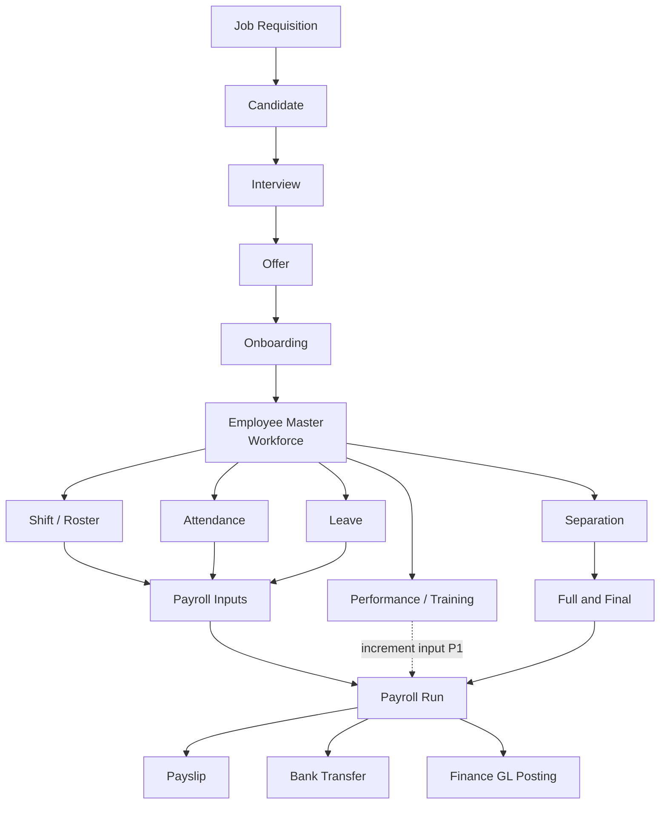

### Linear arrow view

```text
Job Requisition
      ↓
   Candidate
      ↓
   Interview
      ↓
     Offer
      ↓
   Onboarding
      ↓
Employee Master (Workforce)
      ↓
┌─────┴──────┬──────────────┬──────────────┐
↓            ↓              ↓              ↓
Shift     Attendance      Leave      Performance
Roster       ↓              ↓              ↓
      └──────┴──────┬───────┘              │
                    ↓                      │
            Payroll Processing ←───────────┘
                    ↓
         Payslip + Bank + Finance GL
                    ↓
      Separation / Full & Final (on exit)
```

---

## 2. System Integration Map

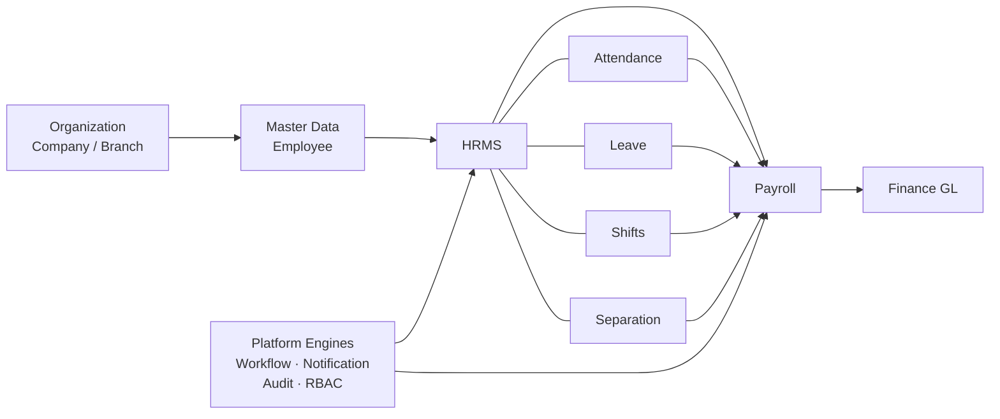

```text
Organization
      ↓
Master Employee
      ↓
   HRMS ──────────────► Payroll ──────────────► Finance
     │                     ▲
     ├─ Attendance ────────┤
     ├─ Leave ─────────────┤
     ├─ Shifts ────────────┤
     └─ Separation ────────┘

Platform: Workflow · Notification · Audit · RBAC
```

**Boundary rule:** Payroll reads HR facts; Payroll does not write attendance/leave. HR does not post GL journals.

---

## 3. Recruitment → Hire

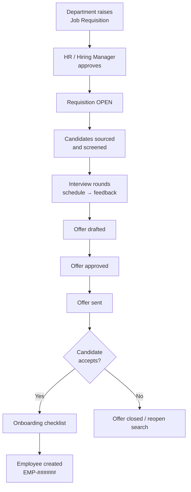

```text
Department raises Job Requisition
      ↓
HR / Hiring Manager approves
      ↓
Requisition OPEN
      ↓
Candidates sourced & screened
      ↓
Interview rounds
      ↓
Offer drafted → approved → sent
      ↓
Candidate accepts?
  ├─ Yes → Onboarding → Employee (EMP-######)
  └─ No  → Close / reopen search
```

---

## 4. Employee Management (Workforce)

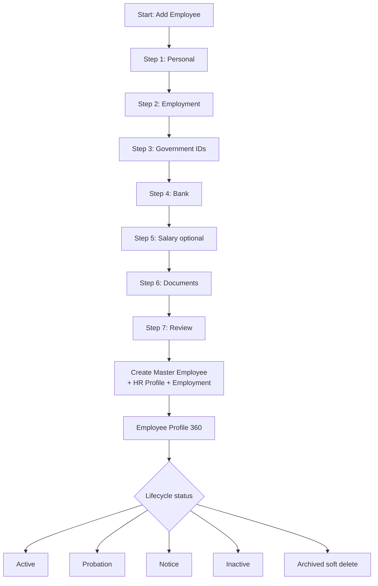

```text
Add Employee Wizard
  1 Personal → 2 Employment → 3 Gov IDs → 4 Bank
  → 5 Salary (opt) → 6 Documents → 7 Review
      ↓
Master + Profile + Employment
      ↓
Profile 360°
      ↓
Status: Active | Probation | Notice | Inactive | Archived
```

---

## 5. Shift & Roster

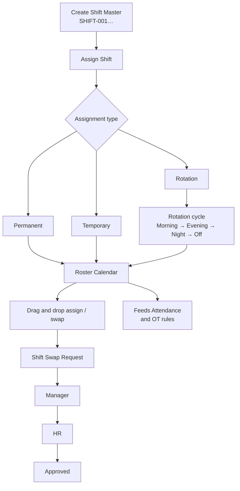

```text
Create Shift Master (SHIFT-001…)
      ↓
Assign Shift (Permanent / Temporary / Rotation)
      ↓
Optional Rotation: Morning → Evening → Night → Off
      ↓
Roster Calendar (Weekly / Monthly)
      ↓
Swap: Employee → Manager → HR → Approved
      ↓
Roster → Attendance & Overtime rules
```

---

## 6. Attendance Management

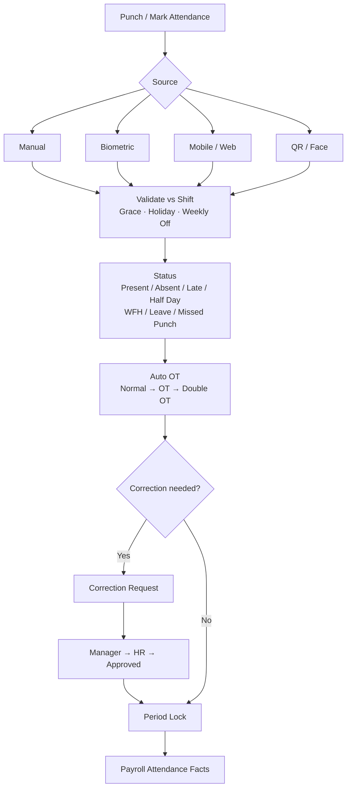

```text
Punch / Mark (Manual | Biometric | Mobile | Web | QR | Face)
      ↓
Validate vs Shift + Grace + Holiday + Weekly Off
      ↓
Status + Auto OT
      ↓
Correction? → Manager → HR → Approved
      ↓
Lock period → Payroll attendance facts
```

---

## 7. Leave Management

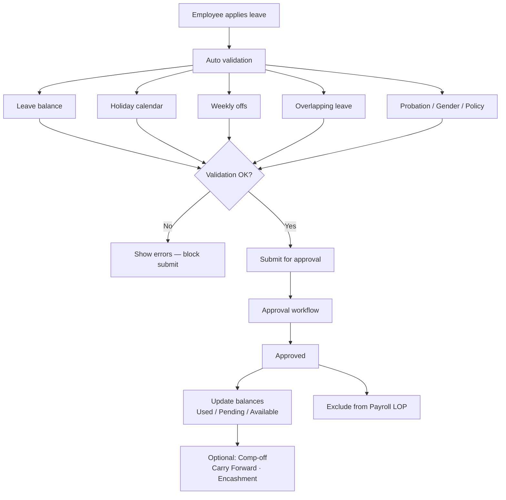

```text
Apply Leave
      ↓
Auto validation (balance, holidays, offs, overlaps, policy)
      ↓
Submit → Approval workflow
      ↓
Approved → Balance update
      ↓
Optional CF / Comp-off / Encashment
      ↓
Feeds Payroll (no LOP for approved leave)
```

---

## 8. Leave Approval Workflow

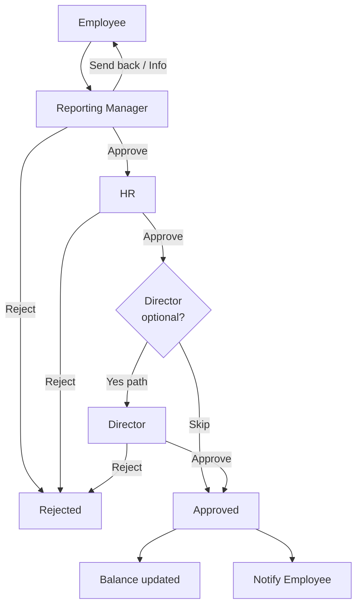

```text
Employee
   ↓
Reporting Manager ──reject──► Rejected
   ↓ approve
HR ──reject──► Rejected
   ↓ approve
[Director optional]
   ↓
Approved → Balance updated → Notify employee
```

---

## 9. Attendance Correction Workflow

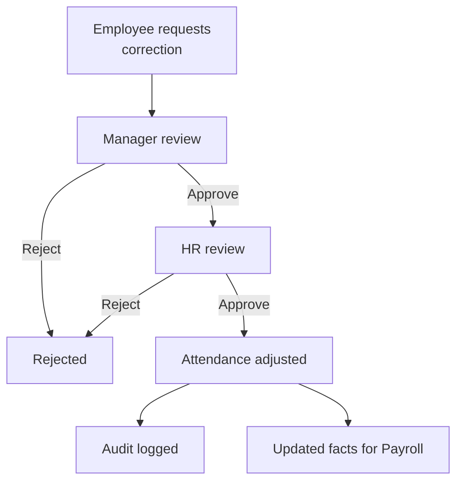

```text
Employee
   ↓
Manager
   ↓
HR
   ↓
Approved → Attendance adjusted → Audit logged
```

---

## 10. Performance & Training

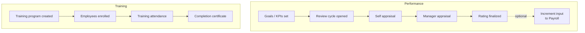

```text
Goals → Review cycle → Self + Manager appraisal → Rating
                                              └─► Increment (opt) → Payroll

Training program → Enroll → Attendance → Certificate
```

---

## 11. Separation / Exit

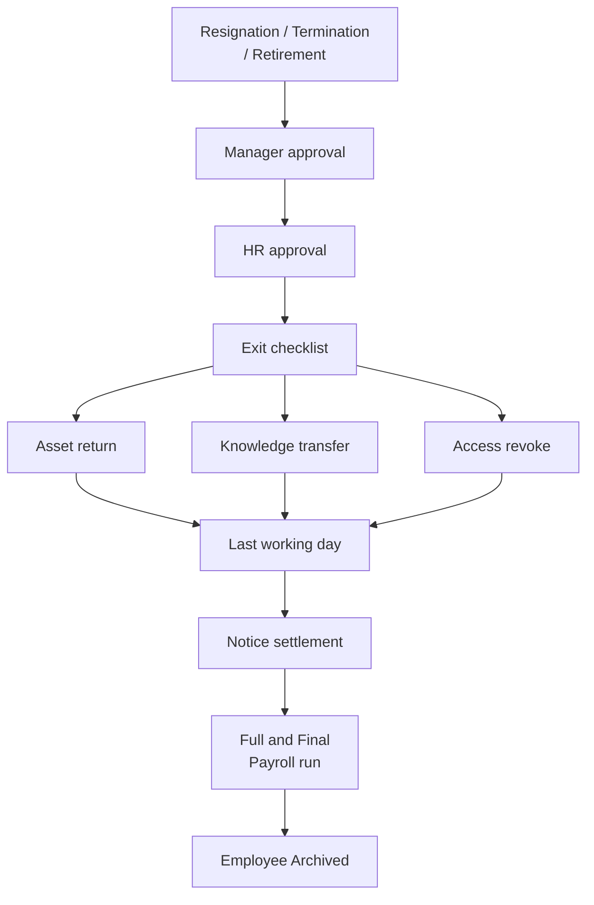

```text
Initiator (Employee / HR)
   ↓
Manager
   ↓
HR
   ↓
Clearance (assets, KT, access)
   ↓
LWD + notice settlement
   ↓
Full & Final payroll
   ↓
Employee Archived
```

---

## 12. Payroll Processing

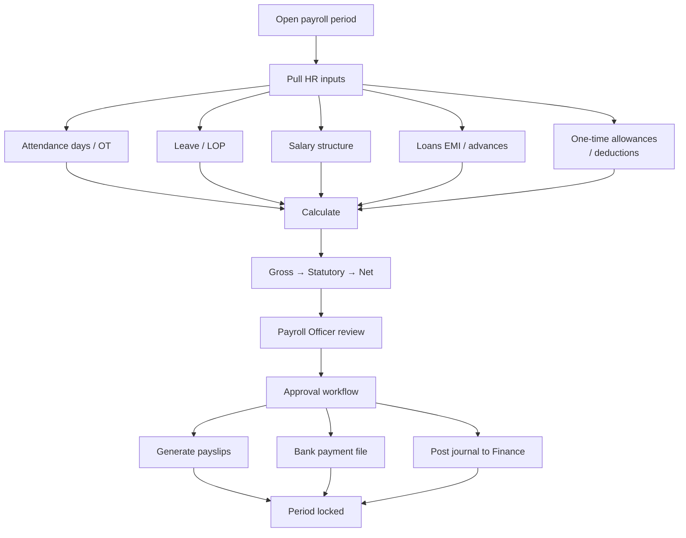

```text
Open period
      ↓
Pull HR inputs (attendance, leave, structure, loans…)
      ↓
Calculate gross → statutory → net
      ↓
Review → Approve
      ↓
Payslip + Bank file + Finance GL
      ↓
Period locked
```

---

## 13. Payroll Approval Workflow

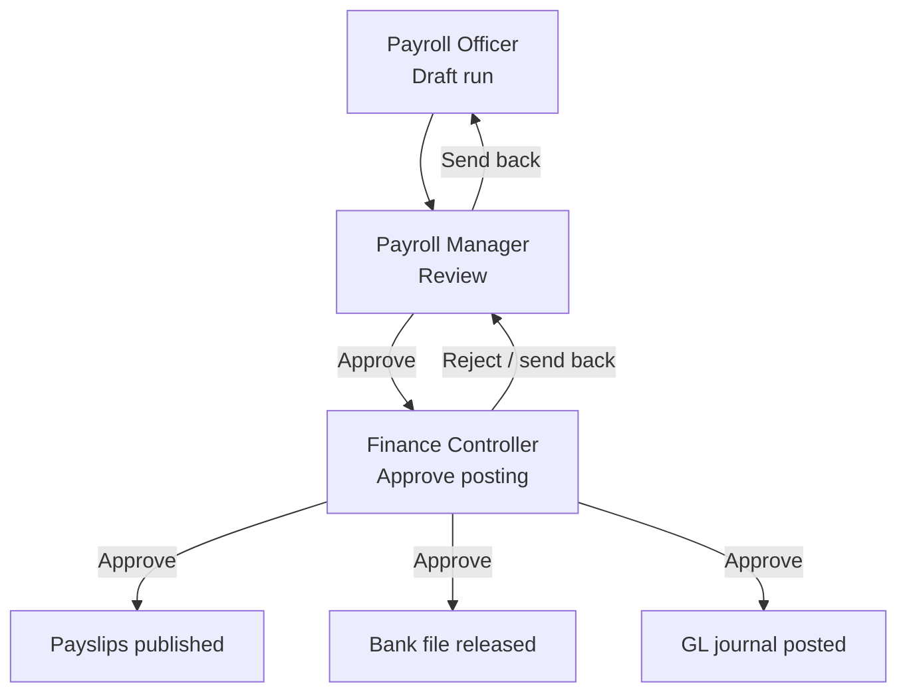

```text
Payroll Officer (Draft)
   ↓
Payroll Manager (Review)
   ↓
Finance Controller (Approve posting)
   ↓
Payslip + Bank + GL posted
```

---

## 14. Payroll → Finance Posting

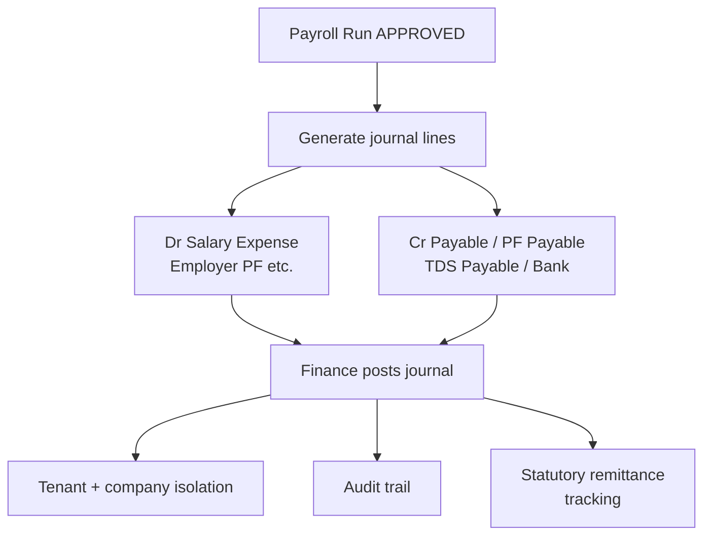

```text
Payroll Run APPROVED
      ↓
Generate journal
  Dr  Salary Expense / Employer contributions
  Cr  Payable / PF / TDS / Bank
      ↓
Finance posts journal
      ↓
Statutory remittance tracked
```

---

## 15. People → Time → Pay → Finance (Swimlane)

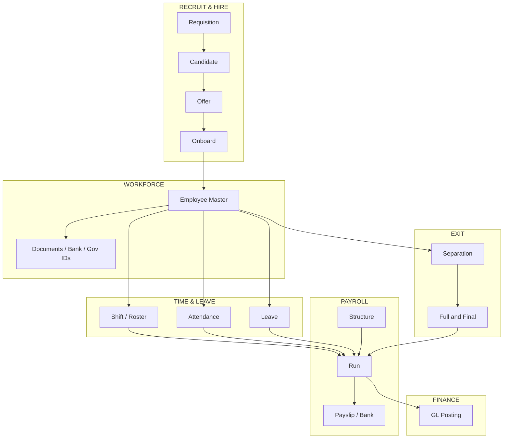

---

## 16. ASCII Quick Reference (All Flows)

### A. Master lifecycle

```text
Req → Candidate → Interview → Offer → Onboard → Employee
        → Shift | Attendance | Leave | Performance
                        ↓
                   Payroll → Payslip → Bank → Finance
                        ↑
                   Separation / F&F
```

### B. Leave approval

```text
Employee → Manager → HR → [Director] → Approved
                ↘ Reject
```

### C. Attendance correction

```text
Employee → Manager → HR → Adjusted + Audit
```

### D. Shift swap

```text
Employee → Manager → HR → Approved → Roster updated
```

### E. Separation

```text
Initiator → Manager → HR → Clearance → F&F Payroll → Archived
```

### F. Payroll

```text
Open → Inputs → Calculate → Review → Approve
         → Payslip | Bank | GL → Lock
```

### G. Integration

```text
Org → Master Employee → HRMS → Payroll → Finance
                          ↑
              Workflow · Audit · RBAC · Notify
```

---

## Legend

| Symbol / Style | Meaning |
|----------------|---------|
| Solid arrow `→` | Mandatory next step |
| Dashed arrow `-·->` | Optional / P1 path |
| Diamond | Decision / branch |
| Soft delete / Archive | No physical delete of business records |

---

## Document Control

| Version | Date | Notes |
|---------|------|-------|
| 1.0 | 2026-07-23 | Separate flows file with Mermaid + ASCII for all HRMS & Payroll processes |

**Parent:** [BRD-HRMS-Payroll-v1.0.md](./BRD-HRMS-Payroll-v1.0.md)
