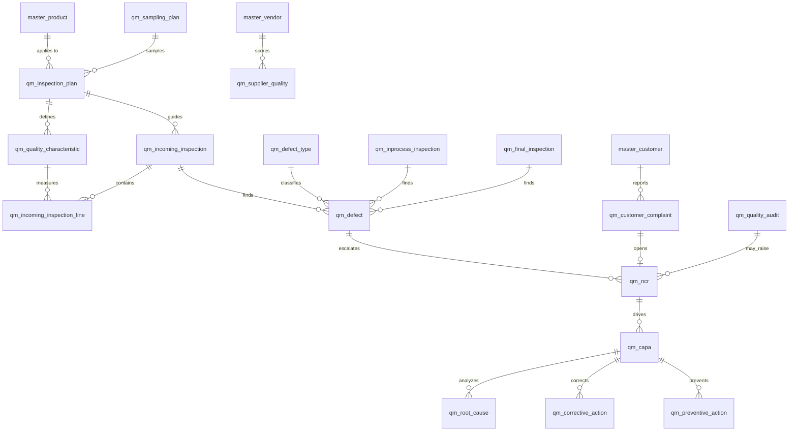

# ERD_09 — Quality Management Domain

**Document:** Enterprise ERD — Quality Management Domain  
**Version:** 1.0  
**Status:** Locked — Ready for Sprint 9 Implementation Planning  
**Schema:** `quality`  
**Table Prefix:** `qm_`  
**Aligned To:** BRD v1.0 · FRD-14 · SDD v1.1 · DBS v1.1 · Architecture Lock v1.1  
**Functional Requirements:** [FRD-14 Quality Management Domain](../02_FRD/FRD-14-Quality-Management-Domain.md)  
**Classification:** Internal — Confidential  
**Prior Release:** [ERP Core v1.3-beta](../07_RELEASES/ERP_Core_v1.3-beta.md)  

---

## 1. Module Overview

The Quality Management Domain ensures **product and process quality** across the procure-to-stock and make-to-stock / make-to-order flows: inspection planning, sampling, characteristic measurement, incoming / in-process / final inspections, defect capture, NCR, CAPA (root cause · corrective · preventive), supplier quality, customer complaints, quality audits, and quality scores.

Quality **does not** write `inv_*` tables — quarantine hold / release / reject movements go through the **Inventory Service** (`source_module = quality`). Valued quality / scrap / warranty costs go through **Finance** via `PostingService.post_system_journal` only. GRN, production order, and sales complaint links are **UUID + `source_module`** (no FK to `proc_*` / `mfg_*` / `sales_*` / `inv_*`).

**Business Tables: 18**  
**Schema: `quality`**

### Enterprise Quality Modules (FRD-14)

| # | Module | Primary Tables | Primary Consumers |
|---|--------|----------------|-------------------|
| 1 | Inspection Plan | `qm_inspection_plan` | Incoming / in-process / final |
| 2 | Sampling Plan | `qm_sampling_plan` | Inspection plans, incoming lines |
| 3 | Quality Characteristics | `qm_quality_characteristic` | Plan definition, measurement lines |
| 4 | Incoming Inspection | `qm_incoming_inspection`, `qm_incoming_inspection_line` | GRN → accept / reject / conditional |
| 5 | In-Process Inspection | `qm_inprocess_inspection` | Production order / operation |
| 6 | Final Inspection | `qm_final_inspection` | FG release / reject / rework |
| 7 | Defect Catalog | `qm_defect_type`, `qm_defect` | Inspections, NCR |
| 8 | Non-Conformance (NCR) | `qm_ncr` | CAPA, complaints, audits |
| 9 | CAPA | `qm_capa`, `qm_root_cause`, `qm_corrective_action`, `qm_preventive_action` | Continuous improvement |
| 10 | Supplier Quality | `qm_supplier_quality` | Vendor scorecards |
| 11 | Customer Complaint | `qm_customer_complaint` | Sales → NCR → CAPA |
| 12 | Quality Audit | `qm_quality_audit` | Internal / supplier / process / compliance |
| 13 | Quality Score | `qm_quality_score` | KPI snapshots / analytics |

**PostgreSQL Schema:** `quality` (Sprint 9 introduction; aligns DBS schema-per-domain convention)

### Architectural Position

```text
Foundation (ERD_01) ── Workflow, Audit, RBAC, Notification
Organization (ERD_02) ── Company, Branch, Cost Center
Master Data (ERD_03) ── Product, UOM, Warehouse, Employee, Vendor, Customer
Finance (ERD_04) ── Periods, Journal (PostingService only)
Procurement (ERD_06) ── GRN UUID → Incoming Inspection
Inventory (ERD_07) ── Quarantine / Hold / Release / Reject (sole stock writer)
Manufacturing (ERD_08) ── WO / operation / scrap UUID → In-Process / Final
Sales (ERD_05) ── Complaint / return UUID refs
        ↓
Quality (ERD_09) ── Plan · Inspect · NCR · CAPA · Audit · Score
        ↓
BI (future)
```

---

## 2. Scope

### In Scope
- Inspection plans by product / category and inspection type (incoming, in_process, final, customer_return) — FRD-14 §4
- Sampling plans (lot size bands, sample size, AQL / accept-reject counts) — FRD-14 planning
- Quality characteristics (dimension, weight, visual, packaging, label, custom) with UOM / tolerances — FRD-14 §8 checklist intent
- Incoming inspection triggered by GRN; results accepted / rejected / conditional — FRD-14 §5
- Incoming inspection lines capturing measured characteristics vs spec
- In-process inspection against production order / operation — FRD-14 §6
- Final inspection for finished goods: approved / rejected / rework_required — FRD-14 §7
- Defect types (master) and defect instances linked to inspections / NCR — FRD-14 §9
- NCR with severity (minor / major / critical) and approval workflow — FRD-14 §9, §16
- CAPA with separate root-cause, corrective-action, and preventive-action child records — FRD-14 §10
- Supplier quality scorecards by vendor / period — FRD-14 supplier QC
- Customer complaints with investigation → NCR → CAPA — FRD-14 §13
- Quality audits (internal / supplier / process / compliance) — FRD-14 §11
- Quality score KPI snapshots (FPY, defect rate, rework rate, complaint rate, supplier score) — FRD-14 §14
- Inventory Service integration only for quarantine / hold / release / reject
- Finance system-journal hooks for quality cost / scrap cost / warranty cost where valued
- Workflow, audit, RBAC, notifications, Celery (audit due, CAPA overdue, failed inspection alerts)

### Out of Scope (Phase 2 / Separate ERD)
- **Full compliance register / evidence repository tables** (`qm_compliance_*`) — FRD-14 §12; Sprint 9 stores standard codes on audit only
- **Separate audit findings child table** — findings captured as NCR / defect linked to audit UUID in Phase 1; dedicated `qm_audit_finding` Phase 2 if needed
- **Lab / LIMS instruments & calibration** — deferred
- **Certificate of Analysis (CoA) attachment store** — use Foundation document/attachment if present; no duplicate blob tables
- **Duplicate product / vendor / customer / warehouse masters** — C-01; use `master_*`
- **Direct `inv_*` / `fin_*` / `proc_*` / `mfg_*` / `sales_*` ORM writes** — service ports + UUID refs only
- SQLAlchemy models, Alembic migrations, application code (implementation sprint)
- Analytics cubes / `ana_fact_quality`

### Future Integration Notes
- **Compliance (Phase 2):** ISO/FDA/GMP register with evidence URIs
- **BI (FRD-18):** Read-only facts from inspections, NCR, CAPA, scores
- **Rework:** Final reject / rework_required references Manufacturing rework WO (Phase 2 `mfg_*`) via UUID

### Assumptions
- **Only Inventory Service** mutates stock; Quality calls hold / release / quarantine / reject ports
- **Only Finance PostingService** posts GL; Quality stores optional `finance_journal_id` refs
- Document numbers company-scoped and immutable after submit
- Soft delete on mutable masters/documents; posted score snapshots retain soft-delete policy but are append-oriented practically
- One open incoming inspection per GRN line set is service-enforced (not hard UK across companies)
- Conditional acceptance does **not** auto-release to unrestricted stock without explicit Quality Manager approval
- Rejected incoming material cannot enter production (service rule + inventory quarantine / reject status)

### Dependencies

| Upstream | Tables / Services Used |
|----------|------------------------|
| ERD_01 Foundation | `sec_tenant`, `sec_user`, `wf_definition`, `wf_instance` |
| ERD_02 Organization | `org_company`, `org_branch`, `org_cost_center` |
| ERD_03 Master Data | `master_product`, `master_uom`, `master_warehouse`, `master_employee`, `master_vendor`, `master_customer` |
| ERD_04 Finance | `fin_period`, `fin_journal_header` (ref only) + PostingService |
| ERD_05 Sales | Logical UUID refs (complaint / return) |
| ERD_06 Procurement | Logical UUID refs (GRN header/line) |
| ERD_07 Inventory | Inventory Service API only — no FK to `inv_*` |
| ERD_08 Manufacturing | Logical UUID refs (production order / operation / scrap / receipt) |

---

## 3. Table Inventory

| # | Table | Classification | tenant_id | company_id | branch_id | Soft Delete | Version | Workflow |
|---|-------|----------------|-----------|------------|-----------|-------------|---------|----------|
| 1 | `qm_inspection_plan` | Quality Master | ✅ | ✅ | optional | ✅ | ✅ | — |
| 2 | `qm_sampling_plan` | Quality Master | ✅ | ✅ | optional | ✅ | ✅ | — |
| 3 | `qm_quality_characteristic` | Quality Master | ✅ | ✅ | optional | ✅ | ✅ | — |
| 4 | `qm_incoming_inspection` | Transaction | ✅ | ✅ | ✅ | ✅ | ✅ | ✅ |
| 5 | `qm_incoming_inspection_line` | Transaction Detail | ✅ | ✅ | ✅ | ✅ | ✅ | — |
| 6 | `qm_inprocess_inspection` | Transaction | ✅ | ✅ | ✅ | ✅ | ✅ | — |
| 7 | `qm_final_inspection` | Transaction | ✅ | ✅ | ✅ | ✅ | ✅ | ✅ |
| 8 | `qm_defect_type` | Catalog Master | ✅ | ✅ | optional | ✅ | ✅ | — |
| 9 | `qm_defect` | Transaction | ✅ | ✅ | ✅ | ✅ | ✅ | — |
| 10 | `qm_ncr` | Transaction | ✅ | ✅ | ✅ | ✅ | ✅ | ✅ |
| 11 | `qm_capa` | Transaction | ✅ | ✅ | ✅ | ✅ | ✅ | ✅ |
| 12 | `qm_root_cause` | Transaction Detail | ✅ | ✅ | ✅ | ✅ | ✅ | — |
| 13 | `qm_corrective_action` | Transaction Detail | ✅ | ✅ | ✅ | ✅ | ✅ | — |
| 14 | `qm_preventive_action` | Transaction Detail | ✅ | ✅ | ✅ | ✅ | ✅ | — |
| 15 | `qm_supplier_quality` | Scorecard | ✅ | ✅ | optional | ✅ | ✅ | — |
| 16 | `qm_customer_complaint` | Transaction | ✅ | ✅ | ✅ | ✅ | ✅ | ✅ |
| 17 | `qm_quality_audit` | Transaction | ✅ | ✅ | ✅ | ✅ | ✅ | ✅ |
| 18 | `qm_quality_score` | KPI Snapshot | ✅ | ✅ | optional | ✅ | ✅ | — |

> **Notes:** Incoming inspection + NCR + CAPA + final inspection + customer complaint + audit carry workflow seeds in Sprint 9. In-process inspection uses status lifecycle without a dedicated approval workflow seed (supervisor confirmation in application). FRD checklist concepts map to `qm_quality_characteristic` (+ plan linkage), not a separate checklist table.

**Business Tables: 18**  
**Schema: `quality`**

---

## 4. Entity Relationships



```text
master_product / category
    └── qm_inspection_plan → qm_sampling_plan
            └── qm_quality_characteristic

GRN (UUID) ──► qm_incoming_inspection
                    └── lines → characteristic measurements
                    └── defects → qm_ncr → qm_capa
                                        ├── root_cause
                                        ├── corrective_action
                                        └── preventive_action

Production Order (UUID) ──► qm_inprocess_inspection / qm_final_inspection
                                    └── accept → Inventory / MFG receipt gate
                                    └── reject → Scrap / Rework UUID refs

Customer Complaint ──► NCR ──► CAPA
Supplier Quality ← vendor KPI rollup
Quality Audit ← findings via NCR/defect links
Quality Score ← period KPI snapshot
```

---

## 5. Standard Column Profiles

### 5.1 Quality Master Profile (Plan, Sampling, Characteristic, Defect Type)

| Column Group | Columns |
|--------------|---------|
| Primary Key | `id UUID` |
| Tenant / Company | `tenant_id`, `company_id` |
| Business Key | code fields |
| Status | `status VARCHAR(30)` |
| Audit + Soft Delete + Version | per DBS §28 |

### 5.2 Transaction Header Profile (Inspections, NCR, CAPA, Complaint, Audit)

| Column Group | Columns |
|--------------|---------|
| Primary Key | `id UUID` |
| Document | `document_number`, `document_date` |
| Status / Workflow | `status`, `workflow_status`, `workflow_instance_id` (where applicable) |
| Scope | `tenant_id`, `company_id`, `branch_id` |
| Source Link | `source_module`, `source_document_id`, optional `source_line_id` (no cross-schema FK) |
| Audit + Soft Delete + Version | per DBS §28 |

### 5.3 Score / Snapshot Profile (Supplier Quality, Quality Score)

| Column Group | Columns |
|--------------|---------|
| Scope | tenant / company (+ optional branch) |
| Period | `period_id` or `score_period_start` / `score_period_end` |
| Metrics | NUMERIC KPI columns |
| Status | `status` (draft / published) |

---

## 6. Detailed Table Definitions

### 6.1 `qm_inspection_plan`

| Column | Type | Nullable | Description |
|--------|------|----------|-------------|
| `id` | UUID | NO | PK |
| `tenant_id` / `company_id` | UUID | NO | Scope |
| `branch_id` | UUID | YES | Optional |
| `plan_code` | VARCHAR(50) | NO | UK per company — `QPL-YYYY-NNNNNN` |
| `plan_name` | VARCHAR(255) | NO | — |
| `product_id` | UUID | YES | FK → `master_product` (null = category-level) |
| `product_category` | VARCHAR(100) | YES | Free/category label when product not set |
| `inspection_type` | VARCHAR(30) | NO | incoming, in_process, final, customer_return |
| `sampling_plan_id` | UUID | YES | FK → `qm_sampling_plan` |
| `status` | VARCHAR(30) | NO | draft, active, obsolete |
| `notes` | TEXT | YES | — |
| AUDIT_STD + SOFT_DELETE_OPT + version | | | |

**UK:** `(company_id, plan_code)` where not deleted.

---

### 6.2 `qm_sampling_plan`

| Column | Type | Nullable | Description |
|--------|------|----------|-------------|
| `id` | UUID | NO | PK |
| Scope | UUID | NO | tenant/company |
| `sampling_code` | VARCHAR(50) | NO | UK — `SMP-YYYY-NNNNNN` |
| `sampling_name` | VARCHAR(255) | YES | — |
| `lot_size_from` / `lot_size_to` | NUMERIC(18,4) | YES | Band |
| `sample_size` | NUMERIC(18,4) | NO | — |
| `accept_count` | SMALLINT | NO | DEFAULT 0 |
| `reject_count` | SMALLINT | NO | — |
| `aql_percent` | NUMERIC(9,4) | YES | Optional AQL |
| `status` | VARCHAR(30) | NO | active, inactive |
| AUDIT_STD + SOFT_DELETE_OPT + version | | | |

**UK:** `(company_id, sampling_code)` where not deleted.  
**Check:** `reject_count >= accept_count`; lot bands coherent when both set.

---

### 6.3 `qm_quality_characteristic`

| Column | Type | Nullable | Description |
|--------|------|----------|-------------|
| `id` | UUID | NO | PK |
| Scope | UUID | NO | — |
| `inspection_plan_id` | UUID | YES | FK → plan (optional shared characteristics) |
| `characteristic_code` | VARCHAR(50) | NO | UK per company |
| `characteristic_name` | VARCHAR(255) | NO | — |
| `characteristic_type` | VARCHAR(30) | NO | numeric, pass_fail, text, visual |
| `uom_id` | UUID | YES | FK → `master_uom` for numeric |
| `target_value` / `min_value` / `max_value` | NUMERIC(18,4) | YES | Spec limits |
| `is_mandatory` | BOOLEAN | NO | DEFAULT true |
| `status` | VARCHAR(30) | NO | active, inactive |
| AUDIT_STD + SOFT_DELETE_OPT + version | | | |

**UK:** `(company_id, characteristic_code)` where not deleted.

---

### 6.4 `qm_incoming_inspection` / 6.5 `qm_incoming_inspection_line`

**Header**

| Column | Notes |
|--------|-------|
| `document_number` | `IQC-YYYY-NNNNNN` |
| `document_date` | DATE |
| `warehouse_id` | FK → `master_warehouse` |
| `inspection_plan_id` | FK optional |
| `vendor_id` | FK → `master_vendor` optional |
| `product_id` / `uom_id` | Product under inspection |
| `inspected_qty` | NUMERIC |
| `accepted_qty` / `rejected_qty` | NUMERIC DEFAULT 0 |
| `result` | pending, accepted, rejected, conditional |
| `status` | draft, in_progress, completed, cancelled |
| `workflow_*` | Incoming release / reject approval when conditional/reject |
| `source_module` | `procurement` |
| `source_document_type` | `grn` / `grn_line` |
| `source_document_id` / `source_line_id` | GRN UUIDs — **no FK** |
| `inspector_employee_id` | FK → `master_employee` |
| `inspected_at` | TIMESTAMPTZ |
| `inventory_event_id` | Logical UUID of inventory movement (idempotency) |
| `period_id` / `finance_journal_id` | Optional valued disposition |

**Line:** `line_number`, `characteristic_id`, `measured_value` (NUMERIC/null), `measured_text`, `pass_fail` (pass/fail/na), `is_out_of_spec` BOOLEAN, `defect_type_id` optional, `notes`, `status`.

**On complete — Accepted:** Inventory Service release from quarantine → available (`source_module=quality`).  
**On complete — Rejected:** Inventory remain/reject; initiate vendor return via Procurement Service + UUID refs (no direct `proc_*` write from Quality ORM).  
**Conditional:** remains on quality hold until approved release.

---

### 6.6 `qm_inprocess_inspection`

| Column | Notes |
|--------|-------|
| `document_number` | `IPQC-YYYY-NNNNNN` |
| `production_order_id` | UUID — **no FK** to `mfg_*` |
| `production_operation_id` | UUID optional — no FK |
| `operation_seq` | SMALLINT optional |
| `product_id`, `inspection_plan_id`, `inspector_employee_id` | Masters |
| `result` | pending, accepted, rejected, rework_required |
| `status` | draft, completed, cancelled |
| `source_module` | `manufacturing` |
| Defects via `qm_defect` |

**Business rule:** Rejected in-process may block operation complete (Manufacturing Service coordination); Quality does not update `mfg_*` directly.

---

### 6.7 `qm_final_inspection`

| Column | Notes |
|--------|-------|
| `document_number` | `FQC-YYYY-NNNNNN` |
| `production_order_id` / `production_receipt_id` | UUID refs — no FK |
| `product_id`, `warehouse_id`, qty fields | — |
| `result` | pending, approved, rejected, rework_required |
| `status` | draft, submitted, approved, completed, cancelled |
| `workflow_*` | Final release approval |
| **Gate:** Only `approved` may proceed to FG production receipt / unrestricted inventory | Service orchestration |

Rejected → Manufacturing scrap and/or rework WO UUID refs; Inventory quarantine/reject as needed.

---

### 6.8 `qm_defect_type`

| Column | Notes |
|--------|-------|
| `defect_type_code` | UK per company — `DFT-…` or stable code |
| `defect_type_name` | — |
| `severity_default` | minor, major, critical |
| `category` | material, process, packaging, labeling, other |
| `status` | active, inactive |

---

### 6.9 `qm_defect`

| Column | Notes |
|--------|-------|
| Soft transactional record (may omit document_number) OR `DEF-YYYY-NNNNNN` optional |
| `defect_type_id` | FK |
| `severity` | minor, major, critical |
| `quantity` | NUMERIC ≥ 0 |
| `description` | TEXT |
| `source_inspection_type` | incoming, in_process, final, audit, complaint, other |
| `incoming_inspection_id` / `inprocess_inspection_id` / `final_inspection_id` | Optional FKs within `quality` |
| `ncr_id` | Optional FK after escalation |
| `product_id`, `status` | open, linked_to_ncr, closed |

---

### 6.10 `qm_ncr`

| Column | Notes |
|--------|-------|
| `document_number` | `NCR-YYYY-NNNNNN` |
| `source` | incoming, in_process, final, audit, complaint, supplier, other |
| `severity` | minor, major, critical |
| `description` | TEXT |
| `product_id`, `vendor_id`, `customer_id` | Optional masters |
| `status` | draft, submitted, approved, closed, cancelled |
| `workflow_*` | NCR approval (Inspector → Quality Manager) |
| Links | optional inspection UUIDs; `source_module` / `source_document_id` |

---

### 6.11–6.14 CAPA cluster

**`qm_capa`:** `CAPA-YYYY-NNNNNN`, `ncr_id` FK, `capa_type` (corrective, preventive, both), `status` draft → submitted → approved → in_progress → verified → closed / cancelled, `workflow_*`, `owner_employee_id`, dates (`due_date`, `verified_at`).

**`qm_root_cause`:** `capa_id`, `sequence_no`, `method` (5_why, fishbone, other), `cause_text`, `status`.

**`qm_corrective_action`:** `capa_id`, `sequence_no`, `action_text`, `owner_employee_id`, `due_date`, `completed_at`, `verification_notes`, `status` (open, done, verified).

**`qm_preventive_action`:** Mirror of corrective for prevention.

---

### 6.15 `qm_supplier_quality`

| Column | Notes |
|--------|-------|
| `vendor_id` | FK → `master_vendor` |
| `score_period_start` / `end` | DATE |
| `incoming_accept_rate` / `defect_rate` / `ncr_count` / `overall_score` | NUMERIC |
| `status` | draft, published |
| **UK (service):** one published row per `(company_id, vendor_id, period)` |

---

### 6.16 `qm_customer_complaint`

| Column | Notes |
|--------|-------|
| `document_number` | `CQC-YYYY-NNNNNN` |
| `customer_id` | FK → `master_customer` |
| `complaint_type` | defective_product, packaging, performance, wrong_product, other |
| `product_id`, `quantity`, `description` | — |
| `status` | draft, investigating, ncr_raised, capa_linked, closed, cancelled |
| `workflow_*` | Optional complaint closure |
| `ncr_id` | FK optional |
| `source_module` / `source_document_id` | sales_return / sales_order UUID |

---

### 6.17 `qm_quality_audit`

| Column | Notes |
|--------|-------|
| `document_number` | `QAD-YYYY-NNNNNN` |
| `audit_type` | internal, supplier, process, compliance |
| `audit_standard` | ISO9001, ISO27001, ISO14001, FDA, GMP, other / free text |
| `vendor_id` | Optional for supplier audit |
| `planned_start` / `planned_end` / `actual_*` | — |
| `status` | planned, in_progress, completed, closed, cancelled |
| `workflow_*` | Audit closure (Auditor → Quality Head) |
| `lead_auditor_employee_id` | FK |
| Findings | Raise `qm_ncr` / `qm_defect` with `source_module=quality`, `source_document_type=quality_audit` |

---

### 6.18 `qm_quality_score`

| Column | Notes |
|--------|-------|
| `score_code` optional / period key | — |
| `score_dimension` | company, product, vendor, customer |
| `dimension_ref_id` | UUID of product/vendor/customer when applicable |
| `period_start` / `period_end` | — |
| KPIs | `first_pass_yield`, `defect_rate`, `rework_rate`, `complaint_rate`, `supplier_quality_score` NUMERIC |
| `status` | draft, published |
| Celery or service job refreshes from inspection/NCR/complaint facts |

---

## 7. Primary Keys

| Table | Constraint Name | Column |
|-------|-----------------|--------|
| `qm_inspection_plan` | `pk_qm_inspection_plan` | `id` |
| `qm_sampling_plan` | `pk_qm_sampling_plan` | `id` |
| `qm_quality_characteristic` | `pk_qm_quality_characteristic` | `id` |
| `qm_incoming_inspection` | `pk_qm_incoming_inspection` | `id` |
| `qm_incoming_inspection_line` | `pk_qm_incoming_insp_line` | `id` |
| `qm_inprocess_inspection` | `pk_qm_inprocess_inspection` | `id` |
| `qm_final_inspection` | `pk_qm_final_inspection` | `id` |
| `qm_defect_type` | `pk_qm_defect_type` | `id` |
| `qm_defect` | `pk_qm_defect` | `id` |
| `qm_ncr` | `pk_qm_ncr` | `id` |
| `qm_capa` | `pk_qm_capa` | `id` |
| `qm_root_cause` | `pk_qm_root_cause` | `id` |
| `qm_corrective_action` | `pk_qm_corrective_action` | `id` |
| `qm_preventive_action` | `pk_qm_preventive_action` | `id` |
| `qm_supplier_quality` | `pk_qm_supplier_quality` | `id` |
| `qm_customer_complaint` | `pk_qm_customer_complaint` | `id` |
| `qm_quality_audit` | `pk_qm_quality_audit` | `id` |
| `qm_quality_score` | `pk_qm_quality_score` | `id` |

---

## 8. Foreign Keys

| Child | Column | Parent |
|-------|--------|--------|
| Plans / inspections | `product_id`, `uom_id`, `warehouse_id` | `master.*` |
| Inspections / CAPA / audit | `*_employee_id` | `master_employee` |
| Vendor / customer score & complaint | `vendor_id`, `customer_id` | `master_vendor` / `master_customer` |
| Internal | plan→sampling, characteristic→plan, incoming lines→header/characteristic, defect→type, capa→ncr, CAPA children→capa | `quality.*` |
| Workflow | `workflow_instance_id` | `foundation.wf_instance` |
| Finance | `period_id`, `finance_journal_id` | `finance.*` (refs only) |
| Org | `tenant_id`, `company_id`, `branch_id`, optional `cost_center_id` | foundation / organization |

**No FK to:** `inv_*`, `proc_*`, `mfg_*`, `sales_*` — UUID + `source_module` / `source_document_type` only.

---

## 9. Indexes & Constraints

### Unique
- Document headers: `(company_id, document_number)` where not deleted
- Masters: company + code (`plan_code`, `sampling_code`, `characteristic_code`, `defect_type_code`)
- Lines: `(incoming_inspection_id, line_number)`
- CAPA children: `(capa_id, sequence_no)` per child table

### Check
- Quantities ≥ 0; rejected_qty / accepted_qty coherent vs inspected_qty (service + optional DB checks)
- Enum status / result / severity / inspection_type / audit_type sets
- Sampling `reject_count >= accept_count`

### Indexes
- All FKs
- `(tenant_id, company_id, product_id)` on inspections / NCR
- `(source_module, source_document_id)` on incoming / in-process / final / complaint
- `(status)` on NCR, CAPA, audit for work queues
- `(vendor_id, score_period_start)` on supplier quality

---

## 10. Document Numbering

| Document | Format | UK Scope |
|----------|--------|----------|
| Inspection Plan | `QPL-YYYY-NNNNNN` | company |
| Sampling Plan | `SMP-YYYY-NNNNNN` | company |
| Incoming Inspection | `IQC-YYYY-NNNNNN` | company |
| In-Process Inspection | `IPQC-YYYY-NNNNNN` | company |
| Final Inspection | `FQC-YYYY-NNNNNN` | company |
| NCR | `NCR-YYYY-NNNNNN` | company |
| CAPA | `CAPA-YYYY-NNNNNN` | company |
| Customer Complaint | `CQC-YYYY-NNNNNN` | company |
| Quality Audit | `QAD-YYYY-NNNNNN` | company |

Characteristic / defect type codes may be non-year business codes (still company-unique).

---

## 11. Status Lifecycles

| Entity | Statuses |
|--------|----------|
| Inspection / Sampling Plan / Characteristic / Defect Type | draft→active→obsolete **or** active/inactive |
| Incoming Inspection | draft → in_progress → completed \| cancelled; `result` pending/accepted/rejected/conditional |
| In-Process Inspection | draft → completed \| cancelled; `result` pending/accepted/rejected/rework_required |
| Final Inspection | draft → submitted → approved → completed \| cancelled; `result` pending/approved/rejected/rework_required |
| Defect | open → linked_to_ncr → closed |
| NCR | draft → submitted → approved → closed \| cancelled |
| CAPA | draft → submitted → approved → in_progress → verified → closed \| cancelled |
| Customer Complaint | draft → investigating → ncr_raised → capa_linked → closed \| cancelled |
| Quality Audit | planned → in_progress → completed → closed \| cancelled |
| Supplier Quality / Quality Score | draft → published |

---

## 12. Stock & Disposition Strategy (Integrations)

| Trigger | Inventory API | Procurement / Manufacturing | Finance |
|---------|---------------|----------------------------|---------|
| Incoming accepted | Release quarantine → available | — | Optional quality cost accrual |
| Incoming rejected | Reject / hold scrap path | Purchase return / debit via Proc Service | Scrap / reject expense journal |
| Incoming conditional | Quality hold | — | — |
| Final approved | Allow FG receipt / release | Production receipt confirm | FG valued receipt (MFG/Inv existing) |
| Final rejected | Quarantine / reject | Scrap / rework UUID | Scrap expense via MFG or Quality posting |
| Complaint warranty | Optional stock return receive | — | Warranty expense journal |

**Idempotency:** `(source_module, source_document_type, source_document_id[, line_id])` on Inventory side.  
**Concurrency:** optimistic `version` on headers and CAPA.

---

## 13. Workflow Integration

| Workflow Code | Document | Path (FRD-14 §16) |
|---------------|----------|-------------------|
| `QM_INCOMING_DISPOSITION` | Incoming Inspection | Inspector → Quality Manager (reject / conditional release) |
| `QM_FINAL_RELEASE` | Final Inspection | Inspector → Quality Manager |
| `QM_NCR_APPROVAL` | NCR | Inspector → Quality Manager |
| `QM_CAPA_APPROVAL` | CAPA | Quality Engineer → Quality Manager |
| `QM_AUDIT_CLOSURE` | Quality Audit | Auditor → Quality Head |
| `QM_COMPLAINT_CLOSURE` | Customer Complaint | Quality → Quality Manager (optional) |

---

## 14. Audit Strategy

| Layer | Mechanism |
|-------|-----------|
| Row audit | Standard columns on mutable tables |
| Business audit | `AuditService` on inspection complete, NCR approve, CAPA verify/close, audit close, inventory disposition |
| Notifications | Inspection failed, NCR created, CAPA assigned/overdue, audit due, compliance standard reminder (FRD-14 §17) |

---

## 15. Tenant / Company / Branch Isolation

| Rule | Application |
|------|-------------|
| `tenant_id` | All tables |
| `company_id` | Numbering and quality org boundary |
| `branch_id` | Mandatory on transactional inspections / NCR / CAPA / complaint / audit |
| Repository | `QmScopedRepository` pattern |
| RBAC | `quality.*` permissions |

### Planned RBAC (Sprint 9)

| Resource | Permissions |
|----------|-------------|
| `quality.inspection_plan` | read, create, update |
| `quality.sampling_plan` | read, create, update |
| `quality.characteristic` | read, create, update |
| `quality.incoming_inspection` | read, create, update, complete, approve |
| `quality.inprocess_inspection` | read, create, complete |
| `quality.final_inspection` | read, create, submit, approve, complete |
| `quality.defect` / `defect_type` | read, create, update |
| `quality.ncr` | read, create, submit, approve, close |
| `quality.capa` | read, create, submit, approve, verify, close |
| `quality.supplier_quality` | read, publish |
| `quality.customer_complaint` | read, create, update, close |
| `quality.audit` | read, create, update, close |
| `quality.score` | read, publish |
| `quality.report` | read, export |

**Roles:** `QUALITY_INSPECTOR`, `QUALITY_ENGINEER`, `QUALITY_MANAGER`, `QUALITY_AUDITOR` (+ Procurement/Production coordination permissions as grants).

---

## 16. Migration Order

Prior Alembic head: **`0114_seed_mfg_workflows`**.

| Order | Revision ID (≤32 chars) | Migration | Tables / Actions |
|-------|-------------------------|-----------|------------------|
| 115 | `0115_create_quality_schema` | Create schema | `quality` |
| 116 | `0116_qm_sampling_plan` | Sampling | `qm_sampling_plan` |
| 117 | `0117_qm_defect_type` | Defect catalog | `qm_defect_type` |
| 118 | `0118_qm_inspection_plan` | Plan H | `qm_inspection_plan` |
| 119 | `0119_qm_quality_char` | Characteristics | `qm_quality_characteristic` |
| 120 | `0120_qm_incoming_insp` | Incoming H | `qm_incoming_inspection` |
| 121 | `0121_qm_incoming_insp_line` | Incoming L | `qm_incoming_inspection_line` |
| 122 | `0122_qm_inprocess_insp` | In-process | `qm_inprocess_inspection` |
| 123 | `0123_qm_final_inspection` | Final | `qm_final_inspection` |
| 124 | `0124_qm_defect` | Defects | `qm_defect` |
| 125 | `0125_qm_ncr` | NCR | `qm_ncr` |
| 126 | `0126_qm_capa` | CAPA H | `qm_capa` |
| 127 | `0127_qm_root_cause` | Root cause | `qm_root_cause` |
| 128 | `0128_qm_corrective_action` | Corrective | `qm_corrective_action` |
| 129 | `0129_qm_preventive_action` | Preventive | `qm_preventive_action` |
| 130 | `0130_qm_supplier_quality` | Supplier score | `qm_supplier_quality` |
| 131 | `0131_qm_customer_complaint` | Complaints | `qm_customer_complaint` |
| 132 | `0132_qm_quality_audit` | Audits | `qm_quality_audit` |
| 133 | `0133_qm_quality_score` | KPI score | `qm_quality_score` |
| 134 | `0134_seed_qm_permissions` | RBAC | Permissions / roles |
| 135 | `0135_seed_qm_workflows` | Workflows | Incoming / Final / NCR / CAPA / Audit / Complaint |

**Dependency order:** schema → sampling & defect type → plan → characteristics → inspections → defects → NCR → CAPA children → scorecards/complaints/audits/scores → seeds.

**Planned head after Sprint 9:** `0135_seed_qm_workflows`

---

## 17. Cross Module Dependencies

### 17.1 Upstream (Quality Consumes)

| Module | FRD | Provides | Pattern |
|--------|-----|----------|---------|
| Foundation | FRD-01 | tenant, user, workflow, audit, RBAC | Direct FK |
| Organization | FRD-02 | company, branch, cost center | Direct FK |
| Master Data | FRD-03 | product, uom, warehouse, employee, vendor, customer | Direct FK — C-01 |
| Finance | FRD-04 | period, journal posting API | FK refs + PostingService |
| Procurement | FRD-07 | GRN identity | UUID + service for returns |
| Inventory | FRD-08 | quarantine / hold / release / reject | Application service only |
| Manufacturing | FRD-13 | WO / operation / scrap / receipt identity | UUID + service gates |
| Sales | FRD-05 | complaint / return identity | UUID only |

### 17.2 Downstream

| Module | FRD | Pattern |
|--------|-----|---------|
| BI | FRD-18 | Read-only quality facts |
| Manufacturing / Procurement | — | Gatekeepers call Quality status before stock/FG release |

**Rule:** Quality never bypasses Inventory or Finance engines for stock or GL, and never writes peer domain tables directly.

---

## 18. API Boundaries (Planned)

**Mount:** `/quality`

| Area | Routes |
|------|--------|
| Plans / Sampling / Characteristics / Defect Types | CRUD |
| Incoming Inspections | CRUD + complete / approve disposition |
| In-Process / Final Inspections | CRUD + complete / submit / approve |
| Defects | create / link to NCR |
| NCR | CRUD + submit / approve / close |
| CAPA (+ root cause / actions) | CRUD + submit / approve / verify / close |
| Supplier Quality / Scores | read / publish |
| Customer Complaints | CRUD + close |
| Audits | CRUD + close |
| Reports | incoming, production quality, NCR, CAPA, supplier, complaint, audit |

Normalize FRD loose paths under `/quality/*` (modular monolith style).

---

## 19. Celery / Background Jobs (Planned)

| Task | Purpose |
|------|---------|
| `quality.inspection_failed_alerts` | Failed / rejected inspection notifications |
| `quality.capa_overdue_alerts` | Open CAPA past due_date |
| `quality.audit_due_alerts` | Planned audits approaching window |
| `quality.refresh_quality_scores` | Recompute KPI snapshots |
| `quality.retry_finance_posting` | Failed quality/scrap/warranty journals |
| `quality.retry_inventory_disposition` | Failed quarantine release/reject |

---

## 20. Phase Gate Checklist

| # | Gate Criterion | Status |
|---|----------------|--------|
| 1 | Business tables = **18**; schema = **`quality`** | ✅ |
| 2 | Prefix `qm_` defined | ✅ |
| 3 | Aligned to FRD-14; incoming / in-process / final / NCR / CAPA / audit / complaints covered | ✅ |
| 4 | Inventory-only stock writes; Finance system journals only | ✅ |
| 5 | No FKs to `inv_*` / `proc_*` / `mfg_*` / `sales_*` | ✅ |
| 6 | Migration order `0115`–`0135`, revision IDs ≤ 32 chars | ✅ |
| 7 | Workflows + RBAC + Celery documented | ✅ |
| 8 | Cross-module dependencies documented | ✅ |
| 9 | Compliance register / audit findings child deferred without blocking Sprint 9 | ✅ |
| 10 | No Architecture Lock changes; Architecture Lock v1.1 preserved | ✅ |

### ERD Phase Gate — Quality Summary

| Metric | Value |
|--------|-------|
| Business Tables | **18** |
| Schema | **`quality`** |
| Prefix | `qm_` |
| Migration range | `0115` – `0135` |
| Prior head | `0114_seed_mfg_workflows` |
| Planned head | `0135_seed_qm_workflows` |

---

## Document Control

| Version | Date | Change |
|---------|------|--------|
| 1.0 | 2026-07-14 | Initial ERD_09 Quality from FRD-14; architecture review editorial lock (status locked for Sprint 9 planning) |

---

**ERD_09 Quality Management locked for Sprint 9 implementation planning.**