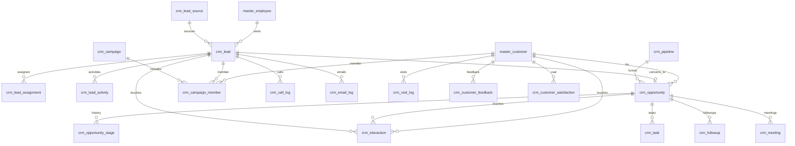

# ERD_10 — CRM Domain

**Document:** Enterprise ERD — Customer Relationship Management Domain  
**Version:** 1.0  
**Status:** Locked — Ready for Sprint 10 Implementation Planning  
**Schema:** `crm`  
**Table Prefix:** `crm_`  
**Aligned To:** BRD v1.0 · FRD-05 · SDD v1.1 · DBS v1.1 · Architecture Lock v1.1  
**Functional Requirements:** [FRD-05 CRM Domain](../02_FRD/FRD-05-CRM-Domain.md)  
**Classification:** Internal — Confidential  
**Prior Release:** [ERP Core v1.4-beta](../07_RELEASES/ERP_Core_v1.4-beta.md)  

---

## 1. Module Overview

The CRM Domain is the enterprise **customer relationship layer**: lead capture and assignment, lead activities, opportunities and stage history, sales pipeline, campaigns and campaign members, customer interactions, tasks, follow-ups, meetings, call / email / visit logs, lead sources, customer feedback, and satisfaction.

CRM **consumes** Foundation, Organization, Master Data, Finance, Sales, and Quality. CRM **must never duplicate customer master** — authoritative party is **`master_customer` (C-01)**. Lead → customer conversion calls the **Master Data service**; CRM stores only `customer_id` FK after conversion. Quotation / Sales Order identity is **UUID + `source_module`** (no FK to `sales_*`). Finance customer ledger / credit and Quality complaint / CSAT links are service ports or UUID refs only.

**Business Tables: 18**  
**Schema: `crm`**

### Enterprise CRM Modules (FRD-05)

| # | Module | Primary Tables | Primary Consumers |
|---|--------|----------------|-------------------|
| 1 | Lead Source | `crm_lead_source` | Lead intake |
| 2 | Lead Management | `crm_lead` | Assignment, activities, convert |
| 3 | Lead Assignment | `crm_lead_assignment` | Territory / owner |
| 4 | Lead Activities | `crm_lead_activity` | Qualification trail |
| 5 | Opportunity | `crm_opportunity` | Pipeline, Sales quote gate |
| 6 | Opportunity Stage History | `crm_opportunity_stage` | Stage transitions |
| 7 | Sales Pipeline | `crm_pipeline` | Funnel definition |
| 8 | Campaign | `crm_campaign`, `crm_campaign_member` | Marketing membership |
| 9 | Interaction History | `crm_interaction` | Unified touchpoints |
| 10 | Task / Follow-up | `crm_task`, `crm_followup` | Sales execution |
| 11 | Meeting | `crm_meeting` | Schedules / outcomes |
| 12 | Call / Email / Visit Log | `crm_call_log`, `crm_email_log`, `crm_visit_log` | Channel logs |
| 13 | Customer Feedback | `crm_customer_feedback` | Voice of customer |
| 14 | Customer Satisfaction | `crm_customer_satisfaction` | CSAT / NPS snapshots |

**PostgreSQL Schema:** `crm` (Sprint 10 introduction)

### Architectural Position

```text
Foundation (ERD_01) ── Workflow, Audit, RBAC, Notification
Organization (ERD_02) ── Company, Branch, Department
Master Data (ERD_03) ── master_customer, master_employee (C-01)
Finance (ERD_04) ── Customer credit / AR read via services (no CRM GL write)
Sales (ERD_05) ── Quotation / Sales Order UUID refs (no CRM write to sales_*)
Quality (ERD_09) ── Complaint / satisfaction UUID cross-refs
        ↓
CRM (ERD_10) ── Lead · Opportunity · Pipeline · Campaign · Interaction
        ↓
Sales (downstream convert-to-quote) · BI (future)
```

---

## 2. Scope

### In Scope
- Lead sources (website, referral, cold call, email campaign, social, events, manual) — FRD-05 §4
- Lead management (`LEAD-YYYY-NNNNNN`), owner, mobile, status lifecycle — FRD-05 §4–§5
- Lead assignment (manual / automatic by territory, industry, region, workload) — FRD-05 §6
- Lead activity log (call, meeting, email, task, follow-up notes) — FRD-05 §10
- BANT-style qualification fields on lead (budget, authority, need, timeline) — FRD-05 §7
- Opportunity management (`OPP-YYYY-NNNNNN`) with expected revenue, close date, probability — FRD-05 §8–§9
- Opportunity stage history (qualification → discovery → proposal → negotiation → won / lost)
- Pipeline master (ordered stages / probabilities for funnel dashboard) — FRD-05 §13
- Campaign + members (leads and/or customers)
- Unified interaction history linking lead / opportunity / customer
- Tasks, follow-ups, meetings — FRD-05 §11–§12
- Call, email, and customer visit logs — FRD-05 §14
- Customer feedback and satisfaction (CSAT/NPS) — Voice of Customer; optional Quality UUID refs
- Forecast **computed** as `expected_revenue × probability_percent / 100` (no separate forecast table in Sprint 10)
- Lead conversion → Opportunity (+ optional `master_customer` via Master Data service) — FRD-05 §17
- Won opportunity may generate Sales quotation via Sales Service (UUID back-ref) — FRD-05 §9
- Workflow, audit, RBAC, notifications, Celery stubs

### Out of Scope (Phase 2 / Separate ERD)
- **Dedicated `crm_sales_forecast` fact table** — FRD-05 §15; Phase 1 = service-computed from open opportunities
- **`master_contact` party table** — not in ERD_03 today; CRM holds prospect fields on `crm_lead` and optional `contact_id` UUID (no invent of contact master). When Master Data adds contact, FK may be wired without schema redesign of CRM party ownership
- **WhatsApp / SMS gateway tables** — channel logs may record `channel=whatsapp|sms`; no provider integration tables
- **Duplicate `crm_customer` / party masters** — C-01 forbidden
- **Direct writes to `sales_*`, `fin_*`, `qm_*`, `master_*` (except FK reads)** — service ports only for convert / quote / credit / complaint
- SQLAlchemy models, Alembic migrations, application code (implementation sprint)
- Analytics cubes / `ana_fact_crm`

### Assumptions
- Customer master remains **`master_customer` only**
- Document numbers company-scoped; immutable after submit/convert where applicable
- Soft delete + version on mutable tables
- One active opportunity per converted lead is service-enforced (FRD 1:1 intent)
- Won opportunity → Quotation is Sales Service orchestration; CRM stores optional `sales_quotation_id` UUID **without FK**
- CRM never posts Finance journals; credit checks are read-only via Sales/Finance credit APIs
- Branch scoping mandatory on transactional CRM docs; pipeline/source catalogs may be company-level

### Dependencies

| Upstream | Tables / Services Used |
|----------|------------------------|
| ERD_01 Foundation | `sec_tenant`, `sec_user`, `wf_definition`, `wf_instance` |
| ERD_02 Organization | `org_company`, `org_branch`, `org_department` |
| ERD_03 Master Data | `master_customer`, `master_employee` (+ future optional contact) |
| ERD_04 Finance | Customer ledger / credit **read via service** — UUID refs only |
| ERD_05 Sales | Quotation / Sales Order UUID — **no FK** |
| ERD_09 Quality | Complaint / satisfaction UUID — **no FK** |

---

## 3. Table Inventory

| # | Table | Classification | tenant_id | company_id | branch_id | Soft Delete | Version | Workflow |
|---|-------|----------------|-----------|------------|-----------|-------------|---------|----------|
| 1 | `crm_lead_source` | Catalog Master | ✅ | ✅ | optional | ✅ | ✅ | — |
| 2 | `crm_pipeline` | Catalog Master | ✅ | ✅ | optional | ✅ | ✅ | — |
| 3 | `crm_campaign` | Marketing Master | ✅ | ✅ | optional | ✅ | ✅ | — |
| 4 | `crm_lead` | Transaction | ✅ | ✅ | ✅ | ✅ | ✅ | ✅ |
| 5 | `crm_lead_assignment` | Transaction Detail | ✅ | ✅ | ✅ | ✅ | ✅ | — |
| 6 | `crm_lead_activity` | Transaction Detail | ✅ | ✅ | ✅ | ✅ | ✅ | — |
| 7 | `crm_opportunity` | Transaction | ✅ | ✅ | ✅ | ✅ | ✅ | ✅ |
| 8 | `crm_opportunity_stage` | History | ✅ | ✅ | ✅ | ✅ | ✅ | — |
| 9 | `crm_campaign_member` | Transaction Detail | ✅ | ✅ | optional | ✅ | ✅ | — |
| 10 | `crm_interaction` | Transaction | ✅ | ✅ | ✅ | ✅ | ✅ | — |
| 11 | `crm_task` | Transaction | ✅ | ✅ | ✅ | ✅ | ✅ | — |
| 12 | `crm_followup` | Transaction | ✅ | ✅ | ✅ | ✅ | ✅ | — |
| 13 | `crm_meeting` | Transaction | ✅ | ✅ | ✅ | ✅ | ✅ | — |
| 14 | `crm_call_log` | Log | ✅ | ✅ | ✅ | ✅ | ✅ | — |
| 15 | `crm_email_log` | Log | ✅ | ✅ | ✅ | ✅ | ✅ | — |
| 16 | `crm_visit_log` | Log | ✅ | ✅ | ✅ | ✅ | ✅ | — |
| 17 | `crm_customer_feedback` | Transaction | ✅ | ✅ | ✅ | ✅ | ✅ | — |
| 18 | `crm_customer_satisfaction` | KPI Snapshot | ✅ | ✅ | optional | ✅ | ✅ | — |

**Business Tables: 18**  
**Schema: `crm`**

---

## 4. Entity Relationships



```text
crm_lead_source
    └── crm_lead ──► crm_lead_assignment / crm_lead_activity
            └── convert ──► crm_opportunity ──► crm_opportunity_stage
                                   └── pipeline (crm_pipeline)
                                   └── task / followup / meeting / logs
                                   └── Sales Quotation UUID (won)

crm_campaign ──► crm_campaign_member (lead | customer)

master_customer ←── crm_* (FK; never duplicated)
Quality complaint UUID ←── feedback / satisfaction (optional)
```

---

## 5. Standard Column Profiles

### 5.1 CRM Catalog Profile (Lead Source, Pipeline, Campaign)

| Column Group | Columns |
|--------------|---------|
| Primary Key | `id UUID` |
| Tenant / Company | `tenant_id`, `company_id` |
| Business Key | code fields |
| Status | `status VARCHAR(30)` |
| Audit + Soft Delete + Version | per DBS §28 |

### 5.2 CRM Transaction Header Profile (Lead, Opportunity, Interaction, Task, Meeting, Feedback)

| Column Group | Columns |
|--------------|---------|
| Primary Key | `id UUID` |
| Document | `document_number` / business code, `document_date` where applicable |
| Status / Workflow | `status`, optional `workflow_status`, `workflow_instance_id` |
| Scope | `tenant_id`, `company_id`, `branch_id` |
| Party | `customer_id` FK to `master_customer` when known; lead prospect fields otherwise |
| Owner | `owner_employee_id` → `master_employee` |
| Source Link | `source_module`, `source_document_id` (Sales / Quality UUID — **no cross-schema FK**) |
| Audit + Soft Delete + Version | per DBS §28 |

### 5.3 CRM Log / History Profile (Assignment, Stage, Call, Email, Visit)

| Column Group | Columns |
|--------------|---------|
| Scope | tenant / company / branch |
| Parent FK | lead_id / opportunity_id / customer_id |
| Event stamps | `occurred_at`, outcome / notes |
| Soft delete + version | yes |

---

## 6. Detailed Table Definitions

### 6.1 `crm_lead_source`

| Column | Type | Nullable | Description |
|--------|------|----------|-------------|
| `id` | UUID | NO | PK |
| `tenant_id` / `company_id` | UUID | NO | Scope |
| `branch_id` | UUID | YES | Optional |
| `source_code` | VARCHAR(50) | NO | UK per company — `LSRC-…` or stable code |
| `source_name` | VARCHAR(255) | NO | Website, Referral, Cold Call, … |
| `channel` | VARCHAR(30) | YES | web, referral, phone, email, social, event, manual |
| `status` | VARCHAR(30) | NO | active, inactive |
| AUDIT_STD + SOFT_DELETE_OPT + version | | | |

**UK:** `(company_id, source_code)` where not deleted.

---

### 6.2 `crm_pipeline`

| Column | Type | Nullable | Description |
|--------|------|----------|-------------|
| `id` | UUID | NO | PK |
| Scope | UUID | NO | tenant/company |
| `pipeline_code` | VARCHAR(50) | NO | UK — `PIPE-YYYY-NNNNNN` or code |
| `pipeline_name` | VARCHAR(255) | NO | Default sales funnel |
| `is_default` | BOOLEAN | NO | DEFAULT false — one default per company (service) |
| `status` | VARCHAR(30) | NO | active, inactive |
| `stages_json` | JSONB | YES | Optional ordered stage defs `{code,name,seq,default_probability}` |
| AUDIT_STD + SOFT_DELETE_OPT + version | | | |

> Stage **history** lives in `crm_opportunity_stage`; pipeline defines the allowed funnel template.

---

### 6.3 `crm_campaign`

| Column | Type | Nullable | Description |
|--------|------|----------|-------------|
| `id` | UUID | NO | PK |
| Scope | UUID | NO | — |
| `campaign_code` | VARCHAR(50) | NO | `CMP-YYYY-NNNNNN` |
| `campaign_name` | VARCHAR(255) | NO | — |
| `campaign_type` | VARCHAR(30) | NO | email, event, social, tele, mixed |
| `start_date` / `end_date` | DATE | YES | — |
| `budget_amount` | NUMERIC(18,4) | YES | — |
| `currency_code` | VARCHAR(10) | YES | Soft ref / master_currency code |
| `owner_employee_id` | UUID | YES | FK → `master_employee` |
| `status` | VARCHAR(30) | NO | draft, active, completed, cancelled |
| AUDIT_STD + SOFT_DELETE_OPT + version | | | |

---

### 6.4 `crm_lead`

| Column | Type | Nullable | Description |
|--------|------|----------|-------------|
| `id` | UUID | NO | PK |
| Scope | UUID | NO | tenant / company / **branch mandatory** |
| `department_id` | UUID | YES | FK → `org_department` |
| `lead_code` | VARCHAR(50) | NO | `LEAD-YYYY-NNNNNN` UK |
| `document_date` | DATE | NO | Capture date |
| `first_name` | VARCHAR(100) | NO | — |
| `last_name` | VARCHAR(100) | YES | — |
| `company_name` | VARCHAR(255) | YES | Prospect org (not master_customer) |
| `email` | VARCHAR(255) | YES | — |
| `mobile` | VARCHAR(30) | NO | Mandatory per FRD-05 |
| `lead_source_id` | UUID | NO | FK → `crm_lead_source` |
| `owner_employee_id` | UUID | NO | FK → `master_employee` |
| `territory` / `industry` / `region` | VARCHAR(100) | YES | Assignment matching |
| `budget_amount` | NUMERIC(18,4) | YES | BANT |
| `has_authority` | BOOLEAN | YES | BANT |
| `need_text` | TEXT | YES | BANT |
| `timeline_text` | VARCHAR(100) | YES | BANT |
| `qualification_score` | SMALLINT | YES | Optional 0–100 |
| `customer_id` | UUID | YES | FK → `master_customer` after convert |
| `contact_id` | UUID | YES | Reserved UUID for future `master_contact` — **no FK Phase 1** |
| `campaign_id` | UUID | YES | FK → `crm_campaign` optional origin |
| `status` | VARCHAR(30) | NO | new, assigned, contacted, qualified, unqualified, converted, lost |
| `workflow_*` | | YES | Lead conversion approval |
| `converted_opportunity_id` | UUID | YES | Soft link after convert (or derive from opportunity.lead_id) |
| `converted_at` | TIMESTAMPTZ | YES | — |
| `lost_reason` | VARCHAR(255) | YES | — |
| `notes` | TEXT | YES | — |
| AUDIT_STD + SOFT_DELETE_OPT + version | | | |

**UK:** `(company_id, lead_code)` where not deleted.  
**Rule:** Convert requires mobile + contactability (email or company_name per service policy) — FRD-05 §5.

---

### 6.5 `crm_lead_assignment`

| Column | Notes |
|--------|-------|
| `lead_id` | FK → `crm_lead` |
| `assignment_type` | manual, automatic |
| `from_employee_id` / `to_employee_id` | FK → `master_employee` |
| `assigned_at` | TIMESTAMPTZ |
| `assignment_reason` | territory, industry, region, workload, manager, other |
| `status` | active, superseded |
| Soft delete + version | |

---

### 6.6 `crm_lead_activity`

| Column | Notes |
|--------|-------|
| `lead_id` | FK |
| `activity_type` | call, meeting, email, task, follow_up, note |
| `activity_at` | TIMESTAMPTZ |
| `owner_employee_id` | FK |
| `subject` | VARCHAR |
| `notes` / `outcome` | TEXT / VARCHAR |
| `related_meeting_id` / `related_task_id` | Optional FKs within `crm` |
| `status` | planned, completed, cancelled |

---

### 6.7 `crm_opportunity`

| Column | Notes |
|--------|-------|
| `document_number` / `opportunity_code` | `OPP-YYYY-NNNNNN` |
| `opportunity_name` | VARCHAR |
| `lead_id` | FK optional (converted from) |
| `customer_id` | FK → `master_customer` (required when stage ≥ proposal or service rule) |
| `pipeline_id` | FK → `crm_pipeline` |
| `current_stage` | qualification, discovery, proposal, negotiation, won, lost |
| `expected_revenue` | NUMERIC(18,4) |
| `probability_percent` | NUMERIC(5,2) 0–100 |
| `expected_close_date` | DATE |
| `owner_employee_id` | FK |
| `forecast_amount` | GENERATED conceptually = revenue × probability/100 (stored NUMERIC optional for indexing) |
| `status` | open, won, lost, cancelled |
| `workflow_*` | Opportunity close (won/lost) manager validation |
| `sales_quotation_id` | UUID — **no FK** to `sales_*` |
| `sales_order_id` | UUID — **no FK** |
| `source_module` / `source_document_id` | Optional Quality complaint / campaign UUID |
| `won_at` / `lost_at` / `lost_reason` | |

**Business rule:** Won → may call Sales Service to create quotation; CRM does not insert `sales_*`.

---

### 6.8 `crm_opportunity_stage`

| Column | Notes |
|--------|-------|
| `opportunity_id` | FK |
| `sequence_no` | SMALLINT |
| `stage_code` | qualification, discovery, proposal, negotiation, won, lost |
| `stage_name` | VARCHAR |
| `entered_at` / `exited_at` | TIMESTAMPTZ |
| `probability_percent` | Snapshot at entry |
| `changed_by_employee_id` | FK |
| `notes` | TEXT |
| Append-oriented history; soft delete rare |

---

### 6.9 `crm_campaign_member`

| Column | Notes |
|--------|-------|
| `campaign_id` | FK |
| `member_type` | lead, customer |
| `lead_id` / `customer_id` | Exactly one set (check constraint) |
| `member_status` | invited, responded, converted, unsubscribed |
| `added_at` | TIMESTAMPTZ |
| **UK:** `(campaign_id, lead_id)` or `(campaign_id, customer_id)` where not deleted |

---

### 6.10 `crm_interaction`

| Column | Notes |
|--------|-------|
| `interaction_code` optional / or soft doc | `INT-YYYY-NNNNNN` optional |
| `interaction_type` | call, email, meeting, visit, chat, other |
| `interaction_at` | TIMESTAMPTZ |
| `lead_id` / `opportunity_id` / `customer_id` | At least one |
| `owner_employee_id` | FK |
| `channel` | phone, email, whatsapp, sms, in_person, other |
| `direction` | inbound, outbound |
| `subject`, `summary`, `outcome` | |
| `call_log_id` / `email_log_id` / `meeting_id` / `visit_log_id` | Optional unify FKs |
| `status` | open, completed |

---

### 6.11 `crm_task`

| Column | Notes |
|--------|-------|
| `task_code` | `TSK-YYYY-NNNNNN` |
| `title`, `description` | |
| `lead_id` / `opportunity_id` / `customer_id` | Optional parents |
| `owner_employee_id` | FK |
| `due_at` | TIMESTAMPTZ |
| `priority` | low, medium, high |
| `status` | pending, in_progress, completed, cancelled — FRD-05 §12 |
| `completed_at` | |

---

### 6.12 `crm_followup`

| Column | Notes |
|--------|-------|
| `followup_code` | `FU-YYYY-NNNNNN` |
| `lead_id` / `opportunity_id` | |
| `owner_employee_id` | FK |
| `followup_at` | TIMESTAMPTZ |
| `followup_type` | call, email, visit, meeting |
| `notes`, `outcome` | |
| `status` | scheduled, done, missed, cancelled |
| `related_task_id` | Optional |

---

### 6.13 `crm_meeting`

| Column | Notes |
|--------|-------|
| `meeting_code` | `MTG-YYYY-NNNNNN` |
| `title` | |
| `meeting_date` | DATE |
| `start_time` / `end_time` | TIME or TIMESTAMPTZ |
| `location` / `meeting_mode` | in_person, video, phone |
| `lead_id` / `opportunity_id` / `customer_id` | |
| `organizer_employee_id` | FK |
| `participants_text` | TEXT (Phase 1; child participant table Phase 2) |
| `notes` | |
| `outcome` | interested, need_follow_up, closed, no_show — FRD-05 §11 |
| `status` | scheduled, completed, cancelled |

---

### 6.14 `crm_call_log`

| Column | Notes |
|--------|-------|
| Soft log or `CALL-YYYY-NNNNNN` | |
| `lead_id` / `opportunity_id` / `customer_id` | |
| `employee_id` | Caller FK |
| `called_at`, `duration_seconds` | |
| `direction` | inbound, outbound |
| `phone_number`, `outcome`, `notes` | |
| `status` | completed, missed, cancelled |

---

### 6.15 `crm_email_log`

| Column | Notes |
|--------|-------|
| Soft log or `EML-YYYY-NNNNNN` | |
| Parents as above | |
| `employee_id` | |
| `sent_at` / `direction` | inbound, outbound |
| `from_address` / `to_address` / `subject` | |
| `body_preview` | TEXT truncated |
| `status` | sent, received, failed, bounced |

---

### 6.16 `crm_visit_log`

| Column | Notes |
|--------|-------|
| Soft log or `VST-YYYY-NNNNNN` | |
| `customer_id` | FK preferred (visits usually existing customers) |
| `lead_id` / `opportunity_id` | Optional |
| `employee_id` | FK |
| `visited_at`, `location_text` | |
| `purpose`, `notes`, `outcome` | |
| `status` | planned, completed, cancelled |

---

### 6.17 `crm_customer_feedback`

| Column | Notes |
|--------|-------|
| `feedback_code` | `FBK-YYYY-NNNNNN` |
| `customer_id` | FK → `master_customer` |
| `feedback_date` | DATE |
| `feedback_type` | product, service, delivery, support, other |
| `rating` | SMALLINT 1–5 optional |
| `comments` | TEXT |
| `source_module` / `source_document_id` | Optional Quality complaint UUID **no FK** |
| `opportunity_id` / `lead_id` | Optional |
| `owner_employee_id` | |
| `status` | open, acknowledged, closed |

---

### 6.18 `crm_customer_satisfaction`

| Column | Notes |
|--------|-------|
| `customer_id` | FK |
| `score_period_start` / `end` | DATE |
| `csat_score` | NUMERIC(5,2) |
| `nps_score` | NUMERIC(5,2) YES |
| `survey_count` | INT |
| `quality_satisfaction_ref_id` | UUID optional → Quality score/complaint domain **no FK** |
| `status` | draft, published |
| **UK (service):** one published row per `(company_id, customer_id, period)` |

---

## 7. Primary Keys

| Table | Constraint Name | Column |
|-------|-----------------|--------|
| `crm_lead_source` | `pk_crm_lead_source` | `id` |
| `crm_pipeline` | `pk_crm_pipeline` | `id` |
| `crm_campaign` | `pk_crm_campaign` | `id` |
| `crm_lead` | `pk_crm_lead` | `id` |
| `crm_lead_assignment` | `pk_crm_lead_assignment` | `id` |
| `crm_lead_activity` | `pk_crm_lead_activity` | `id` |
| `crm_opportunity` | `pk_crm_opportunity` | `id` |
| `crm_opportunity_stage` | `pk_crm_opportunity_stage` | `id` |
| `crm_campaign_member` | `pk_crm_campaign_member` | `id` |
| `crm_interaction` | `pk_crm_interaction` | `id` |
| `crm_task` | `pk_crm_task` | `id` |
| `crm_followup` | `pk_crm_followup` | `id` |
| `crm_meeting` | `pk_crm_meeting` | `id` |
| `crm_call_log` | `pk_crm_call_log` | `id` |
| `crm_email_log` | `pk_crm_email_log` | `id` |
| `crm_visit_log` | `pk_crm_visit_log` | `id` |
| `crm_customer_feedback` | `pk_crm_customer_feedback` | `id` |
| `crm_customer_satisfaction` | `pk_crm_customer_satisfaction` | `id` |

---

## 8. Foreign Keys

| Child | Column | Parent |
|-------|--------|--------|
| Leads / opportunities / logs | `customer_id` | `master.master_customer` |
| Owners / assignees | `*_employee_id` | `master.master_employee` |
| Lead / org | `department_id` | `organization.org_department` |
| Internal | lead→source/campaign; opportunity→lead/pipeline; assignment/activity→lead; stage→opportunity; member→campaign; tasks/meetings/logs→parents | `crm.*` |
| Workflow | `workflow_instance_id` | `foundation.wf_instance` |
| Org | `tenant_id`, `company_id`, `branch_id` | foundation / organization |

**No FK to:** `sales_*`, `fin_*`, `qm_*`, `inv_*` — UUID + `source_module` / `source_document_type` only.  
**No Phase-1 FK to:** `master_contact` (table not in ERD_03); `contact_id` is plain UUID.

---

## 9. Indexes & Constraints

### Unique
- Headers: `(company_id, lead_code|opportunity_code|campaign_code|…)` where not deleted
- Catalog: `(company_id, source_code)`, `(company_id, pipeline_code)`
- `crm_opportunity_stage`: `(opportunity_id, sequence_no)`
- Campaign member exclusivity check on lead vs customer

### Check
- `probability_percent` BETWEEN 0 AND 100
- `expected_revenue` ≥ 0; rating 1–5 where set
- Campaign member: `(lead_id IS NOT NULL) <> (customer_id IS NOT NULL)` (XOR)
- Enum status / stage / activity_type / channel sets

### Indexes
- All FKs
- `(tenant_id, company_id, owner_employee_id, status)` on lead / opportunity / task
- `(customer_id, status)` on opportunity / feedback / satisfaction
- `(source_module, source_document_id)` where present
- `(followup_at)`, `(due_at)`, `(expected_close_date)` for work queues
- `(campaign_id, member_status)` on campaign_member

---

## 10. Document Numbering

| Document | Format | UK Scope |
|----------|--------|----------|
| Lead | `LEAD-YYYY-NNNNNN` | company |
| Opportunity | `OPP-YYYY-NNNNNN` | company |
| Campaign | `CMP-YYYY-NNNNNN` | company |
| Pipeline | `PIPE-YYYY-NNNNNN` (or stable code) | company |
| Task | `TSK-YYYY-NNNNNN` | company |
| Follow-up | `FU-YYYY-NNNNNN` | company |
| Meeting | `MTG-YYYY-NNNNNN` | company |
| Interaction | `INT-YYYY-NNNNNN` | company |
| Feedback | `FBK-YYYY-NNNNNN` | company |
| Lead Source | Stable `source_code` | company |

---

## 11. Status Lifecycles

| Entity | Statuses |
|--------|----------|
| Lead Source / Pipeline | active ↔ inactive |
| Campaign | draft → active → completed \| cancelled |
| Lead | new → assigned → contacted → qualified → converted \| unqualified \| lost |
| Lead Assignment | active → superseded |
| Opportunity | open ↔; terminal **won** / **lost** / **cancelled**; `current_stage` FRD-05 §9 |
| Task | pending → in_progress → completed \| cancelled |
| Follow-up | scheduled → done \| missed \| cancelled |
| Meeting | scheduled → completed \| cancelled |
| Feedback | open → acknowledged → closed |
| Satisfaction | draft → published |

---

## 12. Workflow Integration

| Workflow Code | Document | Path (FRD-05 §17) |
|---------------|----------|-------------------|
| `CRM_LEAD_CONVERSION` | Lead | Owner qualify → Sales Manager approve → Opportunity |
| `CRM_OPPORTUNITY_CLOSE` | Opportunity | Owner mark won/lost → Manager validation |
| `CRM_CAMPAIGN_ACTIVATION` | Campaign | optional Marketer → Manager (optional seed) |

---

## 13. Audit Strategy

| Layer | Mechanism |
|-------|-----------|
| Row audit | Standard columns on all mutable CRM tables |
| Business audit | `AuditService` on lead create/assign/convert, opportunity stage change / won-lost, campaign activate, feedback close |
| Notifications | Lead assigned/qualified, opportunity created/won, meeting reminder, task due — FRD-05 §18 |

---

## 14. Tenant / Company / Branch Isolation

| Rule | Application |
|------|-------------|
| `tenant_id` | All tables |
| `company_id` | Numbering / CRM org boundary |
| `branch_id` | Mandatory on lead, opportunity, interactions, tasks, meetings, logs, feedback |
| Repository | `CrmScopedRepository` pattern |
| RBAC | `crm.*` permissions |

### Planned RBAC (Sprint 10)

| Resource | Permissions |
|----------|-------------|
| `crm.lead_source` / `crm.pipeline` / `crm.campaign` | read, create, update |
| `crm.lead` | read, create, update, assign, convert |
| `crm.opportunity` | read, create, update, close |
| `crm.task` / `crm.followup` / `crm.meeting` | read, create, update, complete |
| `crm.interaction` / call/email/visit logs | read, create |
| `crm.feedback` / `crm.satisfaction` | read, create, publish/close |
| `crm.report` | read, export |

**Roles:** `CRM_SALES_REP`, `CRM_SALES_MANAGER`, `CRM_MARKETING`, `CRM_ADMIN` (`status='active'`).

---

## 15. Migration Order

Prior Alembic head: **`0135_seed_qm_workflows`**.

| Order | Revision ID (≤32 chars) | Migration | Tables / Actions |
|-------|-------------------------|-----------|------------------|
| 136 | `0136_create_crm_schema` | Create schema | `crm` |
| 137 | `0137_crm_lead_source` | Catalog | `crm_lead_source` |
| 138 | `0138_crm_pipeline` | Catalog | `crm_pipeline` |
| 139 | `0139_crm_campaign` | Campaign H | `crm_campaign` |
| 140 | `0140_crm_lead` | Lead | `crm_lead` |
| 141 | `0141_crm_lead_assignment` | Assignment | `crm_lead_assignment` |
| 142 | `0142_crm_lead_activity` | Activity | `crm_lead_activity` |
| 143 | `0143_crm_opportunity` | Opportunity | `crm_opportunity` |
| 144 | `0144_crm_opportunity_stage` | Stage hist | `crm_opportunity_stage` |
| 145 | `0145_crm_campaign_member` | Members | `crm_campaign_member` |
| 146 | `0146_crm_interaction` | Interaction | `crm_interaction` |
| 147 | `0147_crm_task` | Task | `crm_task` |
| 148 | `0148_crm_followup` | Follow-up | `crm_followup` |
| 149 | `0149_crm_meeting` | Meeting | `crm_meeting` |
| 150 | `0150_crm_call_log` | Call log | `crm_call_log` |
| 151 | `0151_crm_email_log` | Email log | `crm_email_log` |
| 152 | `0152_crm_visit_log` | Visit log | `crm_visit_log` |
| 153 | `0153_crm_customer_feedback` | Feedback | `crm_customer_feedback` |
| 154 | `0154_crm_customer_satisfaction` | CSAT | `crm_customer_satisfaction` |
| 155 | `0155_seed_crm_permissions` | RBAC | Permissions / roles |
| 156 | `0156_seed_crm_workflows` | Workflows | Lead convert / Opp close / Campaign |

**Dependency order:** schema → catalogs (source, pipeline, campaign) → lead (+ assignment/activity) → opportunity (+ stage) → campaign_member → interaction/task/followup/meeting/logs → feedback/satisfaction → seeds.

**Planned head after Sprint 10:** `0156_seed_crm_workflows`

---

## 16. Cross Module Dependencies

### 16.1 Upstream (CRM Consumes)

| Module | Provides | Pattern |
|--------|----------|---------|
| Foundation | tenant, user, workflow, audit, RBAC, notification | Direct FK / services |
| Organization | company, branch, department | Direct FK |
| Master Data | **`master_customer`**, `master_employee` | Direct FK — **C-01 no CRM customer table** |
| Finance | Customer ledger / credit | **Read via service only** |
| Sales | Quotation / Sales Order | UUID + Sales Service on won |
| Quality | Complaint / CSAT cross-ref | UUID only |

### 16.2 Downstream

| Module | Pattern |
|--------|---------|
| Sales | Opportunity won → create quotation (Sales owns `sales_*`) |
| BI | Read-only CRM funnel / conversion facts |

**Rule:** CRM never writes `master_customer` rows via ORM bypass — conversion uses Master Data application service. CRM never writes `sales_*` / `fin_*` / `qm_*`.

---

## 17. Phase Gate Checklist

| # | Gate Criterion | Status |
|---|----------------|--------|
| 1 | Business tables = **18**; schema = **`crm`** | ✅ |
| 2 | Prefix `crm_` defined | ✅ |
| 3 | Aligned to FRD-05; lead → opportunity → pipeline → activities covered | ✅ |
| 4 | No duplicate customer master; C-01 `master_customer` only | ✅ |
| 5 | No FKs to `sales_*` / `fin_*` / `qm_*` | ✅ |
| 6 | Migration order `0136`–`0156`, revision IDs ≤ 32 chars | ✅ |
| 7 | Workflows + RBAC + audit/notification documented | ✅ |
| 8 | Cross-module dependencies documented | ✅ |
| 9 | Forecast table / master_contact FK deferred without blocking Sprint 10 | ✅ |
| 10 | No Architecture Lock changes; Architecture Lock v1.1 preserved | ✅ |

### ERD Phase Gate — CRM Summary

| Metric | Value |
|--------|-------|
| Business Tables | **18** |
| Schema | **`crm`** |
| Prefix | `crm_` |
| Migration range | `0136` – `0156` |
| Prior head | `0135_seed_qm_workflows` |
| Planned head | `0156_seed_crm_workflows` |

---

## Document Control

| Version | Date | Change |
|---------|------|--------|
| 1.0 | 2026-07-14 | Initial ERD_10 CRM from FRD-05; architecture review editorial lock (status locked for Sprint 10 planning) |

---

**ERD_10 CRM locked for Sprint 10 implementation planning.**
