# ERD_17 — Helpdesk & Customer Support Domain

**Document:** Enterprise ERD — Helpdesk & Customer Support Domain  
**Version:** 1.0  
**Status:** Locked — Ready for Sprint 17 Implementation Planning  
**Schema:** `helpdesk`  
**Table Prefix:** `hd_`  
**Aligned To:** BRD v1.0 · FRD-17 Helpdesk & Customer Support · SDD v1.1 · DBS v1.1 · Architecture Lock v1.1  
**Functional Requirements:** [FRD-17 Helpdesk & Customer Support Domain](../02_FRD/FRD-17-Helpdesk-Customer-Support-Domain.md)  
**Classification:** Internal — Confidential  
**Prior Release:** [ERP Core v1.11-beta](../07_RELEASES/ERP_Core_v1.11-beta.md)  

> **C-01 note:** Customer and employee identity remain **`master.master_customer`** and **`master.master_employee`**. Helpdesk **never** invents parallel masters. Service / CRM / Project / Asset / Inventory / Quality / Manufacturing context uses **UUID-only** refs — **no FK to `svc_*` / `crm_*` / `prj_*` / `ast_*` / `inv_*` / `qm_*` / `mfg_*`**.

---

## 1. Module Overview

The Helpdesk & Customer Support Domain manages **centralized ticket, incident, and support operations**: ticket categories and priorities, ticket intake and lifecycle, assignment and status history, comments / attachments / activity, SLA and escalation, knowledge base and articles, resolution and customer feedback, support teams / shifts / schedules, notifications, reports, and dashboard snapshots — from issue reported through validation and closure (FRD-17 §3).

Helpdesk **depends on** Foundation, Organization, and Master Data. It **consumes existing masters only (C-01)** — **`master_customer`**, **`master_employee`**, and **`org_department`**. It **must never duplicate** customer, employee, department, or company masters.

**Finance remains the only accounting system.** Helpdesk never ORM-writes `fin_*` tables. Any recoverable / chargeable posting uses **`finance_journal_id`**; GL posting occurs **only** through `PostingService.post_system_journal()`.

Service, CRM, Project, Asset, Inventory, Quality, Manufacturing, HR, Payroll, and Recruitment remain **isolated** except authorized UUID / employee refs — **no peer FKs / no peer ORM writes**.

**Business Tables: 20**  
**Schema: `helpdesk`**

### Enterprise Helpdesk Modules (FRD-17 · Sprint 17 focus)

| # | Module | Primary Tables | Primary Consumers |
|---|--------|----------------|-------------------|
| 1 | Catalog | `hd_ticket_category`, `hd_ticket_priority` | Admins · agents |
| 2 | Ticket Core | `hd_ticket`, `hd_ticket_assignment`, `hd_ticket_status_history` | Agents · managers |
| 3 | Collaboration | `hd_ticket_comment`, `hd_ticket_attachment`, `hd_ticket_activity` | Agents · customers |
| 4 | SLA | `hd_ticket_sla`, `hd_ticket_escalation` | Managers |
| 5 | Knowledge | `hd_knowledge_base`, `hd_knowledge_article` | Agents · self-service |
| 6 | Closure | `hd_resolution`, `hd_customer_feedback` | Agents · CX |
| 7 | Workforce | `hd_support_team`, `hd_support_shift`, `hd_support_schedule` | Dispatch · managers |
| 8 | Notify & Analytics | `hd_ticket_notification`, `hd_ticket_report`, `hd_ticket_dashboard` | Leadership · BI |

**PostgreSQL Schema:** `helpdesk` (Sprint 17 introduction)

### Architectural Position

```text
Foundation (ERD_01) ── Workflow, Audit, RBAC, Notification
Organization (ERD_02) ── Company, Branch, Department
Master Data (ERD_03) ── master_customer · master_employee (C-01)
Finance (ERD_04) ── PostingService only (no direct fin_* writes)
Service (ERD_16) ── service_request_id / service_ticket_id / work_order_id UUID only
CRM / Project / Asset / Inventory / Quality / MFG ── optional UUID refs (no FK / no writes)
HR / Payroll ── employee via master; optional labor read (no hr_*/pay_* writes)
Recruitment ── no writes
        ↓
Helpdesk (ERD_17) ── Category · Priority · Ticket · Assignment · SLA · Knowledge · Reports
        ↓
BI / CX analytics · optional Service handoff
```

### API Mount (planned)

**`/api/v1/helpdesk`** — routers for all aggregates (ticket-categories, ticket-priorities, tickets, ticket-assignments, ticket-status-history, ticket-comments, ticket-attachments, ticket-activities, ticket-slas, ticket-escalations, knowledge-bases, knowledge-articles, resolutions, customer-feedback, support-teams, support-shifts, support-schedules, ticket-notifications, ticket-reports, ticket-dashboards).

---

## 2. Scope

### In Scope
- **Ticket categories** and **priorities** — FRD-17 §4–§5
- **Tickets** (incident / request / problem / change) with multipath channels — FRD-17 §4
- **Assignment**, **status history**, **comments**, **attachments**, **activity** ledger
- **SLA** and **escalation** — FRD-17
- **Knowledge base** and **articles** with approval
- **Resolution** and **customer feedback**
- **Support teams**, **shifts**, **schedules**
- **Notifications**, **reports**, **dashboard** snapshots
- Workflow, audit, RBAC, Celery stubs (planning)

### Out of Scope (Phase 2 / Separate)
- Full **omnichannel telephony / WhatsApp gateway** product — Phase 1: `channel` enum + metadata only
- Duplicate `hd_customer` / `hd_employee` / `hd_department` masters — **forbidden (C-01)**
- Direct writes to `fin_*`, `svc_*`, `crm_*`, `prj_*`, `ast_*`, `inv_*`, `qm_*`, `mfg_*`, `hr_*`, `pay_*`, `rec_*`, `sales_*`
- SQLAlchemy models, Alembic migrations, application code (implementation sprint)
- Analytics cubes / `ana_fact_helpdesk`

### Assumptions / Business Rules
- **Identity:** customers / employees always resolve through Master Data (C-01)
- `hd_ticket_category` / `hd_ticket_priority` are Helpdesk-domain catalogs (not Master Data tables)
- Soft delete + version on mutable helpdesk tables
- Document numbers company-scoped (`TKT-YYYY-NNNNNN` — FRD-17 §4; unique within `helpdesk` schema)
- One **active primary** assignment per ticket unless `is_shared_queue=true` (service-enforced)
- Optional billable recovery: create Helpdesk expense intent via journal → `PostingService.post_system_journal()` → store `finance_journal_id` (Phase 1 on resolution / dashboard cost metadata if needed)

### Dependencies

| Upstream | Tables / Services Used |
|----------|------------------------|
| ERD_01 Foundation | `sec_tenant`, `sec_user`, `wf_definition`, `wf_instance` |
| ERD_02 Organization | `org_company`, `org_branch`, `org_department` |
| ERD_03 Master Data | **`master_customer`**, **`master_employee`** |
| ERD_04 Finance | **`PostingService.post_system_journal()`**; `finance_journal_id` UUID storage |
| ERD_16 Service | Optional `service_request_id` / `service_ticket_id` / `work_order_id` UUID — **no FK** |
| ERD_05 CRM | Optional `crm_opportunity_id` / `crm_customer_id` UUID — **no FK** |
| ERD_14 Project | Optional `project_id` UUID — **no FK** |
| ERD_15 Asset | Optional `asset_id` UUID — **no FK** |
| ERD_07 Inventory | Optional `inventory_issue_id` UUID — **no FK** |
| ERD_09 Quality | Optional `quality_case_id` UUID — **no FK** |
| ERD_08 Manufacturing | Optional `production_order_id` UUID — **no FK** |
| ERD_11 HR | Employee via master only — **read / no `hr_*` writes** |
| ERD_12 Payroll | Optional labor **read** — **no `pay_*` writes** |
| ERD_13 Recruitment | **No writes** |

---

## 3. Table Inventory

| # | Table | Classification | tenant_id | company_id | branch_id | Soft Delete | Version | Workflow |
|---|-------|----------------|-----------|------------|-----------|-------------|---------|----------|
| 1 | `hd_ticket_category` | Catalog Master | ✅ | ✅ | optional | ✅ | ✅ | — |
| 2 | `hd_ticket_priority` | Catalog Master | ✅ | ✅ | optional | ✅ | ✅ | — |
| 3 | `hd_ticket` | Transaction | ✅ | ✅ | ✅ | ✅ | ✅ | ✅ |
| 4 | `hd_ticket_assignment` | Assignment | ✅ | ✅ | ✅ | ✅ | ✅ | ✅ |
| 5 | `hd_ticket_status_history` | History | ✅ | ✅ | optional | ✅ | ✅ | — |
| 6 | `hd_ticket_comment` | Collaboration | ✅ | ✅ | optional | ✅ | ✅ | — |
| 7 | `hd_ticket_attachment` | Document | ✅ | ✅ | optional | ✅ | ✅ | — |
| 8 | `hd_ticket_activity` | Activity | ✅ | ✅ | optional | ✅ | ✅ | — |
| 9 | `hd_ticket_sla` | Policy | ✅ | ✅ | optional | ✅ | ✅ | — |
| 10 | `hd_ticket_escalation` | Event | ✅ | ✅ | ✅ | ✅ | ✅ | ✅ |
| 11 | `hd_knowledge_base` | Catalog | ✅ | ✅ | optional | ✅ | ✅ | — |
| 12 | `hd_knowledge_article` | Content | ✅ | ✅ | optional | ✅ | ✅ | ✅ |
| 13 | `hd_resolution` | Closure | ✅ | ✅ | ✅ | ✅ | ✅ | ✅ |
| 14 | `hd_customer_feedback` | Quality | ✅ | ✅ | optional | ✅ | ✅ | — |
| 15 | `hd_support_team` | Org Unit | ✅ | ✅ | optional | ✅ | ✅ | — |
| 16 | `hd_support_shift` | Workforce | ✅ | ✅ | optional | ✅ | ✅ | — |
| 17 | `hd_support_schedule` | Schedule | ✅ | ✅ | ✅ | ✅ | ✅ | — |
| 18 | `hd_ticket_notification` | Notification | ✅ | ✅ | optional | ✅ | ✅ | — |
| 19 | `hd_ticket_report` | Aggregate Snapshot | ✅ | ✅ | optional | ✅ | ✅ | — |
| 20 | `hd_ticket_dashboard` | Aggregate Snapshot | ✅ | ✅ | optional | ✅ | ✅ | — |

**Business Tables: 20**  
**Schema: `helpdesk`**

---

## 4. Entity Relationships

```mermaid
erDiagram
    master_customer ||--o{ hd_ticket : requests
    master_customer ||--o{ hd_customer_feedback : rates
    master_employee ||--o{ hd_ticket_assignment : agent
    master_employee ||--o{ hd_support_schedule : staffed
    org_department ||--o{ hd_ticket : owning_dept
    hd_ticket_category ||--o{ hd_ticket : classifies
    hd_ticket_priority ||--o{ hd_ticket : prioritizes
    hd_ticket_sla ||--o{ hd_ticket : governs
    hd_support_team ||--o{ hd_ticket : queued
    hd_support_team ||--o{ hd_support_shift : runs
    hd_support_team ||--o{ hd_support_schedule : plans
    hd_support_shift ||--o{ hd_support_schedule : schedules
    hd_knowledge_base ||--o{ hd_knowledge_article : contains
    hd_ticket ||--o{ hd_ticket_assignment : assigned
    hd_ticket ||--o{ hd_ticket_status_history : transitions
    hd_ticket ||--o{ hd_ticket_comment : comments
    hd_ticket ||--o{ hd_ticket_attachment : files
    hd_ticket ||--o{ hd_ticket_activity : activities
    hd_ticket ||--o{ hd_ticket_escalation : escalates
    hd_ticket ||--o{ hd_resolution : resolves
    hd_ticket ||--o{ hd_customer_feedback : feedback
    hd_ticket ||--o{ hd_ticket_notification : alerts
    hd_ticket ||--o{ hd_ticket_report : summarized
    hd_ticket ||--o{ hd_ticket_dashboard : widgets
    hd_ticket_sla ||--o{ hd_ticket_escalation : triggers
```



```text
org_company / org_branch / org_department
master_customer / master_employee (C-01)
    └── hd_ticket_category / hd_ticket_priority
            └── hd_ticket ← hd_ticket_sla / hd_support_team
                    ├── hd_ticket_assignment → master_employee
                    ├── hd_ticket_status_history / comment / attachment / activity
                    ├── hd_ticket_escalation
                    ├── hd_resolution / hd_customer_feedback
                    ├── hd_ticket_notification
                    └── hd_ticket_report / hd_ticket_dashboard
    └── hd_knowledge_base → hd_knowledge_article
    └── hd_support_team
            ├── hd_support_shift
            │    └── hd_support_schedule
            └── hd_support_schedule

Optional UUID-only (no FK): service_request_id, service_ticket_id, work_order_id,
  crm_opportunity_id, crm_customer_id, project_id, asset_id, inventory_issue_id,
  quality_case_id, production_order_id, finance_journal_id
```

---

## 5. Standard Column Profiles

### 5.1 Helpdesk Catalog Profile (Category, Priority, Knowledge Base, Support Team)

| Column Group | Columns |
|--------------|---------|
| Primary Key | `id UUID` |
| Tenant / Company | `tenant_id`, `company_id` |
| Business Key | `*_code` |
| Status | `status VARCHAR(30)` |
| Audit + Soft Delete + Version | per DBS §28 |

### 5.2 Helpdesk Transaction Header Profile (Ticket, Assignment, Escalation, Resolution, Schedule)

| Column Group | Columns |
|--------------|---------|
| Primary Key | `id UUID` |
| Document | `document_number` |
| Status / Workflow | `status`, optional `workflow_status`, `workflow_instance_id` |
| Scope | `tenant_id`, `company_id`, `branch_id` |
| Party / Org | `customer_id` → `master_customer`; `*_employee_id` → `master_employee`; `department_id` → `org_department` |
| Audit + Soft Delete + Version | per DBS §28 |

### 5.3 Helpdesk Detail / Snapshot Profile (History, Comment, Attachment, Activity, Shift, Notification, Report, Dashboard, Feedback, Article)

| Column Group | Columns |
|--------------|---------|
| Scope | tenant / company / branch (as applicable) |
| Parent FKs | ticket / team / knowledge_base / sla |
| Soft delete + version | yes |

---

## 6. Detailed Table Definitions

### 6.1 `hd_ticket_category`

| Column | Notes |
|--------|-------|
| `category_code` | UK — HARDWARE, SOFTWARE, NETWORK, SECURITY, APPLICATION, INFRA, OTHER — FRD-17 §5 |
| `category_name` | — |
| `parent_category_id` | UUID optional self-FK |
| `default_priority_id` | UUID optional → `hd_ticket_priority` (nullable Phase 1) |
| `default_sla_id` | UUID optional → `hd_ticket_sla` (nullable Phase 1) |
| `status` | active, inactive |
| **UK:** `(company_id, category_code)` |

---

### 6.2 `hd_ticket_priority`

| Column | Notes |
|--------|-------|
| `priority_code` | UK — LOW, MEDIUM, HIGH, CRITICAL |
| `priority_name` | — |
| `rank_order` | SMALLINT (1=highest) |
| `default_response_minutes` / `default_resolution_minutes` | INT optional |
| `status` | active, inactive |
| **UK:** `(company_id, priority_code)` |

---

### 6.3 `hd_ticket`

| Column | Type | Nullable | Description |
|--------|------|----------|-------------|
| `id` | UUID | NO | PK |
| `tenant_id` / `company_id` / `branch_id` | UUID | NO | Scope |
| `document_number` | VARCHAR(50) | NO | `TKT-YYYY-NNNNNN` — FRD-17 §4 |
| `category_id` | UUID | NO | FK → `hd_ticket_category` |
| `priority_id` | UUID | NO | FK → `hd_ticket_priority` |
| `ticket_type` | VARCHAR(40) | NO | incident, service_request, problem, change — FRD-17 |
| `customer_id` | UUID | YES | FK → `master_customer` (external requester) |
| `requester_employee_id` | UUID | YES | FK → `master_employee` (internal requester) |
| `department_id` | UUID | YES | FK → `org_department` |
| `support_team_id` | UUID | YES | FK → `hd_support_team` |
| `sla_id` | UUID | YES | FK → `hd_ticket_sla` |
| `subject` | VARCHAR(255) | NO | — |
| `description` | TEXT | YES | — |
| `channel` | VARCHAR(40) | YES | portal, mobile, email, phone, whatsapp, api, manual — FRD-17 §4 |
| `impact` / `urgency` | VARCHAR(20) | YES | low, medium, high, critical |
| `sla_status` | VARCHAR(30) | YES | within_sla, at_risk, breached |
| `is_shared_queue` | BOOLEAN | NO | default false |
| `service_request_id` / `service_ticket_id` / `work_order_id` | UUID | YES | **UUID only — no svc FK** |
| `crm_opportunity_id` / `crm_customer_id` | UUID | YES | **UUID only — no crm FK** |
| `project_id` / `asset_id` / `inventory_issue_id` | UUID | YES | **UUID only — no FK** |
| `quality_case_id` / `production_order_id` | UUID | YES | **UUID only — no FK** |
| `opened_at` / `due_at` / `resolved_at` / `closed_at` | TIMESTAMPTZ | YES | — |
| `status` | VARCHAR(30) | NO | draft, submitted, approved, new, assigned, in_progress, pending, resolved, closed, cancelled |
| `workflow_*` | | | Ticket approval |
| AUDIT_STD + SOFT_DELETE_OPT + version | | | |

**UK:** `(company_id, document_number)` where not deleted.  
**Rule:** at least one of `customer_id` or `requester_employee_id` required (service-enforced).

---

### 6.4 `hd_ticket_assignment`

| Column | Notes |
|--------|-------|
| `document_number` | `HDAS-YYYY-NNNNNN` |
| `ticket_id` | FK → `hd_ticket` |
| `assignee_employee_id` | FK → `master_employee` |
| `support_team_id` | FK optional → `hd_support_team` |
| `role_on_ticket` | primary, secondary, watcher |
| `assigned_at` / `unassigned_at` | TIMESTAMPTZ |
| `status` | draft, submitted, approved, active, completed, cancelled |
| `workflow_*` | Ticket assignment approval |
| **UK:** `(company_id, document_number)` |

---

### 6.5 `hd_ticket_status_history`

| Column | Notes |
|--------|-------|
| `ticket_id` | FK |
| `from_status` / `to_status` | VARCHAR |
| `changed_by_employee_id` | FK optional → `master_employee` |
| `changed_at` | TIMESTAMPTZ |
| `reason` | TEXT optional |
| `status` | recorded |

---

### 6.6 `hd_ticket_comment`

| Column | Notes |
|--------|-------|
| `ticket_id` | FK |
| `author_employee_id` | FK optional → `master_employee` |
| `author_customer_id` | FK optional → `master_customer` |
| `is_public` | BOOLEAN — customer-visible vs internal |
| `body` | TEXT |
| `commented_at` | TIMESTAMPTZ |
| `status` | active, deleted_soft |

---

### 6.7 `hd_ticket_attachment`

| Column | Notes |
|--------|-------|
| `ticket_id` | FK |
| `comment_id` | FK optional → `hd_ticket_comment` |
| `file_name` | VARCHAR |
| `content_type` | VARCHAR optional |
| `storage_uri` / `content_hash` | Phase 1 metadata |
| `uploaded_by_employee_id` | FK optional |
| `status` | active, superseded, archived |

---

### 6.8 `hd_ticket_activity`

| Column | Notes |
|--------|-------|
| `ticket_id` | FK |
| `activity_type` | created, assigned, status_change, commented, escalated, resolved, closed, other |
| `actor_employee_id` | FK optional |
| `payload_json` | JSONB |
| `occurred_at` | TIMESTAMPTZ |
| `status` | recorded |

---

### 6.9 `hd_ticket_sla`

| Column | Notes |
|--------|-------|
| `sla_code` / `sla_name` | UK `(company_id, sla_code)` |
| `priority_id` | FK optional → `hd_ticket_priority` |
| `response_minutes` / `resolution_minutes` | INT |
| `business_hours_only` | BOOLEAN |
| `status` | active, inactive |

---

### 6.10 `hd_ticket_escalation`

| Column | Notes |
|--------|-------|
| `document_number` | `HDES-YYYY-NNNNNN` |
| `ticket_id` | FK |
| `sla_id` | FK optional |
| `escalation_level` | SMALLINT |
| `reason_code` | sla_at_risk, sla_breached, customer_complaint, management |
| `escalated_to_employee_id` | FK → `master_employee` |
| `escalated_at` | TIMESTAMPTZ |
| `status` | open, acknowledged, resolved, cancelled |
| `workflow_*` | SLA escalation |
| **UK:** `(company_id, document_number)` |

---

### 6.11 `hd_knowledge_base`

| Column | Notes |
|--------|-------|
| `kb_code` / `kb_name` | UK `(company_id, kb_code)` |
| `description` | TEXT |
| `owner_employee_id` | FK optional |
| `is_public` | BOOLEAN |
| `status` | active, inactive |

---

### 6.12 `hd_knowledge_article`

| Column | Notes |
|--------|-------|
| `document_number` | `HDKA-YYYY-NNNNNN` |
| `knowledge_base_id` | FK → `hd_knowledge_base` |
| `article_code` / `title` | UK soft `(knowledge_base_id, article_code)` |
| `body` | TEXT / markdown |
| `category_id` | FK optional → `hd_ticket_category` |
| `author_employee_id` | FK → `master_employee` |
| `published_at` | TIMESTAMPTZ optional |
| `status` | draft, submitted, approved, published, archived, cancelled |
| `workflow_*` | Knowledge approval |
| **UK:** `(company_id, document_number)` |

---

### 6.13 `hd_resolution`

| Column | Notes |
|--------|-------|
| `document_number` | `HDRES-YYYY-NNNNNN` |
| `ticket_id` | FK |
| `resolution_code` | fixed, workaround, duplicate, cannot_reproduce, known_error, other |
| `resolution_summary` | TEXT |
| `knowledge_article_id` | FK optional → `hd_knowledge_article` |
| `resolved_by_employee_id` | FK → `master_employee` |
| `resolved_at` | TIMESTAMPTZ |
| `first_time_fix` | BOOLEAN |
| `finance_journal_id` | UUID optional **after** PostingService when chargeable |
| `status` | draft, submitted, completed, cancelled |
| `workflow_*` | Ticket resolution |
| **UK:** `(company_id, document_number)` |

---

### 6.14 `hd_customer_feedback`

| Column | Notes |
|--------|-------|
| `ticket_id` | FK |
| `customer_id` | FK → `master_customer` |
| `rating` | SMALLINT 1–5 |
| `comments` | TEXT |
| `captured_at` | TIMESTAMPTZ |
| `channel` | portal, email, sms, phone |
| `status` | captured, reviewed, archived |

---

### 6.15 `hd_support_team`

| Column | Notes |
|--------|-------|
| `team_code` / `team_name` | UK `(company_id, team_code)` |
| `department_id` | FK optional → `org_department` |
| `lead_employee_id` | FK optional → `master_employee` |
| `status` | active, inactive |

---

### 6.16 `hd_support_shift`

| Column | Notes |
|--------|-------|
| `support_team_id` | FK → `hd_support_team` |
| `shift_code` / `shift_name` | — |
| `start_time` / `end_time` | TIME |
| `timezone` | VARCHAR(64) |
| `status` | active, inactive |
| **UK soft:** `(support_team_id, shift_code)` |

---

### 6.17 `hd_support_schedule`

| Column | Notes |
|--------|-------|
| `document_number` | `HDSS-YYYY-NNNNNN` |
| `support_team_id` / `support_shift_id` | FKs |
| `employee_id` | FK → `master_employee` |
| `schedule_date` | DATE |
| `planned_start` / `planned_end` | TIMESTAMPTZ |
| `status` | planned, confirmed, completed, cancelled |
| **UK:** `(company_id, document_number)` |

---

### 6.18 `hd_ticket_notification`

| Column | Notes |
|--------|-------|
| `ticket_id` | FK optional |
| `notification_type` | assigned, status_change, sla_at_risk, sla_breached, escalated, resolved, feedback_due, knowledge_review, other |
| `recipient_user_id` / `recipient_employee_id` / `recipient_customer_id` | UUID refs |
| `payload_json` | JSONB |
| `sent_at` | TIMESTAMPTZ |
| `delivery_status` | pending, sent, failed, read |
| `status` | active, archived |

---

### 6.19 `hd_ticket_report`

| Column | Notes |
|--------|-------|
| `report_code` | UK |
| `report_type` | volume, sla_compliance, first_time_fix, backlog, agent_productivity, category_mix |
| `period_start` / `period_end` | DATE |
| `category_id` / `team_id` / `department_id` | optional filters |
| `metrics_json` | JSONB |
| `generated_at` | TIMESTAMPTZ |
| `status` | draft, finalized |
| **UK:** `(company_id, report_code)` |

---

### 6.20 `hd_ticket_dashboard`

| Column | Notes |
|--------|-------|
| `dashboard_code` | UK |
| `dashboard_name` | — |
| `owner_employee_id` | FK optional |
| `layout_json` / `metrics_json` | JSONB widget config + cached KPIs |
| `refreshed_at` | TIMESTAMPTZ |
| `status` | active, archived |
| **UK:** `(company_id, dashboard_code)` |

---

## 7. Primary Keys

| Table | Constraint Name | Column |
|-------|-----------------|--------|
| `hd_ticket_category` | `pk_hd_ticket_category` | `id` |
| `hd_ticket_priority` | `pk_hd_ticket_priority` | `id` |
| `hd_ticket` | `pk_hd_ticket` | `id` |
| `hd_ticket_assignment` | `pk_hd_ticket_assignment` | `id` |
| `hd_ticket_status_history` | `pk_hd_ticket_status_hist` | `id` |
| `hd_ticket_comment` | `pk_hd_ticket_comment` | `id` |
| `hd_ticket_attachment` | `pk_hd_ticket_attachment` | `id` |
| `hd_ticket_activity` | `pk_hd_ticket_activity` | `id` |
| `hd_ticket_sla` | `pk_hd_ticket_sla` | `id` |
| `hd_ticket_escalation` | `pk_hd_ticket_escalation` | `id` |
| `hd_knowledge_base` | `pk_hd_knowledge_base` | `id` |
| `hd_knowledge_article` | `pk_hd_knowledge_article` | `id` |
| `hd_resolution` | `pk_hd_resolution` | `id` |
| `hd_customer_feedback` | `pk_hd_customer_feedback` | `id` |
| `hd_support_team` | `pk_hd_support_team` | `id` |
| `hd_support_shift` | `pk_hd_support_shift` | `id` |
| `hd_support_schedule` | `pk_hd_support_schedule` | `id` |
| `hd_ticket_notification` | `pk_hd_ticket_notification` | `id` |
| `hd_ticket_report` | `pk_hd_ticket_report` | `id` |
| `hd_ticket_dashboard` | `pk_hd_ticket_dashboard` | `id` |

---

## 8. Foreign Keys

| Child | Column | Parent |
|-------|--------|--------|
| Ticket / feedback | `customer_id` | `master.master_customer` |
| Assignments / agents / authors | `*_employee_id` | `master.master_employee` |
| Ticket / team | `department_id` | `organization.org_department` |
| Ticket | `category_id` / `priority_id` / `sla_id` / `support_team_id` | helpdesk catalogs |
| Detail tables | `ticket_id` | `helpdesk.hd_ticket` |
| Articles | `knowledge_base_id` | `helpdesk.hd_knowledge_base` |
| Shift / schedule | `support_team_id` | `helpdesk.hd_support_team` |
| Schedule | `support_shift_id` | `helpdesk.hd_support_shift` |
| Workflow | `workflow_instance_id` | `foundation.wf_instance` |
| Org scope | `tenant_id`, `company_id`, `branch_id` | foundation / organization |

**No FK to:** `svc_*`, `crm_*`, `prj_*`, `ast_*`, `inv_*`, `qm_*`, `mfg_*`, `pay_*`, `hr_*`, `rec_*`, `sales_*`.  
**Finance:** `finance_journal_id` is a **UUID ref only**; **writes only via PostingService**.  
**No Helpdesk duplicates of:** `master_customer`, `master_employee`, `org_department`, `org_company`.

---

## 9. Indexes & Constraints

### Unique
- Category / priority / SLA / team / KB / report / dashboard codes: `(company_id, *_code)`
- Document headers: `(company_id, document_number)` for ticket, assignment, escalation, article, resolution, schedule
- Article soft UK `(knowledge_base_id, article_code)`; shift soft UK `(support_team_id, shift_code)`

### Check
- `rating BETWEEN 1 AND 5`; status enums per §11
- Requester presence enforced in service layer

### Indexes
- All FKs
- `(tenant_id, company_id, status)` on ticket
- `(sla_status, due_at)` on ticket
- `(assignee_employee_id, assigned_at)` on assignment
- `(support_team_id, schedule_date)` on schedule

---

## 10. Document Numbering / Naming Convention

| Document | Format | UK Scope |
|----------|--------|----------|
| Ticket | `TKT-YYYY-NNNNNN` | company (helpdesk schema) |
| Assignment | `HDAS-YYYY-NNNNNN` | company |
| Escalation | `HDES-YYYY-NNNNNN` | company |
| Knowledge Article | `HDKA-YYYY-NNNNNN` | company |
| Resolution | `HDRES-YYYY-NNNNNN` | company |
| Support Schedule | `HDSS-YYYY-NNNNNN` | company |
| Category / Priority / SLA / Team / KB / Report / Dashboard codes | Stable codes | company |

**Naming:** schema `helpdesk`; tables `hd_*`; ORM `Hd*`; module package `modules/helpdesk`; API prefix `/helpdesk`; permissions `helpdesk.*`; workflows `HD_*`.

---

## 11. Status Lifecycles

| Entity | Statuses |
|--------|----------|
| Category / Priority / SLA / Team / Shift / KB | active ↔ inactive |
| Ticket | draft → submitted → approved → new → assigned → in_progress → pending → resolved → closed \| cancelled |
| Assignment | draft → submitted → approved → active → completed \| cancelled |
| Status History / Activity | recorded |
| Comment | active → deleted_soft |
| Attachment | active → superseded → archived |
| Escalation | open → acknowledged → resolved \| cancelled |
| Knowledge Article | draft → submitted → approved → published → archived \| cancelled |
| Resolution | draft → submitted → completed \| cancelled |
| Feedback | captured → reviewed → archived |
| Schedule | planned → confirmed → completed \| cancelled |
| Notification | active → archived |
| Report | draft → finalized |
| Dashboard | active → archived |

---

## 12. Approval Workflow Integration (Workflow Matrix)

| Workflow Code | Document | Path |
|---------------|----------|------|
| `HD_TICKET_APPROVAL` | Ticket | Agent → Helpdesk Manager (for gated / chargeable / change tickets) |
| `HD_ASSIGNMENT_APPROVAL` | Ticket Assignment | Coordinator → Helpdesk Manager / Team Lead |
| `HD_SLA_ESCALATION` | Escalation | Agent → Supervisor → Manager |
| `HD_RESOLUTION_APPROVAL` | Resolution | Engineer / Agent → Helpdesk Manager → (optional) Customer confirm |
| `HD_KNOWLEDGE_APPROVAL` | Knowledge Article | Author → Helpdesk Manager → HELPDESK_ADMIN publish |

Seed workflows only; instance rows use Foundation `wf_instance`.

---

## 13. Audit Strategy

| Layer | Mechanism |
|-------|-----------|
| Row audit | Standard columns on all mutable `hd_*` tables |
| Business audit | `AuditService` on ticket approve, assignment approve, status change, escalation, resolution complete, knowledge publish |
| Notifications | Assignment, SLA risk/breach, escalation, resolution, feedback due, knowledge review — Foundation + `hd_ticket_notification` |

---

## 14. Tenant / Company / Branch Isolation + RBAC Matrix

| Rule | Application |
|------|-------------|
| `tenant_id` | All tables |
| `company_id` | Numbering / support entity boundary |
| `branch_id` | Mandatory on ticket, assignment, escalation, resolution, schedule |
| Repository | `HdScopedRepository` pattern |
| RBAC | `helpdesk.*` permissions |

### Planned RBAC (Sprint 17)

| Resource | Permissions |
|----------|-------------|
| `helpdesk.category` / `helpdesk.priority` | read, create, update |
| `helpdesk.ticket` | read, create, update, submit, approve |
| `helpdesk.assignment` | read, create, submit, approve, complete |
| `helpdesk.comment` / `helpdesk.attachment` / `helpdesk.activity` | read, create, update |
| `helpdesk.sla` / `helpdesk.escalation` | read, create, update, escalate |
| `helpdesk.knowledge` | read, create, submit, approve, publish |
| `helpdesk.resolution` | read, create, submit, complete |
| `helpdesk.feedback` | read, create |
| `helpdesk.team` / `helpdesk.shift` / `helpdesk.schedule` | read, create, update |
| `helpdesk.notification` | read, create |
| `helpdesk.report` / `helpdesk.dashboard` | read, export |

**Roles** (`status='active'`):

| Role | Intent |
|------|--------|
| `HELPDESK_AGENT` | Day-to-day ticket work, comments, basic resolution |
| `HELPDESK_MANAGER` | Approvals, escalations, SLA ownership, team oversight |
| `SUPPORT_ENGINEER` | Technical investigation, knowledge authoring, complex resolve |
| `HELPDESK_ADMIN` | Catalog / SLA / team governance, knowledge publish, cross-company |

---

## 15. Migration Order

Prior Alembic head: **`0288_seed_service_workflows`**.

Revision budget **`0289`–`0310` (22 revisions)**. Schema + 20 tables + permissions + workflows = 23 logical steps → **`hd_ticket_comment` and `hd_ticket_attachment` share one migration**.

| Order | Revision ID (≤32 chars) | Migration | Tables / Actions |
|-------|-------------------------|-----------|------------------|
| 289 | `0289_create_helpdesk_schema` | Create schema | `helpdesk` |
| 290 | `0290_hd_ticket_category` | Category | `hd_ticket_category` |
| 291 | `0291_hd_ticket_priority` | Priority | `hd_ticket_priority` |
| 292 | `0292_hd_ticket` | Ticket | `hd_ticket` |
| 293 | `0293_hd_ticket_assignment` | Assignment | `hd_ticket_assignment` |
| 294 | `0294_hd_ticket_status_history` | History | `hd_ticket_status_history` |
| 295 | `0295_hd_ticket_comment_attach` | Collaboration | `hd_ticket_comment`, `hd_ticket_attachment` |
| 296 | `0296_hd_ticket_activity` | Activity | `hd_ticket_activity` |
| 297 | `0297_hd_ticket_sla` | SLA | `hd_ticket_sla` |
| 298 | `0298_hd_ticket_escalation` | Escalation | `hd_ticket_escalation` |
| 299 | `0299_hd_knowledge_base` | Knowledge Base | `hd_knowledge_base` |
| 300 | `0300_hd_knowledge_article` | Article | `hd_knowledge_article` |
| 301 | `0301_hd_resolution` | Resolution | `hd_resolution` |
| 302 | `0302_hd_customer_feedback` | Feedback | `hd_customer_feedback` |
| 303 | `0303_hd_support_team` | Team | `hd_support_team` |
| 304 | `0304_hd_support_shift` | Shift | `hd_support_shift` |
| 305 | `0305_hd_support_schedule` | Schedule | `hd_support_schedule` |
| 306 | `0306_hd_ticket_notification` | Notification | `hd_ticket_notification` |
| 307 | `0307_hd_ticket_report` | Report | `hd_ticket_report` |
| 308 | `0308_hd_ticket_dashboard` | Dashboard | `hd_ticket_dashboard` |
| 309 | `0309_seed_helpdesk_permissions` | RBAC | Permissions / roles |
| 310 | `0310_seed_helpdesk_workflows` | Workflows | Ticket / Assignment / Escalation / Resolution / Knowledge |

**Dependency order:** schema → catalogs → ticket → assignment/history → collaboration → SLA stack → knowledge → closure → workforce → notify/analytics → seeds.

**Note:** Optional FKs such as `default_priority_id` / `default_sla_id` / `sla_id` / `support_team_id` remain nullable at create; bind in services after parents exist (same deferred pattern as prior ERDs).

**Planned head after Sprint 17:** `0310_seed_helpdesk_workflows`

### Celery task stubs (planning)

| Task name | Purpose |
|-----------|---------|
| `helpdesk.sla_monitor` | Detect at-risk / breached SLA on open tickets |
| `helpdesk.ticket_assignment_reminders` | Unassigned / stalled assignment chase |
| `helpdesk.ticket_escalation_monitor` | Open escalation / auto-escalation follow-ups |
| `helpdesk.knowledge_review_reminders` | Stale / draft article review chase |
| `helpdesk.customer_feedback_followups` | Post-resolution feedback chase |
| `helpdesk.retry_finance_posting` | Retry failed chargeable resolution posts |

---

## 16. Cross Module Dependencies

### 16.1 Upstream (Helpdesk Consumes)

| Module | Provides | Pattern |
|--------|----------|---------|
| Foundation | tenant, user, workflow, audit, RBAC, notification | Direct FK / services |
| Organization | company, branch, **department** | Direct FK |
| Master Data | **`master_customer` · `master_employee`** | FK + services (C-01) |
| Finance | **`PostingService.post_system_journal()`** | Adapter; store `finance_journal_id` |
| Service | Optional request / ticket / WO context | UUID only — **no `svc_*` FK** |
| CRM / Project / Asset / Inventory / Quality / MFG | Optional operational context | UUID only — **no FK** |
| HR / Payroll | Agent continuity; optional labor read | Master FK / read port — **no writes** |
| Recruitment | — | **No writes** |

### 16.2 Downstream

| Module | Pattern |
|--------|---------|
| Service Management | May hand off / open field work via UUID bridge |
| Finance | Optional journals from chargeable resolutions |
| BI | Read-only volume / SLA / CSAT |

### 16.3 Hard Rules (Architecture Compliance)

| Rule | Enforcement |
|------|-------------|
| C-01 | Customer / employee via masters only; no duplicate masters |
| Peer isolation | UUID-only for Service / CRM / Project / Asset / Inv / QM / MFG |
| No Finance ORM writes | Only `PostingService.post_system_journal()` |
| No HR / Payroll / Recruitment writes | Read-only or none |
| Architecture Lock v1.1 | Unchanged; Modular Monolith · Clean Architecture · DDD preserved |

---

## 17. Phase Gate Checklist

| # | Gate Criterion | Status |
|---|----------------|--------|
| 1 | Business tables = **20**; schema = **`helpdesk`** | ✅ |
| 2 | Prefix `hd_` defined | ✅ |
| 3 | Aligned to FRD-17 (ticket, SLA, knowledge, escalation, analytics) | ✅ |
| 4 | Consumes masters only (C-01) | ✅ |
| 5 | Finance posting only via PostingService; store finance UUID refs | ✅ |
| 6 | Service / CRM / Project / Asset / Inv / QM / MFG UUID-only; no Recruitment writes | ✅ |
| 7 | Migration order `0289`–`0310`, revision IDs ≤ 32 chars | ✅ |
| 8 | Workflows + RBAC + API mount + Celery stubs documented | ✅ |
| 9 | Full omnichannel gateway deferred without blocking Sprint 17 | ✅ |
| 10 | Architecture Lock v1.1 preserved; no prior module redesign | ✅ |

### ERD Phase Gate — Helpdesk Summary

| Metric | Value |
|--------|-------|
| Business Tables | **20** |
| Schema | **`helpdesk`** |
| Prefix | `hd_` |
| API mount | `/api/v1/helpdesk` |
| Migration range | `0289` – `0310` |
| Prior head | `0288_seed_service_workflows` |
| Planned head | `0310_seed_helpdesk_workflows` |
| Document Status | **Locked — Ready for Sprint 17 Implementation Planning** |

---

## 18. Document Control

| Version | Date | Change |
|---------|------|--------|
| 1.0 | 2026-07-15 | Initial ERD_17 Helpdesk & Customer Support; Mermaid/ASCII Support Shift → Schedule link included; editorial lock (status locked for Sprint 17 implementation planning) |

---

**ERD_17 Helpdesk & Customer Support is locked and ready for Sprint 17 implementation planning.**
