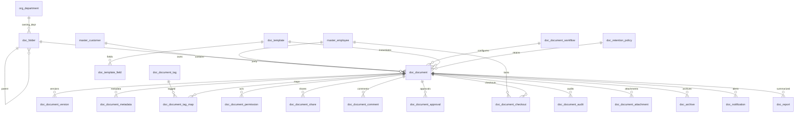

# ERD_18 — Document Management System (DMS) Domain

**Document:** Enterprise ERD — Document Management System Domain  
**Version:** 1.0  
**Status:** Locked — Ready for Sprint 18 Implementation Planning  
**Schema:** `document`  
**Table Prefix:** `doc_`  
**Aligned To:** BRD v1.0 · FRD-19 Document Management System · SDD v1.1 · DBS v1.1 · Architecture Lock v1.1  
**Functional Requirements:** [FRD-19 Document Management System Domain](../02_FRD/FRD-19-Document-Management-System-Domain.md)  
**Classification:** Internal — Confidential  
**Prior Release:** [ERP Core v1.12-beta](../07_RELEASES/ERP_Core_v1.12-beta.md)  

> **C-01 note:** Employee and customer identity remain **`master.master_employee`** and **`master.master_customer`**. DMS **never** invents parallel masters. Helpdesk / Service / Project / Asset / CRM / Inventory / Manufacturing / Quality context uses **UUID-only** refs — **no FK to `hd_*` / `svc_*` / `prj_*` / `ast_*` / `crm_*` / `inv_*` / `mfg_*` / `qm_*`**.

---

## 1. Module Overview

The Document Management System Domain provides a **centralized enterprise document repository**: folders, documents and versions, metadata and tagging, permissions and sharing, comments, approval / domain workflow configuration, checkout/check-in, audit trail, attachments, templates, retention and archive, notifications, and reporting — spanning create → upload → review → approve → publish → use → archive → retention / disposal (FRD-19 §3).

DMS **depends on** Foundation, Organization, and Master Data. It **consumes existing masters only (C-01)** — **`master_employee`**, **`master_customer`**, and **`org_department`**. It **must never duplicate** employee, customer, department, or company masters.

**Finance remains the only accounting system.** DMS never ORM-writes `fin_*` tables. Any chargeable / recoverable posting (e.g. certified copy fees Phase 1 stub) uses **`finance_journal_id`**; GL posting occurs **only** through `PostingService.post_system_journal()`.

Helpdesk, Service, Project, Asset, CRM, Inventory, Manufacturing, Quality, HR, Payroll, and Recruitment remain **isolated** except authorized UUID / employee refs — **no peer FKs / no peer ORM writes** (Recruitment **read-only** where referenced).

**Business Tables: 20**  
**Schema: `document`**

### Enterprise DMS Modules (FRD-19 · Sprint 18 focus)

| # | Module | Primary Tables | Primary Consumers |
|---|--------|----------------|-------------------|
| 1 | Repository | `doc_folder`, `doc_document`, `doc_document_version` | Editors · all domains |
| 2 | Classification | `doc_document_metadata`, `doc_document_tag`, `doc_document_tag_map` | Search · governance |
| 3 | Access | `doc_document_permission`, `doc_document_share` | Security · collaboration |
| 4 | Collaboration | `doc_document_comment`, `doc_document_checkout` | Editors · reviewers |
| 5 | Governance | `doc_document_approval`, `doc_document_workflow`, `doc_document_audit` | Managers · compliance |
| 6 | Content Aids | `doc_document_attachment`, `doc_template`, `doc_template_field` | Authors |
| 7 | Lifecycle | `doc_retention_policy`, `doc_archive` | Records managers |
| 8 | Notify & Analytics | `doc_notification`, `doc_report` | Ops · BI |

**PostgreSQL Schema:** `document` (Sprint 18 introduction)

### Architectural Position

```text
Foundation (ERD_01) ── Workflow, Audit, RBAC, Notification
Organization (ERD_02) ── Company, Branch, Department
Master Data (ERD_03) ── master_employee · master_customer (C-01)
Finance (ERD_04) ── PostingService only (no direct fin_* writes)
Helpdesk / Service / Project / Asset / CRM ── UUID refs only (no peer FK)
Inventory / MFG / Quality ── UUID refs only
HR / Payroll / Recruitment ── read-only ports (no writes)
        ↓
DMS (ERD_18) ── Folder · Document · Version · Metadata · Permission · Retention · Archive
        ↓
All business domains (document consumers) · BI / GRC (future)
```

### API Mount (planned)

**`/api/v1/documents`** — routers for all aggregates (folders, documents, document-versions, document-metadata, document-tags, document-tag-maps, document-permissions, document-shares, document-comments, document-approvals, document-workflows, document-checkouts, document-audits, document-attachments, templates, template-fields, retention-policies, archives, notifications, reports).

---

## 2. Scope

### In Scope
- **Folders** and **documents** repository — FRD-19 §4–§5
- **Version control** — FRD-19
- **Metadata**, **tags**, **tag maps** — FRD-19 §6–§7
- **Permissions** and **shares** — secure access
- **Comments**, **checkout/check-in**, **attachments**
- **Approvals** and **domain workflow** configuration (seeded with Foundation `wf_*`)
- **Audit** trail of document events
- **Templates** and **template fields**
- **Retention policies** and **archive** rows — FRD-19
- **Notifications** and **reports**
- Workflow, audit, RBAC, Celery stubs (planning)

### Out of Scope (Phase 2 / Separate)
- Full **OCR / full-text search engine cluster** product — Phase 1: metadata + URI / hash + optional `content_indexed_at` stub
- Full **e-signature vendor gateway** — Phase 1: approval status metadata only
- Duplicate `doc_employee` / `doc_customer` / `doc_department` masters — **forbidden (C-01)**
- Direct writes to `fin_*`, `hd_*`, `svc_*`, `prj_*`, `ast_*`, `crm_*`, `inv_*`, `mfg_*`, `qm_*`, `hr_*`, `pay_*`, `rec_*`, `sales_*`
- SQLAlchemy models, Alembic migrations, application code (implementation sprint)
- Analytics cubes / `ana_fact_document`

### Assumptions / Business Rules
- **Identity:** authors / owners / customers always resolve through Master Data (C-01)
- Soft delete + version on mutable `doc_*` tables
- Document numbers company-scoped (`DOC-YYYY-NNNNNN`)
- One **active checkout** per document (service-enforced)
- Binary content stored externally (MinIO / S3); DB holds **URI + content_hash + size** only — FRD file-type list Phase 1
- Optional chargeable certified-copy: DMS row → `PostingService.post_system_journal()` → store `finance_journal_id`

### Dependencies

| Upstream | Tables / Services Used |
|----------|------------------------|
| ERD_01 Foundation | `sec_tenant`, `sec_user`, `wf_definition`, `wf_instance` |
| ERD_02 Organization | `org_company`, `org_branch`, `org_department` |
| ERD_03 Master Data | **`master_employee`**, **`master_customer`** |
| ERD_04 Finance | **`PostingService.post_system_journal()`**; `finance_journal_id` UUID storage |
| ERD_17 Helpdesk | Optional `helpdesk_ticket_id` UUID — **no FK** |
| ERD_16 Service | Optional `service_request_id` UUID — **no FK** |
| ERD_14 Project | Optional `project_id` UUID — **no FK** |
| ERD_15 Asset | Optional `asset_id` UUID — **no FK** |
| ERD_05 CRM | Optional `crm_opportunity_id` UUID — **no FK** |
| ERD_07 Inventory | Optional inventory UUID — **no FK** |
| ERD_08 Manufacturing | Optional production UUID — **no FK** |
| ERD_09 Quality | Optional quality UUID — **no FK** |
| ERD_11 HR | Employee via master — **read / no `hr_*` writes** |
| ERD_12 Payroll | Optional labor **read** — **no `pay_*` writes** |
| ERD_13 Recruitment | Optional candidate doc context — **read only / no writes** |

---

## 3. Table Inventory

| # | Table | Classification | tenant_id | company_id | branch_id | Soft Delete | Version | Workflow |
|---|-------|----------------|-----------|------------|-----------|-------------|---------|----------|
| 1 | `doc_folder` | Catalog / Tree | ✅ | ✅ | optional | ✅ | ✅ | — |
| 2 | `doc_document` | Transaction | ✅ | ✅ | ✅ | ✅ | ✅ | ✅ |
| 3 | `doc_document_version` | Version | ✅ | ✅ | optional | ✅ | ✅ | — |
| 4 | `doc_document_metadata` | Detail | ✅ | ✅ | optional | ✅ | ✅ | — |
| 5 | `doc_document_tag` | Catalog | ✅ | ✅ | optional | ✅ | ✅ | — |
| 6 | `doc_document_tag_map` | Map | ✅ | ✅ | optional | ✅ | ✅ | — |
| 7 | `doc_document_permission` | ACL | ✅ | ✅ | optional | ✅ | ✅ | — |
| 8 | `doc_document_share` | Share | ✅ | ✅ | optional | ✅ | ✅ | — |
| 9 | `doc_document_comment` | Collaboration | ✅ | ✅ | optional | ✅ | ✅ | — |
| 10 | `doc_document_approval` | Approval | ✅ | ✅ | ✅ | ✅ | ✅ | ✅ |
| 11 | `doc_document_workflow` | Config | ✅ | ✅ | optional | ✅ | ✅ | — |
| 12 | `doc_document_checkout` | Lock | ✅ | ✅ | ✅ | ✅ | ✅ | ✅ |
| 13 | `doc_document_audit` | Audit | ✅ | ✅ | optional | ✅ | ✅ | — |
| 14 | `doc_document_attachment` | Attachment | ✅ | ✅ | optional | ✅ | ✅ | — |
| 15 | `doc_template` | Template | ✅ | ✅ | optional | ✅ | ✅ | — |
| 16 | `doc_template_field` | Detail | ✅ | ✅ | optional | ✅ | ✅ | — |
| 17 | `doc_retention_policy` | Policy | ✅ | ✅ | optional | ✅ | ✅ | ✅ |
| 18 | `doc_archive` | Archive | ✅ | ✅ | ✅ | ✅ | ✅ | ✅ |
| 19 | `doc_notification` | Notification | ✅ | ✅ | optional | ✅ | ✅ | — |
| 20 | `doc_report` | Aggregate Snapshot | ✅ | ✅ | optional | ✅ | ✅ | — |

**Business Tables: 20**  
**Schema: `document`**

---

## 4. Entity Relationships



```text
org_company / org_branch / org_department
master_employee / master_customer (C-01)
    └── doc_folder (tree)
            └── doc_document ← doc_template / doc_retention_policy / doc_document_workflow
                    ├── doc_document_version
                    ├── doc_document_metadata
                    ├── doc_document_tag → doc_document_tag_map
                    ├── doc_document_permission / doc_document_share
                    ├── doc_document_comment / doc_document_checkout
                    ├── doc_document_approval / doc_document_audit / doc_document_attachment
                    ├── doc_archive
                    ├── doc_notification
                    └── doc_report
    └── doc_template → doc_template_field
    └── doc_document_tag (catalog)
    └── doc_retention_policy

Optional UUID-only (no FK): helpdesk_ticket_id, service_request_id, project_id,
  asset_id, crm_opportunity_id, inventory_*, production_order_id, quality_*,
  finance_journal_id
```

---

## 5. Standard Column Profiles

### 5.1 DMS Catalog Profile (Folder, Tag, Template, Retention Policy, Workflow Config)

| Column Group | Columns |
|--------------|---------|
| Primary Key | `id UUID` |
| Tenant / Company | `tenant_id`, `company_id` |
| Business Key | `*_code` |
| Status | `status VARCHAR(30)` |
| Audit + Soft Delete + Version | per DBS §28 |

### 5.2 DMS Transaction Header Profile (Document, Approval, Checkout, Archive)

| Column Group | Columns |
|--------------|---------|
| Primary Key | `id UUID` |
| Document | `document_number` |
| Status / Workflow | `status`, optional `workflow_status`, `workflow_instance_id` |
| Scope | `tenant_id`, `company_id`, `branch_id` |
| Party / Org | `*_employee_id` → `master_employee`; `customer_id` → `master_customer`; `department_id` → `org_department` |
| Audit + Soft Delete + Version | per DBS §28 |

### 5.3 DMS Detail / Snapshot Profile (Version, Metadata, Tag Map, Permission, Share, Comment, Audit, Attachment, Template Field, Notification, Report)

| Column Group | Columns |
|--------------|---------|
| Scope | tenant / company / branch (as applicable) |
| Parent FKs | document / folder / template / tag |
| Soft delete + version | yes |

---

## 6. Detailed Table Definitions

### 6.1 `doc_folder`

| Column | Notes |
|--------|-------|
| `folder_code` / `folder_name` | UK `(company_id, folder_code)` |
| `parent_folder_id` | Self-FK optional |
| `folder_type` | system, business, user — FRD-19 §5 |
| `department_id` | FK optional → `org_department` |
| `owner_employee_id` | FK optional → `master_employee` |
| `path_label` | VARCHAR optional denormalized path |
| `status` | active, inactive, archived |

---

### 6.2 `doc_document`

| Column | Type | Nullable | Description |
|--------|------|----------|-------------|
| `id` | UUID | NO | PK |
| `tenant_id` / `company_id` / `branch_id` | UUID | NO | Scope |
| `document_number` | VARCHAR(50) | NO | `DOC-YYYY-NNNNNN` |
| `folder_id` | UUID | YES | FK → `doc_folder` |
| `title` | VARCHAR(255) | NO | — |
| `classification_level` | VARCHAR(30) | NO | public, internal, confidential, restricted — FRD-19 §6 |
| `document_category` | VARCHAR(40) | YES | employee, invoice, contract, po, quality, project, policy, compliance, other |
| `owner_employee_id` | UUID | NO | FK → `master_employee` |
| `customer_id` | UUID | YES | FK → `master_customer` |
| `department_id` | UUID | YES | FK → `org_department` |
| `template_id` | UUID | YES | FK → `doc_template` |
| `retention_policy_id` | UUID | YES | FK → `doc_retention_policy` |
| `workflow_config_id` | UUID | YES | FK → `doc_document_workflow` |
| `current_version_no` | INT | NO | default 1 |
| `mime_type` / `file_extension` | VARCHAR | YES | — |
| `storage_uri` / `content_hash` | VARCHAR | YES | current blob pointer |
| `file_size_bytes` | BIGINT | YES | — |
| `helpdesk_ticket_id` / `service_request_id` / `project_id` / `asset_id` / `crm_opportunity_id` | UUID | YES | **UUID only — no peer FK** |
| `inventory_ref_id` / `production_order_id` / `quality_ref_id` | UUID | YES | **UUID only — no FK** |
| `finance_journal_id` | UUID | YES | after PostingService when chargeable |
| `published_at` / `expires_at` | TIMESTAMPTZ / DATE | YES | — |
| `status` | VARCHAR(30) | NO | draft, submitted, approved, published, checked_out, archived, expired, disposed, cancelled |
| `workflow_*` | | | Document approval / publish |
| AUDIT_STD + SOFT_DELETE_OPT + version | | | |

**UK:** `(company_id, document_number)` where not deleted.

---

### 6.3 `doc_document_version`

| Column | Notes |
|--------|-------|
| `document_id` | FK |
| `version_no` | INT |
| `storage_uri` / `content_hash` / `file_size_bytes` | — |
| `change_summary` | TEXT |
| `created_by_employee_id` | FK → `master_employee` |
| `is_current` | BOOLEAN |
| `status` | active, superseded, deleted_soft |
| **UK:** `(document_id, version_no)` |

---

### 6.4 `doc_document_metadata`

| Column | Notes |
|--------|-------|
| `document_id` | FK |
| `meta_key` / `meta_value` | VARCHAR / TEXT |
| `value_type` | string, number, date, boolean, json |
| `status` | active, inactive |
| **UK soft:** `(document_id, meta_key)` |

---

### 6.5 `doc_document_tag`

| Column | Notes |
|--------|-------|
| `tag_code` / `tag_name` | UK `(company_id, tag_code)` |
| `tag_group` | VARCHAR optional |
| `status` | active, inactive |

---

### 6.6 `doc_document_tag_map`

| Column | Notes |
|--------|-------|
| `document_id` | FK → `doc_document` |
| `tag_id` | FK → `doc_document_tag` |
| `tagged_by_employee_id` | FK optional |
| `tagged_at` | TIMESTAMPTZ |
| `status` | active, removed |
| **UK:** `(document_id, tag_id)` where active |

---

### 6.7 `doc_document_permission`

| Column | Notes |
|--------|-------|
| `document_id` / `folder_id` | one required (service-enforced) |
| `grantee_type` | employee, role, department |
| `grantee_employee_id` | FK optional → `master_employee` |
| `grantee_role_code` | VARCHAR optional |
| `grantee_department_id` | FK optional → `org_department` |
| `permission_level` | view, comment, edit, approve, admin |
| `status` | active, revoked |

---

### 6.8 `doc_document_share`

| Column | Notes |
|--------|-------|
| `document_number` | `DSHR-YYYY-NNNNNN` optional internal share id |
| `document_id` | FK |
| `shared_with_employee_id` / `shared_with_customer_id` | FK optional |
| `share_token_hash` | VARCHAR optional external link |
| `expires_at` | TIMESTAMPTZ |
| `permission_level` | view, comment |
| `status` | active, expired, revoked |
| **UK soft:** company + token when present |

---

### 6.9 `doc_document_comment`

| Column | Notes |
|--------|-------|
| `document_id` | FK |
| `version_no` | INT optional |
| `author_employee_id` | FK → `master_employee` |
| `body` | TEXT |
| `is_internal` | BOOLEAN |
| `commented_at` | TIMESTAMPTZ |
| `status` | active, deleted_soft |

---

### 6.10 `doc_document_approval`

| Column | Notes |
|--------|-------|
| `document_number` | `DAPR-YYYY-NNNNNN` |
| `document_id` | FK |
| `approval_type` | content_approval, publish, archive |
| `requested_by_employee_id` | FK |
| `approver_employee_id` | FK optional |
| `decision` | pending, approved, rejected |
| `decided_at` | TIMESTAMPTZ |
| `comments` | TEXT |
| `status` | draft, submitted, completed, cancelled |
| `workflow_*` | Document approval / publish |
| **UK:** `(company_id, document_number)` |

---

### 6.11 `doc_document_workflow`

| Column | Notes |
|--------|-------|
| `workflow_code` / `workflow_name` | UK `(company_id, workflow_code)` |
| `applies_to_category` | VARCHAR optional |
| `foundation_workflow_code` | VARCHAR — maps to Foundation `wf_definition.workflow_code` (e.g. `DOC_DOCUMENT_APPROVAL`) |
| `is_default` | BOOLEAN |
| `status` | active, inactive |
| **Note:** Domain config only — instance rows remain Foundation `wf_instance` |

---

### 6.12 `doc_document_checkout`

| Column | Notes |
|--------|-------|
| `document_number` | `DOUT-YYYY-NNNNNN` |
| `document_id` | FK |
| `checked_out_by_employee_id` | FK → `master_employee` |
| `checked_out_at` / `due_back_at` / `checked_in_at` | TIMESTAMPTZ |
| `lock_reason` | TEXT |
| `status` | draft, active, submitted, completed, cancelled |
| `workflow_*` | Document checkout |
| **Service rule:** only one `active` checkout per document |
| **UK:** `(company_id, document_number)` |

---

### 6.13 `doc_document_audit`

| Column | Notes |
|--------|-------|
| `document_id` | FK |
| `event_type` | created, uploaded, viewed, downloaded, edited, approved, published, shared, checked_out, checked_in, archived, deleted, other |
| `actor_employee_id` | FK optional |
| `payload_json` | JSONB |
| `occurred_at` | TIMESTAMPTZ |
| `status` | recorded |

---

### 6.14 `doc_document_attachment`

| Column | Notes |
|--------|-------|
| `document_id` | FK |
| `file_name` / `mime_type` | — |
| `storage_uri` / `content_hash` / `file_size_bytes` | Phase 1 metadata |
| `uploaded_by_employee_id` | FK optional |
| `status` | active, superseded, archived |

---

### 6.15 `doc_template`

| Column | Notes |
|--------|-------|
| `template_code` / `template_name` | UK `(company_id, template_code)` |
| `description` | TEXT |
| `category` | VARCHAR |
| `storage_uri` | optional base file |
| `owner_employee_id` | FK optional |
| `status` | active, inactive, archived |

---

### 6.16 `doc_template_field`

| Column | Notes |
|--------|-------|
| `template_id` | FK → `doc_template` |
| `field_code` / `field_label` | — |
| `field_type` | text, number, date, boolean, list |
| `is_required` | BOOLEAN |
| `default_value` | TEXT |
| `sequence_no` | INT |
| `status` | active, inactive |
| **UK soft:** `(template_id, field_code)` |

---

### 6.17 `doc_retention_policy`

| Column | Notes |
|--------|-------|
| `policy_code` / `policy_name` | UK `(company_id, policy_code)` |
| `retention_days` | INT |
| `action_on_expiry` | archive, dispose, review |
| `applies_to_category` / `applies_to_classification` | optional filters |
| `status` | draft, submitted, approved, active, inactive |
| `workflow_*` | Retention policy approval |

---

### 6.18 `doc_archive`

| Column | Notes |
|--------|-------|
| `document_number` | `DARC-YYYY-NNNNNN` |
| `document_id` | FK |
| `retention_policy_id` | FK optional |
| `archived_by_employee_id` | FK |
| `archived_at` | TIMESTAMPTZ |
| `archive_location_uri` | VARCHAR |
| `reason` | TEXT |
| `status` | draft, submitted, archived, restored, disposed |
| `workflow_*` | Document archive |
| **UK:** `(company_id, document_number)` |

---

### 6.19 `doc_notification`

| Column | Notes |
|--------|-------|
| `document_id` | FK optional |
| `notification_type` | approval_due, review_due, checkout_overdue, expiry, retention, archived, shared, other |
| `recipient_user_id` / `recipient_employee_id` | UUID refs |
| `payload_json` | JSONB |
| `sent_at` | TIMESTAMPTZ |
| `delivery_status` | pending, sent, failed, read |
| `status` | active, archived |

---

### 6.20 `doc_report`

| Column | Notes |
|--------|-------|
| `report_code` | UK |
| `report_type` | volume, classification_mix, retention_due, checkout_ages, approval_backlog, storage_usage |
| `period_start` / `period_end` | DATE |
| `department_id` / `folder_id` | optional filters |
| `metrics_json` | JSONB |
| `generated_at` | TIMESTAMPTZ |
| `status` | draft, finalized |
| **UK:** `(company_id, report_code)` |

---

## 7. Primary Keys

| Table | Constraint Name | Column |
|-------|-----------------|--------|
| `doc_folder` | `pk_doc_folder` | `id` |
| `doc_document` | `pk_doc_document` | `id` |
| `doc_document_version` | `pk_doc_document_version` | `id` |
| `doc_document_metadata` | `pk_doc_document_metadata` | `id` |
| `doc_document_tag` | `pk_doc_document_tag` | `id` |
| `doc_document_tag_map` | `pk_doc_document_tag_map` | `id` |
| `doc_document_permission` | `pk_doc_document_permission` | `id` |
| `doc_document_share` | `pk_doc_document_share` | `id` |
| `doc_document_comment` | `pk_doc_document_comment` | `id` |
| `doc_document_approval` | `pk_doc_document_approval` | `id` |
| `doc_document_workflow` | `pk_doc_document_workflow` | `id` |
| `doc_document_checkout` | `pk_doc_document_checkout` | `id` |
| `doc_document_audit` | `pk_doc_document_audit` | `id` |
| `doc_document_attachment` | `pk_doc_document_attachment` | `id` |
| `doc_template` | `pk_doc_template` | `id` |
| `doc_template_field` | `pk_doc_template_field` | `id` |
| `doc_retention_policy` | `pk_doc_retention_policy` | `id` |
| `doc_archive` | `pk_doc_archive` | `id` |
| `doc_notification` | `pk_doc_notification` | `id` |
| `doc_report` | `pk_doc_report` | `id` |

---

## 8. Foreign Keys

| Child | Column | Parent |
|-------|--------|--------|
| Document / checkout / comments / etc. | `*_employee_id` | `master.master_employee` |
| Document / share | `customer_id` / `shared_with_customer_id` | `master.master_customer` |
| Folder / document / permission | `department_id` | `organization.org_department` |
| Document | `folder_id` | `document.doc_folder` |
| Versions / metadata / maps / ACL / … | `document_id` | `document.doc_document` |
| Tag map | `tag_id` | `document.doc_document_tag` |
| Template fields | `template_id` | `document.doc_template` |
| Document | `template_id` / `retention_policy_id` / `workflow_config_id` | template / retention / workflow |
| Workflow | `workflow_instance_id` | `foundation.wf_instance` |
| Org scope | `tenant_id`, `company_id`, `branch_id` | foundation / organization |

**No FK to:** `hd_*`, `svc_*`, `prj_*`, `ast_*`, `crm_*`, `inv_*`, `mfg_*`, `qm_*`, `pay_*`, `hr_*`, `rec_*`, `sales_*`.  
**Finance:** `finance_journal_id` is a **UUID ref only**; **writes only via PostingService**.  
**No DMS duplicates of:** `master_employee`, `master_customer`, `org_department`, `org_company`.

---

## 9. Indexes & Constraints

### Unique
- Folder / tag / template / workflow / retention / report codes: `(company_id, *_code)`
- Document / approval / checkout / archive numbers: `(company_id, document_number)`
- Version `(document_id, version_no)`; tag map `(document_id, tag_id)`; template field `(template_id, field_code)`

### Check
- Classification / status enums per §11
- File size ≥ 0; retention_days > 0

### Indexes
- All FKs
- `(tenant_id, company_id, status)` on document
- `(folder_id)`, `(expires_at)`, `(classification_level)`
- `(document_id, is_current)` on version
- `(checked_out_by_employee_id, status)` on checkout

---

## 10. Document Numbering / Naming Convention

| Document | Format | UK Scope |
|----------|--------|----------|
| Document | `DOC-YYYY-NNNNNN` | company |
| Share | `DSHR-YYYY-NNNNNN` | company (optional) |
| Approval | `DAPR-YYYY-NNNNNN` | company |
| Checkout | `DOUT-YYYY-NNNNNN` | company |
| Archive | `DARC-YYYY-NNNNNN` | company |
| Folder / Tag / Template / Workflow / Retention / Report codes | Stable codes | company |

**Naming:** schema `document`; tables `doc_*`; ORM `Doc*`; module package `modules/document`; API prefix `/documents`; permissions `document.*`; workflows `DOC_*`.

---

## 11. Status Lifecycles

| Entity | Statuses |
|--------|----------|
| Folder / Tag / Template / Workflow Config | active ↔ inactive (folder also archived) |
| Document | draft → submitted → approved → published ↔ checked_out → archived → expired / disposed \| cancelled |
| Version | active → superseded \| deleted_soft |
| Metadata / Tag Map / Permission | active → inactive/removed/revoked |
| Share | active → expired \| revoked |
| Comment | active → deleted_soft |
| Approval | draft → submitted → completed \| cancelled |
| Checkout | draft → active → submitted → completed \| cancelled |
| Audit | recorded |
| Attachment | active → superseded → archived |
| Template Field | active ↔ inactive |
| Retention Policy | draft → submitted → approved → active ↔ inactive |
| Archive | draft → submitted → archived ↔ restored → disposed |
| Notification | active → archived |
| Report | draft → finalized |

---

## 12. Approval Workflow Integration (Workflow Matrix)

| Workflow Code | Document | Path |
|---------------|----------|------|
| `DOC_DOCUMENT_APPROVAL` | Document / Approval | Editor → Reviewer → Document Manager |
| `DOC_DOCUMENT_PUBLISH` | Document Publish | Author → Document Reviewer → Document Manager |
| `DOC_DOCUMENT_CHECKOUT` | Checkout | Editor → Document Manager (gated libraries) |
| `DOC_DOCUMENT_ARCHIVE` | Archive | Records Owner → Document Manager → Document Admin |
| `DOC_RETENTION_APPROVAL` | Retention Policy | Document Manager → Document Admin |

Seed workflows only; instance rows use Foundation `wf_instance`. Domain table `doc_document_workflow` stores config bindings.

---

## 13. Audit Strategy

| Layer | Mechanism |
|-------|-----------|
| Row audit | Standard columns on all mutable `doc_*` tables |
| Business audit | `AuditService` + `doc_document_audit` on upload, approve, publish, share, checkout, archive, dispose |
| Notifications | Approval / review / expiry / retention / checkout overdue — Foundation + `doc_notification` |

---

## 14. Tenant / Company / Branch Isolation + RBAC Matrix

| Rule | Application |
|------|-------------|
| `tenant_id` | All tables |
| `company_id` | Numbering / repository boundary |
| `branch_id` | Mandatory on document, approval, checkout, archive |
| Repository | `DocScopedRepository` pattern |
| RBAC | `document.*` permissions |

### Planned RBAC (Sprint 18)

| Resource | Permissions |
|----------|-------------|
| `document.folder` | read, create, update |
| `document.document` | read, create, update, submit, approve, publish |
| `document.version` / `document.metadata` / `document.tag` | read, create, update |
| `document.permission` / `document.share` | read, create, revoke |
| `document.comment` / `document.attachment` | read, create, update |
| `document.approval` | read, create, submit, complete |
| `document.checkout` | read, create, submit, complete |
| `document.template` | read, create, update |
| `document.retention` / `document.archive` | read, create, submit, approve |
| `document.audit` / `document.notification` | read |
| `document.report` | read, export |

**Roles** (`status='active'`):

| Role | Intent |
|------|--------|
| `DOCUMENT_MANAGER` | Approvals, publish, archive oversight, retention |
| `DOCUMENT_EDITOR` | Upload, edit, version, checkout, comment |
| `DOCUMENT_REVIEWER` | Review / approve content; limited publish |
| `DOCUMENT_ADMIN` | Folder / ACL / template / retention governance |

---

## 15. Migration Order

Prior Alembic head: **`0310_seed_helpdesk_workflows`**.

Revision budget **`0311`–`0332` (22 revisions)**. Schema + 20 tables + permissions + workflows = 23 logical steps → **`doc_document_tag` and `doc_document_tag_map` share one migration**.

| Order | Revision ID (≤32 chars) | Migration | Tables / Actions |
|-------|-------------------------|-----------|------------------|
| 311 | `0311_create_document_schema` | Create schema | `document` |
| 312 | `0312_doc_folder` | Folder | `doc_folder` |
| 313 | `0313_doc_document` | Document | `doc_document` |
| 314 | `0314_doc_document_version` | Version | `doc_document_version` |
| 315 | `0315_doc_document_metadata` | Metadata | `doc_document_metadata` |
| 316 | `0316_doc_tag_and_map` | Tags | `doc_document_tag`, `doc_document_tag_map` |
| 317 | `0317_doc_document_permission` | Permission | `doc_document_permission` |
| 318 | `0318_doc_document_share` | Share | `doc_document_share` |
| 319 | `0319_doc_document_comment` | Comment | `doc_document_comment` |
| 320 | `0320_doc_document_approval` | Approval | `doc_document_approval` |
| 321 | `0321_doc_document_workflow` | Workflow Config | `doc_document_workflow` |
| 322 | `0322_doc_document_checkout` | Checkout | `doc_document_checkout` |
| 323 | `0323_doc_document_audit` | Audit | `doc_document_audit` |
| 324 | `0324_doc_document_attachment` | Attachment | `doc_document_attachment` |
| 325 | `0325_doc_template` | Template | `doc_template` |
| 326 | `0326_doc_template_field` | Template Field | `doc_template_field` |
| 327 | `0327_doc_retention_policy` | Retention | `doc_retention_policy` |
| 328 | `0328_doc_archive` | Archive | `doc_archive` |
| 329 | `0329_doc_notification` | Notification | `doc_notification` |
| 330 | `0330_doc_report` | Report | `doc_report` |
| 331 | `0331_seed_document_permissions` | RBAC | Permissions / roles |
| 332 | `0332_seed_document_workflows` | Workflows | Approval / Publish / Checkout / Archive / Retention |

**Dependency order:** schema → folder → document → version/metadata/tags → access → collaboration/governance → templates → retention/archive → notify/report → seeds.

**Note:** Optional FKs such as `template_id` / `retention_policy_id` / `workflow_config_id` remain nullable at create; bind in services after parents exist.

**Planned head after Sprint 18:** `0332_seed_document_workflows`

### Celery task stubs (planning)

| Task name | Purpose |
|-----------|---------|
| `document.retention_policy_runner` | Apply retention actions on due documents |
| `document.archive_scheduler` | Schedule / execute archive batches |
| `document.document_expiry_notifications` | Expiry / retention due alerts |
| `document.document_review_reminders` | Pending approval / publish chase |
| `document.metadata_index_refresh` | Refresh metadata/search index stubs |
| `document.retry_finance_posting` | Retry failed chargeable document posts |

---

## 16. Cross Module Dependencies

### 16.1 Upstream (DMS Consumes)

| Module | Provides | Pattern |
|--------|----------|---------|
| Foundation | tenant, user, workflow, audit, RBAC, notification | Direct FK / services |
| Organization | company, branch, **department** | Direct FK |
| Master Data | **`master_employee` · `master_customer`** | FK + services (C-01) |
| Finance | **`PostingService.post_system_journal()`** | Adapter; store `finance_journal_id` |
| Helpdesk / Service / Project / Asset / CRM | Optional operational context | UUID only — **no FK** |
| Inventory / Manufacturing / Quality | Optional operational context | UUID only — **no FK** |
| HR / Payroll / Recruitment | Author continuity; optional labor / candidate read | Master FK / read port — **no writes** |

### 16.2 Downstream

| Module | Pattern |
|--------|---------|
| All ERP domains | Store / link documents via UUID / services |
| GRC / BI (future) | Read-only retention / audit / volume |
| Finance | Optional journals from chargeable certified copies |

### 16.3 Hard Rules (Architecture Compliance)

| Rule | Enforcement |
|------|-------------|
| C-01 | Employee / customer via masters only; no duplicate masters |
| Peer isolation | UUID-only for Helpdesk / Service / Project / Asset / CRM / Inv / MFG / QM |
| No Finance ORM writes | Only `PostingService.post_system_journal()` |
| No HR / Payroll / Recruitment writes | Read-only |
| Architecture Lock v1.1 | Unchanged; Modular Monolith · Clean Architecture · DDD preserved |

---

## 17. Phase Gate Checklist

| # | Gate Criterion | Status |
|---|----------------|--------|
| 1 | Business tables = **20**; schema = **`document`** | ✅ |
| 2 | Prefix `doc_` defined | ✅ |
| 3 | Aligned to FRD-19 (repository, versioning, metadata, retention, archive) | ✅ |
| 4 | Consumes masters only (C-01) | ✅ |
| 5 | Finance posting only via PostingService; store finance UUID refs | ✅ |
| 6 | Helpdesk / Service / Project / Asset / CRM / Inv / MFG / QM UUID-only; HR/Payroll/Recruitment read-only | ✅ |
| 7 | Migration order `0311`–`0332`, revision IDs ≤ 32 chars | ✅ |
| 8 | Workflows + RBAC + API mount + Celery stubs documented | ✅ |
| 9 | Full OCR / e-sign gateway deferred without blocking Sprint 18 | ✅ |
| 10 | Architecture Lock v1.1 preserved; no prior module redesign | ✅ |

### ERD Phase Gate — DMS Summary

| Metric | Value |
|--------|-------|
| Business Tables | **20** |
| Schema | **`document`** |
| Prefix | `doc_` |
| API mount | `/api/v1/documents` |
| Migration range | `0311` – `0332` |
| Prior head | `0310_seed_helpdesk_workflows` |
| Planned head | `0332_seed_document_workflows` |
| Document Status | **Draft** |

---

## 18. Document Control

| Version | Date | Change |
|---------|------|--------|
| 1.0 | 2026-07-15 | Initial ERD_18 Document Management System draft for Sprint 18 architecture review |

---

**ERD_18 Document Management System is drafted and ready for architecture review / lock before Sprint 18 implementation planning.**
