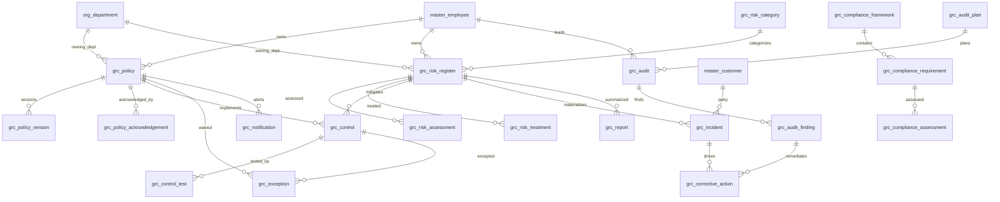

# ERD_19 — Governance, Risk & Compliance (GRC) Domain

**Document:** Enterprise ERD — Governance, Risk & Compliance Domain  
**Version:** 1.0  
**Status:** Locked — Ready for Sprint 19 Implementation Planning  
**Schema:** `grc`  
**Table Prefix:** `grc_`  
**Aligned To:** BRD v1.0 · FRD-20 Compliance, Risk Management & Governance · SDD v1.1 · DBS v1.1 · Architecture Lock v1.1  
**Functional Requirements:** [FRD-20 Compliance, Risk Management & Governance Domain](../02_FRD/FRD-20-Compliance-Risk-Governance-Domain.md)  
**Classification:** Internal — Confidential  
**Prior Release:** [ERP Core v1.13-beta](../07_RELEASES/ERP_Core_v1.13-beta.md)  

> **C-01 note:** Employee and customer identity remain **`master.master_employee`** and **`master.master_customer`**. GRC **never** invents parallel masters. Document / Helpdesk / Service / Project / Quality / Asset / CRM / Inventory / Manufacturing context uses **UUID-only** refs — **no FK to `doc_*` / `hd_*` / `svc_*` / `prj_*` / `qm_*` / `ast_*` / `crm_*` / `inv_*` / `mfg_*`**.

---

## 1. Module Overview (Purpose)

The Governance, Risk & Compliance Domain provides a **centralized enterprise GRC platform**: policies and versions, acknowledgements, internal controls and control tests, risk categories / register / assessment / treatment, compliance frameworks / requirements / assessments, audit plans / audits / findings, corrective actions (CAPA), exceptions, incidents, notifications, and reporting — spanning identify → assess → control → comply → audit → remediate → monitor (FRD-20 §3).

GRC **depends on** Foundation, Organization, and Master Data. It **consumes existing masters only (C-01)** — **`master_employee`**, **`master_customer`**, and **`org_department`**. It **must never duplicate** employee, customer, department, or company masters.

**Finance remains the only accounting system.** GRC never ORM-writes `fin_*` tables. Any penalty / remediation / recoverable cost posting uses **`finance_journal_id`**; GL posting occurs **only** through `PostingService.post_system_journal()`.

Document, Helpdesk, Service, Project, Quality, Asset, CRM, Inventory, Manufacturing, HR, Payroll, and Recruitment remain **isolated** except authorized UUID / employee refs — **no peer FKs / no peer ORM writes** (HR / Payroll / Recruitment **read-only**).

**Business Tables: 20**  
**Schema: `grc`**

### Enterprise GRC Modules (FRD-20 · Sprint 19 focus)

| # | Module | Primary Tables | Primary Consumers |
|---|--------|----------------|-------------------|
| 1 | Policy | `grc_policy`, `grc_policy_version`, `grc_policy_acknowledgement` | Compliance · HR · all staff |
| 2 | Controls | `grc_control`, `grc_control_test` | Control owners · auditors |
| 3 | Risk | `grc_risk_category`, `grc_risk_register`, `grc_risk_assessment`, `grc_risk_treatment` | Risk managers |
| 4 | Compliance | `grc_compliance_framework`, `grc_compliance_requirement`, `grc_compliance_assessment` | Compliance officers |
| 5 | Audit | `grc_audit_plan`, `grc_audit`, `grc_audit_finding` | Internal audit |
| 6 | Remediation | `grc_corrective_action`, `grc_exception`, `grc_incident` | CAPA owners · ops |
| 7 | Notify & Analytics | `grc_notification`, `grc_report` | Ops · leadership |

**PostgreSQL Schema:** `grc` (Sprint 19 introduction)

### Architectural Position

```text
Foundation (ERD_01) ── Workflow, Audit, RBAC, Notification
Organization (ERD_02) ── Company, Branch, Department
Master Data (ERD_03) ── master_employee · master_customer (C-01)
Finance (ERD_04) ── PostingService only (no direct fin_* writes)
Document (ERD_18) ── UUID refs only (policy evidence)
Helpdesk / Service / Project / Quality / Asset / CRM ── UUID refs only
Inventory / MFG ── UUID refs only
HR / Payroll / Recruitment ── read-only ports (no writes)
        ↓
GRC (ERD_19) ── Policy · Control · Risk · Compliance · Audit · CAPA · Incident
        ↓
Leadership · External auditors · BI (future)
```

### API Mount (planned)

**`/api/v1/grc`** — routers for all aggregates (policies, policy-versions, policy-acknowledgements, controls, control-tests, risk-categories, risk-registers, risk-assessments, risk-treatments, compliance-frameworks, compliance-requirements, compliance-assessments, audit-plans, audits, audit-findings, corrective-actions, exceptions, incidents, notifications, reports).

---

## 2. Scope

### In Scope
- **Policy** lifecycle with **versions** and **acknowledgements** — FRD-20 §10
- **Internal controls** and **control tests** — FRD-20 §7
- **Risk categories**, **register**, **assessment**, **treatment** — FRD-20 §4–§6
- **Compliance frameworks**, **requirements**, **assessments** — FRD-20 §8–§9
- **Audit plans**, **audits**, **findings** — FRD-20 §11–§12
- **Corrective actions** (CAPA), **exceptions**, **incidents** — FRD-20 §12–§13
- **Notifications** and **reports**
- Workflow, audit, RBAC, Celery stubs (planning)

### Out of Scope (Phase 2 / Separate)
- Full **BCM / disaster-recovery runbook product** (RTO/RPO modeling) — Phase 1: optional incident flags only
- Full **regulatory rule engine / law feed** — Phase 1: framework + requirement catalog
- Duplicate `grc_employee` / `grc_customer` / `grc_department` masters — **forbidden (C-01)**
- Direct writes to `fin_*`, `doc_*`, `hd_*`, `svc_*`, `prj_*`, `qm_*`, `ast_*`, `crm_*`, `inv_*`, `mfg_*`, `hr_*`, `pay_*`, `rec_*`
- SQLAlchemy models, Alembic migrations, application code (implementation sprint)
- Analytics cubes / `ana_fact_grc`

### Assumptions / Business Rules
- **Identity:** owners / assessors / auditors always resolve through Master Data (C-01)
- Soft delete + version on mutable `grc_*` tables
- Document numbers company-scoped (`POL-` / `RSK-` / `CTL-` / `AUD-` / `CAPA-` / `EXC-` / `INC-` / `CMP-`)
- Risk score = **Impact × Probability** (1–5 scales) — FRD-20 §5
- Treatment strategies: accept · avoid · reduce · transfer — FRD-20 §6
- Policy content / evidence may reference DMS via **`document_id` UUID only** — no `doc_*` FK
- Optional remediation / penalty cost: GRC row → `PostingService.post_system_journal()` → store `finance_journal_id`

### Dependencies

| Upstream | Tables / Services Used |
|----------|------------------------|
| ERD_01 Foundation | `sec_tenant`, `sec_user`, `wf_definition`, `wf_instance` |
| ERD_02 Organization | `org_company`, `org_branch`, `org_department` |
| ERD_03 Master Data | **`master_employee`**, **`master_customer`** |
| ERD_04 Finance | **`PostingService.post_system_journal()`**; `finance_journal_id` UUID storage |
| ERD_18 Document | Optional `document_id` UUID — **no FK** |
| ERD_17 Helpdesk | Optional `helpdesk_ticket_id` UUID — **no FK** |
| ERD_16 Service | Optional `service_request_id` UUID — **no FK** |
| ERD_14 Project | Optional `project_id` UUID — **no FK** |
| ERD_09 Quality | Optional `quality_nonconformance_id` UUID — **no FK** |
| ERD_15 Asset | Optional `asset_id` UUID — **no FK** |
| ERD_05 CRM | Optional `crm_opportunity_id` UUID — **no FK** |
| ERD_07 Inventory | Optional inventory UUID — **no FK** |
| ERD_08 Manufacturing | Optional production UUID — **no FK** |
| ERD_11 HR | Employee via master — **read / no `hr_*` writes** |
| ERD_12 Payroll | Optional labor **read** — **no `pay_*` writes** |
| ERD_13 Recruitment | Optional hiring compliance context — **read only / no writes** |

---

## 3. Table Inventory

| # | Table | Classification | tenant_id | company_id | branch_id | Soft Delete | Version | Workflow |
|---|-------|----------------|-----------|------------|-----------|-------------|---------|----------|
| 1 | `grc_policy` | Transaction / Catalog | ✅ | ✅ | optional | ✅ | ✅ | ✅ |
| 2 | `grc_policy_version` | Version | ✅ | ✅ | optional | ✅ | ✅ | — |
| 3 | `grc_policy_acknowledgement` | Detail | ✅ | ✅ | optional | ✅ | ✅ | — |
| 4 | `grc_control` | Catalog / Transaction | ✅ | ✅ | optional | ✅ | ✅ | — |
| 5 | `grc_control_test` | Transaction | ✅ | ✅ | ✅ | ✅ | ✅ | — |
| 6 | `grc_risk_category` | Catalog | ✅ | ✅ | optional | ✅ | ✅ | — |
| 7 | `grc_risk_register` | Transaction | ✅ | ✅ | ✅ | ✅ | ✅ | ✅ |
| 8 | `grc_risk_assessment` | Transaction | ✅ | ✅ | ✅ | ✅ | ✅ | — |
| 9 | `grc_risk_treatment` | Transaction | ✅ | ✅ | ✅ | ✅ | ✅ | — |
| 10 | `grc_compliance_framework` | Catalog | ✅ | ✅ | optional | ✅ | ✅ | — |
| 11 | `grc_compliance_requirement` | Catalog / Detail | ✅ | ✅ | optional | ✅ | ✅ | — |
| 12 | `grc_compliance_assessment` | Transaction | ✅ | ✅ | ✅ | ✅ | ✅ | — |
| 13 | `grc_audit_plan` | Plan | ✅ | ✅ | optional | ✅ | ✅ | — |
| 14 | `grc_audit` | Transaction | ✅ | ✅ | ✅ | ✅ | ✅ | ✅ |
| 15 | `grc_audit_finding` | Detail / Transaction | ✅ | ✅ | ✅ | ✅ | ✅ | — |
| 16 | `grc_corrective_action` | Transaction | ✅ | ✅ | ✅ | ✅ | ✅ | ✅ |
| 17 | `grc_exception` | Transaction | ✅ | ✅ | ✅ | ✅ | ✅ | — |
| 18 | `grc_incident` | Transaction | ✅ | ✅ | ✅ | ✅ | ✅ | ✅ |
| 19 | `grc_notification` | Notification | ✅ | ✅ | optional | ✅ | ✅ | — |
| 20 | `grc_report` | Aggregate Snapshot | ✅ | ✅ | optional | ✅ | ✅ | — |

**Business Tables: 20**  
**Schema: `grc`**

---

## 4. Entity Relationships



```text
org_company / org_branch / org_department
master_employee / master_customer (C-01)
    └── grc_policy
            ├── grc_policy_version  (optional document_id UUID → DMS)
            ├── grc_policy_acknowledgement
            └── grc_control
                    └── grc_control_test
    └── grc_risk_category
            └── grc_risk_register
                    ├── grc_risk_assessment
                    ├── grc_risk_treatment
                    └── (optional) grc_control / grc_incident
    └── grc_compliance_framework
            └── grc_compliance_requirement
                    └── grc_compliance_assessment
    └── grc_audit_plan
            └── grc_audit
                    └── grc_audit_finding
                            └── grc_corrective_action
    └── grc_exception
    └── grc_incident → grc_corrective_action
    └── grc_notification
    └── grc_report

Optional UUID-only (no FK): document_id, helpdesk_ticket_id, service_request_id,
  project_id, quality_nonconformance_id, asset_id, crm_opportunity_id,
  inventory_ref_id, production_order_id, finance_journal_id
```

---

## 5. Standard Column Profiles

### 5.1 GRC Catalog Profile (Risk Category, Compliance Framework, Requirement, Audit Plan)

| Column Group | Columns |
|--------------|---------|
| Primary Key | `id UUID` |
| Tenant / Company | `tenant_id`, `company_id` |
| Business Key | `*_code` |
| Status | `status VARCHAR(30)` |
| Audit + Soft Delete + Version | per DBS §28 |

### 5.2 GRC Transaction Header Profile (Policy, Risk Register, Audit, Corrective Action, Exception, Incident)

| Column Group | Columns |
|--------------|---------|
| Primary Key | `id UUID` |
| Document number | `*_number` |
| Status / Workflow | `status`, optional `workflow_status`, `workflow_instance_id` |
| Scope | `tenant_id`, `company_id`, `branch_id` |
| Party / Org | `*_employee_id` → `master_employee`; optional `customer_id` → `master_customer`; `department_id` → `org_department` |
| Audit + Soft Delete + Version | per DBS §28 |

### 5.3 GRC Detail / Snapshot Profile (Version, Acknowledgement, Control Test, Assessment, Treatment, Finding, Notification, Report)

| Column Group | Columns |
|--------------|---------|
| Scope | tenant / company / branch (as applicable) |
| Parent FKs | policy / control / risk / framework / audit / finding |
| Soft delete + version | yes |

---

## 6. Detailed Table Definitions

### 6.1 `grc_policy`

| Column | Type | Nullable | Description |
|--------|------|----------|-------------|
| `id` | UUID | NO | PK |
| `tenant_id` / `company_id` / `branch_id` | UUID | NO / NO / YES | Scope |
| `policy_number` | VARCHAR(50) | NO | `POL-YYYY-NNNNNN` |
| `policy_code` / `policy_name` | VARCHAR | NO | UK code optional with number |
| `policy_type` | VARCHAR(40) | NO | hr, finance, it, security, procurement, compliance, other — FRD-20 §10 |
| `owner_employee_id` | UUID | NO | FK → `master_employee` |
| `department_id` | UUID | YES | FK → `org_department` |
| `current_version_no` | INT | NO | default 1 |
| `effective_from` / `effective_to` | DATE | YES | — |
| `review_due_at` | DATE | YES | — |
| `document_id` | UUID | YES | **UUID only — DMS evidence — no FK** |
| `status` | VARCHAR(30) | NO | draft, submitted, approved, published, superseded, retired, cancelled |
| `workflow_*` | | | Policy approval |
| AUDIT_STD + SOFT_DELETE_OPT + version | | | |

**UK:** `(company_id, policy_number)` where not deleted.

---

### 6.2 `grc_policy_version`

| Column | Notes |
|--------|-------|
| `policy_id` | FK → `grc_policy` |
| `version_no` | INT |
| `title` / `summary` | VARCHAR / TEXT |
| `change_summary` | TEXT |
| `document_id` | UUID optional — **no FK to `doc_*`** |
| `published_at` | TIMESTAMPTZ |
| `created_by_employee_id` | FK → `master_employee` |
| `is_current` | BOOLEAN |
| `status` | draft, published, superseded |
| **UK:** `(policy_id, version_no)` |

---

### 6.3 `grc_policy_acknowledgement`

| Column | Notes |
|--------|-------|
| `policy_id` | FK |
| `policy_version_id` | FK optional → `grc_policy_version` |
| `employee_id` | FK → `master_employee` |
| `acknowledged_at` | TIMESTAMPTZ |
| `acknowledgement_method` | portal, email, training, paper |
| `status` | pending, acknowledged, overdue, waived |
| **UK soft:** `(policy_id, employee_id, policy_version_id)` |

---

### 6.4 `grc_control`

| Column | Notes |
|--------|-------|
| `control_number` | `CTL-YYYY-NNNNNN` |
| `control_code` / `control_name` | UK `(company_id, control_code)` |
| `control_type` | preventive, detective, corrective, compensating — FRD-20 §7 |
| `description` | TEXT |
| `owner_employee_id` | FK → `master_employee` |
| `department_id` | FK optional → `org_department` |
| `policy_id` | FK optional → `grc_policy` |
| `risk_id` | FK optional → `grc_risk_register` |
| `frequency` | continuous, daily, weekly, monthly, quarterly, annual, ad_hoc |
| `document_id` | UUID optional — control evidence — **no FK** |
| `status` | draft, active, inactive, retired |
| **UK:** `(company_id, control_number)` |

---

### 6.5 `grc_control_test`

| Column | Notes |
|--------|-------|
| `control_id` | FK → `grc_control` |
| `test_number` | `CTT-YYYY-NNNNNN` |
| `tested_by_employee_id` | FK → `master_employee` |
| `tested_at` | TIMESTAMPTZ |
| `test_result` | effective, partially_effective, ineffective, not_tested |
| `sample_size` | INT optional |
| `findings_summary` | TEXT |
| `document_id` | UUID optional — **no FK** |
| `status` | draft, completed, archived |
| **UK:** `(company_id, test_number)` |

---

### 6.6 `grc_risk_category`

| Column | Notes |
|--------|-------|
| `category_code` / `category_name` | UK `(company_id, category_code)` |
| `parent_category_id` | Self-FK optional |
| `description` | TEXT |
| `status` | active, inactive |
| Categories (seed examples): strategic, operational, financial, compliance, cyber, vendor, project, reputation — FRD-20 §4 |

---

### 6.7 `grc_risk_register`

| Column | Type | Nullable | Description |
|--------|------|----------|-------------|
| `id` | UUID | NO | PK |
| `tenant_id` / `company_id` / `branch_id` | UUID | NO | Scope |
| `risk_number` | VARCHAR(50) | NO | `RSK-YYYY-NNNNNN` — FRD-20 §4 |
| `risk_title` | VARCHAR(255) | NO | — |
| `risk_category_id` | UUID | NO | FK → `grc_risk_category` |
| `owner_employee_id` | UUID | NO | FK → `master_employee` |
| `department_id` | UUID | YES | FK → `org_department` |
| `description` | TEXT | YES | — |
| `inherent_impact` / `inherent_probability` | INT | YES | 1–5 |
| `inherent_score` | INT | YES | impact × probability |
| `residual_impact` / `residual_probability` / `residual_score` | INT | YES | after treatment |
| `risk_level` | VARCHAR(20) | YES | low, medium, high, critical |
| `project_id` / `asset_id` / `crm_opportunity_id` | UUID | YES | **UUID only — no FK** |
| `inventory_ref_id` / `production_order_id` | UUID | YES | **UUID only — no FK** |
| `document_id` | UUID | YES | **UUID only — no FK** |
| `next_review_at` | DATE | YES | — |
| `status` | VARCHAR(30) | NO | draft, submitted, approved, open, mitigated, closed, accepted, cancelled |
| `workflow_*` | | | Risk approval |
| AUDIT_STD + SOFT_DELETE_OPT + version | | | |

**UK:** `(company_id, risk_number)` where not deleted.

---

### 6.8 `grc_risk_assessment`

| Column | Notes |
|--------|-------|
| `risk_id` | FK → `grc_risk_register` |
| `assessment_number` | `RAS-YYYY-NNNNNN` |
| `assessed_by_employee_id` | FK → `master_employee` |
| `assessed_at` | TIMESTAMPTZ |
| `impact` / `probability` | INT 1–5 |
| `risk_score` | INT = impact × probability |
| `risk_level` | low (1–5), medium (6–10), high (11–15), critical (16–25) |
| `assessment_notes` | TEXT |
| `status` | draft, completed, archived |
| **UK:** `(company_id, assessment_number)` |

---

### 6.9 `grc_risk_treatment`

| Column | Notes |
|--------|-------|
| `risk_id` | FK → `grc_risk_register` |
| `treatment_number` | `RTR-YYYY-NNNNNN` |
| `treatment_strategy` | accept, avoid, reduce, transfer — FRD-20 §6 |
| `action_plan` | TEXT |
| `owner_employee_id` | FK → `master_employee` |
| `target_date` | DATE |
| `control_id` | FK optional → `grc_control` |
| `completed_at` | TIMESTAMPTZ |
| `status` | draft, planned, in_progress, completed, deferred, cancelled |
| **UK:** `(company_id, treatment_number)` |

---

### 6.10 `grc_compliance_framework`

| Column | Notes |
|--------|-------|
| `framework_code` / `framework_name` | UK `(company_id, framework_code)` |
| `framework_type` | regulatory, standard, internal, contractual |
| `jurisdiction` | VARCHAR optional |
| `description` | TEXT |
| `owner_employee_id` | FK optional |
| `document_id` | UUID optional — **no FK** |
| `status` | active, inactive, retired |

---

### 6.11 `grc_compliance_requirement`

| Column | Notes |
|--------|-------|
| `framework_id` | FK → `grc_compliance_framework` |
| `requirement_code` / `requirement_name` | — |
| `description` | TEXT |
| `compliance_area` | tax, labor, financial, info_security, environmental, industry, other — FRD-20 §8 |
| `owner_employee_id` | FK optional |
| `due_date` | DATE optional |
| `status` | active, inactive |
| **UK soft:** `(framework_id, requirement_code)` |

---

### 6.12 `grc_compliance_assessment`

| Column | Notes |
|--------|-------|
| `requirement_id` | FK → `grc_compliance_requirement` |
| `assessment_number` | `CMP-YYYY-NNNNNN` — FRD-20 §9 |
| `assessed_by_employee_id` | FK → `master_employee` |
| `assessed_at` | TIMESTAMPTZ |
| `compliance_status` | compliant, partially_compliant, non_compliant — FRD-20 §8 |
| `evidence_summary` | TEXT |
| `document_id` | UUID optional — **no FK** |
| `next_due_at` | DATE |
| `status` | draft, completed, overdue, archived |
| **UK:** `(company_id, assessment_number)` |

---

### 6.13 `grc_audit_plan`

| Column | Notes |
|--------|-------|
| `plan_code` / `plan_name` | UK `(company_id, plan_code)` |
| `plan_year` | INT |
| `owner_employee_id` | FK → `master_employee` |
| `scope_summary` | TEXT |
| `period_start` / `period_end` | DATE |
| `status` | draft, approved, active, closed |

---

### 6.14 `grc_audit`

| Column | Type | Nullable | Description |
|--------|------|----------|-------------|
| `id` | UUID | NO | PK |
| `tenant_id` / `company_id` / `branch_id` | UUID | NO | Scope |
| `audit_number` | VARCHAR(50) | NO | `AUD-YYYY-NNNNNN` |
| `audit_plan_id` | UUID | YES | FK → `grc_audit_plan` |
| `audit_type` | VARCHAR(40) | NO | internal, external, compliance, financial, operational, it — FRD-20 §11 |
| `title` | VARCHAR(255) | NO | — |
| `lead_auditor_employee_id` | UUID | NO | FK → `master_employee` |
| `department_id` | UUID | YES | FK → `org_department` |
| `planned_start` / `planned_end` | DATE | YES | — |
| `actual_start` / `actual_end` | DATE | YES | — |
| `document_id` | UUID | YES | **UUID only — no FK** |
| `project_id` / `quality_nonconformance_id` | UUID | YES | **UUID only — no FK** |
| `status` | VARCHAR(30) | NO | draft, submitted, approved, planned, in_progress, completed, closed, cancelled |
| `workflow_*` | | | Audit approval |
| AUDIT_STD + SOFT_DELETE_OPT + version | | | |

**UK:** `(company_id, audit_number)` where not deleted.

---

### 6.15 `grc_audit_finding`

| Column | Notes |
|--------|-------|
| `audit_id` | FK → `grc_audit` |
| `finding_number` | `FND-YYYY-NNNNNN` |
| `severity` | observation, minor, major, critical — FRD-20 §12 |
| `title` / `description` | VARCHAR / TEXT |
| `action_required` | TEXT |
| `owner_employee_id` | FK optional |
| `due_date` | DATE |
| `control_id` / `risk_id` | FK optional |
| `document_id` | UUID optional — **no FK** |
| `status` | open, in_remediation, closed, accepted |
| **UK:** `(company_id, finding_number)` |

---

### 6.16 `grc_corrective_action`

| Column | Type | Nullable | Description |
|--------|------|----------|-------------|
| `id` | UUID | NO | PK |
| `tenant_id` / `company_id` / `branch_id` | UUID | NO | Scope |
| `capa_number` | VARCHAR(50) | NO | `CAPA-YYYY-NNNNNN` |
| `finding_id` | UUID | YES | FK → `grc_audit_finding` |
| `incident_id` | UUID | YES | FK → `grc_incident` |
| `title` / `description` | VARCHAR / TEXT | NO / YES | — |
| `owner_employee_id` | UUID | NO | FK → `master_employee` |
| `due_date` | DATE | YES | — |
| `completed_at` | TIMESTAMPTZ | YES | — |
| `effectiveness_result` | VARCHAR(30) | YES | effective, ineffective, pending |
| `document_id` | UUID | YES | **UUID only — no FK** |
| `quality_nonconformance_id` / `helpdesk_ticket_id` | UUID | YES | **UUID only — no FK** |
| `finance_journal_id` | UUID | YES | after PostingService when cost posted |
| `status` | VARCHAR(30) | NO | draft, submitted, approved, open, in_progress, completed, verified, cancelled |
| `workflow_*` | | | Corrective action approval |
| AUDIT_STD + SOFT_DELETE_OPT + version | | | |

**UK:** `(company_id, capa_number)` where not deleted.  
**Service rule:** at least one of `finding_id` / `incident_id` typically present.

---

### 6.17 `grc_exception`

| Column | Notes |
|--------|-------|
| `exception_number` | `EXC-YYYY-NNNNNN` |
| `exception_type` | unauthorized_access, approval_bypass, process_violation, security_exception, policy_deviation, other — FRD-20 §13 |
| `title` / `description` | — |
| `requested_by_employee_id` | FK → `master_employee` |
| `approver_employee_id` | FK optional |
| `policy_id` / `control_id` / `risk_id` | FK optional |
| `valid_from` / `valid_to` | DATE |
| `document_id` | UUID optional — **no FK** |
| `status` | draft, open, under_investigation, approved, rejected, closed, expired |
| **UK:** `(company_id, exception_number)` |

---

### 6.18 `grc_incident`

| Column | Type | Nullable | Description |
|--------|------|----------|-------------|
| `id` | UUID | NO | PK |
| `tenant_id` / `company_id` / `branch_id` | UUID | NO | Scope |
| `incident_number` | VARCHAR(50) | NO | `INC-YYYY-NNNNNN` |
| `incident_type` | VARCHAR(40) | NO | compliance, security, operational, safety, fraud, other |
| `title` / `description` | VARCHAR / TEXT | NO / YES | — |
| `reported_by_employee_id` | UUID | NO | FK → `master_employee` |
| `owner_employee_id` | UUID | YES | FK → `master_employee` |
| `customer_id` | UUID | YES | FK → `master_customer` |
| `department_id` | UUID | YES | FK → `org_department` |
| `risk_id` / `control_id` | UUID | YES | FK optional |
| `severity` | VARCHAR(20) | YES | low, medium, high, critical |
| `occurred_at` / `detected_at` | TIMESTAMPTZ | YES | — |
| `helpdesk_ticket_id` / `service_request_id` / `project_id` | UUID | YES | **UUID only — no FK** |
| `quality_nonconformance_id` / `asset_id` | UUID | YES | **UUID only — no FK** |
| `document_id` | UUID | YES | **UUID only — no FK** |
| `finance_journal_id` | UUID | YES | after PostingService when loss / recovery posted |
| `status` | VARCHAR(30) | NO | draft, submitted, under_review, open, contained, resolved, closed, cancelled |
| `workflow_*` | | | Incident review |
| AUDIT_STD + SOFT_DELETE_OPT + version | | | |

**UK:** `(company_id, incident_number)` where not deleted.

---

### 6.19 `grc_notification`

| Column | Notes |
|--------|-------|
| `related_entity_type` | policy, risk, audit, capa, exception, incident, compliance, other |
| `related_entity_id` | UUID optional |
| `notification_type` | policy_review_due, risk_review_due, audit_due, capa_overdue, compliance_due, incident_escalation, acknowledgement_overdue, other |
| `recipient_user_id` / `recipient_employee_id` | UUID refs |
| `payload_json` | JSONB |
| `sent_at` | TIMESTAMPTZ |
| `delivery_status` | pending, sent, failed, read |
| `status` | active, archived |

---

### 6.20 `grc_report`

| Column | Notes |
|--------|-------|
| `report_code` | UK `(company_id, report_code)` |
| `report_type` | risk_heat_map, control_effectiveness, compliance_posture, audit_status, capa_aging, incident_volume, exception_register, policy_ack_rate |
| `period_start` / `period_end` | DATE |
| `department_id` | optional filter |
| `metrics_json` | JSONB |
| `generated_at` | TIMESTAMPTZ |
| `status` | draft, finalized |

---

## 7. Primary Keys

| Table | Constraint Name | Column |
|-------|-----------------|--------|
| `grc_policy` | `pk_grc_policy` | `id` |
| `grc_policy_version` | `pk_grc_policy_version` | `id` |
| `grc_policy_acknowledgement` | `pk_grc_policy_acknowledgement` | `id` |
| `grc_control` | `pk_grc_control` | `id` |
| `grc_control_test` | `pk_grc_control_test` | `id` |
| `grc_risk_category` | `pk_grc_risk_category` | `id` |
| `grc_risk_register` | `pk_grc_risk_register` | `id` |
| `grc_risk_assessment` | `pk_grc_risk_assessment` | `id` |
| `grc_risk_treatment` | `pk_grc_risk_treatment` | `id` |
| `grc_compliance_framework` | `pk_grc_compliance_framework` | `id` |
| `grc_compliance_requirement` | `pk_grc_compliance_requirement` | `id` |
| `grc_compliance_assessment` | `pk_grc_compliance_assessment` | `id` |
| `grc_audit_plan` | `pk_grc_audit_plan` | `id` |
| `grc_audit` | `pk_grc_audit` | `id` |
| `grc_audit_finding` | `pk_grc_audit_finding` | `id` |
| `grc_corrective_action` | `pk_grc_corrective_action` | `id` |
| `grc_exception` | `pk_grc_exception` | `id` |
| `grc_incident` | `pk_grc_incident` | `id` |
| `grc_notification` | `pk_grc_notification` | `id` |
| `grc_report` | `pk_grc_report` | `id` |

---

## 8. Foreign Keys

| Child | Column | Parent |
|-------|--------|--------|
| Policy / risk / audit / CAPA / incident / … | `*_employee_id` | `master.master_employee` |
| Incident | `customer_id` | `master.master_customer` |
| Policy / risk / audit / control / incident | `department_id` | `organization.org_department` |
| Versions / acknowledgements | `policy_id` | `grc.grc_policy` |
| Acknowledgement | `policy_version_id` | `grc.grc_policy_version` |
| Control / treatment / finding / exception | `policy_id` / `control_id` / `risk_id` | grc parents |
| Control test | `control_id` | `grc.grc_control` |
| Risk register | `risk_category_id` | `grc.grc_risk_category` |
| Assessment / treatment | `risk_id` | `grc.grc_risk_register` |
| Requirement | `framework_id` | `grc.grc_compliance_framework` |
| Compliance assessment | `requirement_id` | `grc.grc_compliance_requirement` |
| Audit | `audit_plan_id` | `grc.grc_audit_plan` |
| Finding | `audit_id` | `grc.grc_audit` |
| CAPA | `finding_id` / `incident_id` | finding / incident |
| Workflow | `workflow_instance_id` | `foundation.wf_instance` |
| Org scope | `tenant_id`, `company_id`, `branch_id` | foundation / organization |

**No FK to:** `doc_*`, `hd_*`, `svc_*`, `prj_*`, `qm_*`, `ast_*`, `crm_*`, `inv_*`, `mfg_*`, `pay_*`, `hr_*`, `rec_*`, `sales_*`.  
**Finance:** `finance_journal_id` is a **UUID ref only**; **writes only via PostingService**.  
**No GRC duplicates of:** `master_employee`, `master_customer`, `org_department`, `org_company`.

---

## 9. Indexes & Constraints

### Unique
- Policy / risk / control / audit / CAPA / exception / incident / assessment / treatment / test / compliance assessment numbers: `(company_id, *_number)`
- Category / framework / plan / report / control codes: `(company_id, *_code)`
- Version `(policy_id, version_no)`; requirement `(framework_id, requirement_code)`

### Check
- Impact / probability ∈ 1..5; scores = product when both present
- Severity / status enums per §11
- Treatment strategy enum; control type enum

### Indexes
- All FKs
- `(tenant_id, company_id, status)` on policy, risk, audit, CAPA, incident
- `(review_due_at)`, `(next_review_at)`, `(due_date)` for schedulers
- `(risk_category_id)`, `(severity)`, `(compliance_status)`

---

## 10. Document Numbering / Naming Convention

| Document | Format | UK Scope |
|----------|--------|----------|
| Policy | `POL-YYYY-NNNNNN` | company |
| Control | `CTL-YYYY-NNNNNN` | company |
| Control Test | `CTT-YYYY-NNNNNN` | company |
| Risk | `RSK-YYYY-NNNNNN` | company |
| Risk Assessment | `RAS-YYYY-NNNNNN` | company |
| Risk Treatment | `RTR-YYYY-NNNNNN` | company |
| Compliance Assessment | `CMP-YYYY-NNNNNN` | company |
| Audit | `AUD-YYYY-NNNNNN` | company |
| Finding | `FND-YYYY-NNNNNN` | company |
| Corrective Action | `CAPA-YYYY-NNNNNN` | company |
| Exception | `EXC-YYYY-NNNNNN` | company |
| Incident | `INC-YYYY-NNNNNN` | company |
| Category / Framework / Plan / Report codes | Stable codes | company |

**Naming:** schema `grc`; tables `grc_*`; ORM `Grc*`; module package `modules/grc`; API prefix `/grc`; permissions `grc.*`; workflows `GRC_*`.

---

## 11. Status Lifecycles

| Entity | Statuses |
|--------|----------|
| Policy | draft → submitted → approved → published → superseded / retired \| cancelled |
| Policy Version | draft → published → superseded |
| Acknowledgement | pending → acknowledged \| overdue \| waived |
| Control | draft → active ↔ inactive → retired |
| Control Test | draft → completed → archived |
| Risk Category / Framework / Requirement | active ↔ inactive (framework also retired) |
| Risk Register | draft → submitted → approved → open → mitigated / accepted / closed \| cancelled |
| Risk Assessment | draft → completed → archived |
| Risk Treatment | draft → planned → in_progress → completed \| deferred \| cancelled |
| Compliance Assessment | draft → completed \| overdue → archived |
| Audit Plan | draft → approved → active → closed |
| Audit | draft → submitted → approved → planned → in_progress → completed → closed \| cancelled |
| Finding | open → in_remediation → closed \| accepted |
| Corrective Action | draft → submitted → approved → open → in_progress → completed → verified \| cancelled |
| Exception | draft → open → under_investigation → approved / rejected → closed \| expired |
| Incident | draft → submitted → under_review → open → contained → resolved → closed \| cancelled |
| Notification | active → archived |
| Report | draft → finalized |

---

## 12. Approval Workflow Integration (Workflow Matrix)

| Workflow Code | Document | Path |
|---------------|----------|------|
| `GRC_POLICY_APPROVAL` | Policy | Author → Compliance Officer → GRC Manager |
| `GRC_RISK_APPROVAL` | Risk Register | Risk Owner → Risk Manager → GRC Manager |
| `GRC_AUDIT_APPROVAL` | Audit | Lead Auditor → GRC Manager → GRC Admin |
| `GRC_CORRECTIVE_APPROVAL` | Corrective Action | CAPA Owner → Compliance Officer → GRC Manager |
| `GRC_INCIDENT_REVIEW` | Incident | Reporter → Risk Manager → GRC Manager |

Seed workflows only; instance rows use Foundation `wf_instance`. `is_parallel` remains on **`wf_step`** only (Service / Helpdesk / Document seed pattern).

---

## 13. Audit Strategy

| Layer | Mechanism |
|-------|-----------|
| Row audit | Standard columns on all mutable `grc_*` tables |
| Business audit | Foundation `AuditService` on policy publish, risk approve, audit close, CAPA verify, incident close |
| Notifications | Review / due / overdue / acknowledgement chase — Foundation + `grc_notification` |

---

## 14. Tenant / Company / Branch Isolation + RBAC Matrix

| Rule | Application |
|------|-------------|
| `tenant_id` | All tables |
| `company_id` | Numbering / GRC boundary |
| `branch_id` | Mandatory on risk register, control test, risk assessment/treatment, compliance assessment, audit, finding, CAPA, exception, incident |
| Repository | `GrcScopedRepository` pattern |
| RBAC | `grc.*` permissions |

### Planned RBAC (Sprint 19)

| Resource | Permissions |
|----------|-------------|
| `grc.policy` | read, create, update, submit, approve, publish |
| `grc.policy_version` / `grc.acknowledgement` | read, create, update |
| `grc.control` / `grc.control_test` | read, create, update |
| `grc.risk_category` | read, create, update |
| `grc.risk` | read, create, update, submit, approve |
| `grc.risk_assessment` / `grc.risk_treatment` | read, create, update |
| `grc.compliance_framework` / `grc.compliance_requirement` | read, create, update |
| `grc.compliance_assessment` | read, create, update |
| `grc.audit_plan` | read, create, update |
| `grc.audit` | read, create, update, submit, approve |
| `grc.finding` | read, create, update |
| `grc.corrective_action` | read, create, update, submit, approve, complete |
| `grc.exception` | read, create, update, approve |
| `grc.incident` | read, create, update, submit, review, close |
| `grc.notification` | read |
| `grc.report` | read, export |

**Roles** (`status='active'`):

| Role | Intent |
|------|--------|
| `GRC_MANAGER` | Policy / audit / CAPA oversight; cross-domain approvals |
| `RISK_MANAGER` | Risk register, assessment, treatment, incident review |
| `COMPLIANCE_OFFICER` | Frameworks, requirements, assessments, policy acknowledgements |
| `GRC_ADMIN` | Catalog admin, workflow seed ownership, exception governance |

---

## 15. Migration Plan

Prior Alembic head: **`0332_seed_document_workflows`**.

Revision budget **`0333`–`0354` (22 revisions)**. Schema + 20 tables + permissions + workflows = 23 logical steps → **`grc_compliance_framework` and `grc_compliance_requirement` share one migration**.

| Order | Revision ID (≤32 chars) | Migration | Tables / Actions |
|-------|-------------------------|-----------|------------------|
| 333 | `0333_create_grc_schema` | Create schema | `grc` |
| 334 | `0334_grc_policy` | Policy | `grc_policy` |
| 335 | `0335_grc_policy_version` | Policy Version | `grc_policy_version` |
| 336 | `0336_grc_policy_acknowledgement` | Acknowledgement | `grc_policy_acknowledgement` |
| 337 | `0337_grc_control` | Control | `grc_control` |
| 338 | `0338_grc_control_test` | Control Test | `grc_control_test` |
| 339 | `0339_grc_risk_category` | Risk Category | `grc_risk_category` |
| 340 | `0340_grc_risk_register` | Risk Register | `grc_risk_register` |
| 341 | `0341_grc_risk_assessment` | Risk Assessment | `grc_risk_assessment` |
| 342 | `0342_grc_risk_treatment` | Risk Treatment | `grc_risk_treatment` |
| 343 | `0343_grc_compliance_fw_req` | Compliance | `grc_compliance_framework`, `grc_compliance_requirement` |
| 344 | `0344_grc_compliance_assessment` | Compliance Assessment | `grc_compliance_assessment` |
| 345 | `0345_grc_audit_plan` | Audit Plan | `grc_audit_plan` |
| 346 | `0346_grc_audit` | Audit | `grc_audit` |
| 347 | `0347_grc_audit_finding` | Finding | `grc_audit_finding` |
| 348 | `0348_grc_corrective_action` | CAPA | `grc_corrective_action` |
| 349 | `0349_grc_exception` | Exception | `grc_exception` |
| 350 | `0350_grc_incident` | Incident | `grc_incident` |
| 351 | `0351_grc_notification` | Notification | `grc_notification` |
| 352 | `0352_grc_report` | Report | `grc_report` |
| 353 | `0353_seed_grc_permissions` | RBAC | Permissions / roles |
| 354 | `0354_seed_grc_workflows` | Workflows | Policy / Risk / Audit / CAPA / Incident |

**Dependency order:** schema → policy stack → controls → risk stack → compliance (fw+req dual) → audit stack → remediation → notify/report → seeds.

**Note:** Optional FKs such as `risk_id` on control / `finding_id` on CAPA remain nullable at create; bind in services after parents exist. Control → risk FK may be added after risk_register exists (nullable at `0337`; populated post-`0340`).

**Planned head after Sprint 19:** `0354_seed_grc_workflows`

### Celery task stubs (planning)

| Task name | Purpose |
|-----------|---------|
| `grc.policy_review_reminders` | Policy review / acknowledgement overdue chase |
| `grc.risk_review_scheduler` | Due risk re-assessments / next_review_at |
| `grc.audit_due_notifications` | Planned audit start / end reminders |
| `grc.corrective_action_followups` | Overdue CAPA escalation |
| `grc.compliance_refresh` | Refresh compliance assessment due windows |
| `grc.retry_finance_posting` | Retry failed remediation / loss/recovery posts |

---

## 16. Cross Module Integration

### 16.1 Upstream (GRC Consumes)

| Module | Provides | Pattern |
|--------|----------|---------|
| Foundation | tenant, user, workflow, audit, RBAC, notification | Direct FK / services |
| Organization | company, branch, **department** | Direct FK |
| Master Data | **`master_employee` · `master_customer`** | FK + services (C-01) |
| Finance | **`PostingService.post_system_journal()`** | Adapter; store `finance_journal_id` |
| Document | Optional policy / evidence docs | UUID only — **no FK** |
| Helpdesk / Service / Project / Quality / Asset / CRM | Optional operational context | UUID only — **no FK** |
| Inventory / Manufacturing | Optional operational context | UUID only — **no FK** |
| HR / Payroll / Recruitment | Owner continuity; optional labor / hiring compliance read | Master FK / read port — **no writes** |

### 16.2 Downstream

| Module | Pattern |
|--------|---------|
| Leadership / external auditors | Read GRC registers via APIs |
| BI (future) | Read-only heat maps / aging / posture |
| Finance | Optional journals from remediation / recovery posting |

### 16.3 Hard Rules (Architecture Compliance)

| Rule | Enforcement |
|------|-------------|
| C-01 | Employee / customer via masters only; no duplicate masters |
| Peer isolation | UUID-only for Document / Helpdesk / Service / Project / Quality / Asset / CRM / Inv / MFG |
| No Finance ORM writes | Only `PostingService.post_system_journal()` |
| No HR / Payroll / Recruitment writes | Read-only |
| Architecture Lock v1.1 | Unchanged; Modular Monolith · Clean Architecture · DDD preserved |
| No prior domain redesign | Prior ERDs / modules unmodified |

---

## 17. API Structure

**Mount:** `/api/v1/grc`

| Router | Path prefix | Notes |
|--------|-------------|--------|
| policies | `/policies` | + submit / approve / publish |
| policy-versions | `/policy-versions` | — |
| policy-acknowledgements | `/policy-acknowledgements` | — |
| controls | `/controls` | — |
| control-tests | `/control-tests` | — |
| risk-categories | `/risk-categories` | — |
| risk-registers | `/risk-registers` | + submit / approve |
| risk-assessments | `/risk-assessments` | — |
| risk-treatments | `/risk-treatments` | — |
| compliance-frameworks | `/compliance-frameworks` | — |
| compliance-requirements | `/compliance-requirements` | — |
| compliance-assessments | `/compliance-assessments` | — |
| audit-plans | `/audit-plans` | — |
| audits | `/audits` | + submit / approve |
| audit-findings | `/audit-findings` | — |
| corrective-actions | `/corrective-actions` | + submit / approve / complete |
| exceptions | `/exceptions` | + approve |
| incidents | `/incidents` | + submit / review / close |
| notifications | `/notifications` | — |
| reports | `/reports` | — |

Path params use `/{row_id}` (platform convention).

---

## 18. Phase Gate Checklist

| # | Gate Criterion | Status |
|---|----------------|--------|
| 1 | Business tables = **20**; schema = **`grc`** | ✅ |
| 2 | Prefix `grc_` defined | ✅ |
| 3 | Aligned to FRD-20 (policy, risk, control, compliance, audit, CAPA, exception, incident) | ✅ |
| 4 | Consumes masters only (C-01) | ✅ |
| 5 | Finance posting only via PostingService; store finance UUID refs | ✅ |
| 6 | Document / Helpdesk / Service / Project / Quality / Asset / CRM / Inv / MFG UUID-only; HR/Payroll/Recruitment read-only | ✅ |
| 7 | Migration order `0333`–`0354`, revision IDs ≤ 32 chars | ✅ |
| 8 | Workflows + RBAC + API mount + Celery stubs documented | ✅ |
| 9 | Full BCM / regulatory feed deferred without blocking Sprint 19 | ✅ |
| 10 | Architecture Lock v1.1 preserved; no prior module redesign | ✅ |

### ERD Phase Gate — GRC Summary

| Metric | Value |
|--------|-------|
| Business Tables | **20** |
| Schema | **`grc`** |
| Prefix | `grc_` |
| API mount | `/api/v1/grc` |
| Migration range | `0333` – `0354` |
| Prior head | `0332_seed_document_workflows` |
| Planned head | `0354_seed_grc_workflows` |
| Document Status | **Locked — Ready for Sprint 19 Implementation Planning** |

---

## 19. Document Control

| Version | Date | Change |
|---------|------|--------|
| 1.0 | 2026-07-15 | Initial ERD_19 GRC draft for Sprint 19 architecture review |
| 1.1 | 2026-07-15 | Locked for Sprint 19 implementation planning — editorial status update only; no redesign |

---

**ERD_19 Governance, Risk & Compliance is locked and ready for Sprint 19 implementation planning.**
