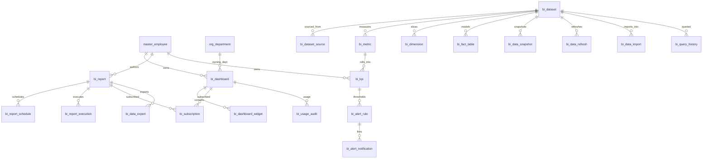

# ERD_20 — Business Intelligence & Analytics Domain

**Document:** Enterprise ERD — Business Intelligence & Analytics Domain  
**Version:** 1.0  
**Status:** Locked — Ready for Sprint 20 Implementation Planning  
**Schema:** `analytics`  
**Table Prefix:** `bi_`  
**Aligned To:** BRD v1.0 · FRD-18 Business Intelligence, Reporting & Analytics · SDD v1.1 · DBS v1.1 · Architecture Lock v1.1  
**Functional Requirements:** [FRD-18 Business Intelligence (BI), Reporting & Analytics Domain](../02_FRD/FRD-18-BI-Reporting-Analytics-Domain.md)  
**Classification:** Internal — Confidential  
**Prior Release:** [ERP Core v1.14-beta](../07_RELEASES/ERP_Core_v1.14-beta.md)  

> **C-01 note:** Party / item identity remains **`master.master_employee`**, **`master.master_customer`**, **`master.master_product`**, and **`master.master_vendor`**. BI **never** invents parallel masters. All operational ERP domains are **read-only analytical sources** — UUID refs where needed; **no peer FKs / no peer ORM writes**.

---

## 1. Module Overview (Purpose)

The Business Intelligence & Analytics Domain provides a **centralized enterprise analytics platform**: dashboards and widgets, reports with schedules and executions, datasets and sources, metrics / KPIs / dimensions, star-schema fact metadata, data snapshots and refresh jobs, alert rules and notifications, subscriptions, import / export, query history, and usage audit — spanning operational DB → analytics layer → dashboards / reports → executives (FRD-18 §3).

BI **depends on** Foundation, Organization, and Master Data. It **consumes existing masters only (C-01)** — **`master_employee`**, **`master_customer`**, **`master_product`**, **`master_vendor`**, and **`org_department`**. It **must never duplicate** employee, customer, product, vendor, department, or company masters.

**Finance remains the only accounting system.** BI **never** ORM-writes `fin_*` tables and **does not** call `PostingService`. Finance is consumed **analytically only** (read / UUID context).

All ERP operational modules (Sales · Procurement · Inventory · Manufacturing · Quality · CRM · HR · Payroll · Recruitment · Project · Asset · Service · Helpdesk · Document · GRC · Finance) remain **isolated writes** — BI is a **consumer only**.

**Business Tables: 20**  
**Schema: `analytics`**

### Enterprise BI Modules (FRD-18 · Sprint 20 focus)

| # | Module | Primary Tables | Primary Consumers |
|---|--------|----------------|-------------------|
| 1 | Dashboards | `bi_dashboard`, `bi_dashboard_widget` | Executives · ops managers |
| 2 | Reporting | `bi_report`, `bi_report_schedule`, `bi_report_execution` | Analysts · schedulers |
| 3 | Data Layer | `bi_dataset`, `bi_dataset_source`, `bi_metric`, `bi_kpi`, `bi_dimension`, `bi_fact_table` | Data stewards · analysts |
| 4 | Refresh | `bi_data_snapshot`, `bi_data_refresh` | Ops · stewards |
| 5 | Alerts | `bi_alert_rule`, `bi_alert_notification` | Managers · watchers |
| 6 | Delivery | `bi_subscription`, `bi_data_export`, `bi_data_import` | Subscribers · integrations |
| 7 | Governance | `bi_query_history`, `bi_usage_audit` | BI Admin · compliance |

**PostgreSQL Schema:** `analytics` (Sprint 20 introduction)

### Architectural Position

```text
Foundation (ERD_01) ── Workflow, Audit, RBAC, Notification
Organization (ERD_02) ── Company, Branch, Department
Master Data (ERD_03) ── employee · customer · product · vendor (C-01)
All ERP domains ── READ-ONLY analytical sources (UUID refs, no peer writes)
Finance (ERD_04) ── analytical consumption ONLY (no PostingService / no fin_* writes)
        ↓
BI / Analytics (ERD_20) ── Dashboard · Report · Dataset · KPI · Alert · Export
        ↓
Executives · Analysts · External BI tools (export)
```

### API Mount (planned)

**`/api/v1/analytics`** — routers for all aggregates (dashboards, dashboard-widgets, reports, report-schedules, report-executions, datasets, dataset-sources, metrics, kpis, dimensions, fact-tables, data-snapshots, data-refreshes, alert-rules, alert-notifications, subscriptions, data-exports, data-imports, query-history, usage-audits).

---

## 2. Scope

### In Scope
- **Executive / operational dashboards** and **widgets** — FRD-18 §4–§5
- **Reports**, **schedules**, **executions** — FRD-18 §7–§9
- **Datasets**, **sources**, **metrics**, **KPIs**, **dimensions**, **fact table metadata** — FRD-18 §6 · §10–§11
- **Snapshots** and **refresh** jobs — FRD-18 data warehouse / analytics layer
- **Alert rules** and **alert notifications** — FRD-18 §15
- **Subscriptions**, **exports**, **imports**
- **Query history** and **usage audit**
- Workflow, audit, RBAC, Celery stubs (planning)

### Out of Scope (Phase 2 / Separate)
- Full **external OLAP / cube product** (SSAS / ClickHouse cluster) — Phase 1: metadata + snapshot JSON / URI
- Full **ML / predictive forecasting engine** — Phase 1: KPI / metric definitions only (FRD-18 §12 deferred)
- Duplicate `bi_employee` / `bi_customer` / `bi_product` / `bi_vendor` / `bi_department` masters — **forbidden (C-01)**
- Direct writes to any peer schema (`fin_*`, `sales_*`, `doc_*`, `grc_*`, …)
- SQLAlchemy models, Alembic migrations, application code (implementation sprint)
- Real-time CDC bus product — Phase 1: scheduled refresh stubs

### Assumptions / Business Rules
- **Identity:** owners / stewards / subscribers resolve through Master Data (C-01)
- Soft delete + version on mutable `bi_*` tables
- Numbers company-scoped (`DASH-` / `RPT-` / `KPI-` / `DS-` / `ALR-` / `EXP-` / `IMP-`)
- BI **never posts** journals; **no** `finance_journal_id` write-path
- Source bindings store **module code + entity UUID / query key** — **no peer FKs**
- Fact / snapshot payloads stored as JSONB and/or external URI (warehouse pointer)
- Dataset refresh is **idempotent** per refresh job row (service-enforced)

### Dependencies

| Upstream | Tables / Services Used |
|----------|------------------------|
| ERD_01 Foundation | `sec_tenant`, `sec_user`, `wf_definition`, `wf_instance` |
| ERD_02 Organization | `org_company`, `org_branch`, `org_department` |
| ERD_03 Master Data | **`master_employee`**, **`master_customer`**, **`master_product`**, **`master_vendor`** |
| ERD_04 Finance | **Read-only** analytical consumption — **no writes / no PostingService** |
| ERD_05–ERD_19 peers | Sales · Proc · Inv · MFG · QM · CRM · HR · Pay · Rec · Prj · Ast · Svc · HD · Doc · GRC — **read-only / UUID only** |

---

## 3. Table Inventory

| # | Table | Classification | tenant_id | company_id | branch_id | Soft Delete | Version | Workflow |
|---|-------|----------------|-----------|------------|-----------|-------------|---------|----------|
| 1 | `bi_dashboard` | Transaction / Catalog | ✅ | ✅ | optional | ✅ | ✅ | ✅ |
| 2 | `bi_dashboard_widget` | Detail | ✅ | ✅ | optional | ✅ | ✅ | — |
| 3 | `bi_report` | Transaction | ✅ | ✅ | optional | ✅ | ✅ | ✅ |
| 4 | `bi_report_schedule` | Schedule | ✅ | ✅ | optional | ✅ | ✅ | — |
| 5 | `bi_report_execution` | Execution | ✅ | ✅ | optional | ✅ | ✅ | — |
| 6 | `bi_dataset` | Catalog | ✅ | ✅ | optional | ✅ | ✅ | ✅ |
| 7 | `bi_dataset_source` | Detail | ✅ | ✅ | optional | ✅ | ✅ | — |
| 8 | `bi_metric` | Catalog | ✅ | ✅ | optional | ✅ | ✅ | — |
| 9 | `bi_kpi` | Catalog / Transaction | ✅ | ✅ | optional | ✅ | ✅ | ✅ |
| 10 | `bi_dimension` | Catalog | ✅ | ✅ | optional | ✅ | ✅ | — |
| 11 | `bi_fact_table` | Catalog / Metadata | ✅ | ✅ | optional | ✅ | ✅ | — |
| 12 | `bi_data_snapshot` | Snapshot | ✅ | ✅ | optional | ✅ | ✅ | — |
| 13 | `bi_data_refresh` | Job | ✅ | ✅ | optional | ✅ | ✅ | ✅ |
| 14 | `bi_alert_rule` | Config | ✅ | ✅ | optional | ✅ | ✅ | ✅ |
| 15 | `bi_alert_notification` | Notification | ✅ | ✅ | optional | ✅ | ✅ | — |
| 16 | `bi_subscription` | Subscription | ✅ | ✅ | optional | ✅ | ✅ | — |
| 17 | `bi_data_export` | Job | ✅ | ✅ | optional | ✅ | ✅ | — |
| 18 | `bi_data_import` | Job | ✅ | ✅ | optional | ✅ | ✅ | — |
| 19 | `bi_query_history` | Audit / History | ✅ | ✅ | optional | ✅ | ✅ | — |
| 20 | `bi_usage_audit` | Audit | ✅ | ✅ | optional | ✅ | ✅ | — |

**Business Tables: 20**  
**Schema: `analytics`**

---

## 4. Entity Relationships



```text
org_company / org_branch / org_department
master_employee / master_customer / master_product / master_vendor (C-01)
    └── bi_dashboard
            ├── bi_dashboard_widget  (metric_id / report_id / kpi_id optional)
            └── bi_subscription / bi_usage_audit
    └── bi_report
            ├── bi_report_schedule
            ├── bi_report_execution
            └── bi_data_export / bi_subscription
    └── bi_dataset
            ├── bi_dataset_source  (source_module + source_ref_id UUID — no peer FK)
            ├── bi_metric → bi_kpi → bi_alert_rule → bi_alert_notification
            ├── bi_dimension
            ├── bi_fact_table
            ├── bi_data_snapshot / bi_data_refresh
            ├── bi_data_import
            └── bi_query_history
    └── bi_usage_audit

Optional UUID-only (no FK): source_ref_id, sales_order_id, procurement_*, inventory_*,
  production_order_id, quality_*, crm_*, project_id, asset_id, service_*, helpdesk_*,
  document_id, grc_*, finance_ledger_ref_id (read context only)
```

---

## 5. Standard Column Profiles

### 5.1 BI Catalog Profile (Dataset, Metric, Dimension, Fact Table, Alert Rule)

| Column Group | Columns |
|--------------|---------|
| Primary Key | `id UUID` |
| Tenant / Company | `tenant_id`, `company_id` |
| Business Key | `*_code` |
| Status | `status VARCHAR(30)` |
| Audit + Soft Delete + Version | per DBS §28 |

### 5.2 BI Transaction / Job Profile (Dashboard, Report, KPI, Refresh, Export, Import)

| Column Group | Columns |
|--------------|---------|
| Primary Key | `id UUID` |
| Document number | `*_number` or `*_code` |
| Status / Workflow | `status`, optional `workflow_status`, `workflow_instance_id` |
| Scope | `tenant_id`, `company_id`, optional `branch_id` |
| Party / Org | `*_employee_id` → `master_employee`; `department_id` → `org_department` |
| Audit + Soft Delete + Version | per DBS §28 |

### 5.3 BI Detail / History Profile (Widget, Schedule, Execution, Source, Snapshot, Notification, Subscription, Query History, Usage Audit)

| Column Group | Columns |
|--------------|---------|
| Scope | tenant / company / branch (as applicable) |
| Parent FKs | dashboard / report / dataset / alert_rule |
| Soft delete + version | yes (history tables soft-deleteable) |

---

## 6. Detailed Table Definitions

### 6.1 `bi_dashboard`

| Column | Type | Nullable | Description |
|--------|------|----------|-------------|
| `id` | UUID | NO | PK |
| `tenant_id` / `company_id` / `branch_id` | UUID | NO / NO / YES | Scope |
| `dashboard_number` | VARCHAR(50) | NO | `DASH-YYYY-NNNNNN` |
| `dashboard_code` / `dashboard_name` | VARCHAR | NO | UK code with name |
| `dashboard_type` | VARCHAR(40) | NO | executive, operational, self_service — FRD-18 §4–§5 · §14 |
| `audience_role` | VARCHAR(40) | YES | ceo, cfo, coo, chro, sales, procurement, inventory, manufacturing, hr, custom |
| `owner_employee_id` | UUID | NO | FK → `master_employee` |
| `department_id` | UUID | YES | FK → `org_department` |
| `layout_json` | JSONB | YES | Widget layout |
| `is_default` | BOOLEAN | NO | default false |
| `published_at` | TIMESTAMPTZ | YES | — |
| `status` | VARCHAR(30) | NO | draft, submitted, approved, published, archived, cancelled |
| `workflow_*` | | | Dashboard approval |
| AUDIT_STD + SOFT_DELETE_OPT + version | | | |

**UK:** `(company_id, dashboard_number)` where not deleted.

---

### 6.2 `bi_dashboard_widget`

| Column | Notes |
|--------|-------|
| `dashboard_id` | FK → `bi_dashboard` |
| `widget_code` / `widget_title` | — |
| `widget_type` | kpi_tile, chart, table, gauge, map, text, iframe |
| `metric_id` / `kpi_id` / `report_id` | FK optional |
| `dataset_id` | FK optional → `bi_dataset` |
| `config_json` | JSONB (chart type, filters, axes) |
| `sequence_no` | INT |
| `status` | active, hidden, archived |
| **UK soft:** `(dashboard_id, widget_code)` |

---

### 6.3 `bi_report`

| Column | Type | Nullable | Description |
|--------|------|----------|-------------|
| `id` | UUID | NO | PK |
| `tenant_id` / `company_id` / `branch_id` | UUID | NO / NO / YES | Scope |
| `report_number` | VARCHAR(50) | NO | `RPT-YYYY-NNNNNN` |
| `report_code` / `report_name` | VARCHAR | NO | — |
| `report_type` | VARCHAR(40) | NO | operational, financial, cross_module, ad_hoc, scheduled — FRD-18 §7–§9 |
| `owner_employee_id` | UUID | NO | FK → `master_employee` |
| `department_id` | UUID | YES | FK → `org_department` |
| `dataset_id` | UUID | YES | FK → `bi_dataset` |
| `definition_json` | JSONB | YES | Columns / filters / grouping |
| `output_format` | VARCHAR(20) | YES | pdf, xlsx, csv, json |
| `status` | VARCHAR(30) | NO | draft, submitted, approved, published, archived, cancelled |
| `workflow_*` | | | Report approval |
| AUDIT_STD + SOFT_DELETE_OPT + version | | | |

**UK:** `(company_id, report_number)` where not deleted.

---

### 6.4 `bi_report_schedule`

| Column | Notes |
|--------|-------|
| `report_id` | FK → `bi_report` |
| `schedule_code` | UK soft with report |
| `cron_expression` / `timezone` | VARCHAR |
| `next_run_at` / `last_run_at` | TIMESTAMPTZ |
| `recipients_json` | JSONB (user/employee ids, emails) |
| `is_enabled` | BOOLEAN |
| `status` | active, paused, retired |

---

### 6.5 `bi_report_execution`

| Column | Notes |
|--------|-------|
| `report_id` | FK → `bi_report` |
| `schedule_id` | FK optional → `bi_report_schedule` |
| `execution_number` | `REX-YYYY-NNNNNN` |
| `triggered_by_employee_id` | FK optional |
| `started_at` / `completed_at` | TIMESTAMPTZ |
| `row_count` | INT |
| `output_uri` / `content_hash` | VARCHAR |
| `error_message` | TEXT |
| `status` | queued, running, succeeded, failed, cancelled |
| **UK:** `(company_id, execution_number)` |

---

### 6.6 `bi_dataset`

| Column | Notes |
|--------|-------|
| `dataset_number` | `DS-YYYY-NNNNNN` |
| `dataset_code` / `dataset_name` | UK `(company_id, dataset_code)` |
| `dataset_type` | operational, warehouse, virtual, imported |
| `description` | TEXT |
| `owner_employee_id` | FK → `master_employee` |
| `steward_employee_id` | FK optional |
| `grain_description` | VARCHAR / TEXT |
| `cache_ttl_seconds` | INT optional |
| `last_refreshed_at` | TIMESTAMPTZ |
| `status` | draft, submitted, approved, active, refreshing, failed, retired |
| `workflow_*` | Dataset refresh approval / gate |
| **UK:** `(company_id, dataset_number)` |

---

### 6.7 `bi_dataset_source`

| Column | Notes |
|--------|-------|
| `dataset_id` | FK → `bi_dataset` |
| `source_code` | — |
| `source_module` | foundation, organization, master, finance, sales, procurement, inventory, manufacturing, quality, crm, hr, payroll, recruitment, project, asset, service, helpdesk, document, grc, external |
| `source_entity` | VARCHAR (logical entity name) |
| `source_ref_id` | UUID optional — **UUID only — no peer FK** |
| `connection_key` | VARCHAR optional (config reference) |
| `extract_query_key` | VARCHAR optional (named query / view) |
| `filter_json` | JSONB |
| `status` | active, inactive |
| **UK soft:** `(dataset_id, source_code)` |

---

### 6.8 `bi_metric`

| Column | Notes |
|--------|-------|
| `metric_code` / `metric_name` | UK `(company_id, metric_code)` |
| `dataset_id` | FK optional → `bi_dataset` |
| `metric_category` | financial, sales, operations, hr, quality, project, custom — FRD-18 §6 |
| `aggregation` | sum, avg, count, min, max, distinct_count, ratio |
| `expression_json` | JSONB / formula metadata |
| `unit` | VARCHAR (currency, percent, count, hours) |
| `owner_employee_id` | FK optional |
| `status` | draft, active, deprecated |

---

### 6.9 `bi_kpi`

| Column | Type | Nullable | Description |
|--------|------|----------|-------------|
| `id` | UUID | NO | PK |
| `tenant_id` / `company_id` | UUID | NO | Scope |
| `kpi_number` | VARCHAR(50) | NO | `KPI-YYYY-NNNNNN` |
| `kpi_code` / `kpi_name` | VARCHAR | NO | — |
| `metric_id` | UUID | YES | FK → `bi_metric` |
| `owner_employee_id` | UUID | NO | FK → `master_employee` |
| `department_id` | UUID | YES | FK → `org_department` |
| `target_value` / `warning_threshold` / `critical_threshold` | NUMERIC | YES | FRD-18 §15 |
| `direction` | VARCHAR(20) | YES | higher_better, lower_better |
| `period_grain` | VARCHAR(20) | YES | day, week, month, quarter, year |
| `current_value` | NUMERIC | YES | last computed |
| `status` | VARCHAR(30) | NO | draft, submitted, approved, active, inactive, cancelled |
| `workflow_*` | | | KPI approval |
| AUDIT_STD + SOFT_DELETE_OPT + version | | | |

**UK:** `(company_id, kpi_number)` where not deleted.

---

### 6.10 `bi_dimension`

| Column | Notes |
|--------|-------|
| `dimension_code` / `dimension_name` | UK `(company_id, dimension_code)` |
| `dataset_id` | FK optional |
| `dimension_type` | time, geo, org, product, customer, vendor, employee, custom |
| `source_module` | VARCHAR optional |
| `hierarchy_json` | JSONB optional |
| `master_product_id` / `master_customer_id` / `master_vendor_id` | FK optional (C-01 dims) |
| `status` | active, inactive |

---

### 6.11 `bi_fact_table`

| Column | Notes |
|--------|-------|
| `fact_code` / `fact_name` | UK `(company_id, fact_code)` |
| `dataset_id` | FK → `bi_dataset` |
| `grain_description` | TEXT |
| `measure_codes_json` | JSONB |
| `dimension_codes_json` | JSONB |
| `storage_uri` / `physical_table_name` | optional warehouse pointer |
| `status` | draft, active, rebuilding, retired |

---

### 6.12 `bi_data_snapshot`

| Column | Notes |
|--------|-------|
| `dataset_id` | FK → `bi_dataset` |
| `snapshot_number` | `SNP-YYYY-NNNNNN` |
| `snapshot_at` | TIMESTAMPTZ |
| `period_start` / `period_end` | DATE optional |
| `row_count` | INT |
| `payload_json` / `storage_uri` | Phase 1 snapshot body or external URI |
| `refresh_id` | FK optional → `bi_data_refresh` |
| `status` | ready, expired, failed |
| **UK:** `(company_id, snapshot_number)` |

---

### 6.13 `bi_data_refresh`

| Column | Notes |
|--------|-------|
| `refresh_number` | `RFH-YYYY-NNNNNN` |
| `dataset_id` | FK → `bi_dataset` |
| `refresh_type` | full, incremental, rebuild |
| `requested_by_employee_id` | FK → `master_employee` |
| `started_at` / `completed_at` | TIMESTAMPTZ |
| `rows_processed` | INT |
| `error_message` | TEXT |
| `status` | draft, submitted, queued, running, succeeded, failed, cancelled |
| `workflow_*` | Dataset refresh |
| **UK:** `(company_id, refresh_number)` |

---

### 6.14 `bi_alert_rule`

| Column | Notes |
|--------|-------|
| `alert_number` | `ALR-YYYY-NNNNNN` |
| `alert_code` / `alert_name` | — |
| `kpi_id` / `metric_id` | FK optional |
| `condition_operator` | gt, gte, lt, lte, eq, neq, between |
| `threshold_value` / `threshold_upper` | NUMERIC |
| `severity` | info, warning, critical |
| `owner_employee_id` | FK → `master_employee` |
| `is_enabled` | BOOLEAN |
| `status` | draft, submitted, approved, active, paused, retired |
| `workflow_*` | Alert review |
| **UK:** `(company_id, alert_number)` |

---

### 6.15 `bi_alert_notification`

| Column | Notes |
|--------|-------|
| `alert_rule_id` | FK → `bi_alert_rule` |
| `triggered_at` | TIMESTAMPTZ |
| `observed_value` | NUMERIC |
| `message` | TEXT |
| `recipient_user_id` / `recipient_employee_id` | UUID refs |
| `delivery_status` | pending, sent, failed, acknowledged |
| `acknowledged_at` | TIMESTAMPTZ |
| `status` | open, acknowledged, closed |

---

### 6.16 `bi_subscription`

| Column | Notes |
|--------|-------|
| `subscription_number` | `SUB-YYYY-NNNNNN` |
| `subscriber_employee_id` | FK → `master_employee` |
| `target_type` | dashboard, report, kpi, alert |
| `dashboard_id` / `report_id` / `kpi_id` / `alert_rule_id` | one required (service-enforced) |
| `channel` | in_app, email, webhook |
| `frequency` | realtime, daily, weekly, monthly |
| `status` | active, paused, cancelled |
| **UK:** `(company_id, subscription_number)` |

---

### 6.17 `bi_data_export`

| Column | Notes |
|--------|-------|
| `export_number` | `EXP-YYYY-NNNNNN` |
| `report_id` / `dataset_id` | FK optional |
| `requested_by_employee_id` | FK → `master_employee` |
| `format` | csv, xlsx, json, pdf, parquet |
| `storage_uri` / `content_hash` / `file_size_bytes` | — |
| `started_at` / `completed_at` | TIMESTAMPTZ |
| `status` | queued, running, succeeded, failed, expired |
| **UK:** `(company_id, export_number)` |

---

### 6.18 `bi_data_import`

| Column | Notes |
|--------|-------|
| `import_number` | `IMP-YYYY-NNNNNN` |
| `dataset_id` | FK → `bi_dataset` |
| `requested_by_employee_id` | FK → `master_employee` |
| `source_uri` / `content_hash` | — |
| `format` | csv, xlsx, json |
| `rows_loaded` | INT |
| `error_message` | TEXT |
| `status` | queued, running, succeeded, failed, cancelled |
| **UK:** `(company_id, import_number)` |
| **Note:** External file ingest into BI dataset only — **never** writes peer ERP tables |

---

### 6.19 `bi_query_history`

| Column | Notes |
|--------|-------|
| `dataset_id` / `report_id` | FK optional |
| `executed_by_employee_id` | FK optional → `master_employee` |
| `executed_by_user_id` | UUID optional → Foundation user |
| `query_text` / `query_hash` | TEXT / VARCHAR |
| `duration_ms` | INT |
| `row_count` | INT |
| `executed_at` | TIMESTAMPTZ |
| `status` | succeeded, failed, timeout |
| `status` (row) | recorded |

---

### 6.20 `bi_usage_audit`

| Column | Notes |
|--------|-------|
| `actor_employee_id` / `actor_user_id` | UUID refs |
| `resource_type` | dashboard, report, kpi, dataset, export, widget, alert |
| `resource_id` | UUID |
| `action` | view, run, export, subscribe, edit, publish, refresh |
| `payload_json` | JSONB |
| `occurred_at` | TIMESTAMPTZ |
| `status` | recorded |

---

## 7. Primary Keys

| Table | Constraint Name | Column |
|-------|-----------------|--------|
| `bi_dashboard` | `pk_bi_dashboard` | `id` |
| `bi_dashboard_widget` | `pk_bi_dashboard_widget` | `id` |
| `bi_report` | `pk_bi_report` | `id` |
| `bi_report_schedule` | `pk_bi_report_schedule` | `id` |
| `bi_report_execution` | `pk_bi_report_execution` | `id` |
| `bi_dataset` | `pk_bi_dataset` | `id` |
| `bi_dataset_source` | `pk_bi_dataset_source` | `id` |
| `bi_metric` | `pk_bi_metric` | `id` |
| `bi_kpi` | `pk_bi_kpi` | `id` |
| `bi_dimension` | `pk_bi_dimension` | `id` |
| `bi_fact_table` | `pk_bi_fact_table` | `id` |
| `bi_data_snapshot` | `pk_bi_data_snapshot` | `id` |
| `bi_data_refresh` | `pk_bi_data_refresh` | `id` |
| `bi_alert_rule` | `pk_bi_alert_rule` | `id` |
| `bi_alert_notification` | `pk_bi_alert_notification` | `id` |
| `bi_subscription` | `pk_bi_subscription` | `id` |
| `bi_data_export` | `pk_bi_data_export` | `id` |
| `bi_data_import` | `pk_bi_data_import` | `id` |
| `bi_query_history` | `pk_bi_query_history` | `id` |
| `bi_usage_audit` | `pk_bi_usage_audit` | `id` |

---

## 8. Foreign Keys

| Child | Column | Parent |
|-------|--------|--------|
| Dashboard / report / KPI / refresh / export / import / … | `*_employee_id` | `master.master_employee` |
| Dimension (optional) | `master_customer_id` | `master.master_customer` |
| Dimension (optional) | `master_product_id` | `master.master_product` |
| Dimension (optional) | `master_vendor_id` | `master.master_vendor` |
| Dashboard / report / KPI | `department_id` | `organization.org_department` |
| Widget | `dashboard_id` | `analytics.bi_dashboard` |
| Schedule / execution / export | `report_id` | `analytics.bi_report` |
| Source / metric / dimension / fact / snapshot / refresh / import | `dataset_id` | `analytics.bi_dataset` |
| KPI / alert / widget | `metric_id` / `kpi_id` | metric / kpi |
| Alert notification | `alert_rule_id` | `analytics.bi_alert_rule` |
| Workflow | `workflow_instance_id` | `foundation.wf_instance` |
| Org scope | `tenant_id`, `company_id`, `branch_id` | foundation / organization |

**No FK to:** `fin_*`, `sales_*`, `proc_*`, `inv_*`, `mfg_*`, `qm_*`, `crm_*`, `hr_*`, `pay_*`, `rec_*`, `prj_*`, `ast_*`, `svc_*`, `hd_*`, `doc_*`, `grc_*`.  
**Finance:** analytical read only — **no PostingService**, **no `fin_*` writes**.  
**No BI duplicates of:** `master_employee`, `master_customer`, `master_product`, `master_vendor`, `org_department`, `org_company`.

---

## 9. Indexes & Constraints

### Unique
- Dashboard / report / KPI / dataset / alert / subscription / export / import / refresh / snapshot / execution numbers: `(company_id, *_number)`
- Dataset / metric / dimension / fact / dashboard codes: `(company_id, *_code)`
- Widget `(dashboard_id, widget_code)`; source `(dataset_id, source_code)`

### Check
- Threshold / aggregation / widget_type / source_module enums
- Row counts / file sizes ≥ 0
- Subscription target exclusivity (service-enforced)

### Indexes
- All FKs
- `(tenant_id, company_id, status)` on dashboard, report, dataset, kpi
- `(next_run_at)` on schedule; `(started_at)` on execution / refresh
- `(source_module, source_ref_id)` on dataset_source
- `(occurred_at)` on usage_audit; `(executed_at)` on query_history

---

## 10. Document Numbering / Naming Convention

| Document | Format | UK Scope |
|----------|--------|----------|
| Dashboard | `DASH-YYYY-NNNNNN` | company |
| Report | `RPT-YYYY-NNNNNN` | company |
| Report Execution | `REX-YYYY-NNNNNN` | company |
| Dataset | `DS-YYYY-NNNNNN` | company |
| KPI | `KPI-YYYY-NNNNNN` | company |
| Alert | `ALR-YYYY-NNNNNN` | company |
| Subscription | `SUB-YYYY-NNNNNN` | company |
| Export | `EXP-YYYY-NNNNNN` | company |
| Import | `IMP-YYYY-NNNNNN` | company |
| Refresh | `RFH-YYYY-NNNNNN` | company |
| Snapshot | `SNP-YYYY-NNNNNN` | company |
| Dataset / Metric / Dimension / Fact / Dashboard codes | Stable codes | company |

**Naming:** schema `analytics`; tables `bi_*`; ORM `Bi*`; module package `modules/analytics`; API prefix `/analytics`; permissions `analytics.*`; workflows `BI_*`.

---

## 11. Status Lifecycles

| Entity | Statuses |
|--------|----------|
| Dashboard / Report | draft → submitted → approved → published → archived \| cancelled |
| Widget | active ↔ hidden → archived |
| Schedule | active ↔ paused → retired |
| Execution / Export / Import / Refresh | queued → running → succeeded \| failed \| cancelled (refresh also draft/submitted) |
| Dataset | draft → submitted → approved → active ↔ refreshing → failed \| retired |
| Metric / Dimension | draft → active → deprecated/inactive |
| KPI | draft → submitted → approved → active ↔ inactive \| cancelled |
| Fact Table | draft → active ↔ rebuilding → retired |
| Snapshot | ready → expired \| failed |
| Alert Rule | draft → submitted → approved → active ↔ paused → retired |
| Alert Notification | open → acknowledged → closed |
| Subscription | active ↔ paused → cancelled |
| Query History / Usage Audit | recorded |

---

## 12. Approval Workflow Integration (Workflow Matrix)

| Workflow Code | Document | Path |
|---------------|----------|------|
| `BI_DASHBOARD_APPROVAL` | Dashboard | Analyst → BI Manager → BI Admin |
| `BI_REPORT_APPROVAL` | Report | Analyst → Data Steward → BI Manager |
| `BI_KPI_APPROVAL` | KPI | Owner → Data Steward → BI Manager |
| `BI_DATASET_REFRESH` | Data Refresh | Steward → BI Manager (gated datasets) |
| `BI_ALERT_REVIEW` | Alert Rule | Owner → BI Manager → BI Admin |

Seed workflows only; instance rows use Foundation `wf_instance`. `is_parallel` remains on **`wf_step`** only (prior sprint seed pattern).

---

## 13. Audit Strategy

| Layer | Mechanism |
|-------|-----------|
| Row audit | Standard columns on all mutable `bi_*` tables |
| Business audit | `bi_usage_audit` on view / run / export / publish / refresh; Foundation `AuditService` on approve / publish |
| Query governance | `bi_query_history` for ad-hoc / dataset queries |
| Notifications | Schedule due / refresh fail / alert fire — Foundation + `bi_alert_notification` |

---

## 14. Tenant / Company / Branch Isolation + RBAC Matrix

| Rule | Application |
|------|-------------|
| `tenant_id` | All tables |
| `company_id` | Numbering / analytics boundary |
| `branch_id` | Optional; used when dashboard/report is branch-scoped |
| Repository | `AnalyticsScopedRepository` pattern |
| RBAC | `analytics.*` permissions |

### Planned RBAC (Sprint 20)

| Resource | Permissions |
|----------|-------------|
| `analytics.dashboard` | read, create, update, submit, approve, publish |
| `analytics.widget` | read, create, update |
| `analytics.report` | read, create, update, submit, approve, publish, run |
| `analytics.schedule` / `analytics.execution` | read, create, update |
| `analytics.dataset` | read, create, update, submit, approve, refresh |
| `analytics.source` / `analytics.metric` / `analytics.dimension` / `analytics.fact` | read, create, update |
| `analytics.kpi` | read, create, update, submit, approve |
| `analytics.snapshot` / `analytics.refresh` | read, create, submit |
| `analytics.alert` | read, create, update, submit, approve |
| `analytics.notification` | read, acknowledge |
| `analytics.subscription` | read, create, update, cancel |
| `analytics.export` / `analytics.import` | read, create, run |
| `analytics.query_history` / `analytics.usage_audit` | read |

**Roles** (`status='active'`):

| Role | Intent |
|------|--------|
| `BI_ANALYST` | Build dashboards / reports / ad-hoc queries; limited publish |
| `BI_MANAGER` | Approve dashboards / reports / KPIs / alerts; oversee schedules |
| `DATA_STEWARD` | Dataset / metric / dimension / fact governance; refresh gates |
| `BI_ADMIN` | Platform admin, usage audit, cross-company catalog (within tenant) |

---

## 15. Migration Plan

Prior Alembic head: **`0354_seed_grc_workflows`**.

Revision budget **`0355`–`0376` (22 revisions)**. Schema + 20 tables + permissions + workflows = 23 logical steps → **`bi_dataset` and `bi_dataset_source` share one migration**.

| Order | Revision ID (≤32 chars) | Migration | Tables / Actions |
|-------|-------------------------|-----------|------------------|
| 355 | `0355_create_analytics_schema` | Create schema | `analytics` |
| 356 | `0356_bi_dashboard` | Dashboard | `bi_dashboard` |
| 357 | `0357_bi_dashboard_widget` | Widget | `bi_dashboard_widget` |
| 358 | `0358_bi_report` | Report | `bi_report` |
| 359 | `0359_bi_report_schedule` | Schedule | `bi_report_schedule` |
| 360 | `0360_bi_report_execution` | Execution | `bi_report_execution` |
| 361 | `0361_bi_dataset_and_source` | Dataset | `bi_dataset`, `bi_dataset_source` |
| 362 | `0362_bi_metric` | Metric | `bi_metric` |
| 363 | `0363_bi_kpi` | KPI | `bi_kpi` |
| 364 | `0364_bi_dimension` | Dimension | `bi_dimension` |
| 365 | `0365_bi_fact_table` | Fact | `bi_fact_table` |
| 366 | `0366_bi_data_snapshot` | Snapshot | `bi_data_snapshot` |
| 367 | `0367_bi_data_refresh` | Refresh | `bi_data_refresh` |
| 368 | `0368_bi_alert_rule` | Alert Rule | `bi_alert_rule` |
| 369 | `0369_bi_alert_notification` | Alert Notification | `bi_alert_notification` |
| 370 | `0370_bi_subscription` | Subscription | `bi_subscription` |
| 371 | `0371_bi_data_export` | Export | `bi_data_export` |
| 372 | `0372_bi_data_import` | Import | `bi_data_import` |
| 373 | `0373_bi_query_history` | Query History | `bi_query_history` |
| 374 | `0374_bi_usage_audit` | Usage Audit | `bi_usage_audit` |
| 375 | `0375_seed_analytics_permissions` | RBAC | Permissions / roles |
| 376 | `0376_seed_analytics_workflows` | Workflows | Dashboard / Report / KPI / Refresh / Alert |

**Dependency order:** schema → dashboard/report stack → dataset(+source dual) → semantic layer → refresh/snapshot → alerts → delivery → governance → seeds.

**Note:** Optional FKs such as widget → metric / kpi remain nullable until parents exist; bind in services.

**Planned head after Sprint 20:** `0376_seed_analytics_workflows`

### Celery task stubs (planning)

| Task name | Purpose |
|-----------|---------|
| `analytics.dataset_refresh_scheduler` | Queue due dataset refreshes |
| `analytics.dashboard_cache_refresh` | Refresh cached dashboard / widget payloads |
| `analytics.report_scheduler` | Run due report schedules |
| `analytics.alert_monitor` | Evaluate alert rules against KPI/metric values |
| `analytics.usage_statistics_refresh` | Aggregate usage audit into report snapshots |
| `analytics.retry_failed_refresh` | Retry failed dataset refresh / report execution jobs |

---

## 16. Cross Module Integration

### 16.1 Upstream (BI Consumes)

| Module | Provides | Pattern |
|--------|----------|---------|
| Foundation | tenant, user, workflow, audit, RBAC, notification | Direct FK / services |
| Organization | company, branch, **department** | Direct FK |
| Master Data | **`master_employee` · `master_customer` · `master_product` · `master_vendor`** | FK + services (C-01) |
| Finance | Ledgers / journals / balances for analysis | **Read-only** — **no writes / no PostingService** |
| Sales · Procurement · Inventory · Manufacturing · Quality · CRM · HR · Payroll · Recruitment · Project · Asset · Service · Helpdesk · Document · GRC | Operational facts | **Read-only** via dataset sources — UUID / query keys — **no peer FKs / no writes** |

### 16.2 Downstream

| Module | Pattern |
|--------|---------|
| Executives / managers | Consume dashboards / KPIs / alerts |
| External BI tools | Consume exports / subscription webhooks |
| GRC / Document (optional) | May attach exported evidence via their own UUID refs — BI does not write peers |

### 16.3 Hard Rules (Architecture Compliance)

| Rule | Enforcement |
|------|-------------|
| C-01 | Employee / customer / product / vendor via masters only; no duplicate masters |
| Peer isolation | All ERP modules **read-only**; UUID / query-key sources only |
| No Finance writes | No `fin_*` ORM writes; **no** `PostingService` from BI |
| No import into peers | `bi_data_import` loads BI datasets only |
| Architecture Lock v1.1 | Unchanged; Modular Monolith · Clean Architecture · DDD preserved |
| No prior domain redesign | Prior ERDs / modules unmodified |

---

## 17. API Structure

**Mount:** `/api/v1/analytics`

| Router | Path prefix | Notes |
|--------|-------------|--------|
| dashboards | `/dashboards` | + submit / approve / publish |
| dashboard-widgets | `/dashboard-widgets` | — |
| reports | `/reports` | + submit / approve / publish / run |
| report-schedules | `/report-schedules` | — |
| report-executions | `/report-executions` | — |
| datasets | `/datasets` | + submit / approve / refresh |
| dataset-sources | `/dataset-sources` | — |
| metrics | `/metrics` | — |
| kpis | `/kpis` | + submit / approve |
| dimensions | `/dimensions` | — |
| fact-tables | `/fact-tables` | — |
| data-snapshots | `/data-snapshots` | — |
| data-refreshes | `/data-refreshes` | + submit |
| alert-rules | `/alert-rules` | + submit / approve |
| alert-notifications | `/alert-notifications` | + acknowledge |
| subscriptions | `/subscriptions` | — |
| data-exports | `/data-exports` | + run |
| data-imports | `/data-imports` | + run |
| query-history | `/query-history` | — |
| usage-audits | `/usage-audits` | — |

Path params use `/{row_id}` (platform convention).

---

## 18. Phase Gate Checklist

| # | Gate Criterion | Status |
|---|----------------|--------|
| 1 | Business tables = **20**; schema = **`analytics`** | ✅ |
| 2 | Prefix `bi_` defined | ✅ |
| 3 | Aligned to FRD-18 (dashboards, KPI, reporting, warehouse metadata, alerts) | ✅ |
| 4 | Consumes masters only (C-01) including product / vendor | ✅ |
| 5 | Finance analytical only — no PostingService / no fin_* writes | ✅ |
| 6 | All ERP peers read-only UUID / source bindings; no peer writes | ✅ |
| 7 | Migration order `0355`–`0376`, revision IDs ≤ 32 chars | ✅ |
| 8 | Workflows + RBAC (`analytics.*`) + API mount + Celery stubs documented | ✅ |
| 9 | Full OLAP / ML forecasting deferred without blocking Sprint 20 | ✅ |
| 10 | Architecture Lock v1.1 preserved; no prior module redesign | ✅ |

### ERD Phase Gate — BI Summary

| Metric | Value |
|--------|-------|
| Business Tables | **20** |
| Schema | **`analytics`** |
| Prefix | `bi_` |
| API mount | `/api/v1/analytics` |
| Migration range | `0355` – `0376` |
| Prior head | `0354_seed_grc_workflows` |
| Planned head | `0376_seed_analytics_workflows` |
| Document Status | **Locked — Ready for Sprint 20 Implementation Planning** |

---

## 19. Document Control

| Version | Date | Change |
|---------|------|--------|
| 1.0 | 2026-07-15 | Initial ERD_20 Business Intelligence & Analytics draft for Sprint 20 architecture review |
| 1.1 | 2026-07-15 | Editorial lock for Sprint 20 implementation planning. |

---

**ERD_20 Business Intelligence & Analytics is locked and ready for Sprint 20 implementation planning.**
