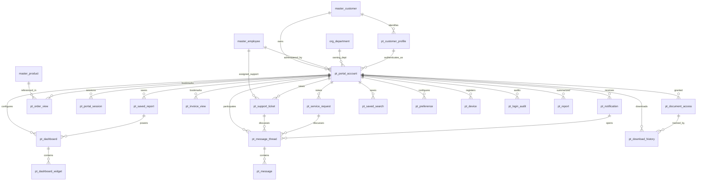

# ERD_23 — Customer Portal & Self-Service Portal

**Document:** Enterprise ERD — Customer Portal & Self-Service Portal Domain  
**Version:** 1.1  
**Status:** Locked — Ready for Sprint 23 Implementation Planning  
**Schema:** `portal`  
**Table Prefix:** `pt_`  
**Aligned To:** BRD v1.0 · FRD Customer / Self-Service Portal (planning) · Service FRD Customer Portal touchpoints · SDD v1.1 · DBS v1.1 · Architecture Lock v1.1  
**Functional Requirements:** Customer Portal & Self-Service (enterprise self-service layer; aligned to Service / Helpdesk / Document / Sales / Finance consumption patterns)  
**Classification:** Internal — Confidential  
**Prior Release:** [ERP Core v1.17-beta](../07_RELEASES/ERP_Core_v1.17-beta.md)  

> **C-01 note:** Party / item identity remains **`master.master_customer`**, **`master.master_employee`**, and **`master.master_product`**. Customer Portal **never** invents parallel masters. This module provides **secure self-service access** for external customers — it **consumes** CRM · Sales · Finance · Document · Helpdesk · Service · Analytics · Integration Hub · E-Commerce and **never becomes the system of record**. Peers communicate via **services · events · UUID refs** — **never** via peer ORM writes.

---

## 1. Functional Overview (Purpose)

The Customer Portal & Self-Service Portal domain provides the **enterprise external customer self-service layer** for portal accounts, customer portal profiles, authenticated sessions, dashboards / widgets, notifications / messages, projected order and invoice views, document access / downloads, support tickets and service requests (portal envelopes), saved reports / searches, preferences, devices, login audit, and portal operational reports.

This module **consumes existing ERP modules**. It **never** becomes order, invoice, document, ticket, service-request, or customer-master authority. **CRM remains customer relationship authority** (interaction / opportunity ledgers), **`master_customer` remains party identity (C-01)**, **Sales remains order authority**, **Finance remains invoice / accounting authority**, **Document remains document authority**, **Helpdesk remains ticket authority**, and **Service remains request authority**.

Portal **depends on** Foundation, Organization, and Master Data. It **consumes existing masters only (C-01)** — **`master_customer`**, **`master_employee`**, **`master_product`**, and **`org_department`**.

**Finance remains the only accounting system.** Portal **never** ORM-writes `fin_*`. Any portal-initiated fee / access charge (if configured) uses **`finance_journal_id`** after **`PostingService.post_system_journal()`** only.

**Business Tables: 20**  
**Schema: `portal`**

### Enterprise Portal Modules (Sprint 23 focus)

| # | Module | Primary Tables | Primary Consumers |
|---|--------|----------------|-------------------|
| 1 | Identity & Access | `pt_portal_account`, `pt_customer_profile`, `pt_portal_session` | Customers · portal admins |
| 2 | Experience | `pt_dashboard`, `pt_dashboard_widget` | Customers · portal managers |
| 3 | Comms | `pt_notification`, `pt_message_thread`, `pt_message` | Customers · support users |
| 4 | Views (consume-only) | `pt_order_view`, `pt_invoice_view`, `pt_document_access` | Customers |
| 5 | Requests | `pt_support_ticket`, `pt_service_request` | Customers · support · service desk |
| 6 | Personalization | `pt_download_history`, `pt_saved_report`, `pt_saved_search`, `pt_preference` | Customers |
| 7 | Security & Ops | `pt_device`, `pt_login_audit`, `pt_report` | Portal admins · security |

**PostgreSQL Schema:** `portal` (Sprint 23 introduction)

### Architectural Position

```text
Foundation (ERD_01) ── Workflow, Audit, RBAC, Platform Notification (unchanged owners)
Organization (ERD_02) ── Company, Branch, Department
Master Data (ERD_03) ── customer · employee · product (C-01)
CRM ── CUSTOMER RELATIONSHIP AUTHORITY (UUID views only)
Sales ── ORDER AUTHORITY (order view UUID only)
Finance (ERD_04) ── INVOICE AUTHORITY + PostingService ONLY (no fin_* ORM writes)
Document ── DOCUMENT AUTHORITY (access / download UUID only)
Helpdesk ── TICKET AUTHORITY (portal ticket → helpdesk UUID)
Service ── REQUEST AUTHORITY (portal request → service UUID)
Analytics ── READ-ONLY
Integration Hub ── external portal / IdP / API transport
E-Commerce ── optional channel order UUID (not portal SoR)
        ↓
Customer Portal (ERD_23) ── Account · Session · Dashboard · Views · Tickets · Prefs
        ↓
External customers (web / mobile self-service)
```

### API Mount (planned)

**`/api/v1/portal`** — routers for all aggregates (portal-accounts, customer-profiles, portal-sessions, dashboards, dashboard-widgets, notifications, message-threads, messages, order-views, invoice-views, document-accesses, support-tickets, service-requests, download-histories, saved-reports, saved-searches, preferences, devices, login-audits, reports).

---

## 2. Scope & Business Rules

### In Scope
- **Portal accounts** and **customer portal profiles** (linked to `master_customer`)
- **Portal sessions**, **devices**, **login audit**
- **Dashboards** and **dashboard widgets**
- **Notifications**, **message threads**, **messages**
- **Order views** and **invoice views** (projected / cached consume rows)
- **Document access** grants and **download history**
- **Support tickets** and **service requests** as portal envelopes mapped to Helpdesk / Service
- **Saved reports**, **saved searches**, **preferences**
- **Portal operational reports**
- Workflow, RBAC, Celery stubs (planning)

### Out of Scope (Phase 2 / Separate)
- Replacing **CRM** customer relationship ledgers — Portal profile is self-service surface; CRM remains CRM authority
- Replacing **Sales / Finance / Document / Helpdesk / Service** systems of record
- Full **IdP / SSO product** — Phase 1: account + session + device shells; Federation via Foundation / Hub later
- Duplicate `pt_customer` / `pt_employee` / `pt_product` / `pt_department` masters — **forbidden (C-01)**
- Direct ORM writes to any peer business schema
- SQLAlchemy models, Alembic migrations, application code (implementation sprint)

### Business Rules
1. **Portal consumes data only** — never system of record for orders, invoices, documents, tickets, service requests, or customer master
2. **C-01:** customer / employee / product / department resolve via Master Data / Organization only
3. **CRM** remains customer relationship authority — portal stores CRM interaction UUID optionally; **no `crm_*` ORM writes**
4. **Sales** remains order authority — `pt_order_view.sales_order_id` UUID only
5. **Finance** remains invoice authority — `pt_invoice_view` stores finance invoice UUID; journals **only** via `PostingService.post_system_journal()`
6. **Document** remains document authority — access / download store `document_id` UUID only
7. **Helpdesk / Service** remain ticket / request authority — portal rows map via UUID + service APIs
8. Soft delete + version on mutable `pt_*` tables
9. Numbers company-scoped (`ACC-` / `PRF-` / `SES-` / `DSH-` / `MSG-` / `THR-` / `ORD-` / `INV-` / `DOC-` / `TKT-` / `SRQ-` / `DL-` / `SVR-` / `SVS-` / `DEV-` / `AUD-` / `RPT-`)
10. Passwords / secrets are **vault / hash refs** — never plaintext credentials in DB
11. Analytics / Integration Hub / E-Commerce / Inventory / peers — UUID / events only — **no peer ORM writes**

### Assumptions
- One `master_customer` may have one primary `pt_customer_profile` and one or more `pt_portal_account` users (delegates)
- `pt_order_view` / `pt_invoice_view` are **projections / bookmarks**, refreshed from authoritative modules — not operational ledgers
- Portal support ticket creation invokes Helpdesk service and stores returned ticket UUID
- Portal service request creation invokes Service module API similarly
- Message thread is parent of messages (logical order); migration dual creates both safely

### Dependencies

| Upstream | Tables / Services Used |
|----------|------------------------|
| ERD_01 Foundation | `sec_tenant`, `sec_user`, `wf_definition`, `wf_instance`, platform audit / notification |
| ERD_02 Organization | `org_company`, `org_branch`, `org_department` |
| ERD_03 Master Data | **`master_customer`**, **`master_employee`**, **`master_product`** |
| CRM | Relationship / interaction UUID — **no CRM ORM writes** |
| Sales | Order authority via **service / UUID** |
| Finance | Invoice UUID + **`PostingService.post_system_journal()`** only |
| Document | Document UUID — **no Document ORM writes** |
| Helpdesk | Ticket UUID via service |
| Service | Service request UUID via service |
| Analytics | Read-only |
| Integration Hub | External IdP / API transport UUID refs |
| E-Commerce | Optional channel order UUID |

---

## 3. Table Inventory

| # | Table | Classification | tenant_id | company_id | Soft Delete | Version | Workflow |
|---|-------|----------------|-----------|------------|-------------|---------|----------|
| 1 | `pt_portal_account` | Identity | ✅ | ✅ | ✅ | ✅ | ✅ |
| 2 | `pt_customer_profile` | Profile | ✅ | ✅ | ✅ | ✅ | ✅ |
| 3 | `pt_portal_session` | Session | ✅ | ✅ | ✅ | ✅ | — |
| 4 | `pt_dashboard` | Config | ✅ | ✅ | ✅ | ✅ | — |
| 5 | `pt_dashboard_widget` | Config Detail | ✅ | ✅ | ✅ | ✅ | — |
| 6 | `pt_notification` | Notification | ✅ | ✅ | ✅ | ✅ | — |
| 7 | `pt_message` | Message | ✅ | ✅ | ✅ | ✅ | — |
| 8 | `pt_message_thread` | Conversation | ✅ | ✅ | ✅ | ✅ | — |
| 9 | `pt_order_view` | Projection | ✅ | ✅ | ✅ | ✅ | — |
| 10 | `pt_invoice_view` | Projection | ✅ | ✅ | ✅ | ✅ | — |
| 11 | `pt_document_access` | Entitlement | ✅ | ✅ | ✅ | ✅ | ✅ |
| 12 | `pt_support_ticket` | Portal Envelope | ✅ | ✅ | ✅ | ✅ | ✅ |
| 13 | `pt_service_request` | Portal Envelope | ✅ | ✅ | ✅ | ✅ | ✅ |
| 14 | `pt_download_history` | Audit Log | ✅ | ✅ | ✅ | ✅ | — |
| 15 | `pt_saved_report` | Preference | ✅ | ✅ | ✅ | ✅ | — |
| 16 | `pt_saved_search` | Preference | ✅ | ✅ | ✅ | ✅ | — |
| 17 | `pt_preference` | Preference | ✅ | ✅ | ✅ | ✅ | — |
| 18 | `pt_device` | Security | ✅ | ✅ | ✅ | ✅ | — |
| 19 | `pt_login_audit` | Security Log | ✅ | ✅ | ✅ | ✅ | — |
| 20 | `pt_report` | Snapshot | ✅ | ✅ | ✅ | ✅ | — |

**Business Tables: 20** · **Schema: `portal`**

---

## 4. Entity Relationships

### Mermaid ER Diagram



### ASCII Relationship Overview

```text
org_company / org_branch / org_department
master_customer / master_employee / master_product (C-01)
    └── pt_customer_profile ── master_customer
            └── pt_portal_account
                    ├── pt_portal_session
                    ├── pt_device → pt_login_audit
                    ├── pt_preference
                    ├── pt_dashboard
                    │       ├── pt_dashboard_widget
                    │       └── pt_saved_report
                    ├── pt_notification
                    │       └── pt_message_thread
                    │              └── pt_message
                    ├── pt_order_view ── sales_order_id (UUID — Sales SoR)
                    ├── pt_invoice_view ── finance_invoice_id (UUID — Finance SoR)
                    │         └── finance_journal_id (PostingService only, if fee posted)
                    ├── pt_document_access ── document_id (UUID — Document SoR)
                    │         └── pt_download_history
                    ├── pt_support_ticket ── helpdesk_ticket_id (UUID — Helpdesk SoR)
                    ├── pt_service_request ── service_request_id (UUID — Service SoR)
                    ├── pt_saved_report / pt_saved_search
                    └── pt_report

Optional UUID-only (no FK): crm_interaction_id, sales_order_id, sales_invoice_id,
  finance_invoice_id, finance_journal_id, document_id, helpdesk_ticket_id,
  service_request_id, ec_order_id, bi_dashboard_ref_id, int_connector_id,
  inventory_*, project_*, asset_*, qm_*, mfg_*, hr_*, pay_*, recruitment_*
```

---

## 5. Detailed Table Definitions

### 5.1 `pt_portal_account`

| Column | Notes |
|--------|-------|
| `account_number` | `ACC-YYYY-NNNNNN` |
| `login_email` | UK `(company_id, login_email)` |
| `customer_id` | FK → `master_customer` |
| `customer_profile_id` | FK → `pt_customer_profile` |
| `display_name` | VARCHAR |
| `credential_vault_ref` | VARCHAR — hash / vault path only |
| `status` | draft, submitted, approved, active, locked, suspended, retired |
| `owner_employee_id` | FK optional → `master_employee` (internal admin) |
| `department_id` | FK optional → `org_department` |
| `workflow_*` | Account approval |
| **UK:** `(company_id, account_number)` |

---

### 5.2 `pt_customer_profile`

| Column | Notes |
|--------|-------|
| `profile_number` | `PRF-YYYY-NNNNNN` |
| `customer_id` | FK → `master_customer` — **C-01** |
| `display_name` / `preferred_language` / `timezone` | — |
| `billing_contact_json` / `shipping_contact_json` | JSONB (non-authoritative contact prefs) |
| `crm_party_ref_id` | UUID optional — **CRM SoR; no FK** |
| `status` | draft, submitted, approved, active, inactive |
| `workflow_*` | Profile approval |
| **UK:** `(company_id, profile_number)` · soft UK `(company_id, customer_id)` when active |
| **Rule:** Does not replace `master_customer` or CRM ledgers |

---

### 5.3 `pt_portal_session`

| Column | Notes |
|--------|-------|
| `session_number` | `SES-YYYY-NNNNNN` |
| `portal_account_id` | FK → `pt_portal_account` |
| `device_id` | FK optional → `pt_device` |
| `started_at` / `expires_at` / `ended_at` | TIMESTAMPTZ |
| `ip_address` / `user_agent` | VARCHAR |
| `status` | active, expired, revoked |
| **UK:** `(company_id, session_number)` |

---

### 5.4 `pt_dashboard`

| Column | Notes |
|--------|-------|
| `dashboard_number` | `DSH-YYYY-NNNNNN` |
| `portal_account_id` | FK → `pt_portal_account` |
| `dashboard_code` / `dashboard_name` | — |
| `layout_json` | JSONB |
| `is_default` | BOOLEAN |
| `status` | draft, active, archived |
| **UK:** `(company_id, dashboard_number)` |

---

### 5.5 `pt_dashboard_widget`

| Column | Notes |
|--------|-------|
| `dashboard_id` | FK → `pt_dashboard` |
| `widget_type` | order_summary, invoice_summary, ticket_status, service_status, document_list, notification_feed, custom |
| `title` | VARCHAR |
| `config_json` | JSONB — query keys / UUID filters only |
| `sequence_no` | INT |
| `status` | active, hidden |
| **UK soft:** `(dashboard_id, sequence_no)` |

---

### 5.6 `pt_notification`

| Column | Notes |
|--------|-------|
| `portal_account_id` | FK → `pt_portal_account` |
| `notification_type` | order_update, invoice_ready, document_shared, ticket_update, service_update, message, system |
| `title` / `body` | — |
| `related_entity_type` / `related_entity_id` | VARCHAR / UUID |
| `read_at` | TIMESTAMPTZ |
| `delivery_status` | pending, sent, failed, read |
| `status` | active, archived |

---

### 5.7 `pt_message`

| Column | Notes |
|--------|-------|
| `message_number` | `MSG-YYYY-NNNNNN` |
| `message_thread_id` | FK → `pt_message_thread` |
| `sender_account_id` | FK optional → `pt_portal_account` |
| `sender_employee_id` | FK optional → `master_employee` |
| `body` | TEXT |
| `sent_at` | TIMESTAMPTZ |
| `status` | sent, delivered, read, deleted |
| **UK:** `(company_id, message_number)` |

---

### 5.8 `pt_message_thread`

| Column | Notes |
|--------|-------|
| `thread_number` | `THR-YYYY-NNNNNN` |
| `portal_account_id` | FK → `pt_portal_account` |
| `subject` | VARCHAR |
| `related_entity_type` | support_ticket, service_request, order_view, invoice_view, document_access, general |
| `related_entity_id` | UUID optional |
| `status` | open, waiting, closed |
| **UK:** `(company_id, thread_number)` |

---

### 5.9 `pt_order_view`

| Column | Notes |
|--------|-------|
| `view_number` | `ORD-YYYY-NNNNNN` |
| `portal_account_id` | FK → `pt_portal_account` |
| `customer_id` | FK → `master_customer` |
| `sales_order_id` | UUID — **Sales SoR; no FK** |
| `ec_order_id` | UUID optional — channel order ref |
| `order_ref` / `order_status_text` | VARCHAR snapshots |
| `product_id` | FK optional → `master_product` (primary product hint) |
| `ordered_at` | TIMESTAMPTZ |
| `last_synced_at` | TIMESTAMPTZ |
| `status` | visible, hidden, stale |
| **UK:** `(company_id, view_number)` · soft UK `(portal_account_id, sales_order_id)` |
| **Rule:** Projection only — never mutates Sales |

---

### 5.10 `pt_invoice_view`

| Column | Notes |
|--------|-------|
| `view_number` | `INV-YYYY-NNNNNN` |
| `portal_account_id` | FK → `pt_portal_account` |
| `customer_id` | FK → `master_customer` |
| `finance_invoice_id` | UUID — **Finance SoR; no FK** |
| `sales_invoice_id` | UUID optional |
| `invoice_ref` / `amount_due` / `currency` | snapshot fields |
| `due_at` | TIMESTAMPTZ |
| `finance_journal_id` | UUID optional — after **PostingService** (e.g. portal fee) |
| `last_synced_at` | TIMESTAMPTZ |
| `status` | visible, hidden, stale, paid_snapshot |
| **UK:** `(company_id, view_number)` |
| **Rule:** Projection only — never mutates Finance invoices via ORM |

---

### 5.11 `pt_document_access`

| Column | Notes |
|--------|-------|
| `access_number` | `DOC-YYYY-NNNNNN` |
| `portal_account_id` | FK → `pt_portal_account` |
| `document_id` | UUID — **Document SoR; no FK** |
| `access_level` | view, download |
| `granted_by_employee_id` | FK → `master_employee` |
| `granted_at` / `expires_at` | TIMESTAMPTZ |
| `status` | draft, submitted, approved, active, revoked, expired |
| `workflow_*` | Document access approval |
| **UK:** `(company_id, access_number)` |

---

### 5.12 `pt_support_ticket`

| Column | Notes |
|--------|-------|
| `ticket_number` | `TKT-YYYY-NNNNNN` |
| `portal_account_id` | FK → `pt_portal_account` |
| `customer_id` | FK → `master_customer` |
| `subject` / `description` | — |
| `priority` | low, medium, high, urgent |
| `helpdesk_ticket_id` | UUID — **Helpdesk SoR; no FK** |
| `assigned_employee_id` | FK optional → `master_employee` |
| `status` | draft, submitted, open, in_progress, waiting, resolved, closed, cancelled |
| `workflow_*` | Support request approval / routing |
| **UK:** `(company_id, ticket_number)` |
| **Rule:** Create/update authority remains Helpdesk via service |

---

### 5.13 `pt_service_request`

| Column | Notes |
|--------|-------|
| `request_number` | `SRQ-YYYY-NNNNNN` |
| `portal_account_id` | FK → `pt_portal_account` |
| `customer_id` | FK → `master_customer` |
| `request_type` | install, repair, visit, consultation, other |
| `description` | TEXT |
| `service_request_id` | UUID — **Service SoR; no FK** |
| `preferred_slot_json` | JSONB |
| `status` | draft, submitted, accepted, scheduled, completed, cancelled |
| `workflow_*` | Service request approval |
| **UK:** `(company_id, request_number)` |

---

### 5.14 `pt_download_history`

| Column | Notes |
|--------|-------|
| `download_number` | `DL-YYYY-NNNNNN` |
| `portal_account_id` | FK → `pt_portal_account` |
| `document_access_id` | FK → `pt_document_access` |
| `document_id` | UUID — Document SoR ref |
| `downloaded_at` | TIMESTAMPTZ |
| `bytes_transferred` | BIGINT |
| `status` | recorded, failed |
| **UK:** `(company_id, download_number)` |

---

### 5.15 `pt_saved_report`

| Column | Notes |
|--------|-------|
| `saved_report_number` | `SVR-YYYY-NNNNNN` |
| `portal_account_id` | FK → `pt_portal_account` |
| `report_name` | VARCHAR |
| `source_type` | portal, analytics_ref |
| `bi_report_ref_id` | UUID optional — Analytics read-only |
| `definition_json` | JSONB |
| `status` | active, archived |
| **UK:** `(company_id, saved_report_number)` |

---

### 5.16 `pt_saved_search`

| Column | Notes |
|--------|-------|
| `saved_search_number` | `SVS-YYYY-NNNNNN` |
| `portal_account_id` | FK → `pt_portal_account` |
| `search_name` | VARCHAR |
| `entity_type` | order, invoice, document, ticket, service_request |
| `query_json` | JSONB |
| `status` | active, archived |
| **UK:** `(company_id, saved_search_number)` |

---

### 5.17 `pt_preference`

| Column | Notes |
|--------|-------|
| `portal_account_id` | FK → `pt_portal_account` |
| `preference_key` | UK `(portal_account_id, preference_key)` |
| `preference_value_json` | JSONB |
| `status` | active |

---

### 5.18 `pt_device`

| Column | Notes |
|--------|-------|
| `device_number` | `DEV-YYYY-NNNNNN` |
| `portal_account_id` | FK → `pt_portal_account` |
| `device_fingerprint` | VARCHAR |
| `device_name` / `platform` | VARCHAR |
| `last_seen_at` | TIMESTAMPTZ |
| `is_trusted` | BOOLEAN |
| `status` | active, revoked |
| **UK:** `(company_id, device_number)` |

---

### 5.19 `pt_login_audit`

| Column | Notes |
|--------|-------|
| `audit_number` | `AUD-YYYY-NNNNNN` |
| `portal_account_id` | FK optional → `pt_portal_account` |
| `device_id` | FK optional → `pt_device` |
| `event_type` | login_success, login_failure, logout, lockout, password_reset |
| `occurred_at` | TIMESTAMPTZ |
| `ip_address` / `user_agent` | VARCHAR |
| `status` | recorded |
| **UK:** `(company_id, audit_number)` |

---

### 5.20 `pt_report`

| Column | Notes |
|--------|-------|
| `report_code` | UK `(company_id, report_code)` |
| `report_type` | active_users, login_failures, ticket_volume, service_volume, document_downloads, session_metrics |
| `period_start` / `period_end` | DATE |
| `metrics_json` | JSONB |
| `generated_at` | TIMESTAMPTZ |
| `status` | draft, finalized |

---

## 6. Primary Keys / Foreign Keys (summary)

**PKs:** `pk_pt_*` on `id` for all 20 tables.

**FKs (authoritative only):**
- `customer_id` → `master.master_customer`
- `*_employee_id` → `master.master_employee`
- optional `product_id` → `master.master_product`
- `department_id` → `organization.org_department`
- Portal-internal FKs among `pt_*` parents
- `workflow_instance_id` → `foundation.wf_instance`

**No FK to:** `crm_*`, `sales_*`, `fin_*`, `doc_*`, `helpdesk_*`, `service_*`, `bi_*`, `int_*`, `ec_*`, …  
**Finance:** `finance_journal_id` UUID only; writes **only** via `PostingService.post_system_journal()`.  
**Peers:** UUID refs only — **no peer ORM writes**.

---

## 7. Naming Convention

| Artifact | Convention |
|----------|------------|
| Schema | `portal` |
| Tables | `pt_*` |
| ORM | `Pt*` |
| Package | `modules/portal` |
| API | `/api/v1/portal` |
| Permissions | `portal.*` |
| Workflows | `PT_*` |
| Celery | `portal.*` |

| Number | Format |
|--------|--------|
| Account / Profile / Session / Dashboard / Message / Thread / Order view / Invoice view / Document access / Ticket / Service req / Download / Saved report / Saved search / Device / Audit | `ACC-` `PRF-` `SES-` `DSH-` `MSG-` `THR-` `ORD-` `INV-` `DOC-` `TKT-` `SRQ-` `DL-` `SVR-` `SVS-` `DEV-` `AUD-` + `YYYY-NNNNNN` |

---

## 8. Status Lifecycles (selected)

| Entity | Statuses |
|--------|----------|
| Portal Account | draft → submitted → approved → active ↔ locked/suspended → retired |
| Customer Profile | draft → submitted → approved → active ↔ inactive |
| Session | active → expired \| revoked |
| Dashboard | draft → active → archived |
| Widget | active ↔ hidden |
| Notification | active → archived |
| Message Thread | open → waiting → closed |
| Message | sent → delivered → read \| deleted |
| Order / Invoice View | visible ↔ hidden \| stale |
| Document Access | draft → submitted → approved → active → revoked \| expired |
| Support Ticket | draft → submitted → open → in_progress → waiting → resolved → closed \| cancelled |
| Service Request | draft → submitted → accepted → scheduled → completed \| cancelled |
| Device | active → revoked |
| Preference / Saved* | active → archived |
| Login Audit / Download | recorded |
| Report | draft → finalized |

---

## 9. Workflow Matrix

| Workflow Code | Document | Path |
|---------------|----------|------|
| `PT_ACCOUNT_APPROVAL` | Portal Account | Support User → Portal Manager → Portal Admin |
| `PT_PROFILE_APPROVAL` | Customer Profile | Customer User → Portal Manager → Portal Admin |
| `PT_DOCUMENT_ACCESS` | Document Access | Support User → Portal Manager → Portal Admin |
| `PT_SUPPORT_REQUEST` | Support Ticket | Customer User → Support User → Portal Manager |
| `PT_SERVICE_REQUEST` | Service Request | Customer User → Support User → Portal Manager |

Seed only; instances on Foundation `wf_instance`. `is_parallel` on **`wf_step`** only.

---

## 10. RBAC Matrix

**Namespace:** `portal.*`  
**Roles** (`status='active'`): `PORTAL_ADMIN`, `PORTAL_MANAGER`, `CUSTOMER_USER`, `SUPPORT_USER`

| Resource | Permissions (planned) |
|----------|------------------------|
| `portal.account` / `portal.profile` | read, create, update, submit, approve, lock |
| `portal.session` / `portal.device` / `portal.login_audit` | read, revoke |
| `portal.dashboard` / `portal.widget` | read, create, update |
| `portal.notification` / `portal.message` / `portal.thread` | read, create, update, acknowledge |
| `portal.order_view` / `portal.invoice_view` | read, sync |
| `portal.document_access` | read, create, submit, approve, revoke |
| `portal.download` | read |
| `portal.support_ticket` / `portal.service_request` | read, create, submit, update |
| `portal.saved_report` / `portal.saved_search` / `portal.preference` | read, create, update |
| `portal.report` | read, export |

---

## 11. Migration Plan

Prior Alembic head: **`0420_seed_ecommerce_workflows`**.

Revision budget **`0421`–`0442` (22 revisions)**. Schema + 20 tables + permissions + workflows = 23 logical steps → **`pt_message_thread` and `pt_message` share one migration** (parent thread created with messages).

| Order | Revision ID (≤32 chars) | Tables / Actions |
|-------|-------------------------|------------------|
| 421 | `0421_create_portal_schema` | schema `portal` |
| 422 | `0422_pt_portal_account` | `pt_portal_account` |
| 423 | `0423_pt_customer_profile` | `pt_customer_profile` |
| 424 | `0424_pt_portal_session` | `pt_portal_session` |
| 425 | `0425_pt_dashboard` | `pt_dashboard` |
| 426 | `0426_pt_dashboard_widget` | `pt_dashboard_widget` |
| 427 | `0427_pt_notification` | `pt_notification` |
| 428 | `0428_pt_thread_and_message` | `pt_message_thread`, `pt_message` |
| 429 | `0429_pt_order_view` | `pt_order_view` |
| 430 | `0430_pt_invoice_view` | `pt_invoice_view` |
| 431 | `0431_pt_document_access` | `pt_document_access` |
| 432 | `0432_pt_support_ticket` | `pt_support_ticket` |
| 433 | `0433_pt_service_request` | `pt_service_request` |
| 434 | `0434_pt_download_history` | `pt_download_history` |
| 435 | `0435_pt_saved_report` | `pt_saved_report` |
| 436 | `0436_pt_saved_search` | `pt_saved_search` |
| 437 | `0437_pt_preference` | `pt_preference` |
| 438 | `0438_pt_device` | `pt_device` |
| 439 | `0439_pt_login_audit` | `pt_login_audit` |
| 440 | `0440_pt_report` | `pt_report` |
| 441 | `0441_seed_pt_permissions` | RBAC |
| 442 | `0442_seed_portal_workflows` | Workflows |

**Planned head:** `0442_seed_portal_workflows`

> **Note:** Inventory listing order places `pt_message` before `pt_message_thread` for catalog numbering; migration **0428** creates **thread then message** to honor FK parenthood without redesigning the 20-table set.

### Celery task stubs (planning)

| Task | Purpose |
|------|---------|
| `portal.session_expiry_sweeper` | Expire / revoke stale sessions |
| `portal.order_view_sync` | Refresh order view projections from Sales |
| `portal.invoice_view_sync` | Refresh invoice view projections from Finance |
| `portal.notification_dispatcher` | Deliver pending portal notifications |
| `portal.login_audit_retention` | Archive / prune old login audit rows |
| `portal.ticket_status_poller` | Sync portal ticket envelope status from Helpdesk |

---

## 12. Cross Module Integration & Architecture Validation

### Upstream (Portal Consumes)

| Module | Pattern |
|--------|---------|
| Foundation | tenant, user, workflow, audit, notification |
| Organization | company, branch, **department** FK |
| Master Data | **customer · employee · product** (C-01) |
| CRM | **Customer relationship authority** — UUID only — **no `crm_*` writes** |
| Sales | **Order authority** — `sales_order_id` UUID — **no `sales_*` writes** |
| Finance | **Invoice authority** + **`PostingService.post_system_journal()`** — **no `fin_*` ORM writes** |
| Document | **Document authority** — document UUID — **no Document ORM writes** |
| Helpdesk | **Ticket authority** — helpdesk ticket UUID via service |
| Service | **Request authority** — service request UUID via service |
| Analytics | **Read-only** saved-report / widget refs |
| Integration Hub | External IdP / API transport — UUID only |
| E-Commerce | Optional `ec_order_id` UUID |
| Inventory / Project / Asset / Quality / Manufacturing / HR / Payroll / Recruitment | UUID / event only if needed — **no peer ORM writes** |

### Downstream

| Consumer | Pattern |
|----------|---------|
| External customers | Web / mobile self-service APIs |
| Helpdesk / Service | Receive portal-originated envelopes via their APIs |
| Portal Admins / Support Users | Operate accounts, access grants, tickets |

### Hard Rules

| Rule | Enforcement |
|------|-------------|
| C-01 | Masters only; no duplicate parties / products |
| Portal not system of record | Views / envelopes / prefs only |
| CRM / Sales / Finance / Document / Helpdesk / Service authorities preserved | UUID + services only |
| Finance posting | Only `PostingService.post_system_journal()` |
| No peer ORM writes | UUID / services / events / Hub only |
| Architecture Lock v1.1 | Modular Monolith · Clean Architecture · DDD preserved |

---

## 13. Phase Gate Checklist

| # | Gate Criterion | Status |
|---|----------------|--------|
| 1 | Business tables = **20**; schema = **`portal`** | ✅ |
| 2 | Prefix `pt_` defined | ✅ |
| 3 | Aligned to Customer Portal & Self-Service purpose | ✅ |
| 4 | Consumes masters only (C-01) | ✅ |
| 5 | Finance only via PostingService; no fin_* ORM writes | ✅ |
| 6 | Portal consumes only; CRM/Sales/Finance/Document/Helpdesk/Service remain authorities | ✅ |
| 7 | Analytics read-only; Integration Hub transport; UUID-only peers; no peer ORM writes | ✅ |
| 8 | Migration order `0421`–`0442`, revision IDs ≤ 32 chars | ✅ |
| 9 | Workflows (`PT_*`) + RBAC (`portal.*`) + API mount + Celery stubs documented | ✅ |
| 10 | Architecture Lock v1.1 preserved; no prior module redesign | ✅ |

### ERD Phase Gate — Customer Portal & Self-Service Summary

| Metric | Value |
|--------|-------|
| Business Tables | **20** |
| Schema | **`portal`** |
| Prefix | `pt_` |
| API mount | `/api/v1/portal` |
| Migration range | `0421` – `0442` |
| Prior head | `0420_seed_ecommerce_workflows` |
| Planned head | `0442_seed_portal_workflows` |
| Document Status | **Locked — Ready for Sprint 23 Implementation Planning** |

---

## 14. Document Control

| Version | Date | Change |
|---------|------|--------|
| 1.0 | 2026-07-15 | Initial ERD_23 Customer Portal & Self-Service Portal for Sprint 23 architecture review |
| 1.1 | 2026-07-15 | Editorial lock for Sprint 23 implementation planning. |

---

**ERD_23 Customer Portal & Self-Service Portal is locked and ready for Sprint 23 implementation planning.**
