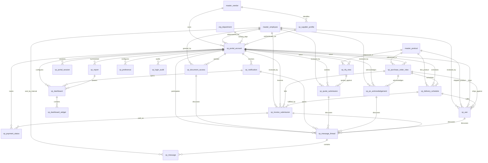

# ERD_24 — Supplier / Vendor Portal

**Document:** Enterprise ERD — Supplier / Vendor Portal Domain  
**Version:** 1.1  
**Status:** Locked — Ready for Sprint 24 Implementation Planning  
**Schema:** `vendor_portal`  
**Table Prefix:** `vp_`  
**Aligned To:** BRD v1.0 · FRD Supplier / Vendor Portal (planning) · Procurement · Inventory · Finance · Quality · Document · Analytics · Integration Hub · SDD v1.1 · DBS v1.1 · Architecture Lock v1.1  
**Functional Requirements:** Supplier / Vendor Portal (enterprise supplier self-service layer; aligned to Procurement / Inventory / Finance / Quality / Document consumption patterns)  
**Classification:** Internal — Confidential  
**Prior Release:** [ERP Core Customer Portal ERD_23](./ERD_23_Customer_Portal.md)  

> **C-01 note:** Party / item identity remains **`master.master_vendor`**, **`master.master_employee`**, and **`master.master_product`**. Vendor Portal **never** invents parallel masters. This module provides **secure self-service access** for external suppliers / vendors — it **consumes** Procurement · Inventory · Finance · Quality · Document · Analytics · Integration Hub · Organization and **never becomes the system of record**. Peers communicate via **services · events · UUID refs** — **never** via peer ORM writes.

---

## 1. Functional Overview (Purpose)

The Supplier / Vendor Portal domain provides the **enterprise external supplier self-service layer** for portal accounts, supplier portal profiles, authenticated sessions, dashboards / widgets, RFQ views, quotation submission envelopes, purchase-order views / acknowledgements, delivery schedules, ASN envelopes, invoice submission envelopes, payment-status projections, document access, notifications / messages, preferences, login audit, and portal operational reports.

This module **consumes existing ERP modules**. It **never** becomes RFQ, quotation, purchase-order, receipt, invoice, payment, quality, document, or vendor-master authority. **`master_vendor` remains party identity (C-01)**, **Procurement remains RFQ / PO / quote / AP-invoice authority**, **Inventory remains receipt authority**, **Finance remains payment / accounting authority**, **Quality remains quality authority**, and **Document remains document authority**.

Portal **depends on** Foundation, Organization, and Master Data. It **consumes existing masters only (C-01)** — **`master_vendor`**, **`master_employee`**, **`master_product`**, and **`org_department`**.

**Finance remains the only accounting system.** Portal **never** ORM-writes `fin_*`. Any portal-initiated fee / access charge (if configured) uses **`finance_journal_id`** after **`PostingService.post_system_journal()`** only.

**Business Tables: 20**  
**Schema: `vendor_portal`**

### Enterprise Vendor Portal Modules (Sprint 24 focus)

| # | Module | Primary Tables | Primary Consumers |
|---|--------|----------------|-------------------|
| 1 | Identity & Access | `vp_portal_account`, `vp_supplier_profile`, `vp_portal_session` | Suppliers · portal admins · procurement |
| 2 | Experience | `vp_dashboard`, `vp_dashboard_widget` | Suppliers · portal managers |
| 3 | Sourcing (consume / envelope) | `vp_rfq_view`, `vp_quote_submission` | Suppliers · procurement |
| 4 | Order Fulfilment | `vp_purchase_order_view`, `vp_po_acknowledgement`, `vp_delivery_schedule`, `vp_asn` | Suppliers · procurement · inventory |
| 5 | Commercial | `vp_invoice_submission`, `vp_payment_status` | Suppliers · finance · procurement |
| 6 | Docs & Comms | `vp_document_access`, `vp_notification`, `vp_message_thread`, `vp_message` | Suppliers · quality · procurement |
| 7 | Personalization & Ops | `vp_preference`, `vp_login_audit`, `vp_report` | Suppliers · portal admins · security |

**PostgreSQL Schema:** `vendor_portal` (Sprint 24 introduction)

### Architectural Position

```text
Foundation (ERD_01) ── Workflow, Audit, RBAC, Platform Notification (unchanged owners)
Organization (ERD_02) ── Company, Branch, Department
Master Data (ERD_03) ── vendor · employee · product (C-01)
Procurement (ERD_06) ── RFQ / QUOTE / PO / PROC INVOICE AUTHORITY (UUID + services only)
Inventory (ERD_07) ── RECEIPT AUTHORITY (ASN → receipt via service / UUID only)
Finance (ERD_04) ── PAYMENT AUTHORITY + PostingService ONLY (no fin_* ORM writes)
Quality (ERD_09) ── QUALITY AUTHORITY (NCR / inspection UUID + response via service)
Document ── DOCUMENT AUTHORITY (access UUID only)
Analytics ── READ-ONLY
Integration Hub ── external portal / IdP / API transport
        ↓
Vendor Portal (ERD_24) ── Account · Session · Dashboard · RFQ/PO Views · Envelopes · Prefs
        ↓
External suppliers / vendors (web / mobile self-service)
```

### API Mount (planned)

**`/api/v1/vendor-portal`** — routers for all aggregates (portal-accounts, supplier-profiles, portal-sessions, dashboards, dashboard-widgets, rfq-views, quote-submissions, purchase-order-views, po-acknowledgements, delivery-schedules, asns, invoice-submissions, payment-statuses, document-accesses, notifications, message-threads, messages, preferences, login-audits, reports).

---

## 2. Scope & Business Rules

### In Scope
- **Vendor portal accounts** and **supplier portal profiles** (linked to `master_vendor`)
- **Portal sessions** and **login audit**
- **Dashboards** and **dashboard widgets**
- **RFQ views** (projected / invited RFQ consume rows)
- **Quotation submission** envelopes mapped to Procurement vendor quotations
- **Purchase order views** and **PO acknowledgements**
- **Delivery schedules** and **ASN** envelopes (advance shipment notice)
- **Invoice submission** envelopes mapped to Procurement / Finance AP path
- **Payment status** projections (Finance / AP payment snapshots)
- **Document access** grants
- **Notifications**, **message threads**, **messages** (including quality-issue response threads)
- **Portal preferences**
- **Portal operational reports**
- Workflow, RBAC, Celery stubs (planning)

### Out of Scope (Phase 2 / Separate)
- Replacing **Procurement** RFQ / quote / PO / invoice ledgers — Portal envelopes / views only
- Replacing **Inventory** receipts / stock — ASN is notice envelope; Inventory remains receipt SoR
- Replacing **Finance** payment / AP / journals
- Replacing **Quality** NCR / inspection / CAPA systems of record
- Full **IdP / SSO product** — Phase 1: account + session shells; Federation via Foundation / Hub later
- Duplicate `vp_vendor` / `vp_employee` / `vp_product` / `vp_department` masters — **forbidden (C-01)**
- Direct ORM writes to any peer business schema
- SQLAlchemy models, Alembic migrations, application code (implementation sprint)

### Business Rules
1. **Portal consumes data only** — never system of record for RFQ, quote, PO, receipt, invoice, payment, quality, documents, or vendor master
2. **C-01:** vendor / employee / product / department resolve via Master Data / Organization only
3. **Procurement** remains RFQ / PO / quote / purchase-invoice authority — portal stores Procurement UUIDs; **no `proc_*` ORM writes**
4. **Inventory** remains receipt authority — `vp_asn` stores inventory / GRN UUID refs after accept; **no `inv_*` ORM writes**
5. **Finance** remains payment authority — `vp_payment_status` stores finance payment / AP UUID; journals **only** via `PostingService.post_system_journal()`
6. **Quality** remains quality authority — quality-issue responses via message / service APIs with `qm_*` UUID; **no `qm_*` ORM writes**
7. **Document** remains document authority — access stores `document_id` UUID only
8. Soft delete + version on mutable `vp_*` tables
9. Numbers company-scoped (`ACC-` / `PRF-` / `SES-` / `DSH-` / `RFQ-` / `QTE-` / `POV-` / `ACK-` / `DLS-` / `ASN-` / `INV-` / `PAY-` / `DOC-` / `NTF-` / `THR-` / `MSG-` / `AUD-` / `RPT-`)
10. Passwords / secrets are **vault / hash refs** — never plaintext credentials in DB
11. Analytics / Integration Hub / peers — UUID / events only — **no peer ORM writes**

### Assumptions
- One `master_vendor` may have one primary `vp_supplier_profile` and one or more `vp_portal_account` users (delegates)
- `vp_rfq_view` / `vp_purchase_order_view` / `vp_payment_status` are **projections / bookmarks**, refreshed from authoritative modules — not operational ledgers
- Quote / PO ack / ASN / invoice submission invoke Procurement / Inventory services and store returned UUIDs
- Quality issue responses use `vp_message_thread` / `vp_message` (and optional document access) linked to Quality UUIDs — no separate quality SoR table in this 20-table set
- Message thread is parent of messages; migration dual-creates both safely

### Dependencies

| Upstream | Tables / Services Used |
|----------|------------------------|
| ERD_01 Foundation | `sec_tenant`, `sec_user`, `wf_definition`, `wf_instance`, platform audit / notification |
| ERD_02 Organization | `org_company`, `org_branch`, `org_department` |
| ERD_03 Master Data | **`master_vendor`**, **`master_employee`**, **`master_product`** |
| Procurement | RFQ / quote / PO / purchase-invoice authority via **service / UUID** |
| Inventory | Receipt authority via **service / UUID** |
| Finance | Payment UUID + **`PostingService.post_system_journal()`** only |
| Quality | NCR / inspection UUID via service — **no Quality ORM writes** |
| Document | Document UUID — **no Document ORM writes** |
| Analytics | Read-only |
| Integration Hub | External IdP / API transport UUID refs |

---

## 3. Table Inventory

| # | Table | Classification | tenant_id | company_id | Soft Delete | Version | Workflow |
|---|-------|----------------|-----------|------------|-------------|---------|----------|
| 1 | `vp_portal_account` | Identity | ✅ | ✅ | ✅ | ✅ | ✅ |
| 2 | `vp_supplier_profile` | Profile | ✅ | ✅ | ✅ | ✅ | ✅ |
| 3 | `vp_portal_session` | Session | ✅ | ✅ | ✅ | ✅ | — |
| 4 | `vp_dashboard` | Config | ✅ | ✅ | ✅ | ✅ | — |
| 5 | `vp_dashboard_widget` | Config Detail | ✅ | ✅ | ✅ | ✅ | — |
| 6 | `vp_rfq_view` | Projection | ✅ | ✅ | ✅ | ✅ | — |
| 7 | `vp_quote_submission` | Portal Envelope | ✅ | ✅ | ✅ | ✅ | ✅ |
| 8 | `vp_purchase_order_view` | Projection | ✅ | ✅ | ✅ | ✅ | — |
| 9 | `vp_po_acknowledgement` | Portal Envelope | ✅ | ✅ | ✅ | ✅ | ✅ |
| 10 | `vp_delivery_schedule` | Schedule | ✅ | ✅ | ✅ | ✅ | — |
| 11 | `vp_asn` | Portal Envelope | ✅ | ✅ | ✅ | ✅ | ✅ |
| 12 | `vp_invoice_submission` | Portal Envelope | ✅ | ✅ | ✅ | ✅ | ✅ |
| 13 | `vp_payment_status` | Projection | ✅ | ✅ | ✅ | ✅ | — |
| 14 | `vp_document_access` | Entitlement | ✅ | ✅ | ✅ | ✅ | ✅ |
| 15 | `vp_notification` | Notification | ✅ | ✅ | ✅ | ✅ | — |
| 16 | `vp_message_thread` | Conversation | ✅ | ✅ | ✅ | ✅ | — |
| 17 | `vp_message` | Message | ✅ | ✅ | ✅ | ✅ | — |
| 18 | `vp_preference` | Preference | ✅ | ✅ | ✅ | ✅ | — |
| 19 | `vp_login_audit` | Security Log | ✅ | ✅ | ✅ | ✅ | — |
| 20 | `vp_report` | Snapshot | ✅ | ✅ | ✅ | ✅ | — |

**Business Tables: 20** · **Schema: `vendor_portal`**

---

## 4. Entity Relationships

### Mermaid ER Diagram



### ASCII Relationship Overview

```text
org_company / org_branch / org_department
master_vendor / master_employee / master_product (C-01)
    └── vp_supplier_profile ── master_vendor
            └── vp_portal_account
                    ├── vp_portal_session
                    ├── vp_preference
                    ├── vp_login_audit
                    ├── vp_dashboard
                    │      ├── vp_dashboard_widget
                    │      └── vp_report
                    ├── vp_notification
                    │      └── vp_dashboard
                    ├── vp_rfq_view ── proc_rfq_header_id (UUID — Procurement SoR)
                    │       └── vp_quote_submission ── proc_vendor_quotation_id (UUID — Procurement SoR)
                    ├── vp_purchase_order_view ── proc_order_header_id (UUID — Procurement SoR)
                    │      ├── vp_po_acknowledgement
                    │      ├── vp_delivery_schedule
                    │      │      ├── vp_asn
                    │      │      └── vp_invoice_submission ── proc_invoice_header_id (UUID — Procurement SoR)
                    │      │             └── vp_payment_status ── finance_payment_id (UUID — Finance SoR)
                    │      │                       └── finance_journal_id (PostingService only, if fee posted)
                    ├── vp_document_access ── document_id (UUID — Document SoR)
                    └── vp_report

Quality responses (no dedicated SoR table):
    vp_message_thread.related_entity_type = quality_issue
      + qm_ncr_id / qm_incoming_inspection_id (UUID — Quality SoR; no FK)

Optional UUID-only (no FK): proc_rfq_header_id, proc_rfq_vendor_id, proc_vendor_quotation_id,
  proc_order_header_id, proc_order_line_id, proc_grn_header_id, proc_invoice_header_id,
  inventory_receipt_id, finance_payment_id, finance_ap_invoice_id, finance_journal_id,
  document_id, qm_ncr_id, qm_incoming_inspection_id, qm_capa_id, bi_dashboard_ref_id,
  int_connector_id, sales_*, crm_*, hr_*, pay_*, project_*, asset_*, mfg_*, portal_pt_*
```

---

## 5. Detailed Table Definitions

### 5.1 `vp_portal_account`

| Column | Notes |
|--------|-------|
| `account_number` | `ACC-YYYY-NNNNNN` |
| `login_email` | UK `(company_id, login_email)` |
| `vendor_id` | FK → `master_vendor` |
| `supplier_profile_id` | FK → `vp_supplier_profile` |
| `display_name` | VARCHAR |
| `credential_vault_ref` | VARCHAR — hash / vault path only |
| `status` | draft, submitted, approved, active, locked, suspended, retired |
| `owner_employee_id` | FK optional → `master_employee` (internal admin) |
| `department_id` | FK optional → `org_department` |
| `workflow_*` | Account approval |
| **UK:** `(company_id, account_number)` |

---

### 5.2 `vp_supplier_profile`

| Column | Notes |
|--------|-------|
| `profile_number` | `PRF-YYYY-NNNNNN` |
| `vendor_id` | FK → `master_vendor` — **C-01** |
| `display_name` / `preferred_language` / `timezone` | — |
| `primary_contact_json` / `remittance_contact_json` | JSONB (non-authoritative contact prefs) |
| `capabilities_json` | JSONB optional (categories / certifications hints — not master) |
| `status` | draft, submitted, approved, active, inactive |
| `workflow_*` | Profile approval (may share account path or admin update) |
| **UK:** `(company_id, profile_number)` · soft UK `(company_id, vendor_id)` when active |
| **Rule:** Does not replace `master_vendor` |

---

### 5.3 `vp_portal_session`

| Column | Notes |
|--------|-------|
| `session_number` | `SES-YYYY-NNNNNN` |
| `portal_account_id` | FK → `vp_portal_account` |
| `started_at` / `expires_at` / `ended_at` | TIMESTAMPTZ |
| `ip_address` / `user_agent` | VARCHAR |
| `status` | active, expired, revoked |
| **UK:** `(company_id, session_number)` |

---

### 5.4 `vp_dashboard`

| Column | Notes |
|--------|-------|
| `dashboard_number` | `DSH-YYYY-NNNNNN` |
| `portal_account_id` | FK → `vp_portal_account` |
| `dashboard_code` / `dashboard_name` | — |
| `layout_json` | JSONB |
| `is_default` | BOOLEAN |
| `status` | draft, active, archived |
| **UK:** `(company_id, dashboard_number)` |

---

### 5.5 `vp_dashboard_widget`

| Column | Notes |
|--------|-------|
| `dashboard_id` | FK → `vp_dashboard` |
| `widget_type` | rfq_open, quote_status, po_open, delivery_due, asn_status, invoice_status, payment_status, quality_open, document_list, notification_feed, custom |
| `title` | VARCHAR |
| `config_json` | JSONB — query keys / UUID filters only |
| `sequence_no` | INT |
| `status` | active, hidden |
| **UK soft:** `(dashboard_id, sequence_no)` |

---

### 5.6 `vp_rfq_view`

| Column | Notes |
|--------|-------|
| `view_number` | `RFQ-YYYY-NNNNNN` |
| `portal_account_id` | FK → `vp_portal_account` |
| `vendor_id` | FK → `master_vendor` |
| `proc_rfq_header_id` | UUID — **Procurement SoR; no FK** |
| `proc_rfq_vendor_id` | UUID optional — invitation link |
| `rfq_ref` / `rfq_status_text` | VARCHAR snapshots |
| `product_id` | FK optional → `master_product` (primary line hint) |
| `response_due_at` | TIMESTAMPTZ |
| `last_synced_at` | TIMESTAMPTZ |
| `status` | visible, hidden, stale, closed |
| **UK:** `(company_id, view_number)` · soft UK `(portal_account_id, proc_rfq_header_id)` |
| **Rule:** Projection only — never mutates Procurement RFQ |

---

### 5.7 `vp_quote_submission`

| Column | Notes |
|--------|-------|
| `submission_number` | `QTE-YYYY-NNNNNN` |
| `portal_account_id` | FK → `vp_portal_account` |
| `vendor_id` | FK → `master_vendor` |
| `rfq_view_id` | FK optional → `vp_rfq_view` |
| `proc_rfq_header_id` | UUID — Procurement RFQ ref |
| `proc_vendor_quotation_id` | UUID — **Procurement SoR after accept; no FK** |
| `vendor_quote_reference` | VARCHAR |
| `currency_code` / `total_amount` | snapshot fields |
| `payload_json` | JSONB — line proposals for service handoff |
| `reviewed_by_employee_id` | FK optional → `master_employee` |
| `status` | draft, submitted, under_review, accepted, rejected, withdrawn |
| `workflow_*` | Quote submission approval |
| **UK:** `(company_id, submission_number)` |
| **Rule:** Create/update authority remains Procurement via service |

---

### 5.8 `vp_purchase_order_view`

| Column | Notes |
|--------|-------|
| `view_number` | `POV-YYYY-NNNNNN` |
| `portal_account_id` | FK → `vp_portal_account` |
| `vendor_id` | FK → `master_vendor` |
| `proc_order_header_id` | UUID — **Procurement SoR; no FK** |
| `po_ref` / `po_status_text` | VARCHAR snapshots |
| `product_id` | FK optional → `master_product` |
| `ordered_at` / `required_at` | TIMESTAMPTZ |
| `last_synced_at` | TIMESTAMPTZ |
| `status` | visible, hidden, stale, closed |
| **UK:** `(company_id, view_number)` · soft UK `(portal_account_id, proc_order_header_id)` |
| **Rule:** Projection only — never mutates Procurement PO |

---

### 5.9 `vp_po_acknowledgement`

| Column | Notes |
|--------|-------|
| `ack_number` | `ACK-YYYY-NNNNNN` |
| `portal_account_id` | FK → `vp_portal_account` |
| `purchase_order_view_id` | FK → `vp_purchase_order_view` |
| `proc_order_header_id` | UUID — Procurement PO ref |
| `ack_type` | accept, accept_with_changes, reject |
| `confirmed_delivery_date` | DATE optional |
| `change_notes` | TEXT |
| `reviewed_by_employee_id` | FK optional → `master_employee` |
| `status` | draft, submitted, acknowledged, disputed, cancelled |
| `workflow_*` | PO acknowledgement |
| **UK:** `(company_id, ack_number)` |
| **Rule:** Acknowledgement envelope only — PO authority remains Procurement |

---

### 5.10 `vp_delivery_schedule`

| Column | Notes |
|--------|-------|
| `schedule_number` | `DLS-YYYY-NNNNNN` |
| `portal_account_id` | FK → `vp_portal_account` |
| `purchase_order_view_id` | FK → `vp_purchase_order_view` |
| `proc_order_header_id` | UUID — Procurement PO ref |
| `proc_order_line_id` | UUID optional |
| `product_id` | FK optional → `master_product` |
| `promised_qty` | NUMERIC |
| `promised_date` | DATE |
| `ship_from_json` | JSONB optional |
| `status` | planned, confirmed, partially_shipped, completed, cancelled |
| **UK:** `(company_id, schedule_number)` |
| **Rule:** Supplier commitment surface — does not create Inventory receipts |

---

### 5.11 `vp_asn`

| Column | Notes |
|--------|-------|
| `asn_number` | `ASN-YYYY-NNNNNN` |
| `portal_account_id` | FK → `vp_portal_account` |
| `purchase_order_view_id` | FK → `vp_purchase_order_view` |
| `delivery_schedule_id` | FK optional → `vp_delivery_schedule` |
| `proc_order_header_id` | UUID — Procurement PO ref |
| `product_id` | FK optional → `master_product` |
| `ship_qty` / `pack_count` | NUMERIC / INT |
| `carrier_name` / `tracking_number` | VARCHAR |
| `shipped_at` / `eta_at` | TIMESTAMPTZ |
| `lines_json` | JSONB — ASN line payload for service handoff |
| `proc_grn_header_id` | UUID optional — after GRN created |
| `inventory_receipt_id` | UUID optional — **Inventory SoR; no FK** |
| `reviewed_by_employee_id` | FK optional → `master_employee` |
| `status` | draft, submitted, approved, in_transit, received_snapshot, cancelled, rejected |
| `workflow_*` | ASN approval |
| **UK:** `(company_id, asn_number)` |
| **Rule:** Advance notice envelope — Inventory remains receipt authority |

---

### 5.12 `vp_invoice_submission`

| Column | Notes |
|--------|-------|
| `submission_number` | `INV-YYYY-NNNNNN` |
| `portal_account_id` | FK → `vp_portal_account` |
| `vendor_id` | FK → `master_vendor` |
| `purchase_order_view_id` | FK optional → `vp_purchase_order_view` |
| `proc_order_header_id` | UUID optional |
| `vendor_invoice_reference` | VARCHAR |
| `invoice_date` | DATE |
| `currency_code` / `total_amount` / `tax_amount` | snapshot fields |
| `payload_json` | JSONB — lines / attachments metadata for service handoff |
| `proc_invoice_header_id` | UUID — **Procurement SoR after accept; no FK** |
| `finance_ap_invoice_id` | UUID optional — Finance AP ref |
| `document_id` | UUID optional — supporting PDF via Document |
| `reviewed_by_employee_id` | FK optional → `master_employee` |
| `status` | draft, submitted, under_review, accepted, rejected, withdrawn |
| `workflow_*` | Invoice submission approval |
| **UK:** `(company_id, submission_number)` |
| **Rule:** Envelope only — Procurement / Finance remain invoice authorities |

---

### 5.13 `vp_payment_status`

| Column | Notes |
|--------|-------|
| `status_number` | `PAY-YYYY-NNNNNN` |
| `portal_account_id` | FK → `vp_portal_account` |
| `vendor_id` | FK → `master_vendor` |
| `invoice_submission_id` | FK optional → `vp_invoice_submission` |
| `proc_invoice_header_id` | UUID optional |
| `finance_ap_invoice_id` | UUID optional |
| `finance_payment_id` | UUID — **Finance SoR; no FK** |
| `payment_ref` / `amount_paid` / `currency_code` | snapshot fields |
| `paid_at` / `due_at` | TIMESTAMPTZ |
| `finance_journal_id` | UUID optional — after **PostingService** (e.g. portal fee) |
| `last_synced_at` | TIMESTAMPTZ |
| `status` | visible, pending_snapshot, paid_snapshot, partial_snapshot, overdue_snapshot, stale, hidden |
| **UK:** `(company_id, status_number)` |
| **Rule:** Projection only — never mutates Finance payments via ORM |

---

### 5.14 `vp_document_access`

| Column | Notes |
|--------|-------|
| `access_number` | `DOC-YYYY-NNNNNN` |
| `portal_account_id` | FK → `vp_portal_account` |
| `document_id` | UUID — **Document SoR; no FK** |
| `access_level` | view, download |
| `related_entity_type` | rfq, quote, po, asn, invoice, quality_issue, general |
| `related_entity_id` | UUID optional |
| `granted_by_employee_id` | FK → `master_employee` |
| `granted_at` / `expires_at` | TIMESTAMPTZ |
| `status` | draft, submitted, approved, active, revoked, expired |
| `workflow_*` | Document access approval (optional; may reuse admin path) |
| **UK:** `(company_id, access_number)` |

---

### 5.15 `vp_notification`

| Column | Notes |
|--------|-------|
| `notification_number` | `NTF-YYYY-NNNNNN` optional if numbered |
| `portal_account_id` | FK → `vp_portal_account` |
| `notification_type` | rfq_invite, quote_decision, po_issued, po_ack_required, delivery_reminder, asn_update, invoice_decision, payment_update, quality_issue, document_shared, message, system |
| `title` / `body` | — |
| `related_entity_type` / `related_entity_id` | VARCHAR / UUID |
| `read_at` | TIMESTAMPTZ |
| `delivery_status` | pending, sent, failed, read |
| `status` | active, archived |
| **UK soft:** `(company_id, notification_number)` when numbered |

---

### 5.16 `vp_message_thread`

| Column | Notes |
|--------|-------|
| `thread_number` | `THR-YYYY-NNNNNN` |
| `portal_account_id` | FK → `vp_portal_account` |
| `subject` | VARCHAR |
| `related_entity_type` | quote_submission, po_acknowledgement, asn, invoice_submission, document_access, quality_issue, rfq_view, purchase_order_view, general |
| `related_entity_id` | UUID optional |
| `qm_ncr_id` | UUID optional — **Quality SoR; no FK** |
| `qm_incoming_inspection_id` | UUID optional |
| `status` | open, waiting, closed |
| **UK:** `(company_id, thread_number)` |
| **Rule:** Quality issue **responses** live here as supplier replies — Quality module remains SoR |

---

### 5.17 `vp_message`

| Column | Notes |
|--------|-------|
| `message_number` | `MSG-YYYY-NNNNNN` |
| `message_thread_id` | FK → `vp_message_thread` |
| `sender_account_id` | FK optional → `vp_portal_account` |
| `sender_employee_id` | FK optional → `master_employee` |
| `body` | TEXT |
| `sent_at` | TIMESTAMPTZ |
| `status` | sent, delivered, read, deleted |
| **UK:** `(company_id, message_number)` |

---

### 5.18 `vp_preference`

| Column | Notes |
|--------|-------|
| `portal_account_id` | FK → `vp_portal_account` |
| `preference_key` | UK `(portal_account_id, preference_key)` |
| `preference_value_json` | JSONB |
| `status` | active |

---

### 5.19 `vp_login_audit`

| Column | Notes |
|--------|-------|
| `audit_number` | `AUD-YYYY-NNNNNN` |
| `portal_account_id` | FK optional → `vp_portal_account` |
| `event_type` | login_success, login_failure, logout, lockout, password_reset |
| `occurred_at` | TIMESTAMPTZ |
| `ip_address` / `user_agent` | VARCHAR |
| `status` | recorded |
| **UK:** `(company_id, audit_number)` |

---

### 5.20 `vp_report`

| Column | Notes |
|--------|-------|
| `report_code` | UK `(company_id, report_code)` |
| `report_type` | active_suppliers, login_failures, rfq_response_rate, quote_volume, po_ack_latency, asn_on_time, invoice_submission_volume, payment_aging_snapshot, quality_response_latency, session_metrics |
| `period_start` / `period_end` | DATE |
| `metrics_json` | JSONB |
| `generated_at` | TIMESTAMPTZ |
| `status` | draft, finalized |

---

## 6. Primary Keys / Foreign Keys (summary)

**PKs:** `pk_vp_*` on `id` for all 20 tables.

**FKs (authoritative only):**
- `vendor_id` → `master.master_vendor`
- `*_employee_id` → `master.master_employee`
- optional `product_id` → `master.master_product`
- `department_id` → `organization.org_department`
- Vendor-portal-internal FKs among `vp_*` parents
- `workflow_instance_id` → `foundation.wf_instance`

**No FK to:** `proc_*`, `inv_*`, `fin_*`, `qm_*`, `doc_*`, `bi_*`, `int_*`, …  
**Finance:** `finance_journal_id` UUID only; writes **only** via `PostingService.post_system_journal()`.  
**Peers:** UUID refs only — **no peer ORM writes**.

---

## 7. Naming Convention

| Artifact | Convention |
|----------|------------|
| Schema | `vendor_portal` |
| Tables | `vp_*` |
| ORM | `Vp*` |
| Package | `modules/vendor_portal` |
| API | `/api/v1/vendor-portal` |
| Permissions | `vendor_portal.*` |
| Workflows | `VP_*` |
| Celery | `vendor_portal.*` |

| Number | Format |
|--------|--------|
| Account / Profile / Session / Dashboard / RFQ view / Quote / PO view / Ack / Delivery / ASN / Invoice / Payment / Document / Notification / Thread / Message / Audit | `ACC-` `PRF-` `SES-` `DSH-` `RFQ-` `QTE-` `POV-` `ACK-` `DLS-` `ASN-` `INV-` `PAY-` `DOC-` `NTF-` `THR-` `MSG-` `AUD-` + `YYYY-NNNNNN` |

---

## 8. Status Lifecycles (selected)

| Entity | Statuses |
|--------|----------|
| Portal Account | draft → submitted → approved → active ↔ locked/suspended → retired |
| Supplier Profile | draft → submitted → approved → active ↔ inactive |
| Session | active → expired \| revoked |
| Dashboard | draft → active → archived |
| Widget | active ↔ hidden |
| RFQ / PO View | visible ↔ hidden \| stale \| closed |
| Quote Submission | draft → submitted → under_review → accepted \| rejected \| withdrawn |
| PO Acknowledgement | draft → submitted → acknowledged \| disputed \| cancelled |
| Delivery Schedule | planned → confirmed → partially_shipped → completed \| cancelled |
| ASN | draft → submitted → approved → in_transit → received_snapshot \| rejected \| cancelled |
| Invoice Submission | draft → submitted → under_review → accepted \| rejected \| withdrawn |
| Payment Status | visible ↔ pending/paid/partial/overdue_snapshot \| stale \| hidden |
| Document Access | draft → submitted → approved → active → revoked \| expired |
| Notification | active → archived |
| Message Thread | open → waiting → closed |
| Message | sent → delivered → read \| deleted |
| Preference | active |
| Login Audit | recorded |
| Report | draft → finalized |

---

## 9. Workflow Matrix

| Workflow Code | Document | Path |
|---------------|----------|------|
| `VP_ACCOUNT_APPROVAL` | Portal Account | Supplier User → Procurement Manager → Vendor Portal Admin |
| `VP_QUOTE_SUBMISSION` | Quote Submission | Supplier User → Procurement Manager → Vendor Portal Admin |
| `VP_PO_ACKNOWLEDGEMENT` | PO Acknowledgement | Supplier User → Procurement Manager |
| `VP_INVOICE_SUBMISSION` | Invoice Submission | Supplier User → Procurement Manager → Vendor Portal Admin |
| `VP_ASN_APPROVAL` | ASN | Supplier User → Procurement Manager → Quality Coordinator (optional) → Vendor Portal Admin |

Seed only; instances on Foundation `wf_instance`. `is_parallel` on **`wf_step`** only.

---

## 10. RBAC Matrix

**Namespace:** `vendor_portal.*`  
**Roles** (`status='active'`): `VENDOR_PORTAL_ADMIN`, `PROCUREMENT_MANAGER`, `SUPPLIER_USER`, `QUALITY_COORDINATOR`

| Resource | Permissions (planned) |
|----------|------------------------|
| `vendor_portal.account` / `vendor_portal.profile` | read, create, update, submit, approve, lock |
| `vendor_portal.session` / `vendor_portal.login_audit` | read, revoke |
| `vendor_portal.dashboard` / `vendor_portal.widget` | read, create, update |
| `vendor_portal.rfq_view` / `vendor_portal.purchase_order_view` / `vendor_portal.payment_status` | read, sync |
| `vendor_portal.quote_submission` | read, create, submit, update |
| `vendor_portal.po_acknowledgement` | read, create, submit, update |
| `vendor_portal.delivery_schedule` | read, create, update |
| `vendor_portal.asn` | read, create, submit, approve |
| `vendor_portal.invoice_submission` | read, create, submit, update |
| `vendor_portal.document_access` | read, create, submit, approve, revoke |
| `vendor_portal.notification` / `vendor_portal.message` / `vendor_portal.thread` | read, create, update, acknowledge |
| `vendor_portal.preference` | read, create, update |
| `vendor_portal.report` | read, export |
| `vendor_portal.quality_response` | read, create, update (via message thread + Quality UUID) |

---

## 11. Migration Plan

Prior Alembic head: **`0442_seed_portal_workflows`**.

Revision budget **`0443`–`0464` (22 revisions)**. Schema + 20 tables + permissions + workflows = 23 logical steps → **`vp_message_thread` and `vp_message` share one migration** (parent thread created with messages).

| Order | Revision ID (≤32 chars) | Tables / Actions |
|-------|-------------------------|------------------|
| 443 | `0443_create_vendor_portal_schema` | schema `vendor_portal` |
| 444 | `0444_vp_portal_account` | `vp_portal_account` |
| 445 | `0445_vp_supplier_profile` | `vp_supplier_profile` |
| 446 | `0446_vp_portal_session` | `vp_portal_session` |
| 447 | `0447_vp_dashboard` | `vp_dashboard` |
| 448 | `0448_vp_dashboard_widget` | `vp_dashboard_widget` |
| 449 | `0449_vp_rfq_view` | `vp_rfq_view` |
| 450 | `0450_vp_quote_submission` | `vp_quote_submission` |
| 451 | `0451_vp_purchase_order_view` | `vp_purchase_order_view` |
| 452 | `0452_vp_po_acknowledgement` | `vp_po_acknowledgement` |
| 453 | `0453_vp_delivery_schedule` | `vp_delivery_schedule` |
| 454 | `0454_vp_asn` | `vp_asn` |
| 455 | `0455_vp_invoice_submission` | `vp_invoice_submission` |
| 456 | `0456_vp_payment_status` | `vp_payment_status` |
| 457 | `0457_vp_document_access` | `vp_document_access` |
| 458 | `0458_vp_notification` | `vp_notification` |
| 459 | `0459_vp_thread_and_message` | `vp_message_thread`, `vp_message` |
| 460 | `0460_vp_preference` | `vp_preference` |
| 461 | `0461_vp_login_audit` | `vp_login_audit` |
| 462 | `0462_vp_report` | `vp_report` |
| 463 | `0463_seed_vp_permissions` | RBAC |
| 464 | `0464_seed_vendor_portal_workflows` | Workflows |

**Planned head:** `0464_seed_vendor_portal_workflows`

> **Note:** Inventory listing order places `vp_message_thread` before `vp_message` for catalog numbering; migration **0459** creates **thread then message** to honor FK parenthood. Implementation may create `vp_supplier_profile` before wiring non-null `supplier_profile_id` on account (nullable-then-backfill or dual migration order within sprint planning) without changing the 20-table set.

### Celery task stubs (planning)

| Task | Purpose |
|------|---------|
| `vendor_portal.session_expiry_sweeper` | Expire / revoke stale sessions |
| `vendor_portal.rfq_view_sync` | Refresh RFQ view projections from Procurement |
| `vendor_portal.po_view_sync` | Refresh PO view projections from Procurement |
| `vendor_portal.payment_status_sync` | Refresh payment projections from Finance |
| `vendor_portal.notification_dispatcher` | Deliver pending portal notifications |
| `vendor_portal.login_audit_retention` | Archive / prune old login audit rows |
| `vendor_portal.asn_status_poller` | Sync ASN envelope status from Inventory / GRN |
| `vendor_portal.quality_issue_poller` | Sync open quality UUID refs into notification / threads |

---

## 12. Cross Module Integration & Architecture Validation

### Upstream (Vendor Portal Consumes)

| Module | Pattern |
|--------|---------|
| Foundation | tenant, user, workflow, audit, notification |
| Organization | company, branch, **department** FK |
| Master Data | **vendor · employee · product** (C-01) |
| Procurement | **RFQ / Quote / PO / purchase-invoice authority** — UUID + services — **no `proc_*` ORM writes** |
| Inventory | **Receipt authority** — ASN → receipt / GRN UUID — **no Inventory ORM writes** |
| Finance | **Payment authority** + **`PostingService.post_system_journal()`** — **no `fin_*` ORM writes** |
| Quality | **Quality authority** — NCR / inspection UUID + response messages — **no `qm_*` ORM writes** |
| Document | **Document authority** — document UUID — **no Document ORM writes** |
| Analytics | **Read-only** report / widget refs |
| Integration Hub | External IdP / API transport — UUID only |
| Sales / CRM / HR / Payroll / Project / Asset / Manufacturing / Customer Portal | UUID / event only if needed — **no peer ORM writes** |

### Downstream

| Consumer | Pattern |
|----------|---------|
| External suppliers / vendors | Web / mobile self-service APIs |
| Procurement | Receives quote / PO-ack / invoice envelopes via Procurement APIs |
| Inventory | Receives ASN notices via Inventory / GRN services |
| Quality | Receives supplier responses via Quality service APIs |
| Vendor Portal Admins / Procurement Managers / Quality Coordinators | Operate accounts, reviews, quality threads |

### Hard Rules

| Rule | Enforcement |
|------|-------------|
| C-01 | Masters only; no duplicate parties / products |
| Portal not system of record | Views / envelopes / prefs only |
| Procurement / Inventory / Finance / Quality / Document authorities preserved | UUID + services only |
| Finance posting | Only `PostingService.post_system_journal()` |
| No peer ORM writes | UUID / services / events / Hub only |
| Architecture Lock v1.1 | Modular Monolith · Clean Architecture · DDD preserved |

---

## 13. Phase Gate Checklist

| # | Gate Criterion | Status |
|---|----------------|--------|
| 1 | Business tables = **20**; schema = **`vendor_portal`** | ✅ |
| 2 | Prefix `vp_` defined | ✅ |
| 3 | Aligned to Supplier / Vendor Portal purpose | ✅ |
| 4 | Consumes masters only (C-01): vendor · employee · product · department | ✅ |
| 5 | Finance only via PostingService; no fin_* ORM writes | ✅ |
| 6 | Portal consumes only; Procurement/Inventory/Finance/Quality/Document remain authorities | ✅ |
| 7 | Analytics read-only; Integration Hub transport; UUID-only peers; no peer ORM writes | ✅ |
| 8 | Migration order `0443`–`0464`, revision IDs ≤ 32 chars; planned head `0464_seed_vendor_portal_workflows` | ✅ |
| 9 | Workflows (`VP_*`) + RBAC (`vendor_portal.*`) + API mount + Celery stubs documented | ✅ |
| 10 | Architecture Lock v1.1 preserved; no prior module redesign | ✅ |

### Validation Checklist (design)

| Check | Result |
|-------|--------|
| Exactly 20 business tables listed | ✅ |
| Required table names match 1–20 | ✅ |
| Mermaid ER includes all relationships + master refs | ✅ |
| ASCII relationship overview present | ✅ |
| Cross-module integrations documented | ✅ |
| Permissions namespace `vendor_portal.*` + suggested roles | ✅ |
| Workflow seeds: Account / Quote / PO Ack / Invoice / ASN | ✅ |
| No implementation / migrations / code in this ERD | ✅ |

### ERD Phase Gate — Supplier / Vendor Portal Summary

| Metric | Value |
|--------|-------|
| Business Tables | **20** |
| Schema | **`vendor_portal`** |
| Prefix | `vp_` |
| API mount | `/api/v1/vendor-portal` |
| Migration range | `0443` – `0464` |
| Prior head | `0442_seed_portal_workflows` |
| Planned head | `0464_seed_vendor_portal_workflows` |
| Document Status | **Locked — Ready for Sprint 24 Implementation Planning** |

---

## 14. Document Control

| Version | Date | Change |
|---------|------|--------|
| 1.0 | 2026-07-17 | Initial ERD_24 Supplier / Vendor Portal for Sprint 24 architecture review |
| 1.1 | 2026-07-17 | Editorial lock for Sprint 24 implementation planning. |

---

**ERD_24 Supplier / Vendor Portal is locked and ready for Sprint 24 implementation planning.**
