# Enterprise ERP Platform — Master Architecture Document

**Document type:** Solution Architecture & Shipping Master  
**Product:** Enterprise ERP Platform (ConnectPlus-aligned portfolio)  
**Baseline:** Architecture Lock v1.1 · ADR-001 · ADR-002  
**Classification:** Internal — Confidential  
**Audience:** Engineering, Architecture, DevOps, Product  

This is the **master architecture document** for the full ERP portfolio. It consolidates system design, current locked technology stack, module features and flows, Mermaid architecture diagrams, and shipping strategies for **on-premise** and **AWS**. Calendar timelines and month-based phase dates are intentionally omitted.

---

## Contents

| # | Section |
|---|---------|
| 1 | [Executive Summary](#1-executive-summary) |
| 2 | [Product Scope and Module Map](#2-product-scope-and-module-map) |
| 3 | [Architectural Principles](#3-architectural-principles) |
| 4 | [High-Level System Architecture](#4-high-level-system-architecture) |
| 5 | [Technology Stack (Current / Locked)](#5-technology-stack-current--locked) |
| 6 | [Clean Architecture and Request Flow](#6-clean-architecture-and-request-flow) |
| 7 | [Multi-Tenancy and Security](#7-multi-tenancy-and-security) |
| 8 | [Data and Storage Architecture](#8-data-and-storage-architecture) |
| 9 | [Platform Engines](#9-platform-engines) |
| 10 | [Cross-Domain Business Flows](#10-cross-domain-business-flows) |
| 11 | [Module Catalog — Full Portfolio](#11-module-catalog--full-portfolio) |
| 12 | [Roadmap Platform Extensions](#12-roadmap-platform-extensions) |
| 13 | [Integration Strategy](#13-integration-strategy) |
| 14 | [On-Premise Deployment Plan](#14-on-premise-deployment-plan) |
| 15 | [AWS Deployment Plan](#15-aws-deployment-plan) |
| 16 | [DevOps, Environments, and CI/CD](#16-devops-environments-and-cicd) |
| 17 | [Quality, Observability, and Compliance](#17-quality-observability-and-compliance) |
| 18 | [Key Risks and Mitigations](#18-key-risks-and-mitigations) |
| 19 | [Document Hierarchy and Compliance](#19-document-hierarchy-and-compliance) |

---

## 1. Executive Summary

The Enterprise ERP Platform is a **modular monolith** ERP ecosystem covering foundation platform services and twenty-plus business domains — Finance, CRM, Sales, Procurement, Inventory, Manufacturing, Quality, HR, Payroll, Projects, Assets, Service, Helpdesk, Documents, GRC, Analytics, Integration, Ecommerce, Portal, Marketing, and employee self-service — with roadmap extensions for AI Assistant / Virtual E.A., Licensing, and Backup & DR.

Every module shares:

- One identity and RBAC model  
- One design system (Next.js + Tailwind + ShadCN)  
- One API surface (`/api/v1`)  
- One transactional database (PostgreSQL) with tenant isolation  
- Shared Workflow, Notification, Audit, and Integration engines  

**Central decisions (locked):**

| Decision | Choice |
|----------|--------|
| Architecture | Modular monolith · Clean Architecture · DDD (ADR-001) |
| Backend | Python 3.13+ · FastAPI · SQLAlchemy 2 · Alembic · Pydantic v2 · Celery (ADR-002) |
| Frontend | Next.js 16+ · TypeScript · Tailwind · ShadCN · Zod |
| OLTP | PostgreSQL |
| Cache / broker | Redis · RabbitMQ |
| Search / objects | OpenSearch · MinIO or AWS S3 |
| Deploy artifact | Docker images (API, worker, beat, web, employee-app) |
| Cloud primary | AWS (EKS/ECS, RDS, S3, ElastiCache, OpenSearch) |
| On-prem | Same containers · Compose / K3s / customer Kubernetes |

SaaS (cloud or private datacenter) and on-premise share **one codebase and one image pipeline**; configuration and infrastructure topology differ by destination.

---

## 2. Product Scope and Module Map

### 2.1 Domain grouping

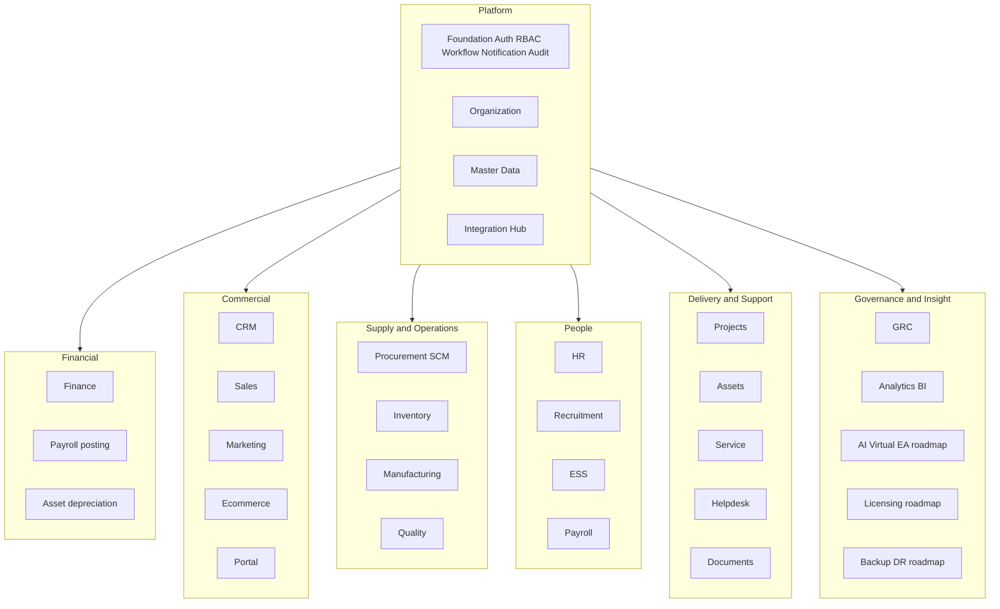

### 2.2 Module portfolio (summary)

| Domain | Modules | Shared core entities |
|--------|---------|----------------------|
| Platform | Foundation, Email/Notifications, Organization, Master Data, Integration Hub | Tenant, user, role, company, branch, employee/customer/vendor/product masters |
| Financial | Finance, Payroll (GL side), Assets (depreciation) | COA, journal, period, cost center, tax, currency |
| Commercial | CRM, Sales, Marketing, Ecommerce, Portal | Account, lead, opportunity, order, invoice, campaign |
| Supply | Procurement, Inventory, Manufacturing, Quality, SCM (ops) | Item, vendor, UoM, BOM, WO, inspection, GRN |
| People | HR, Recruitment, ESS, Payroll | Employee, attendance, leave, salary structure |
| Delivery | Projects, Assets, Service, Helpdesk, DMS | Project, asset, ticket, document, SLA |
| Insight | Analytics, GRC, AI/EA (roadmap), Licensing (roadmap), Backup/DR (roadmap) | KPI, policy, risk, entitlement, backup job |

### 2.3 Sell-together and sell-alone

Every module must satisfy:

1. **Licensing contract** — entitlement service (roadmap) disables unlicensed APIs, UI, and jobs (not merely hides menus).  
2. **Degradation contract** — defined behavior when a sibling module is absent (e.g. Sales exports invoices when Finance is not licensed).  

---

## 3. Architectural Principles

| Principle | Meaning |
|-----------|---------|
| Modular monolith first | One deployable API; strict module packages; extract services only with evidence |
| Clean Architecture | Router → Service → Repository → DB; domain free of ORM |
| DDD bounded contexts | No cross-module table access; integrate via APIs / events / engines |
| API-first | Versioned REST/OpenAPI before UI |
| Multi-tenant by construction | `tenant_id` (and company/branch) on transactional data |
| Soft delete + audit | No physical DELETE on business tables; audit columns mandatory |
| Config over customization | Workflows, settings, custom fields — not forks |
| One artifact, many destinations | Same images for AWS, private cloud, and on-prem |
| Engines mandatory | Workflow, Notification, Audit, Integration must not be bypassed |

**Forbidden without EARB/ADR:** NestJS, Prisma, MongoDB as primary OLTP, business logic in routers, UI→DB access, cross-module SQL, manual production schema changes.

---

## 4. High-Level System Architecture

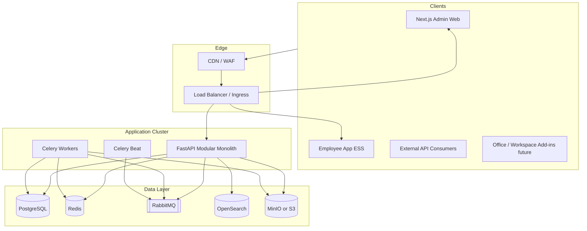

### Layer responsibilities

| Layer | Responsibility |
|-------|----------------|
| Clients | Admin web, employee ESS app, integrators |
| Edge | TLS termination, WAF, rate limiting, routing |
| API | AuthN/Z, tenancy middleware, domain routers/services |
| Workers | Email delivery, async jobs, scheduled syncs |
| Data | OLTP, cache/sessions, broker, search, object storage |

---

## 5. Technology Stack (Current / Locked)

Aligned with [ERP Architecture Lock Report v1.1](../05_ARCHITECTURE_LOCK/ERP_Architecture_Lock_Report_v1.1.md).

### 5.1 Stack at a glance

| Layer | Primary choice | Role |
|-------|----------------|------|
| Frontend (admin) | Next.js 16+ · React · TypeScript · Tailwind · ShadCN · Zod | ERP admin shell and module UIs |
| Frontend (ESS) | Next.js employee-app | Employee self-service |
| Backend API | Python 3.13+ · FastAPI · Uvicorn | HTTP API modular monolith |
| Prod process mgr | Gunicorn + Uvicorn workers | Production API serving |
| ORM / migrations | SQLAlchemy 2.0 · Alembic | Infrastructure layer only |
| Validation | Pydantic v2 | Request/response schemas |
| Async jobs | Celery · Celery Beat · RabbitMQ | Notifications, scheduled work |
| Cache / sessions | Redis | Cache, RBAC cache, sessions, Celery backend |
| OLTP | PostgreSQL | Single transactional standard |
| Search | OpenSearch | Full-text / analytics indexing |
| Object storage | MinIO (on-prem/local) · AWS S3 (cloud) | Documents, exports, backups |
| Auth federation | Microsoft Entra ID (OIDC) · JWT sessions | SSO + local auth / MFA |
| Email | Microsoft Graph adapter | Outbound notification email |
| Containers | Docker | `api`, `worker`, `beat`, `web`, `employee-app` |
| Orchestration | Kubernetes Ready · Terraform Ready | Target production |
| Design system | `design-system/enterprise-erp-platform/MASTER.md` | Data-dense · Swiss minimal |

### 5.2 Repository layout

```text
enterprise-erp-platform/
├── apps/api/          # FastAPI modular monolith
├── apps/web/          # Next.js admin
├── apps/employee-app/ # Next.js ESS
├── docs/              # BRD FRD SDD DBS ERD Architecture Lock Master
├── design-system/     # UI tokens and page overrides
├── docker-compose.yml # Infra: Redis RabbitMQ MinIO OpenSearch
└── infrastructure/    # IaC growth area
```

### 5.3 Backend module packages (mounted)

`foundation`, `organization`, `master_data`, `finance`, `sales`, `procurement`, `inventory`, `manufacturing`, `quality`, `crm`, `hr`, `ess`, `payroll`, `recruitment`, `project`, `asset`, `service`, `helpdesk`, `document`, `grc`, `analytics`, `integration`, `ecommerce`, `portal` (+ marketing scaffolding).

Mandatory flow inside every module:

```text
Router → Service → Repository → Database
```

---

## 6. Clean Architecture and Request Flow

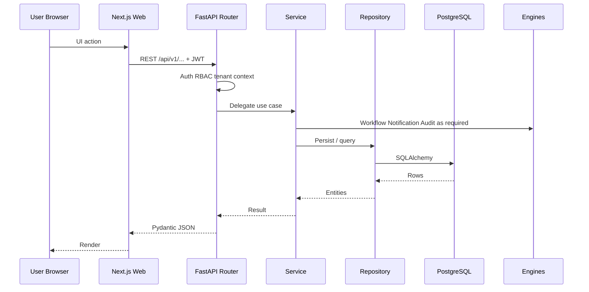

---

## 7. Multi-Tenancy and Security

### 7.1 Tenancy model

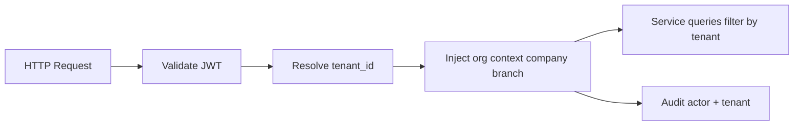

| Concern | Rule |
|---------|------|
| Isolation | `tenant_id` on transactional tables; company/branch scoping where applicable |
| Auth | JWT access + refresh; MFA; Microsoft OAuth supported |
| AuthZ | RBAC: role → permissions; module membership; org scope |
| Secrets | Env / secret store — never commit production secrets |
| Data | Soft delete; audit columns `created_at/by`, `updated_at/by`, `version` |
| Transport | TLS everywhere in deployed environments |

### 7.2 Security controls (target)

Edge WAF/DDoS · short-lived tokens · input validation · OWASP-aligned engineering · encrypted backups · immutable audit from mutation path · ISO 27001 / SOC 2 posture for SaaS offerings.

---

## 8. Data and Storage Architecture

### 8.1 Logical layout

| Store | Holds | Isolation |
|-------|-------|-----------|
| PostgreSQL | All module transactional data, masters, workflow/notification/audit | Tenant (+ company/branch) filters |
| Redis | Cache, sessions, rate limits, Celery results | Key prefixes per tenant where applicable |
| RabbitMQ | Task queues | Vhost / queue naming by env |
| OpenSearch | Search indexes | Index or filter per tenant |
| MinIO / S3 | Documents, attachments, exports, backup objects | Prefix/bucket per tenant |

### 8.2 Database standards (DBS)

- UUID primary keys  
- Table/prefix standards per domain  
- Alembic-only schema changes  
- Soft delete — no physical DELETE on business tables  
- No cross-module foreign-key coupling across bounded contexts  

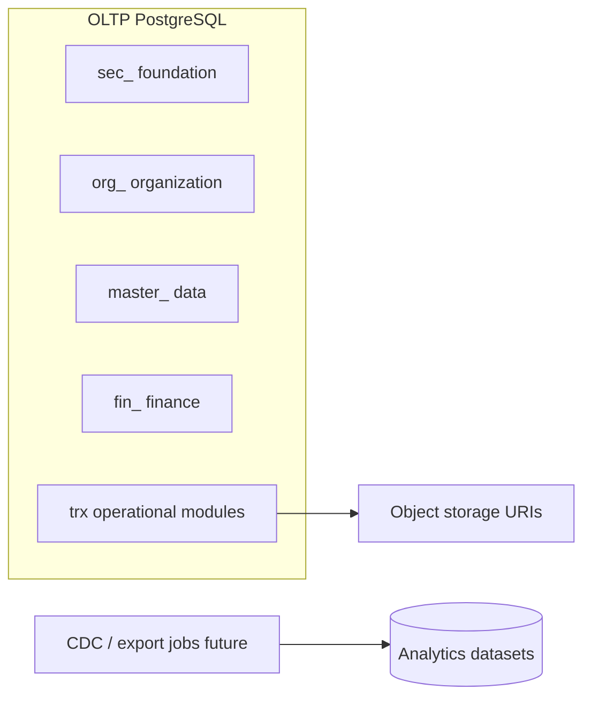

---

## 9. Platform Engines

| Engine | Responsibility | Home |
|--------|----------------|------|
| Identity & RBAC | Login, MFA, OAuth, roles, permissions, module members | Foundation |
| Workflow | Definitions, instances, approvals, escalation | Foundation |
| Notification / Email | Templates, events, deliveries, Graph send, FCM devices | Foundation + Email UI |
| Audit | Immutable mutation/event logs | Foundation |
| Integration Hub | Connectors, webhooks, sync jobs, mappings, DLQ | Integration module |
| Document service | Versioned library consumed cross-module | Document module |
| Settings | System and tenant configuration | Foundation |

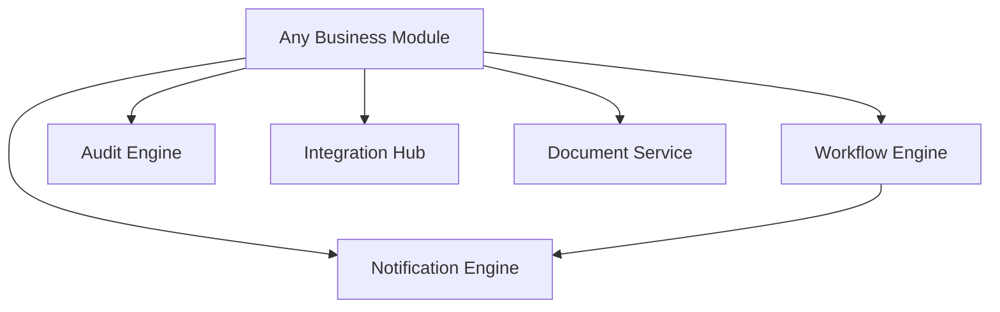

---

## 10. Cross-Domain Business Flows

### 10.1 Enterprise dependency chain

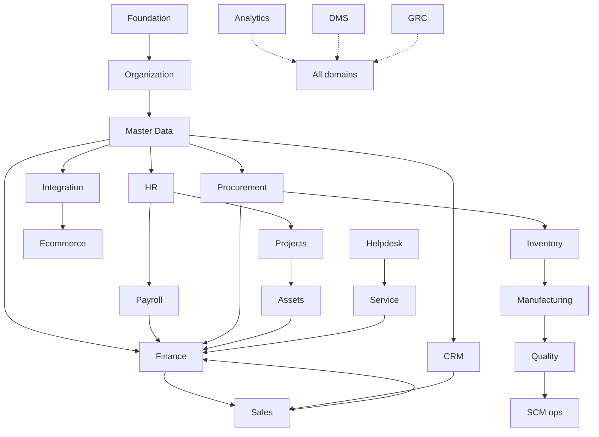

### 10.2 Order-to-cash

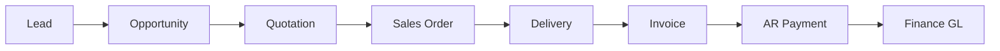

### 10.3 Procure-to-pay

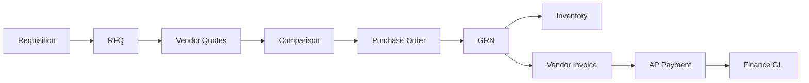

### 10.4 Hire-to-pay

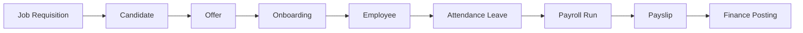

### 10.5 Plan-to-produce

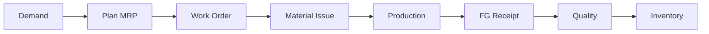

### 10.6 CRM → SCM bridge (product path)

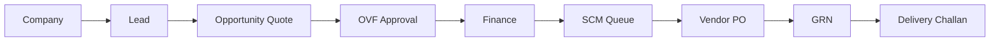

### 10.7 Service / ITSM

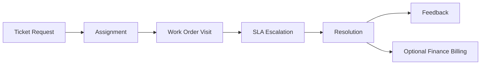

### 10.8 Record-to-report

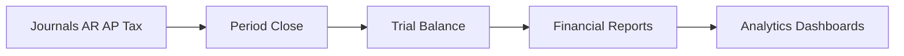

---

## 11. Module Catalog — Full Portfolio

Maturity legend: **Implemented** · **Partial** · **Scaffold** · **Roadmap**.

---

### 11.1 Foundation (Auth, RBAC, Workflow, Audit, Settings)

| | |
|--|--|
| **Web** | `/foundation` |
| **API** | `/tenants`, `/users`, `/roles`, `/permissions`, `/workflows/*`, `/audit/*`, `/settings`, `/auth/*` |
| **Maturity** | Implemented |

**Features**

- Local login, MFA verify, refresh/logout, `/me`  
- Microsoft Entra OAuth (config, login, callback, exchange)  
- Tenants, users, roles, permissions  
- Module admin/member assignment  
- RBAC with Redis-cached permission resolution  
- Org context (tenant / company / branch)  
- Workflow definitions and instances  
- Audit logs  
- System settings  

**Key flows:** Authenticate → session → authorized API call; submit → approve/reject/escalate workflow; every mutation audited.

---

### 11.2 Email & Notification System

| | |
|--|--|
| **Web** | `/email` |
| **API** | `/notifications/*`, `/notifications/email/*` |
| **Maturity** | Implemented |

**Features**

- Notification templates, events, deliveries  
- Microsoft Graph email send, test, overview KPIs  
- Compose UI; delivery and event logs  
- Device token registration (FCM) for push path  
- Celery-backed async delivery  

**Key flows:** Event → template render → Graph/FCM delivery → status logging.

---

### 11.3 Organization

| | |
|--|--|
| **Web** | `/organization` |
| **API** | `/companies`, `/branches`, `/departments`, `/business-units`, `/locations`, `/cost-centers`, `/profit-centers`, `/organization/tree` |
| **Maturity** | Implemented |

**Features:** Multi-company hierarchy; branches; departments; BUs; locations; cost/profit centers; org tree.

---

### 11.4 Master Data

| | |
|--|--|
| **Web** | `/master-data` |
| **API** | `/employees`, `/customers`, `/vendors`, `/products`, `/product-categories`, `/uoms`, `/currencies`, `/taxes`, `/assets`, `/warehouses` |
| **Maturity** | Implemented |

**Features:** Central masters consumed by all operational modules; uniqueness and governance; no duplicate masters inside business modules.

---

### 11.5 Finance & Accounting

| | |
|--|--|
| **Web** | `/finance/**` (custom UX) |
| **API** | `/finance/*` |
| **Maturity** | Implemented |

**Features**

- Account groups & chart of accounts  
- Fiscal years and periods  
- Journals (lines, submit, approve, reject, post, reverse)  
- GL inquiry, trial balance preview, account ledger  
- AR / AP workspaces and aging  
- Tax register, currency rates, asset transactions  
- Reports: TB, BS, P&L, cash flow, journal register, tax summary, cost center, aging  
- Posting / journal / ledger / balance / period-closing engines  
- Finance scope / SoD governance hooks  

**Key flows:** Draft journal → approve → post → GL; subledger activity → financial statements; period close.

---

### 11.6 CRM

| | |
|--|--|
| **Web** | `/crm` |
| **API** | `/crm/*` |
| **Maturity** | Implemented |

**Features:** Companies, leads, assignments, activities, opportunities, stages, pipelines, quotes, OVF, contacts, campaigns, interactions, tasks, follow-ups, meetings, call/email/visit logs, CSAT/feedback.

**Key flows:** Company → Lead → Opportunity → Quote → OVF → Won/Lost; campaign membership.

---

### 11.7 Sales

| | |
|--|--|
| **Web** | `/sales` |
| **API** | `/sales/*` |
| **Maturity** | Implemented |

**Features:** Price lists, discount rules, customer credit, quotations, sales orders, deliveries, invoices, returns.

**Key flows:** Quotation → Order → Delivery → Invoice → Payment/AR; credit holds; returns/credit notes.

---

### 11.8 Procurement & SCM Operations

| | |
|--|--|
| **Web** | `/procurement` |
| **API** | `/procurement/*` |
| **Maturity** | Implemented (advanced SCM planning Partial vs FRD-15) |

**Features:** SCM queue, requisitions, RFQs, vendor quotations, comparisons, POs, GRNs, delivery challan/status, vendor invoices, returns, contracts, vendor performance.

**Key flows:** P2P full cycle; OVF → SCM queue → PO → GRN → challan.

---

### 11.9 Inventory & Warehouse

| | |
|--|--|
| **Web** | `/inventory` |
| **API** | `/inventory/*` |
| **Maturity** | Implemented |

**Features:** Stock, bins, batches, serials, reservations, transfers, adjustments, cycle counts, policies, valuation, reports.

**Key flows:** GRN putaway → reserve → issue/transfer → count/adjust → valuation.

---

### 11.10 Manufacturing

| | |
|--|--|
| **Web** | `/manufacturing` |
| **API** | `/manufacturing/*` |
| **Maturity** | Implemented |

**Features:** BOMs, routings, work centers, machines, production orders, material issues/returns, production receipts, scrap, WIP, variances.

**Key flows:** Plan → WO → issue → execute → FG receipt → WIP/variance close.

---

### 11.11 Quality Management

| | |
|--|--|
| **Web** | `/quality` |
| **API** | `/quality/*` |
| **Maturity** | Implemented |

**Features:** Inspection/sampling plans, characteristics, defect types, incoming/in-process/final inspections, NCRs, CAPAs, supplier quality, complaints, audits, scores.

**Key flows:** Plan → inspect → release/hold; NCR → CAPA.

---

### 11.12 HRMS

| | |
|--|--|
| **Web** | `/hr` |
| **API** | `/hr/*` |
| **Maturity** | Implemented |

**Features:** Designations, profiles, employment, shifts, holidays, leave types/balances/requests, attendance, documents, performance, goals, appraisals, training, separation.

**Key flows:** Hire-to-retire; leave approval; attendance → payroll handoff.

---

### 11.13 Recruitment

| | |
|--|--|
| **Web** | `/recruitment` |
| **API** | `/recruitment/*` |
| **Maturity** | Implemented |

**Features:** Requisitions, postings, sources, recruiters, candidates, applications/stages, interviews/feedback, offers, BGV, talent pools, onboarding tasks.

**Key flows:** Requisition → apply → interview → offer → BGV → onboard → HR employee.

---

### 11.14 Employee Self-Service (ESS)

| | |
|--|--|
| **Web** | Employee app (not admin registry) |
| **API** | `/ess/*` |
| **Maturity** | Implemented (API + employee-app) |

**Features:** Profile, leave, attendance corrections, on-duty/comp-off, payslips, KYC/bank, documents, assets, performance, holidays, announcements, device tokens, notifications.

---

### 11.15 Payroll

| | |
|--|--|
| **Web** | `/payroll` |
| **API** | `/payroll/*` |
| **Maturity** | Implemented |

**Features:** Periods, salary structures/components, employee salaries, earning/deduction types, tax/statutory, runs, payslips, bonuses, reimbursements, loans, adjustments, summaries, Finance posting.

**Key flows:** Attendance/leave → run → approve → payslip → GL → bank file (FRD).

---

### 11.16 Project Management

| | |
|--|--|
| **Web** | `/projects` |
| **API** | `/projects/*` |
| **Maturity** | Implemented |

**Features:** Projects, phases, milestones, tasks, timesheets, resource plans/allocations, budgets, costs, issues, risks, change requests, documents.

**Key flows:** Approve → plan → execute → timesheet cost → close / bill.

---

### 11.17 Asset Management

| | |
|--|--|
| **Web** | `/assets` |
| **API** | `/assets/*` |
| **Maturity** | Implemented |

**Features:** Categories, assets, components, assignments, transfers, locations, warranties, insurance, maintenance plans/work, depreciation, disposals, audits, meter readings.

**Key flows:** Register → assign → maintain → depreciate → dispose.

---

### 11.18 Service Management

| | |
|--|--|
| **Web** | `/service` |
| **API** | `/service/*` |
| **Maturity** | Implemented |

**Features:** Categories, requests, tickets, assignments, schedules, work orders, tasks, visits, materials, time entries, SLAs, escalations, contracts, feedback.

**Key flows:** Request → assign → WO/visit → complete → feedback → optional billing.

---

### 11.19 Helpdesk

| | |
|--|--|
| **Web** | `/helpdesk` |
| **API** | `/helpdesk/*` |
| **Maturity** | Implemented |

**Features:** Categories, priorities, tickets, assignments, comments, SLAs, escalations, knowledge base/articles, resolutions, support teams, shifts, schedules, feedback.

**Key flows:** Report → assign → resolve → CSAT; SLA breach → escalate.

---

### 11.20 Document Management (DMS)

| | |
|--|--|
| **Web** | `/documents` |
| **API** | `/documents/*` |
| **Maturity** | Partial / scaffold-rich (storage/OCR hardening ongoing) |

**Features:** Folders, documents, versions, tags, permissions, shares, approvals, workflows, templates, retention, archives, comments, checkouts, audits, attachments, reports.

**Key flows:** Upload → review → approve → publish; retain → archive.

---

### 11.21 GRC (Governance, Risk, Compliance)

| | |
|--|--|
| **Web** | `/grc` |
| **API** | `/grc/*` |
| **Maturity** | Scaffold / broad CRUD (+ dashboard) |

**Features:** Policies/versions/acknowledgements, controls/tests, risk categories/register/assessments/treatments, compliance frameworks/requirements/assessments, audit plans/audits/findings, corrective actions, exceptions, incidents, notifications, reports.

**Key flows:** Risk identify → assess → treat → control test; audit → finding → CAPA; policy lifecycle.

---

### 11.22 Analytics (BI)

| | |
|--|--|
| **Web** | `/analytics` |
| **API** | `/analytics/*` |
| **Maturity** | Implemented |

**Features:** Dashboards, widgets, reports, schedules, datasets, metrics, KPIs, dimensions, alert rules, subscriptions, imports/exports.

**Key flows:** Dataset → metric/KPI → dashboard/report → schedule/alert.

---

### 11.23 Integration Hub

| | |
|--|--|
| **Web** | `/integration` |
| **API** | `/integration/*` |
| **Maturity** | Implemented |

**Features:** External systems, connectors, API credentials, OAuth clients, webhooks, event definitions, message/retry/DLQ queues, mappings, sync jobs/logs, rate limits.

**Key flows:** Connect → map → sync; webhook ingest → retry/DLQ.

---

### 11.24 Ecommerce

| | |
|--|--|
| **Web** | `/ecommerce` |
| **API** | `/ecommerce/*` |
| **Maturity** | Implemented |

**Features:** Stores, channels, listings, carts, orders, payments, shipments, return requests, coupons, promotions, marketplace connectors.

**Key flows:** Channel order → pay → fulfill → ERP inventory/sales sync; returns.

---

### 11.25 Customer Portal

| | |
|--|--|
| **Web** | `/portal` |
| **API** | `/portal/*` |
| **Maturity** | Implemented |

**Features:** Portal accounts, profiles, sessions, dashboards, notifications, messages, order/invoice views, document access, support tickets, service requests, preferences, login audits.

**Key flows:** Portal login → view commercial docs → raise ticket/service.

---

### 11.26 Marketing & Social Media

| | |
|--|--|
| **Web** | Registry pending |
| **API** | `/marketing/*` (scaffolding) + CRM campaigns |
| **Maturity** | Partial / in progress |

**Features:** CRM campaigns; marketing FRD scope — platforms/accounts, content requests, AI/Celery generation pipeline, versions/scores, brand voice, research/trends, competitors, calendar, publish jobs (stub), analytics summary; ecommerce promos/coupons adjacent.

**Key flows:** Campaign → content request → generate → score → calendar → publish/approve.

---

## 12. Roadmap Platform Extensions

These are part of the product vision and ownership scope; not yet first-class API packages.

### 12.1 AI Assistant & AI Infrastructure

**Target features:** LLM gateway; permission-aware RAG over ERP + DMS; tool-calling against OpenAPI; in-module copilots; eval/guardrails; audit of AI actions.

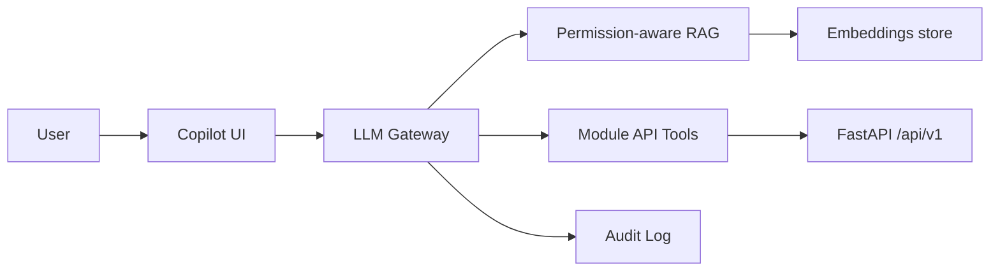

### 12.2 Virtual Executive Assistant

**Target features:** Skills/performance graph; assessments/certifications; reminders; calendar/meeting assist; email draft/summarize; proactive insights; human-in-the-loop for consequential actions; consent/transparency controls.

### 12.3 Licensing & Server-side Activation

**Target features:** Module entitlements, seats, license keys, online/offline activation, metering, renewal/expiry, grace periods, license audit — required for sell-alone and on-prem.

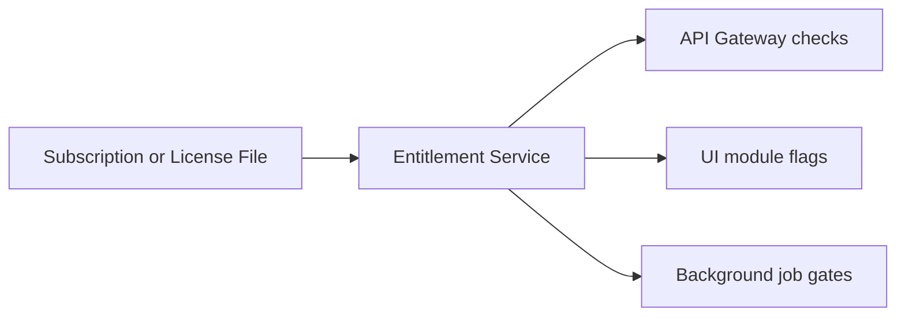

### 12.4 Data Backup & DR

**Target features:** Scheduled full/incremental/WAL backups; encryption; restore verification; per-tenant PITR tooling; DR runbooks; RPO/RTO targets; alignment with GRC BCM.

Ops today: PostgreSQL external hosting, manual dumps under `backups/`, SDD/DBS standards — product module still roadmap.

---

## 13. Integration Strategy

### 13.1 Hub pattern

All external connectivity prefers the Integration Hub: credential vaulting, scheduled/webhook syncs, field mapping, retries, DLQ, connector health.

### 13.2 Priority connectors

| Area | Examples |
|------|----------|
| Identity | Microsoft Entra ID OIDC/SCIM |
| Email / collab | Microsoft Graph mail |
| Object storage | MinIO / S3 |
| Payments / banking | Host-to-host, payment status APIs |
| Tax / e-invoice | Country packs (GST etc.) |
| Commerce | Shopify/Magento-style channels via Ecommerce module |
| Signatures | DocuSign / Adobe Sign via DMS |
| Catch-all | Public OpenAPI, outbound webhooks, CSV/Excel import-export |

---

## 14. On-Premise Deployment Plan

Same signed container images as cloud; topology changes by customer size.

### 14.1 Installation profiles

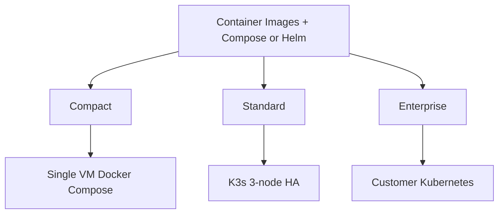

| Profile | Target | Shape |
|---------|--------|-------|
| **Compact** | ≤ ~100 users | One VM/host: API, worker, beat, web, Postgres, Redis, RabbitMQ, MinIO; optional warm standby |
| **Standard** | ~100–1,000 users | K3s cluster; HA Postgres (Patroni or managed); replicated Redis/RabbitMQ; MinIO erasure coding |
| **Enterprise** | 1,000+ / regulated | Customer Kubernetes; customer-managed DB; AD/LDAP federation; air-gap capable; customer DR |

### 14.2 Compact reference topology

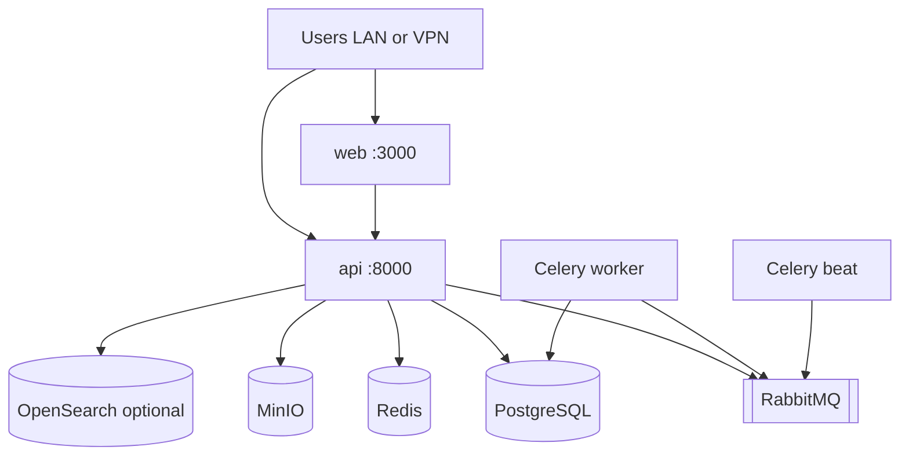

### 14.3 On-prem packaging checklist

| Item | Guidance |
|------|----------|
| Installer | CLI (`cpctl` or equivalent) validates OS, disk, ports; applies Compose/Helm; runs Alembic; health checks |
| Config | `.env` / sealed secrets — DB URL, JWT, Graph/SSO optional, storage endpoints |
| Licensing | Offline signed license files (roadmap entitlement service) |
| Updates | Online registry pull or offline signed bundle; pre-upgrade backup mandatory |
| AI | Customer LLM keys, vendor gateway, or local GPU inference — config only, no code fork |
| Existing artifacts | `apps/api/Dockerfile` (roles: `api` / `worker` / `beat` / `migrate`), `apps/web/Dockerfile`, `apps/employee-app/Dockerfile`, root `docker-compose.yml` (infra services) |

### 14.4 On-prem backup & DR

- Nightly DB dump + continuous WAL where feasible  
- Object-storage versioning for documents  
- Documented restore drill  
- Optional secondary site replication for Standard/Enterprise  

---

## 15. AWS Deployment Plan

Primary cloud target per SDD Volume 4.

### 15.1 Service mapping

| Function | AWS service |
|----------|-------------|
| Compute | EKS (preferred) or ECS Fargate |
| API / workers | Kubernetes Deployments or ECS services |
| Frontend | EKS/ECS + ALB, or CloudFront → S3/SSR containers |
| Database | Amazon RDS PostgreSQL (Multi-AZ) |
| Cache | ElastiCache Redis |
| Broker | Amazon MQ (RabbitMQ) or self-managed on EKS |
| Search | Amazon OpenSearch Service |
| Objects | Amazon S3 |
| Secrets | AWS Secrets Manager |
| TLS / DNS | ACM · Route 53 |
| Edge | CloudFront · AWS WAF |
| Observability | CloudWatch · OpenTelemetry · Grafana (optional) |
| IaC | Terraform |

### 15.2 Target AWS topology

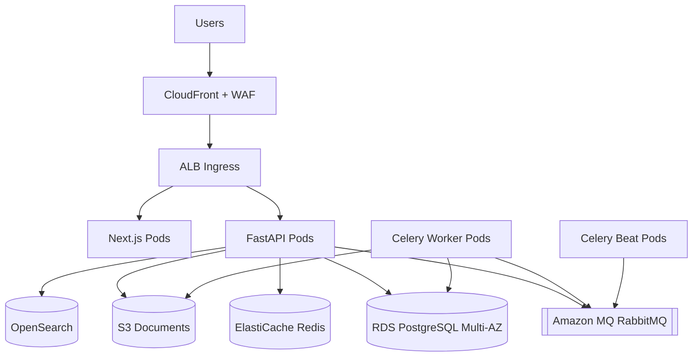

### 15.3 Network

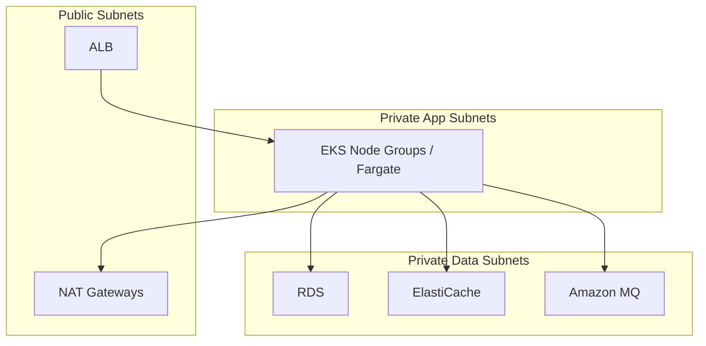

**Rule:** Databases and brokers are never publicly accessible.

### 15.4 Kubernetes workload set

| Workload | Image / role | Notes |
|----------|--------------|-------|
| `erp-web` | `apps/web` | HPA on CPU/RPS |
| `erp-api` | `apps/api` role=`api` | Gunicorn+Uvicorn; HPA |
| `erp-worker` | `apps/api` role=`worker` | Scale on queue depth |
| `erp-beat` | `apps/api` role=`beat` | Single active replica |
| `erp-migrate` | Job | Alembic before rollout |
| `erp-employee` | `apps/employee-app` | Optional public path |

Ingress, ConfigMaps, Secrets, NetworkPolicies, and PodDisruptionBudgets are mandatory for production.

### 15.5 Environment promotion (no calendar dates)

```mermaid
flowchart LR
  LOCAL[Local] --> DEV[Development]
  DEV --> QA[QA]
  QA --> UAT[UAT]
  UAT --> STG[Staging]
  STG --> PROD[Production]
```

Promotion is artifact-based: the **same image digests** move forward; only config/secrets change.

### 15.6 SaaS control-plane concerns on AWS

- Automated tenant provisioning (schema/DB + seed + DNS)  
- Entitlements and metering (Licensing roadmap)  
- Per-tenant backup/export  
- Status page and error budgets  
- Multi-AZ RDS; S3 cross-region replication for DR; defined RPO/RTO  

---

## 16. DevOps, Environments, and CI/CD

### 16.1 Target pipeline

```mermaid
flowchart LR
  COMMIT[Commit] --> BUILD[Build Test Lint]
  BUILD --> SCAN[SAST Image Scan SBOM]
  SCAN --> PUSH[Push to Registry]
  PUSH --> DEVDEP[Deploy Dev]
  DEVDEP --> PROMOTE[Promote by env]
  PROMOTE --> PRODDEP[Deploy Prod]
```

| Practice | Standard |
|----------|----------|
| Source | GitHub |
| Branches | `main`, `develop`, `feature/*` |
| CI | Build API/web images; unit/integration tests; architecture/guardrail checks |
| CD | GitOps (Argo CD) or pipeline deploy to EKS/ECS |
| Migrations | Forward-only Alembic; expand/contract; run as release Job |
| Secrets | Secrets Manager / sealed secrets — not git |

### 16.2 Current repo reality

| Present | Gap |
|---------|-----|
| Dockerfiles for api/web/employee-app | Full-stack prod Compose/Helm not checked in |
| Infra Compose (Redis, RabbitMQ, MinIO, OpenSearch) | Postgres assumed external / platform-provided |
| `.env.example` | No Terraform/EKS manifests yet |
| Coolify-style env used operationally | Formalize as one of the deploy profiles |

This master document defines the **target**; implementation closes the IaC/CI gaps without changing ADR-001/002.

---

## 17. Quality, Observability, and Compliance

| Area | Practice |
|------|----------|
| API contracts | OpenAPI; breaking changes fail review |
| Domain tests | High coverage on finance/payroll math and posting |
| Module matrix | Standalone degradation tests when licensing lands |
| E2E golden paths | O2C, P2P, hire-to-pay, record-to-report |
| Security | Auth/RBAC tests; no cross-tenant leaks |
| Telemetry | Structured logs, metrics, traces (OpenTelemetry) |
| Compliance | Audit engine; GRC module; ISO 27001 / SOC 2 target for SaaS |

---

## 18. Key Risks and Mitigations

| Risk | Mitigation |
|------|------------|
| Scope explosion across 20+ modules | Depth before breadth; sellable increments; dependency order Foundation → Org → MDM → business |
| Tenancy / permission leak | Tenant middleware + query filters; automated cross-tenant tests; pen tests |
| Payroll / tax correctness | Country packs; domain experts; property-based tests |
| On-prem support burden | One artifact; LTS channels; installer automation; partner first-line |
| AI hallucination / unauthorized action | Grounding, citations, user-scoped tools, confirmation, full AI audit |
| Cursor/AI code drift | `.cursor/rules`, ADRs in-repo, human review, architecture tests |
| Backup/DR only manual today | Productize Backup & DR module; automate verify restores |
| Licensing absent | Block sell-alone GA until entitlement service ships |

---

## 19. Document Hierarchy and Compliance

```text
BRD → FRD (Master + domain FRDs) → SDD v1.1 → DBS v1.1 → ERD → Physical Schema
    → SQLAlchemy Models → Alembic → OpenAPI → Code
```

| Document set | Path |
|--------------|------|
| BRD | `docs/01_BRD/` |
| FRD | `docs/02_FRD/` |
| SDD | `docs/03_SDD/` |
| DBS | `docs/04_DBS/` |
| Architecture Lock | `docs/05_ARCHITECTURE_LOCK/` |
| ERD | `docs/06_ERD/` |
| **This master** | `docs/07_MASTER_ARCHITECTURE/` |
| Design system | `design-system/enterprise-erp-platform/MASTER.md` |

No deviation from Architecture Lock v1.1 without EARB approval and an updated ADR.

---

## Appendix A — Connect ownership (implementation focus)

Primary engineer ownership for delivery prioritization:

1. User Login / Access & RBAC  
2. Finance  
3. AI Assistant & AI Infra  
4. Marketing Tool  
5. GRC  
6. Document Management  
7. Virtual E.A.  
8. Data Backup & DR  
9. Licensing & Server-side Activation  
10. Emailer & Notification System  

---

## Appendix B — Related source anchors

| Concern | Location |
|---------|----------|
| API mount list | `apps/api/src/shared/router.py` |
| Web module registry | `apps/web/src/config/modules.ts` |
| Architecture lock | `docs/05_ARCHITECTURE_LOCK/ERP_Architecture_Lock_Report_v1.1.md` |
| Infra Compose | `docker-compose.yml` |
| API container entry | `apps/api/docker/entrypoint.sh` |

---

*End of Master Architecture Document*
