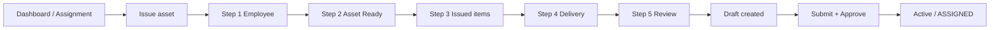
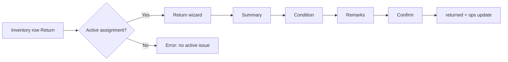

# CR-004 — Assignment & Return User Journeys

**Phase:** 5B-1 — UI/UX design freeze  
**Persona:** IT Administrator (branch-scoped daily operations)

---

## Journey index

| ID | Name | Primary entry | Wizard |
|----|------|---------------|--------|
| J1 | New hire issue | Dashboard / roster | Assignment |
| J2 | Issue from inventory | Register row **Assign** | Assignment (asset pre-filled) |
| J3 | Return from inventory | Register row **Return** | Return |
| J4 | Return from assignment list | Active row **Return** | Return |
| J5 | Draft correction | Draft **Continue issue** | Assignment (resume) |
| J6 | Approver (unchanged) | Assignment view modal | — (no wizard) |

---

## J1 — New hire laptop issue

**Goal:** Employee receives laptop; Excel “Assigned” tab equivalent.

| Step | User action | System |
|------|-------------|--------|
| 1 | Pick employee from roster or search | — |
| 2 | Select Ready To Move laptop | Validates branch match |
| 3 | Tick charger / bag | Remarks prefix optional |
| 4 | Set delivery Pending or Issued + DC number | Maps 5A fields |
| 5 | Confirm | `POST` draft |
| — | Open assignment, Submit | Workflow if enabled |
| — | Approver approves | Activate → ops ASSIGNED |

**Success:** Inventory shows employee as current holder; ops **Assigned**.

**Failure paths:**

- No ready assets → empty picker + link to register filter `READY_TO_MOVE`.
- Submit without delivery status → API error; wizard **Continue issue** opens Step 4.

---

## J2 — Assign from inventory

**Goal:** IT already found asset in register; issue to someone.

| Step | Detail |
|------|--------|
| Entry | `AssetNavigation.openAssignment(assetId)` |
| Wizard | Open at **Step 2** with asset locked; **Step 1** still required unless `employeeId` query added later |
| Branch | From asset.branch_id |

**Edge:** Asset not assignable → banner on Step 2 with reason (maintenance, pending transfer).

---

## J3 — Return from inventory

**Goal:** Employee returned machine at desk; IT processes in system.

| Condition choice | User intent | Result tab (Excel) |
|------------------|-------------|-------------------|
| Good | Re-stock | Ready To Move |
| Outdated | Old kit retire | Not Given To Anyone |
| Dead | Faulty | Not Working |

**Freeze:** `?assetId=&intent=return` must trigger this flow (gap today).

---

## J4 — Return from assignment list

Same as J3 but assignment row known; **Step 1** shows document + assignee.

**Shortcut:** View modal **Return** opens wizard (not immediate POST).

---

## J5 — Resume draft

| State | UX |
|-------|-----|
| Draft missing employee/asset | Open wizard Step 1 |
| Draft complete, missing delivery | Open Step 4 with validation hints |
| Draft ready | User uses existing Submit from list view |

Persist wizard progress in draft row only (no localStorage authority).

---

## J6 — Approver (out of wizard scope)

Unchanged from Phase 3.1: view modal, comments, approve/reject. Wizard does not replace governance UI.

---

## Cross-journey rules

1. **Single active assignment** per non-shared asset — surface API validation on Step 2 save or Review.
2. **Return remarks** only in Return wizard — never on assignment PATCH form.
3. **Operational status** never editable in wizards — outcome via return condition only.
4. **Permissions** — hide Issue / Return entry points when RBAC denies; same as inventory menu gating.

---

## Excel workflow mapping (customer)

| Excel step | Journey |
|------------|---------|
| Pick employee on register mental model | J1 Step 1 |
| Pick asset from Ready pool | J1 Step 2 |
| Note charger | J1 Step 3 |
| Delivery challan column | J1 Step 4 |
| Issue date / active row | Approve activate (not backdated in 5B — Phase 7 import) |
| Return dropdown outcome | J3/J4 Step 2 |
| Return notes column | J3/J4 Step 3 |

---

## Metrics & success (for 5B-2 QA)

| Metric | Target |
|--------|--------|
| Issue flow clicks (draft created) | ≤ 5 steps after entry |
| Return with non-good condition | Possible without devtools |
| Inventory return deep link | Opens wizard 100% when active assignment exists |
| API errors | Shown inline on wizard step that owns the field |

---

## Related

- [CR-004-Phase-5B1-Assignment-UI-Design.md](./CR-004-Phase-5B1-Assignment-UI-Design.md)
- [CR-004-Assignment-Wireframes.md](./CR-004-Assignment-Wireframes.md)
- [CR-004-Assignment-Workflow.md](./CR-004-Assignment-Workflow.md)
