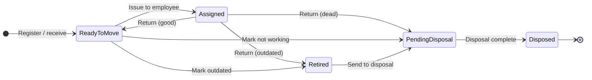

# CR-004 — Assignment Workflow (Current vs Excel)

**Phase:** 4.1 — Architecture documentation  
**Scope:** Assignment lifecycle, operational status coupling, Excel equivalence

---

## 1. Excel workflow (customer)



**Register row** always shows hardware + **current** employee fields when assigned. **Tabs** filter by bucket, not by separate data stores.

---

## 2. Platform workflow (current)

### 2.1 Assignment document lifecycle

```text
draft → submitted → approved → active → returned
         ↘ cancelled
```

| Step | Actor | System effect |
|------|-------|----------------|
| Create draft | IT Admin | AS row; asset unchanged |
| Submit | IT Admin | Workflow instance (if governance on) |
| Approve | Approver | `_activate_assignment` |
| Activate | System | `allocated_at`, custodian mirror, `operational_status → ASSIGNED` |
| Return | IT Admin | Engine `active → returned`; ops action from `return_condition` |

**Excel gap:** Multi-step approval has no Excel equivalent; non-prod path can auto-approve (`ASSET_WORKFLOW_GOVERNANCE_ENABLED=false`).

### 2.2 Operational status coupling (implemented Phase 2B-2)

| Event | `AssignmentService` | `AssetOperationalStatusService` action | Target ops status |
|-------|---------------------|----------------------------------------|-------------------|
| Activate | `_activate_assignment` | `assign` | `ASSIGNED` |
| Return `good` | `return_assignment` | `return_to_ready` | `READY_TO_MOVE` |
| Return `outdated` | `return_assignment` | `retire` | `RETIRED` |
| Return `dead` | `return_assignment` | `mark_pending_disposal` | `PENDING_DISPOSAL` |
| Disposal post | `DisposalService` | `complete_disposal` | `DISPOSED` |

### 2.3 Return condition (domain)

Defined in `assignment_return_condition.py`:

| `return_condition` | Excel outcome |
|--------------------|---------------|
| `good` | Back to **Ready To Move** |
| `outdated` | **Not Given To Anyone** (`RETIRED`) |
| `dead` | **Not Working** (`PENDING_DISPOSAL`) |

**Workflow gap:** Router `POST /asset-assignments/{id}/return` does not accept a body; UI does not prompt for condition → **only `good` is used in practice**.

---

## 3. Side-by-side mapping

| Excel action | Excel tab after | Platform path today | Complete? |
|--------------|-----------------|---------------------|-----------|
| Receive laptop | Ready To Move | Register activate → `initialize_ready_to_move` | Yes |
| Issue to employee | Assigned | Assignment activate | Yes (minus challan/remarks) |
| Return working | Ready To Move | Return default `good` | Yes |
| Return outdated | Not Given To Anyone | Return `outdated` | **Service only** |
| Return dead | Not Working | Return `dead` | **Service only** |
| Mark stock outdated | Not Given To Anyone | Ops `retire` from `READY_TO_MOVE` | **No IT UI command** |
| Mark stock dead | Not Working | Ops `mark_pending_disposal` | **No IT UI command** |
| Dispose | Disposed | Disposal post | Yes (ops hook) |
| Branch move | Same bucket, new branch | Transfer complete | Yes (separate doc) |

---

## 4. Inventory integration (Phase 3.4)

| User action | Workspace | Routing |
|-------------|-----------|---------|
| View asset | Inventory drawer | In-place |
| Assign | Inventory menu | `/assets/asset-assignments?assetId=` |
| Return | Inventory menu | `…&intent=return` |
| Portal / Discovery / QR / Transfer / Maintenance | Quick links / menu | Existing modules |

Assignment **module** remains system of record for issue/return; inventory does not duplicate workflows.

---

## 5. Workflow gaps (prioritized)

### P0 — Excel parity blockers

1. **Return condition** exposed on API and Assignment UI (good / outdated / dead).
2. **`delivery_challan_ref` and `remarks`** on create/activate path (D-010).
3. **Import** sets `allocated_at` from Excel Issue Date when loading historical active rows.

### P1 — Operational clarity

4. IT command to **retire** or **mark pending disposal** from register without full assignment (stock not issued).
5. **Earlier used by** panel fed from assignment history API.
6. Reconciliation: `ASSIGNED` ⇔ exactly one active employee assignment.

### P2 — Governance / training

7. Document simplified IT path when workflow governance disabled.
8. Optional **backdated** `allocated_at` with audit (policy).

### Not Required

- Excel-style inline grid edit of assignment fields.
- Separate shadow workflow for IT.

---

## 6. Permissions (unchanged)

| Action | Permission |
|--------|------------|
| Create / submit assignment | `asset.assignment:create` |
| Approve | `asset.assignment:approve` |
| Return | `asset.assignment:return` |
| Read register | `asset.asset:read` |

Inventory menu uses same permission keys via `inventory-permissions.ts`.

---

## 7. Target workflow (post Phase 5)

```text
Inventory / Dashboard
    → Assign (prefill asset)
        → Draft: employee, challan, remarks, optional expected return
        → Submit / Approve
        → Activate (issue date = allocated_at)
    → Return
        → Prompt: Good | Outdated | Dead
        → Ops transition + returned assignment row
```

Export and import both use the **same ownership** rules in `CR-004-Assignment-Data-Model.md`.

---

## 8. References

- `CR-004-Workflow-Ownership-Matrix.md`
- `CR-004-Transition-Matrix.md`
- `assignment_service.py`, `asset_assignment_engine.py`
- `asset-assignment-workspace.tsx`, `asset-navigation.ts`
