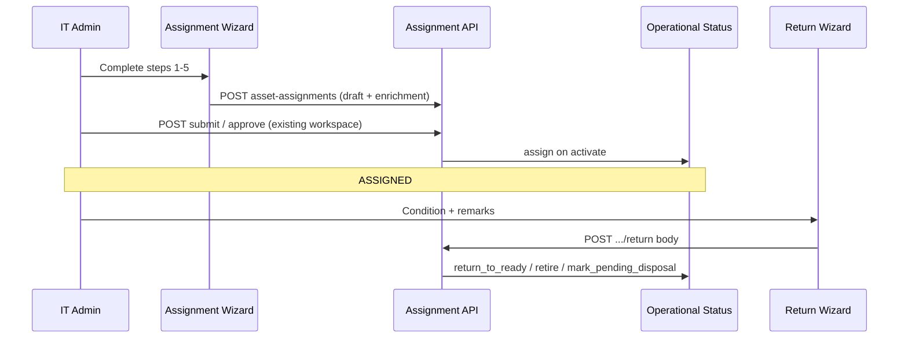

# CR-004 Phase 5B-1 — Assignment & Return UI/UX Design Freeze

**Status:** LOCKED — design freeze (documentation only)  
**Date:** 2026-08-03  
**Audience:** IT Administrators  
**Prerequisite:** Phase 5A-1/5A-2 (enrichment + return API)  
**Design baseline:** Enterprise ERP Platform — Data-Dense Dashboard + Swiss Minimalism (`design-system/enterprise-erp-platform/MASTER.md`)

---

## Executive summary

Phase 5B-1 replaces the **single-modal assignment form** and **one-click return** in `AssetAssignmentWorkspace` with two **guided wizards** that match the customer Excel issue/return mental model while preserving platform workflow (draft → submit → approve → active → return).

| Wizard | Steps | Outcome |
|--------|-------|---------|
| **Assignment** | Employee → Asset → Issued items → Delivery → Review | Draft assignment with D-010 fields; user continues submit/approve in workspace or detail |
| **Return** | Asset summary → Return condition → Return remarks → Review | `POST …/return` with `return_condition` + `return_remarks`; ops bucket updated by backend |

**No React implementation in this phase.** Phase 5B-2 implements against this freeze.

**Related docs:** [Wireframes](./CR-004-Assignment-Wireframes.md) · [User journeys](./CR-004-Assignment-User-Journey.md) · Phase 5A-2 API rules · Phase 3.1 IT Admin freeze

---

## Scope

| In scope | Out of scope (5B-1) |
|----------|---------------------|
| Assignment wizard IA, fields, validation UX, errors | Code, routes, API changes |
| Return wizard IA + Excel parity labels | Excel import (Phase 7) |
| Entry points from inventory, dashboard, list | Sidebar redesign (Phase 3.5) |
| Read-only issued-items from `ast_asset_component` | New accessory tables (D-011) |
| Workflow mapping to 5A APIs | Governance policy changes |

---

## Analysis — current state

### Assignment UI (`asset-assignment-workspace.tsx`)

| Aspect | Today | Gap vs Excel / 5A |
|--------|--------|---------------------|
| Create/edit | One `max-w-lg` dialog: asset, branch, allocation type, assignee, expected return | No delivery reference, no remarks, no issued-items checklist |
| Employee-first | “Team roster” chips pre-fill employee on create | Good seed for **Step 1**; wizard should keep roster as shortcut |
| Prefill | `?assetId=` opens create with asset locked | Inventory **Assign** path works; no `intent=assign` alias needed |
| View modal | Submit / approve / reject / return inline | Return calls action **without body** → always `good` |
| List | Document, asset, assignee, status filters | Missing columns: delivery ref, ops context (read-only link) |

### Return UI

| Entry | Behavior today |
|-------|----------------|
| Assignment detail **Return** button | Immediate `POST …/return` (no dialog) |
| Inventory **Return Asset** | Navigates `?assetId=&intent=return` — **intent not handled** in workspace |
| Asset detail | Return on active assignment — same no-body call |

**Freeze:** `intent=return` must open **Return wizard** pre-resolved to active assignment for that asset (or error if none).

### Backend Phase 5A (locked for UI)

| UI field | API |
|----------|-----|
| Delivery challan / DC number | `delivery_reference_number` (max 100) |
| Challan status | `delivery_reference_status`: `not_applicable`, `pending`, `issued`, `received` |
| Issue notes | `assignment_remarks` (max 4000) |
| Return notes | `return_remarks` on **return body only** |
| Return outcome | `return_condition`: `good`, `outdated`, `dead` |
| Optional reason | `reason` (max 500) on return body |

**Employee assignments:** Submit blocked until delivery status ≠ `not_applicable`; UI must default employee flow to **`pending`** or prompt in Delivery step.

### Customer Excel workflow (target UX)

| Excel action | UI equivalent |
|--------------|----------------|
| Issue laptop to employee | Assignment wizard → activate → tab **Assigned** |
| Delivery challan + remarks on issue row | Delivery step |
| Charger / bag on issue | Issued items step (components) |
| Return working | Return wizard → **Good** → Ready To Move |
| Return outdated | **Outdated** → Retired |
| Return dead / not working | **Dead** → Pending disposal |

### Inventory integration (Phase 3.4B)

| Surface | Assignment freeze behavior |
|---------|----------------------------|
| Row action **Assign Asset** | `AssetNavigation.openAssignment(assetId)` → assignment route with `assetId` → wizard **Step 2** pre-filled (skip Step 1 or show employee from context only if user landed without employee) |
| Row action **Return Asset** | `openReturn(assetId)` → `intent=return` → Return wizard |
| Drawer **Assignment** section | Read-only; link “Return” opens Return wizard when active assignment exists |
| Register filters | Unchanged; assignment wizards do not live in register |

**Rule:** Inventory never duplicates assignment persistence; wizards call existing assignment APIs only.

---

## Design — assignment wizard

### Shell

- **Pattern:** Full-height **wizard sheet** on desktop (`max-w-2xl`, centered) or dedicated sub-route `/assets/asset-assignments/new` (implementation choice in 5B-2; freeze prefers **route + step query** `?step=employee` for deep links and back button).
- **Chrome:** Step indicator (1–5), title “Issue asset”, branch context chip (from session / asset), Cancel (confirm if dirty), **Save draft** on steps 2–4, **Next** / **Back**.
- **Permissions:** `asset.assignment:create` to start; branch scope unchanged from today.

### Step 1 — Employee

| Control | Required | Notes |
|---------|----------|--------|
| Employee search / select | Yes (employee allocation default) | Master Data employees; roster chips remain on list page as shortcut into Step 1 with employee locked |
| Allocation type | Visible, default `employee` | Advanced: department / project / branch / warehouse — collapsible “Other allocation” to avoid clutter; non-employee skips strict delivery rule at submit |
| Expected return date | Optional | Maps `expected_return_at` |

**Validation (client):** Employee required when type = employee. Show branch from employee’s company context if needed.

**Excel parity:** Matches “who receives the laptop” first.

### Step 2 — Asset

| Control | Required | Notes |
|---------|----------|--------|
| Asset picker | Yes | Filter: same branch as assignment, `operational_status` **Ready To Move** (and assignable registration status); search by code, name, serial |
| Asset summary card | Read-only | Code, name, category, serial, current ops status, branch |
| Conflict hints | Read-only | Banner if pending transfer or other pending assignment (from validation error on save) |

Prefill: `assetId` query skips picker when valid.

### Step 3 — Issued items

| Control | Required | Notes |
|---------|----------|--------|
| Component checklist | No | Load `GET` asset components for selected asset; show code, description, status |
| “Issue with asset” toggles | Optional | UX records selections; persist via `assignment_remarks` bullet list and/or future component issue API — **5B-2 minimum:** append selected labels to `assignment_remarks` prefix block `[Issued: charger, bag]` if no separate API (documented shortcut; D-011 long-term is component lifecycle) |
| Empty state | — | “No registered accessories” + link to asset detail / components workspace |

**Excel parity:** Charger and extras called out on issue row.

### Step 4 — Delivery

| Control | Required | Notes |
|---------|----------|--------|
| Delivery reference status | Yes for employee | Select: Pending / Issued / Received; hide `not_applicable` for employee path |
| Delivery reference number | Conditional | Required when status Issued or Received; disabled when Pending (optional number) |
| Assignment remarks | Optional | Textarea, 4000 max, helper text for issue notes |

**Validation (client):** Mirror 5A rules before save; inline messages from API on submit.

### Step 5 — Review

| Block | Content |
|-------|---------|
| Summary grid | Employee, asset, issued items list, delivery fields, remarks, expected return |
| Workflow note | Copy: “Saving creates a **draft**. Submit for approval from the assignment list.” |
| Primary CTA | **Create draft** → `POST` create with enrichment fields |
| Secondary | Back |

Post-create: toast + navigate to assignment **view** with draft status (existing modal or detail route).

---

## Design — return wizard

### Shell

- **Pattern:** Modal or sheet `max-w-lg`, title “Return asset”, 4 steps.
- **Entry:** List (active row), inventory return, `intent=return`, asset detail return.
- **Permissions:** `asset.assignment:return`

### Step 1 — Asset summary

| Block | Content |
|-------|---------|
| Asset | Code, name, serial, ops status |
| Assignment | Document number, assignee, allocated date, delivery ref (if any) |
| Warning | If status ≠ active → block with explanation |

### Step 2 — Return condition

| Option | Label (user) | API `return_condition` | Excel / ops result |
|--------|----------------|------------------------|---------------------|
| A | **Good — return to stock** | `good` | Ready To Move |
| B | **Outdated — retire** | `outdated` | Retired |
| C | **Not working — pending disposal** | `dead` | Pending disposal |

**Control:** Radio card group (icon + short description); default **Good**. Destructive styling on C only.

### Step 3 — Return remarks

| Control | Required | Notes |
|---------|----------|--------|
| Return remarks | Optional | Textarea → `return_remarks` |
| Reason | Optional | Short text → `reason` (audit / ops) |

### Step 4 — Review

Summary + **Confirm return** → `POST …/return` with body. Success: toast, close wizard, refresh list / inventory holder column.

---

## Screen layouts (summary)

| Screen | Layout |
|--------|--------|
| Assignment list | Unchanged table + **Issue asset** (primary) opens wizard; row click → view; draft → **Continue issue** reopens wizard at Review or last step |
| Assignment wizard | Vertical stepper left (desktop) or top (mobile); form right; sticky footer actions |
| Return wizard | Compact stepper; single column |
| Mobile | Full-screen sheet; bottom sticky **Next** / **Confirm** |

Density: 9/10 — compact labels `text-xs` muted, `text-sm` values, 8px grid gaps per MASTER.

---

## Workflow mapping (UI → API → ops)

| UI action | API | Assignment status | Asset ops |
|-----------|-----|-------------------|-----------|
| Create draft (wizard) | `POST` + enrichment | `draft` | — |
| Submit / approve (existing) | unchanged | → `active` | `ASSIGNED` |
| Return Good | `POST return` `{ return_condition: good }` | `returned` | `READY_TO_MOVE` |
| Return Outdated | `{ outdated }` | `returned` | `RETIRED` |
| Return Dead | `{ dead }` | `returned` | `PENDING_DISPOSAL` |

---

## Accessibility & motion

- Focus trap in wizards; step change announces via `aria-live="polite"`.
- All click targets `cursor-pointer`; transitions 150–200ms; respect `prefers-reduced-motion`.
- Return condition cards: full keyboard operable, visible focus ring (`--color-ring`).

---

## Implementation phases (after freeze)

| Phase | Deliverable |
|-------|-------------|
| **5B-2** | Assignment wizard component + API wiring + list entry |
| **5B-3** | Return wizard + `intent=return` + inventory hooks |
| **5B-4** | List columns (delivery ref), drawer links, polish |

---

## Open decisions (locked in freeze)

1. **Employee-first** default; other allocation types behind disclosure.
2. **Issued items** in 5B-2 may append to `assignment_remarks` until component-issue API exists.
3. **Return** always uses request body (no empty POST).
4. **Wizard route** recommended: `/assets/asset-assignments/new` with query prefill.

---

## Document map

| File | Purpose |
|------|---------|
| This document | Executive summary, analysis, step specs, workflow |
| [CR-004-Assignment-Wireframes.md](./CR-004-Assignment-Wireframes.md) | ASCII layouts |
| [CR-004-Assignment-User-Journey.md](./CR-004-Assignment-User-Journey.md) | Personas, flows, edge cases |
