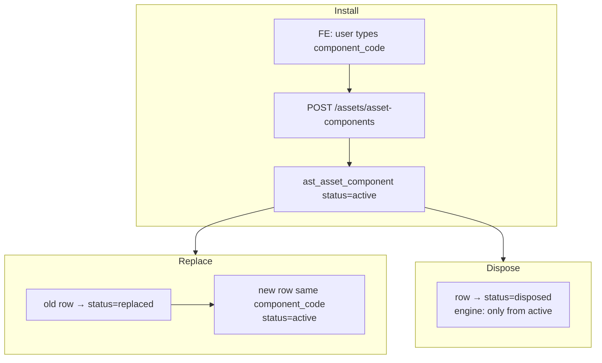

# IT Assets — Asset Components (Full Feature Analysis)

**Date:** 2026-08-31  
**Scope:** Read-only map. No schema, migration, or redesign proposals.  
**Status:** Ready for review.

## Core distinction (locked from codebase)

Components are **lightweight child rows under a parent IT asset** (`ast_asset_component.asset_id` → `ast_asset`). They are **not** assets themselves, **not** Non-IT types, and **not** warehouse/inventory stock. Codes are **user-supplied free text** at install — there is **no** system code generator for components.

---

## Summary table

| Concept | Backend source | Frontend source | Status |
|---|---|---|---|
| Components page | `/assets/asset-components` CRUD + tree/history/replace/dispose | Single workspace `asset-components-workspace.tsx` via `[resource]/page.tsx` | **Real** |
| Component register table | `GET /assets/asset-components` | Same workspace filters (search / status / parent asset) | **Real** |
| Install form | `POST /assets/asset-components` → `AssetComponentService.install` | User-entered code + name + type + optional serial/qty | **Real** |
| Component type | Python enum `AssetComponentType` + DB check constraint | `COMPONENT_TYPE_OPTIONS` mirrors enum labels | **Backend enum** (persisted) — not a master table |
| Component code | Required string on create; **no generator** | Free-text input | **User-entered** |
| Observed `X-/SET-/RET-/PEN-…` codes | Stored as typed | — | **Demo/test data artifact**, not generation bug |
| Depth 1 | Model has only `asset_id` (no parent-component FK); repo/service never nest | Tree API returns `depth: 1`; UI does not offer nesting | **Structural** (not only UI) |
| Replace | Marks old `replaced`, creates new active row **same `component_code`** | Replace panel; successor selected after | **Real**, lineage via code history |
| Dispose | Engine + validator: only `active` → `disposed`; no reactivate | Dispose button on active only | **Terminal server-side** |
| Uniqueness | Partial unique index `(asset_id, component_code)` WHERE `status='active'` | — | **DB + service** (history may reuse code) |
| Parent asset detail | List active components for asset | Live card + link to Components page | **Real** |
| Assignment issue flow | `ast_assignment_component` + availability | Assignment wizard “Issued Items” | **Real** (separate join table) |
| Asset disposal gate | Blocks dispose if active components remain | — | **Real** |
| Nav | — | IT sidebar **Extended → Components** | `asset.component:read|create|update` |

---

## 1. Full route / page map

### Frontend

| Route | File | What it is |
|---|---|---|
| `/assets/asset-components` | `apps/web/src/app/(app)/assets/[resource]/page.tsx` → `AssetComponentsWorkspace` | **Single page** for list, install, detail, hierarchy, code history, replace, dispose |

There are **no** separate Next.js routes for install / replace / dispose / detail. All of that is panels on `apps/web/src/components/assets/asset-components-workspace.tsx`.

**Nav:** `apps/web/src/config/assets.ts` — group **Extended** (IT), item **Components** → `/assets/asset-components`.  
**Module registry:** `apps/web/src/config/modules.ts` key `asset-components`, `apiPath: "/assets/asset-components"`.

### Backend endpoints

Router: `apps/api/src/modules/asset/routers/__init__.py` (`asset_components_router`, prefix `/asset-components` under module `/assets`).

| Method | Path | Permission | Service |
|---|---|---|---|
| GET | `/assets/asset-components` | `asset.component:read` | `AssetComponentService.search` |
| GET | `/assets/asset-components/tree?asset_id=` | `asset.component:read` | `.tree` |
| GET | `/assets/asset-components/{id}` | `asset.component:read` | `.get` |
| GET | `/assets/asset-components/{id}/history` | `asset.component:read` | `.history` |
| POST | `/assets/asset-components` | `asset.component:create` | `.install` |
| PATCH | `/assets/asset-components/{id}` | `asset.component:update` | `.update` |
| POST | `/assets/asset-components/{id}/replace` | `asset.component:update` | `.replace` |
| POST | `/assets/asset-components/{id}/dispose` | `asset.component:update` | `.dispose` |

**Layers:**  
Router → `service/component_service.py` (`AssetComponentService`) → `service/component_validator.py` + `engines/asset_component_engine.py` → `repository/asset_component_repository.py` → model `models/asset_component.py`.

**Related (not the Components page, but consumes components):**

- Assignment components: `/assets/asset-assignments/{id}/components` (+ set/return flows) via `assignment_component_service.py` / `models/assignment_component.py`.
- Permissions defined in `apps/api/src/modules/asset/permissions.py`: `asset.component:read|create|update` only (no separate dispose permission).

---

## 2. Data model

### Table `asset.ast_asset_component`

Mixin: `AstDetailMixin` → audit + tenant + company + soft delete + version (**no** required `branch_id` on mixin; `branch_id` is optional column on the row).

| Column | Notes |
|---|---|
| `id` | UUID PK |
| `tenant_id`, `company_id` | Tenant isolation |
| `branch_id` | Optional FK → `org_branch`; defaulted from parent asset on install |
| `asset_id` | **Required** FK → `ast_asset` (parent) |
| `component_code` | String(50), required, user-supplied |
| `component_name` | String(255), required |
| `component_type` | String(30), required, default `OTHER`; check constraint to enum values |
| `product_id` | Optional FK → `master_product` |
| `serial_number` | Optional; company-scoped uniqueness among **active** rows (service) |
| `quantity` | Optional numeric |
| `status` | `active` \| `replaced` \| `disposed` |
| audit / soft-delete / version | Standard |

**No** `parent_component_id`, **no** component-type master table, **no** timeline child table.

### Depth 1 — where enforced

| Layer | Enforcement |
|---|---|
| DB | Only FK to asset; nothing to nest under another component |
| Repository docstring | “Depth-1 hierarchy: queries by parent asset_id only (no recursion)” |
| Service `tree()` | Returns flat `components[]` + `"depth": 1` |
| UI | Hierarchy panel lists that flat list; no “add under component” |

So depth 1 is **structural**, not merely a UI omission.

### Meaning of “Not inventory or warehouse stock”

From service module docstring (“Option B: components are not assets/inventory”) and product copy, this **rules out**:

- Creating a standalone stock SKU / warehouse quantity for the part  
- Inventory module stock-count / reorder screens for components  
- Treating a component as its own `ast_asset` with asset codes/lifecycle  

What **does** exist: register under parent asset, optional serial, issue with an **assignment** (custody), replace/dispose lifecycle, block **parent asset disposal** while active components remain.

---

## 3. Component Type

### Source: **backend enum + DB check**, mirrored on FE

**Backend:** `AssetComponentType` in `apps/api/src/modules/asset/domain/enums.py`:

`CHARGER | MOUSE | KEYBOARD | CABLE | PENDRIVE | LAPTOP_BAG | OTHER`

Persisted on the row; validated in `ComponentValidator`; enforced by `ck_ast_asset_component_type`.

**Frontend:** `COMPONENT_TYPE_OPTIONS` / `componentTypeLabel` in `apps/web/src/services/assets-service.ts` — label map for the same codes (e.g. `CHARGER` → “Charger”). Install dropdown defaults to `OTHER`.

### Vs pre–Part 2 Asset Type

| | Old IT Asset Type | Component Type |
|---|---|---|
| Display names | Hardcoded PRD catalog (Laptop…) **not** stored | Enum value **is** stored (`CHARGER`, …) |
| Separate coarse enum | `fixed/digital/…` dual layer | **Single** persisted type field |
| Admin master table | Was missing (now `ast_asset_type`) | **Still no** type master / CRUD |

So Component Type is **not** the same “display-only dual-layer” trap as old Asset Type: the dropdown value **is** the persisted classification. It **is** still a closed hardcoded enum (like Non-IT’s type `category` enum), not an admin-manageable table.

### Behavior keyed on type value

Only notable branch found:

- **`CHARGER` requires `serial_number`** — `assert_charger_serial` in `assignment_component_service.py`, used by install/update/replace validation and mirrored in the FE workspace.

No other type-specific validation (Pendrive vs Mouse, etc.). Type is otherwise filter/display/label.

**Independent of Asset Type Master** — different enum, different table, no shared list with PRD types.

---

## 4. Code generation — resolving the prefix inconsistency

### Definitive rule

**There is no component code-generation logic in the product path.**

- Install requires client-provided `component_code` (`ComponentValidator.validate_install_fields`).
- FE: free-text `<Input>` bound to `draft.component_code` — user types it.
- Service `.install` / `.create` persists that string as-is.
- `CODE_PREFIXES` / sequence services are **not** used for components (those cover AST-, AASN-, DC-, etc.).
- Official demo seed uses a simple fixed code `CMP-BATT` (`seed_demo_modules.py`) — not `RET-` / `X-` / UUID suffixes.

### Why screenshots show `X-CHG-…`, `SET-CHG-…`, `RET-CHG-…`, `PEN-…`

Queried live DB (local/dev). Samples include:

| component_code | component_type | Notes |
|---|---|---|
| `X-CHG-01839d09` | CHARGER | Ad-hoc prefix + hex |
| `SET-CHG-1cdc5430` | CHARGER | Same pattern |
| `RET-CHG-8d48f87f` / `RET-CHG-1670a140` | CHARGER | **Not** a replace marker from the engine |
| `DUP-CHG-…`, `ISSUE-CHG-…`, `INV-CHG-…`, `CMPFIX-CHG-…`, `FIX-CHA-…` | CHARGER | Look like test/scenario tags |
| `PEN-604aea` / `PEN-593880` | PENDRIVE | Abbreviation + hex |
| `CH-…` / `CHA-…` | CHARGER | Mixed abbreviations |
| `123123` | CHARGER | Pure freeform |

**`RET-` is not produced by Replace.** Replace **reuses the same `component_code`** on the successor (`validate_successor_fields` → `setdefault("component_code", source.component_code)`). A replaced lineage would show multiple history rows under **one** code, not a new `RET-` prefix.

**Verdict:** Observed inconsistency is a **demo / manual / exploratory-test data artifact** (users or scripts typing scenario-looking codes into the free-text field). It is **not** a bug in type-derived code generation, because that generator does not exist. Concern level for production: **low for generation correctness**; **medium for UX** (operators can invent incompatible coding schemes unless a later phase adds generation or conventions).

### Uniqueness

| Constraint | Scope |
|---|---|
| Partial unique index `uq_ast_asset_component_active_code` | `(asset_id, component_code)` WHERE `status = 'active' AND is_deleted = false` (migration `0484`) |
| Service `find_active_by_code` | Same rule before insert |
| Serial | At most one **active** serial per company (service); index exists but uniqueness of serial is service-enforced |

Same code may appear on **replaced/disposed** historical rows under the same asset (intentional for replace lineage).  
Codes are **not** globally unique across assets/companies beyond those rules — duplicate codes on different assets are allowed.

---

## 5. Replace / Dispose lifecycle

### Replace

1. Validator: must be `active`; parent asset not disposed/written-off; component must **not** be currently issued on an assignment.  
2. Engine: old row `active` → `replaced`.  
3. New row created on **same `asset_id`**, typically **same `component_code`**, new name/serial/type/qty as provided; status `active`.  
4. Audit log operation `replace` with successor id.  
5. **History** is not a separate timeline table: `GET …/history` loads all rows with same `(asset_id, component_code)` ordered by `created_at` (`list_code_history`). Compare to Non-IT’s append-only `ast_nonit_asset_timeline` — Components use **row lineage by shared code**, not an event stream.

Banner “Replace preserves history under the same component code” matches the implementation.

### Dispose

1. Validator: must be `active`; not issued on assignment.  
2. Engine: only `active` → `disposed`; raises `InvalidAssetComponentState` otherwise.  
3. Update path forbids changing `status` except via replace/dispose.  
4. **No reactivate / un-dispose endpoint.** Terminal **server-side**, verified.

### Parent-asset link after Replace/Dispose

- Row keeps `asset_id`; replaced/disposed stay in history/tree (`include_inactive=True` on tree).  
- Active-only lists (detail page, assignment picker, disposal gate) ignore non-active.  
- **Asset disposal** (`DisposalService._assert_no_active_components`) blocks disposing the parent while any **active** components remain — must dispose/replace away actives first.

---

## 6. Every other place Components are read

| Consumer | How |
|---|---|
| Asset detail (`asset-detail-workspace.tsx`) | `componentService.search({ asset_id, status: active })` — live list; link “Add Component” → `/assets/asset-components` |
| Hierarchy panel on Components page | `componentService.tree(assetId)` — live |
| Code history panel | `componentService.history(id)` — live |
| Assignment wizard Issued Items | Lists available components for the chosen asset (`listComponents` / availability) |
| `ast_assignment_component` | Issue/return custody; blocks replace/dispose while issued |
| Parent asset disposal | Requires no active components |
| Inventory container | Loads components in some register-parity paths (grouping/display of accessories) |
| Reports / Excel import / dashboard KPIs | **No** dedicated component report or Excel component column found in IT import |

**Permissions:** RBAC `asset.component:*` only — **not** domain-admin gated like Types/Locations admin. Any user with those permissions (via ASSET_* roles) can use the Extended Components screen. No Components-specific module-admin check beyond standard RBAC.

---

## 7. Comparison to established patterns

| Pattern | Components | Non-IT / DC / Type Master |
|---|---|---|
| Code allocation | **User-entered**; no `FOR UPDATE` + MAX+1 | Non-IT / DC: gapless per-prefix sequences |
| Type classification | Closed **enum** on row | Non-IT: admin type table + `assignment_mode`; IT assets: new `ast_asset_type` master |
| History | Multiple component **rows** sharing code | Non-IT: append-only timeline events |
| Depth | Flat under asset | N/A |
| Conflict with Asset Type Master | **None** — different domain object | Independent |

---

## Open questions / bugs vs intentional design

1. **Code prefix inconsistency (`X-` / `SET-` / `RET-` / `PEN-` on same type)** — **Resolved: intentional-but-undocumented free entry + demo/test data artifact.** Not a broken type-prefix generator. `RET-` is **not** the Replace mechanism.

2. **No coding standard** — By design today (required free text). Looks like a product gap if operators expect type-based prefixes; not a runtime bug.

3. **CHARGER-only serial rule** — Intentional special case; other types optional serial. Confirm whether that remains desired.

4. **Replace keeps code; FE replace form does not re-ask for code** — Matches banner; intentional.

5. **Depth 1** — Intentional / structural; not a missing UI for nesting.

6. **Component type not admin-manageable** — Closed enum (unlike new Asset Type master). Whether to promote to a master table is a **product decision**, not a defect in current code.

7. **Partial unique only while active** — Intentional so replace lineage can share codes; do not treat multi-row same code as a uniqueness bug.

8. **Disposal of parent blocked by active components** — Intentional coupling; operators must dispose components first.

9. **No un-dispose** — Terminal by design (engine + no endpoint); same class of rule as Non-IT dispose if that product also forbids revive — here verified for Components.

10. **Mixed live codes (`123123`, `CH-`, `CHA-`, `FIX-CHA-`)** — Confirms operators/tests already invent schemes; any future generator must migrate or ignore historical freeform data.

---

*End of analysis. No code or schema changes were made in this pass.*
