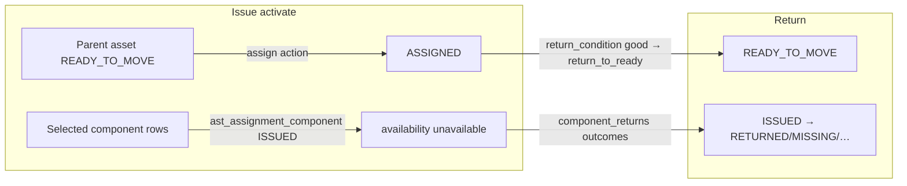

# IT Assets — Components Part 1.5: Assignment/Return & Operational Status Analysis

**Date:** 2026-08-31  
**Scope:** Read-only. Prepares for linking a real `ast_asset` as a component of another asset. No schema or code proposals.  
**Depends on:** [it-asset-components-analysis.md](./it-asset-components-analysis.md) (Part 1).

## Core distinction (locked)

| Concern | What exists today |
|---|---|
| IT **Assignment** | Custody of one **parent** `ast_asset` to employee/dept/…; optional **issued accessories** = lightweight `ast_asset_component` rows via `ast_assignment_component` |
| IT **Return** | Single path: `POST …/asset-assignments/{id}/return` → `AssignmentService.return_assignment` |
| IT **Unassign** | **Does not exist** for IT assets (unlike Non-IT’s `/unassign`) |
| Ops status | Orthogonal to lifecycle `status`; central engine + transition matrix (5 values) |
| Asset↔Asset link | **None** — no `ast_asset` row FKs to another `ast_asset` |



---

## Summary table

| Concept | Backend | Frontend | Status |
|---|---|---|---|
| Issue form sections | Assignment create/update + approve → activate | `ASSIGNMENT_FORM_SECTIONS` in `wizard-types.ts` | **Real** (single-page form, not gated steps) |
| Issued Items | `component_ids` on draft; `activate_issued` on approve | `IssuedItemsStep` + `listComponents(assetId)` | **Lightweight components only** |
| Return | `AssignmentService.return_assignment` | Return wizard → `returnAssignment` | **Single return path** |
| Parent ops on return | `apply_action` from return condition | — | good→READY; outdated→RETIRED; dead→PENDING_DISPOSAL |
| Lightweight component on return | Only `ast_assignment_component` updated | Return “Components” step | Component **row status stays active** |
| Ops state machine | `operational_status_rules` + engine | `OPERATIONAL_STATUS_*` in `asset-status.ts` | **Central, closed set of 5** |
| `ast_asset_component` → child asset | Only parent `asset_id` (+ optional `product_id`) | — | **No child-asset FK today** |
| Parent dispose vs components | `_assert_no_active_components` | — | Blocks parent dispose while actives exist |
| Cascade dispose asset↔asset | — | — | **No precedent** |
| Type eligibility flag | `ast_asset_type.requires_hardware_config` exists | Types admin | Adding another bool is **additive / straightforward** |
| Asset↔Asset reference | Transactional FKs *to* asset only | — | **New relationship type** if added |

---

## 1. Assignment wizard — full flow

### Issue (assign) — UI

Not a multi-route wizard; one form with section anchors (`ASSIGNMENT_FORM_SECTIONS`):

| Section id | Label | Primary files |
|---|---|---|
| `allocation` | Allocation & Employee | `assignment-wizard.tsx`, employee step |
| `asset` | Asset | `steps/asset-step.tsx` — eligible assets = ops `READY_TO_MOVE` + lifecycle active/in_maintenance (`isAssignmentEligibleAsset`) |
| `issued-items` | Issued Items | `steps/issued-items-step.tsx` |
| `delivery` | Delivery (DC paperwork) | delivery fields / DC mode |
| `review` | Review & Submit | review + submit |

Containers: `assignment-wizard-container.tsx`, mapper `assignment-wizard-mapper.ts`, API `assignment-frontend-service.ts`.

### Issued Items — how components are listed/selected/written

1. **List:** `assignmentFrontendService.listComponents(assetId)` → `componentService.search({ asset_id, status: "active", include_availability: true })`.  
2. **UI:** Checkboxes of `WizardIssuedItemOption` — label = **type label** (Charger, …), plus name/serial; `disabled` if `availability === "unavailable"`.  
3. **Draft write:** Selected ids → `issuedItemIds` → create/update body `component_ids: UUID[]`.  
4. **Backend:** `AssignmentService.create/update` → `AssignmentComponentService.set_components` → draft `ast_assignment_component` rows.  
5. **On approve/activate:** `_activate_assignment` → `activate_issued` stamps `issued_at` / ISSUED, then `AssetOperationalStatusService.apply_action(..., action="assign")` → parent **ASSIGNED**.

Lightweight `ast_asset_component.status` stays **`active`**; custody is on the join table.

### Return / “unassign”

| Item | Finding |
|---|---|
| Endpoint | `POST /assets/asset-assignments/{row_id}/return` (`asset.assignment:return`) |
| Service | **Only** `AssignmentService.return_assignment` — no separate IT unassign/reassign API |
| Non-IT | Has `/non-it/.../unassign` — **not** reused for IT |

**Return sequence (same UoW):**

1. Validate return readiness + `return_condition` (`good` \| `outdated` \| `dead`).  
2. `AssignmentComponentService.reconcile_return` — if any ISSUED lines, **require** `component_returns` covering all; set join-row `issue_status` to `RETURNED|MISSING|DAMAGED|RETAINED`. **Does not** change `ast_asset_component.status`.  
3. Lock parent asset; `AssetOperationalStatusService.apply_action` with mapped action (below).  
4. Mark assignment returned (`returned_at`, assignment status returned).  
5. Clear custodian when applicable; auto-cancel linked DC.

**Parent `operational_status` on return** (`assignment_return_condition.py`):

| return_condition | action | Target ops |
|---|---|---|
| `good` | `return_to_ready` | `READY_TO_MOVE` |
| `outdated` | `retire` | `RETIRED` |
| `dead` | `mark_pending_disposal` | `PENDING_DISPOSAL` |

**Return wizard FE** (`RETURN_WIZARD_STEPS`): summary → condition → **components** → remarks → review (`return-wizard-container.tsx`).

Other assignment exits that touch components but are **not** “return to ready”:

- Reject / cancel draft → `release_issued` (soft-delete join rows; components selectable again).  
- No “reassign” API — new assignment after return (or cancel).

---

## 2. Asset `operational_status` — state machine

### Values (exactly five)

From `AssetOperationalStatus` / FE `OPERATIONAL_STATUS_VALUES`:

1. `READY_TO_MOVE`  
2. `ASSIGNED`  
3. `RETIRED`  
4. `PENDING_DISPOSAL`  
5. `DISPOSED`  

DB check on `ast_asset` matches this set. Orthogonal to lifecycle `status` (draft/active/disposed/…).

### Formal transition machinery — **yes, central**

| Layer | File | Role |
|---|---|---|
| Rules | `domain/operational_status_rules.py` | Allowed / blocked / terminal sets |
| Engine | `engines/asset_operational_status_engine.py` | Pure validation |
| Validator | `operational_status_validator.py` | Named actions → targets |
| Service | `asset_operational_status_service.py` | **Sole workflow writer** for ops transitions (`transition` / `apply_action`); `initialize_ready_to_move` is special-cased |

Allowed edges (locked comments in rules file):

- READY → ASSIGNED  
- ASSIGNED → READY \| RETIRED \| PENDING  
- RETIRED → PENDING (Start Disposal)  
- PENDING → DISPOSED \| READY (Reinstate)  
- DISPOSED terminal  

Named actions: `assign`, `return_to_ready`, `retire`, `mark_pending_disposal`, `start_disposal`, `reinstate`, `complete_disposal`.

Writers today: Assignment activate/return, `RetirementService.start_disposal`, `ReinstateService`, `DisposalService.post` → `complete_disposal`. Registration activate uses `initialize_ready_to_move` (not the matrix).

### Frontend locations that encode the closed ops set

**Canonical UI source:** `apps/web/src/components/assets/shared/asset-status.ts`  
(`OPERATIONAL_STATUS_VALUES`, labels, badge classes, help text, eligibility/gate helpers).

**Also must be updated for any new value** (non-exhaustive but product-critical):

| Area | Files |
|---|---|
| Inventory presets / pills | `inventory.types.ts` (`INVENTORY_PRESETS`, `PRESET_OPERATIONAL_STATUS`, pill classes) |
| Status badge | `shared/status-badge.tsx` |
| Inventory filters / chips / search | `inventory-filter-bar.tsx`, `inventory-filter-chips*.tsx`, `inventory-search-typeahead.tsx`, `inventory.mapper.ts` |
| Permissions / menus | `navigation/inventory-permissions.ts` |
| Detail / disposal / reinstate | `asset-detail-workspace.tsx`, `start-disposal-confirm-dialog*.tsx`, `reinstate-confirm-dialog*.tsx`, `asset-disposal-workspace.tsx` |
| Dashboard / ops | `dashboard.mapper.ts`, ops container/fetch (KPI → presets) |
| Excel import ops column | `excel-import.types.ts`, validator |
| Exports | `inventory/export/*` |
| Assignment eligibility | `assignment-frontend-service.ts`, `asset-step.tsx`, `isAssignmentEligibleAsset` |
| Shared export | `shared/index.ts` re-exports |

Plus many **tests** that hardcode the five statuses.

### Cost of adding e.g. `IN_USE_AS_COMPONENT`

**Not** “just a label.” Requires at least:

1. Python enum + frozenset + **DB check constraint** migration on `ast_asset.operational_status`  
2. New allowed edges in `operational_status_rules.py` + action names in validator  
3. Every FE closed list / preset / gate that assumes five values  
4. Policy decisions: assign eligibility, transfer/maintenance blocks (`OPS_BLOCKED_FOR_MAINTENANCE_OR_TRANSFER`), disposal/reinstate gates, dashboard KPIs, Excel allowed ops  

Reports/dashboards that filter by ops will treat unknown values as uncategorized unless updated. **Permission codes are not per-ops-status**, but inventory action gates **are** status-keyed.

---

## 3. Component model — linkage capability

### Confirm: no FK to a “child” asset today

`ast_asset_component` columns relevant to linkage:

- `asset_id` → **parent** `ast_asset` (required)  
- `product_id` → `master_product` (optional)  
- **No** `component_asset_id` / child asset pointer  

Part 1 stands.

### If Part 2 adds nullable `component_asset_id` → `ast_asset.id`

| Existing mechanism | Awareness needed |
|---|---|
| `_assert_no_active_components` / dispose gate | Decide: child-asset rows still “active components”? Cascade order vs block |
| `list_code_history` / replace same `component_code` | History still by `(asset_id, component_code)`; child asset identity is separate |
| Active code uniqueness `(asset_id, component_code)` WHERE active | Still applies; generated codes must remain unique per parent |
| Active serial uniqueness (company) | Child asset already has its own `serial_number` on `ast_asset` — risk of dual serial semantics |
| Assignment issue lock / availability | Today keys off `ast_asset_component.id`; child asset ops must not stay ASSIGNED to someone else |
| Parent asset detail / inventory accessories | Currently show type + name + serial from component row |
| Tree API | Flat under parent; may need to expose linked asset code/name |

Also: prevent cycles (A component of B component of A), and prevent attaching an asset that is itself a parent with actives / currently ASSIGNED — product rules for Part 2.

---

## 4. Disposal — both directions

### Parent blocked while active components

```text
DisposalService._assert_no_active_components(ctx, asset_id)
→ AssetComponentRepository.list_by_asset(..., include_inactive=False)
→ DisposalValidationError if any active
```

Called from `create`, `submit`/`approve` paths, and **`post`** (before finance + ops complete).

**Callable in-transaction?** It is an instance method on `DisposalService` using the same `Session`. Another service in the same request can:

- Instantiate `DisposalService(db)` and call it, or  
- Call `AssetComponentRepository.list_by_asset` directly  

It does **not** open a nested transaction by itself — it participates in the caller’s UoW. For cascade-dispose of a **linked child asset**, Part 2 must decide whether to drive full `DisposalService` lifecycle (draft→…→`post`) or a narrower ops-only path; today **complete_disposal** is tied to disposal **post**.

### Cascade dispose precedent

**None** for asset→asset. No “dispose linked assets” helper. Closest cousins: assignment return updates one asset’s ops; Non-IT dispose is single-row. **Cascade would be new territory.**

### Plain single-asset dispose path (no assignment, no components)

1. Ops typically already `RETIRED` or `PENDING_DISPOSAL` (Start Disposal from retired).  
2. `DisposalService.create` (draft) — asserts no active components; branch matches asset.  
3. submit → approve (workflow or legacy).  
4. `post` → finance journal → lifecycle dispose on asset → `apply_action(complete_disposal)` → ops **DISPOSED**; master asset marked disposed if linked.

Lightweight **component dispose** today: `AssetComponentService.dispose` only flips **component** row to `disposed` — **does not** call `DisposalService` and does not change any `ast_asset` ops.

---

## 5. Eligibility filtering precedent (`eligible_as_component`)

`ast_asset_type` (`0506` / model):

- `name`, `active`, `requires_hardware_config` (bool), `description`  
- Company-scoped unique name; soft delete; version  

Adding `eligible_as_component boolean NOT NULL DEFAULT true` (or `false` with seed overrides) is the **same shape** as `requires_hardware_config`: additive column + service create/update + Types admin checkbox + list/filter. No structural blocker.

Seed policy (e.g. Laptop `false`, Monitor/Mouse/Keyboard `true`) is a Part 2 product choice — the table can carry it without hardcoding `"Laptop"` in Components code.

---

## 6. Where `component_code` / `component_name` surface today

| Surface | Uses code? | Uses name? |
|---|---|---|
| Components install form | Required input | Required input |
| Components register table | Column | Column |
| Components detail / edit / replace / hierarchy / history panels | Yes | Yes |
| Assignment Issued Items | Label is **type**; option carries `componentName` | Shown in option metadata |
| Return wizard component lines | Fallback label `type · name \|\| code` | Yes |
| Asset detail accessories card | — | Name (+ type label) |
| Inventory accessories enrichment | — | `componentName` (+ type, serial) |
| API types / `componentService.*` | Required on install DTO | Required on install |
| Assignment component API enrich | Includes `component_code` | Includes `component_name` |
| Disposal error text | Lists active `component_code`s | — |
| Demo seed | `CMP-BATT` | Battery |

**Not** on Excel IT import as a first-class column; **not** a dashboard KPI dimension.

If Part 2 hides code/name from Install + register UI but keeps them required in DB/API, silent generation must still feed: uniqueness, history lineage, disposal error messages, assignment enrich, hierarchy/history panels (unless those panels are redesigned to show linked asset code/name instead).

---

## 7. Precedent for one `ast_asset` referencing another

Searched Asset models for FKs to `asset.ast_asset.id`: assignment, transfer, disposal, maintenance, warranty, insurance, location, component (**parent only**), DC, documents, meters, etc. — all **outbound from satellite tables to one asset**.

**No** `ast_asset` column references another `ast_asset`. Transfers move **one** asset’s branch/location; they do not link two asset PKs as kit/parent-child.

**Conclusion:** an asset-as-component pointer is a **genuinely new relationship type** in this schema, not reuse of an established pattern.

---

## What Part 2 needs to design, given these constraints

1. **New nullable FK** on `ast_asset_component` (e.g. `component_asset_id` → `ast_asset.id`) — nullability, RESTRICT vs SET NULL, uniqueness (can the same child asset appear on two parents? only one active?), cycle prevention.  

2. **New ops status vs reuse** — If “attached as component” needs a distinct ops value (e.g. `IN_USE_AS_COMPONENT`), Part 2 must extend: enum, DB check, transition matrix + actions, and **all FE closed lists** starting from `asset-status.ts` + `inventory.types.ts`. Alternatively, design without a new status (e.g. keep READY but block assign via other flags) — must be explicit.  

3. **Transition graph** — Exact edges: attach (READY → ?), parent return auto-detach (? → READY), cascade dispose (? → DISPOSED), and whether ASSIGNED parent’s accessories that are real assets also move.  

4. **`eligible_as_component` (or equivalent) on `ast_asset_type`** — bool column, admin UI, seed (Laptop ineligible), filter for attach picker; **no** name hardcoding.  

5. **Install UX without user code/name** — Silent `component_code` (and name?) generation rules that satisfy active uniqueness + history; what the register/detail/history UI shows instead (linked asset code/name).  

6. **Assignment Issued Items** — Whether real asset-components appear alongside lightweight rows; what gets written (`component_ids` only vs also child asset ops); return `component_returns` semantics for asset-linked rows.  

7. **Parent return auto-detach** — Hook inside `return_assignment` (after/before ops apply) to detach child assets and set their ops to READY; define behavior for return_condition outdated/dead on the **parent** vs children.  

8. **Cascade dispose** — On component dispose of an asset-linked row: call which DisposalService / ops path for the child asset; ordering vs `_assert_no_active_components` on parent; finance/workflow requirements for “silent” cascade.  

9. **Assignment conflict** — Child asset must not be ASSIGNED (or ineligible) when attached; attach must not leave child assignable as a standalone asset.  

10. **Disposal gate updates** — Whether active asset-linked components still block parent dispose the same way; whether disposing parent should be forbidden until children detached or cascaded.  

11. **No existing asset↔asset pattern** — Document migration + domain rules as greenfield; do not assume Transfer/Assignment kit semantics.  

12. **Inventory / detail / accessories consumers** — Update enrichment to prefer linked asset identity when `component_asset_id` is set; keep lightweight path for classic rows during coexistence.  

---

*End of Part 1.5. No code or schema changes were made.*
