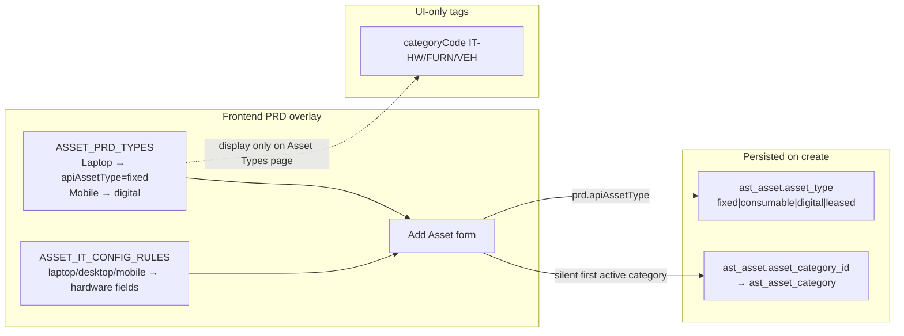

# IT Assets — Asset Type & Category Part 1 (Analysis Report)

**Date:** 2026-08-31  
**Scope:** Read-only map. No schema, migration, or code proposals (those are Part 2).  
**Status:** Ready for review — Part 2 blocked on sign-off of this report.

## Core distinction (locked from codebase)

There are **three different “type/category” concepts** that share overlapping English names:

| Layer | What users see | What is persisted | Admin-manageable today? |
|---|---|---|---|
| **A. PRD type catalog** | Laptop, Desktop, Monitor, … on Add Asset + `/assets/asset-types` | **Nothing under that name.** Only maps → `ast_asset.asset_type` enum | **No** — hardcoded FE array |
| **B. API `asset_type` enum** | Inventory filter “Fixed / Digital / …” | `ast_asset.asset_type` ∈ `{fixed, consumable, digital, leased}` | **No** — DB check constraint + validator frozenset |
| **C. Asset Category master** | Formerly “Category” dropdown (“IT Equipment”); Categories CRUD page | `ast_asset_category` + required `ast_asset.asset_category_id` | **Yes** — full CRUD API (UI nav recently hidden) |

The `IT-HW` / `FURN` / `VEH` badges on `/assets/asset-types` belong to layer **A only** (`categoryCode` on the hardcoded catalog). They are **not** rows in `ast_asset_category` and are **not** written to the database.



---

## Summary table

| Concept | Backend source | Frontend source | Status |
|---|---|---|---|
| PRD type names (Laptop, Desktop, …) | **None** — no `ast_asset_type` table | `ASSET_PRD_TYPES` in `apps/web/src/config/asset-prd-types.ts` | **Hardcoded** |
| `/assets/asset-types` page | None | `AssetTypesWorkspace` — search/filter over `ASSET_PRD_TYPES` | **100% read-only** UI catalog |
| Hardware field show/require | None | `ASSET_IT_CONFIG_RULES` keyed by PRD **id** (`laptop`/`desktop`/`mobile`) in `asset-it-config-rules.ts` | **Behavior** keyed on PRD id, not enum |
| API `asset_type` column | `ast_asset.asset_type` + `ck_ast_asset_type` | Mapped from `apiAssetType`; inventory filter uses Fixed/Digital/… | **Real enum** (4 values); no subtype behavior |
| Category tags `IT-HW`/`FURN`/`VEH` | **None** | `categoryCode` field on `ASSET_PRD_TYPES` | **Display-only** on Asset Types page |
| Asset Category master | `asset.ast_asset_category` | Categories workspace + API; Add Asset auto-picks first active | **Real table**; still **required** on create |
| Add Asset “Category” dropdown | Was `listAssetCategories` → `asset_category_id` | Recently removed from Add Asset UI; silent default remains | **Same concept C**, not `IT-HW` tags |
| IT asset codes | `CODE_PREFIXES[ASSET] = ("AST-", 6)` — company-wide sequence | — | **Independent** of type/category |
| Non-IT type master | `ast_nonit_asset_type` (+ `assignment_mode`, `prefix`, `category`) | Full admin CRUD | **Separate** mechanism (reference pattern) |

---

## 1. Is “Asset Type” a table, an enum, or both?

### Verdict: **both layers exist, but they are not the same thing**

**There is no IT Asset Type master table.** No `ast_asset_type`, no migration seed of the nine PRD rows, no create/edit/delete API for Laptop/Desktop/etc.

What exists instead:

### 1a. Hardcoded PRD catalog (frontend only)

File: `apps/web/src/config/asset-prd-types.ts`

Nine rows:

| id | typeName | categoryCode (UI tag) | apiAssetType |
|---|---|---|---|
| laptop | Laptop | IT-HW | fixed |
| desktop | Desktop | IT-HW | fixed |
| monitor | Monitor | IT-HW | fixed |
| keyboard | Keyboard | IT-HW | fixed |
| mouse | Mouse | IT-HW | fixed |
| mobile | Mobile Device | IT-HW | **digital** |
| furniture | Office Furniture | FURN | fixed |
| vehicle | Vehicle | VEH | fixed |
| other | Other | *(blank)* | fixed |

File header comment: *“Interim PRD asset type catalog until backend master exists.”*

### 1b. `/assets/asset-types` — confirmed read-only

`AssetTypesWorkspace` (`apps/web/src/components/assets/asset-types-workspace.tsx`):

- Renders `ASSET_PRD_TYPES` in a table.
- Search only; **no** Create / Edit / Delete / Activate controls.
- Copy: *“This list is UI guidance…”* / *“Forms map these labels to the backend asset_type enum.”*
- `modules.ts` `apiPath` for `asset-types` points at `/assets/assets` (not a types API) — further evidence it is not backed by a resource.

### 1c. Backend `asset_type` = 4-value classification enum

Persisted on every IT asset:

```text
ast_asset.asset_type IN ('fixed','consumable','digital','leased')
  — ck_ast_asset_type (models/asset.py)
  — RegistrationValidator.ASSET_TYPES / incoming VALID_ASSET_TYPES
```

**What “API ASSET_TYPE” / `apiAssetType` controls today:**

| Controls | Does **not** control |
|---|---|
| Value stored on `ast_asset.asset_type` | Hardware Processor/RAM/Storage visibility (that uses PRD **id**) |
| Inventory / list filter equality match | Code prefix / numbering |
| Validation that create/import/incoming payloads are one of the four strings | Warranty, insurance, depreciation, meters, disposal rules |
| Display in detail / portal / dashboards as the type string | Permissions / RBAC |

**Important:** Backend code does **not** branch business logic on `fixed` vs `digital` vs `consumable` vs `leased` beyond “is this one of the four allowed values?” and list filtering. Mobile Device → `digital` is a **label/classification stored for filtering**, not a behavior switch.

**PRD type name is never persisted.** After Add Asset, the DB cannot answer “was this a Laptop or a Monitor?” — only `asset_type=fixed` (and free-text `asset_name` / `configuration`).

---

## 2. Every place Asset Type value drives behavior (not just display)

### 2.1 Keyed on PRD type **id** / name (frontend hardcoded)

| Location | What branches | Keyed on |
|---|---|---|
| `asset-it-config-rules.ts` → Add Asset | Show/require Processor, RAM, Storage; Intel generation | **PRD id** (`laptop`, `desktop`, `mobile` → COMPUTER; all others → PERIPHERAL) |
| `asset-add-form.tsx` | Clears hardware fields on type change; validates per `getItConfigRule`; help text *“Hardware configuration fields apply to Laptop, Desktop, and Mobile Device types”* | PRD id via rules map |
| `asset-add-form.tsx` submit | Sets `asset_type` from `prd.apiAssetType` | PRD row → enum |
| Incoming prefill on Add Asset | Maps `prefill.asset_type` (enum) → first PRD with matching `apiAssetType` | **Lossy** — many PRDs share `fixed`, so prefill may pick Laptop for any fixed asset |

**This is the main Part 2 risk:** behavior today is **name/id-keyed** on a closed FE list, same class of problem Non-IT solved with `assignment_mode`.

### 2.2 Keyed on API enum `fixed|consumable|digital|leased`

| Location | Behavior | Notes |
|---|---|---|
| `RegistrationValidator` / incoming registration | Reject unknown values | Validation only |
| `AssetRepository.search` / inventory mapper | Filter `WHERE asset_type = ?` | Filter, not branching |
| Inventory filter bar | Options Fixed / Consumable / Digital / Leased | Filters enum, **not** Laptop/Desktop |
| Excel import defaults | Always `asset_type: "fixed"` | Ignores PRD catalog entirely |
| Registration workspace (legacy draft UI) | Dropdown of four enum values | Does **not** use PRD names |
| Asset detail / portal / ops dashboard | Display `asset.asset_type` | Display |

No warranty/insurance/depreciation/meter/disposal/permission code was found that switches on `asset_type` value.

### 2.3 Explicit non-hits (searched, no type-name behavior)

| Area | Finding |
|---|---|
| Excel bulk import column mapping | No PRD type column. Name column is labeled **“Laptop Name”** (legacy copy → `asset_name`). Category column maps to **Category master**, not `IT-HW`. Type always defaulted to `fixed`. |
| Depreciation | Uses per-asset `depreciation_method` / `useful_life_months`. Category holds *optional defaults* on the category row itself, but asset create does **not** auto-copy those defaults from category (verified in `AssetService.create` path). |
| Warranty / insurance | No `asset_type` / category branching in those services. |
| Dashboard ops summary | Groups by location/status/etc.; not by PRD type. Reports have `by_category` for **Category master** (see §3). |
| Permissions / RBAC | `asset.category:*` exists for Category CRUD. No permission scoped by type name or enum value. |
| Code generation | IT assets: company-wide `AST-######` via `CODE_PREFIXES` — **independent** of type and category. (Contrast Non-IT: prefix per type.) |

---

## 3. Category — full map (two different “Category” concepts)

### 3.1 Concept C1 — PRD `categoryCode` (`IT-HW` / `FURN` / `VEH`)

- Defined **only** on `ASSET_PRD_TYPES.categoryCode`.
- Shown as the “Category” column on `/assets/asset-types`.
- Helper `prdTypesForCategory()` exists to filter PRD types by that code — **no current consumer** found outside the catalog file itself (dead helper after UI changes).
- **Never written to DB. Never used for numbering, permissions, Excel, or reporting.**

Removing these tags from the Asset Types page is UI-only and cannot silently break backend flows.

### 3.2 Concept C2 — `ast_asset_category` (real master)

**Definition:** table `asset.ast_asset_category` (migration `0246_ast_asset_category`), fields include:

- `category_code`, `category_name` (unique per company on code)
- optional `default_useful_life_months`, `default_depreciation_method`, GL account ids
- `status` active/inactive
- `asset_domain` IT / NON_IT / NULL (added in `0500`)

**Demo seed** (`seed_demo_modules.py`): typically `category_code="IT"`, `category_name="IT Equipment"` — **not** `IT-HW` / `FURN` / `VEH`.

**Relationship to Type:** independent FK. Type (enum or PRD) does **not** determine category. Historically the Add Asset form had a **separate** Category dropdown; after recent UX work it silently assigns the **first active** IT-domain category. PRD `categoryCode` is **not** used to pick that row.

### 3.3 Are the Add Asset “Category” and Asset Types “Category” the same?

**No.**

| | Asset Types column | Add Asset (former) Category dropdown |
|---|---|---|
| Source | Hardcoded `categoryCode` | `GET /assets/asset-categories` → `ast_asset_category` |
| Example values | `IT-HW`, `FURN`, `VEH` | `IT` / “IT Equipment” (seed) |
| Persisted? | No | Yes → `asset_category_id` |

### 3.4 Every place Category master (C2) is read / required / filtered

| Touchpoint | Role |
|---|---|
| `AssetCreate` / registration / incoming / Excel defaults | **Required** `asset_category_id`; must exist, same company, **active** |
| `CategoryValidator.validate_deactivate` | Blocks deactivate if operational assets still reference it |
| Asset list / inventory filters | `asset_category_id` query param still supported (UI control recently removed; chips/count may still honor stale `categoryId`) |
| Asset reports | `group_assets_by_category` / `by_category`; report rows can store `category_id` |
| Information portal | Resolves `category_code` / `category_name` for display |
| Master Data adapter | Copies category **code/name** (or falls back to `asset_type` enum) into `master_asset.asset_category` string on approve/link |
| Excel import | Optional per-row “Category” column resolved by label → id; else batch `defaults.asset_category_id` |
| Permissions | `asset.category:read|create|update` — CRUD on the master, not per-asset scoping |
| Asset detail `isItAssetCategory()` | Heuristic on category **code/name** (`IT*`, `*HW*`, name contains hardware/computer) to show **Device Discovery** panel — **behavior** keyed on Category master strings, not PRD tags |
| Domain filter | Category list defaults `asset_domain=IT`; assets also have `asset_domain` (IT vs Non-IT register split) — orthogonal to PRD types |

### 3.5 Removal risk for Category (C2)

Removing Category **entirely** is **not** a display cleanup. It would break or require redesign of:

1. Required create/import/incoming fields and validators  
2. Deactivate guard + report aggregation  
3. Master-asset link category string  
4. Detail-page discovery visibility heuristic  
5. Existing FK data on every `ast_asset` row  

Removing only the **PRD tags** (`IT-HW` etc.) and the Categories **nav** is largely safe; removing the **table/FK** is a schema + data migration decision.

---

## 4. Compare against Non-IT’s pattern

| Dimension | IT today | Non-IT today |
|---|---|---|
| Type storage | No type master; PRD names FE-only; enum on asset | `ast_nonit_asset_type` table, FK `asset_type_id` on each asset |
| Admin CRUD | Types page read-only | Full create/edit; active flag; peek next code |
| Behavior classification | Hardcoded map by PRD **id** (`ASSET_IT_CONFIG_RULES`) | `assignment_mode` ∈ `EMPLOYEE\|LOCATION\|BOTH` on the type row |
| Secondary grouping | PRD `categoryCode` (unused) + separate `ast_asset_category` | Enum `category` on type (`FURNITURE`, `APPLIANCE`, …) — UX/filter grouping, not assignment logic |
| Code numbering | Global `AST-######` | Per-type `prefix` + gapless sequence (`CH001`, …) |
| Structural similarity | **None** shared with Non-IT type table | Separate, newer design |

### Structurally missing to match Non-IT’s “admin-manageable + behavior-by-field” pattern

1. A real IT type master table (name, active, company scope, audit columns).  
2. FK from `ast_asset` to that type (today only enum + category FK).  
3. A **behavior field** (or fields) replacing `ASSET_IT_CONFIG_RULES` keyed by id — e.g. something like `hardware_config_mode` / `requires_hardware` analogous to `assignment_mode`.  
4. (Optional, if desired) per-type code `prefix` — IT does not have this today; would be a product choice, not a parity requirement.  
5. Migration/backfill strategy for existing assets that only have `asset_type=fixed|digital|…` and no Laptop/Monitor identity.  
6. Decision on what happens to `ast_asset_category` and the 4-value enum once a real type master exists (keep, collapse, or redefine).

Non-IT’s type `category` enum is **not** the same as IT’s Category master; it is closer to the display `categoryCode` on the PRD catalog.

---

## 5. Other hardcoded IT classification constants (adjacent hits)

| Constant / file | Role | Related to Type/Category? |
|---|---|---|
| `apps/web/src/config/asset-prd-types.ts` | PRD type catalog | **Primary** |
| `apps/web/src/config/asset-it-config-rules.ts` | Hardware visibility + Processor/RAM/Storage/Intel option lists | **Primary behavior** |
| `DEFAULT_ASSET_TYPE_OPTIONS` in `inventory-filter-bar.tsx` | Fixed/Consumable/Digital/Leased filter labels | Enum layer |
| `ASSET_TYPES` in `asset-registration-workspace.tsx` | Same four enum values | Enum layer |
| `isItAssetCategory()` in `domain/asset-prd.ts` | Heuristic string match on category code/name → show discovery UI | Category master |
| `CODE_PREFIXES` / `AstEntityType` in `domain/enums.py` | Document/asset code prefixes | Adjacent numbering; not type-keyed for IT |
| Excel “Laptop Name” column label | Maps to `asset_name` | Naming leftover; not type logic |
| Non-IT enums (`NonItAssignmentMode`, `NonItAssetTypeCategory`, location kinds) | Non-IT only | Reference only |
| ~~`asset-site-catalog.ts`~~ | Removed in Location Part 2 | Historical parallel (hardcoded catalog → DB master) |

No other IT-side hardcoded “classification catalog” files were found in `apps/web/src/config/` beyond the two type-related files above.

---

## What must be decided before Part 2

1. **What is the product meaning of “Asset Type”?**  
   Persist the nine PRD names (Laptop, …) as first-class master rows, or only keep the 4-value financial/classification enum and treat PRD names as disposable UX labels?

2. **Behavior classification for new admin-created types**  
   Today hardware fields only appear for `laptop`/`desktop`/`mobile` ids. If admins can add “Tablet” or “Server”, what field drives hardware UI — a Non-IT-style enum (e.g. `requires_hardware` / `config_profile`), free-form flags, or keep name-based rules (not recommended)?

3. **Fate of API enum `fixed|consumable|digital|leased`**  
   Keep as orthogonal classification on the asset or type row, derive from the new type master, or retire once PRD types are persisted? Mobile → `digital` is the only non-`fixed` PRD mapping today; is that intentional product meaning?

4. **Fate of `ast_asset_category` (Category master)**  
   Remove entirely (schema + backfill), keep as silent internal depreciation/GL bucket, or merge into the new type master? Required FK and report `by_category` make this a hard dependency.

5. **Clarify naming in UX**  
   Confirm product language: eliminate “Category” for both PRD tags **and** the Category master, or keep Category master under a different label (e.g. “Depreciation class”)?

6. **Existing asset identity gap**  
   Historical rows have no Laptop vs Monitor identity. Part 2 backfill options: leave unknown, map all `fixed` → “Other”, infer from `asset_name`/`configuration`, or require manual classification.

7. **Inventory filter semantics**  
   Today “Asset type” filter means enum (Fixed/Digital). After Part 2, should it filter by master type name instead (or both)?

8. **Excel / incoming / registration workspace parity**  
   Excel always forces `asset_type=fixed` and never captures PRD type. Should Part 2 add a Type column, and should the legacy registration draft UI switch from enum dropdown to the new master?

9. **Code numbering**  
   Keep global `AST-` sequences, or adopt Non-IT-style per-type prefixes? (No current IT dependency forces either.)

10. **Discovery panel heuristic**  
    `isItAssetCategory()` depends on Category master naming. If Category is removed, what replaces the gate for Device Discovery UI?

11. **Asset Types Configuration page**  
    Become real CRUD (like Non-IT Types), or disappear once types are editable elsewhere?

12. **Domain boundary**  
    Furniture/Vehicle appear in the **IT** PRD catalog today. Should Part 2 keep them under IT, migrate them to Non-IT types, or drop them from IT once Category/Non-IT split is clean?

---

*End of Part 1. No code or schema changes were made in this pass.*
