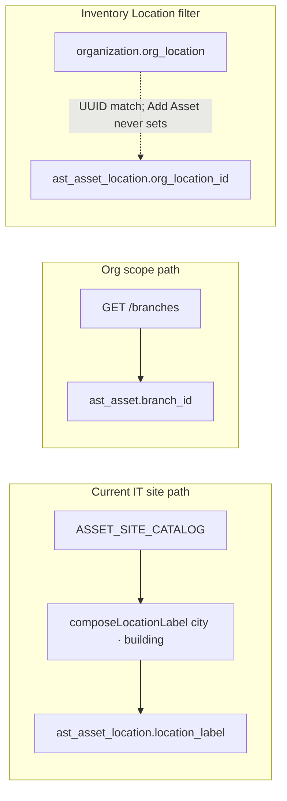

# IT Assets — Location Master Part 1 (Analysis Report)

**Date:** 2026-08-30  
**Scope:** Read-only map. No schema, migration, or code proposals (those are Part 2).  
**Status:** Ready for review — Part 2 blocked on sign-off of this report.

## Core distinction (locked from codebase)

- **Branch** = Organization scope (`organization.org_branch` → mandatory `branch_id` on `AstTransactionMixin` tables). Used for RBAC, dashboard grouping, DC pinning, transfer destination.
- **Site (Location → Building)** = product UX today via hardcoded `apps/web/src/config/asset-site-catalog.ts` → free-text `ast_asset_location.location_label`. Not the same as Branch and not the same as Organization `org_location`.

---

## Summary table

| Concept | Backend source | Frontend source | Status |
|---|---|---|---|
| Add Asset Location (city) | None (no DB) | `ASSET_SITE_CATALOG` in `apps/web/src/config/asset-site-catalog.ts` via `apps/web/src/components/assets/asset-add-form.tsx` | **Hardcoded** |
| Add Asset Building | None (no DB) | Same catalog `buildings[]` via `buildingsForCity` — select, not freeform | **Hardcoded** |
| Persisted site string | `ast_asset_location.location_label` | `composeLocationLabel` → e.g. `"Mumbai · CRC-1"` | **Real write** of opaque text |
| Asset org branch | `ast_asset.branch_id` → `org_branch` | Silent: first `/branches` option (or incoming prefill); **no Branch picker on Add Asset** | **Real**, background |
| `org_location_id` on create | Column exists, nullable, **no FK** | Add Asset **never sends** it | **Unused** on registration path |
| Config → Locations sidebar | — | `AssetLocationsPlaceholderWorkspace` (`apps/web/src/components/assets/asset-locations-placeholder-workspace.tsx`) at `/assets/locations` | **Placeholder** |
| Per-asset location history UI | `GET/POST /assets/asset-locations` | `apps/web/src/components/assets/asset-location-workspace.tsx` | **Real** (not in IT Configuration nav) |
| Inventory Location **column** | Current `location_label` | `fetchCurrentAssetLocationLabels` in `apps/web/src/components/assets/asset-inventory-container.tsx` | **Real** |
| Inventory Location **filter** | `org_location` UUID ↔ `org_location_id` | `listLocationOptions` in `apps/web/src/lib/org-options.ts` → `/locations` | **Real but disconnected** from catalog / Add Asset |
| Org Locations page | `organization.org_location` | Organization module `/locations` | **Independent** — Asset Location Master must not mutate it |
| Non-IT locations | `ast_nonit_location` | Non-IT admin | **Independent** (out of Part 2 IT master) |

---

## 1. Add Asset form — current source (confirmed)

**Location dropdown** (Mumbai / Delhi / Noida / Gurgaon / Bangalore / Hyderabad / Pune): sourced **only** from `ASSET_SITE_CATALOG` in `apps/web/src/config/asset-site-catalog.ts`. Not any DB table.

**Building:** also hardcoded per city in the same catalog (`buildings: [{ id, label }]`). Cascading select via `buildingsForCity(city_id)` — **not** freeform text.

**On submit** (`apps/web/src/components/assets/asset-add-form.tsx` ~L235–250):

| Field sent | Value | Lands on |
|---|---|---|
| `location_label` | `composeLocationLabel(city_id, building_id)` → `` `${city.label} · ${building.label}` `` | `ast_asset_location.location_label` via `AssetService._persist_registration_location` → `LocationService.create` |
| `branch_id` | Org branch UUID from `listBranchOptions()` — auto first branch or incoming prefill | `ast_asset.branch_id` **and** copied onto the new location row’s `branch_id` |
| `org_location_id` | **Not sent** | Stays `NULL` |
| `city_id` / `building_id` | UI-only | Never persisted as IDs |

Backend path: `apps/api/src/modules/asset/service/asset_service.py` pops `location_label`, creates asset, then `_persist_registration_location(..., branch_id=..., location_label=...)`.

---

## 2. Every `branch_id` / `org_branch` touchpoint (Asset-related)

### Foundation

- `BranchMixin` (`apps/api/src/database/mixins.py`): `branch_id` NOT NULL → `organization.org_branch.id`.
- `AstTransactionMixin` (`apps/api/src/modules/asset/models/mixins.py`): includes BranchMixin.
- Scope: `AssetScopeValidator.validate_branch_access` + `apply_ast_filter(..., branch_scoped=True)` for branch-scoped list APIs.

### Tables / write paths

| Entity | `branch_id` | How set | Treats Branch as site? |
|---|---|---|---|
| `ast_asset` | Required | Create/import body; transfer execute; assignment activate for `branch`/`warehouse` allocation | **No** |
| `ast_asset_assignment` | Required | Create (= asset for employee/dept/project); wizard copies asset branch | **No** |
| `ast_asset_transfer` | Required home + `from_branch_id` / `to_branch_id` | Home/from = asset; **to = user-chosen** (optional among transfer targets) | **No** (org move) |
| `ast_asset_location` | Optional | Asset create / transfer / LocationService / import | Carries org branch alongside site label |
| `ast_dc_challan` | Required, **pinned at create** | `asset.branch_id` at insert; **does not follow later transfers** (`apps/api/src/modules/asset/models/dc_challan.py` docstring) | **No** |
| Incoming line / registration | Required | From GRN / prefill / Excel row | **No** |
| Maintenance / disposal / revaluation / audit | Required | Must match asset | **No** |
| Depreciation | Optional | Copied from asset | **No** |
| Warranty / insurance / checklist / meter / document / etc. | Often optional | Caller | **No** |
| Excel import | Required on row | Column “Branch” resolved to org branch UUID | **No** (separate from Location column → `location_label`) |

### Transfer execute (critical)

`apps/api/src/modules/asset/service/transfer_service.py` `_execute_transfer` (~L286–321):

1. If `to_branch_id` set and ≠ `from_branch_id` → **updates `ast_asset.branch_id`**.
2. If branch / `to_location_label` / `to_org_location_id` changed → marks current location historical, **creates new `ast_asset_location`** with new `location_label` and destination `branch_id`.
3. Source branch **inferred** from asset; destination branch **user-chosen** (UI: free-text UUID in transfer workspace today); location label also user free-text.

### Dashboard “By branch” / All toggle

- Toggle is **`All` vs specific org branch** (`BRANCH_ALL_VALUE = "all"`), **not** a “Head Office” mode. “Head Office” appears only as a branch **label** or catalog building name (“Delhi Head Office”).
- API: `GET /assets/assets/dashboard-summary`; when `branch_id` omitted → `summary_by_branch` **GROUP BY `ast_asset.branch_id`** (`asset_dashboard_summary_service.py` / asset repo).
- UI: `apps/web/src/components/assets/asset-operations-dashboard.tsx` shows “By branch” only when selector is All.
- Changing grouping to Location/Building would require new backend key + frontend label lookup; RBAC would still key off `branch_id`.

### Frontend Branch surfaces

| Surface | Selects Branch? | Displays? |
|---|---|---|
| Ops dashboard | Yes (`BranchSelector`) | By-branch table |
| Inventory header + filter | Yes | Chips / labels |
| Incoming / QC / registration queue | Yes (“All branches”) | Row labels |
| Add Asset | **No** (silent) | Location/Building only |
| Assignment wizard | No | Label from asset |
| Transfer | Destination `to_branch_id` (UUID text) | from/to |
| Maintenance / disposal / revaluation | Read-only from asset | Yes |
| Excel import | Column mapping | Preview |
| Asset detail | No | Resolved branch name + current location_label |
| DC Challan UI | No | Not primary column |

---

## 3. `ast_asset_location` (history table)

**Columns** (`apps/api/src/modules/asset/models/asset_location.py` + `AstDetailMixin`):

| Column | Notes |
|---|---|
| `id`, `tenant_id`, `company_id` | Standard |
| `branch_id` | Nullable FK → `org_branch` (own column; mixin is Detail, not Transaction) |
| `asset_id` | FK → `ast_asset` |
| `location_label` | `String(255)` required |
| `org_location_id` | UUID nullable, **no FK constraint** |
| `effective_from` / `effective_to` | timestamptz |
| `is_current` | bool |
| `status` | `active` \| `historical` |
| audit / soft-delete / `version` | Mixin |

**`location_label` structural parsing?** **No.** After compose it is opaque. Backend: strip + `ILIKE` search only. No split on ` · `, no catalog rematch. Transfer compares labels as plain strings.

**Writers besides Add Asset:** Transfer execute; Excel import `create_for_import`; incoming bulk register; Location workspace CRUD; Asset PATCH when `location_label` provided; demo seed (`"HQ - Floor 2"`).

**Readers:** LocationService API; inventory current-label map; asset detail current label; transfer create snapshots `from_*`; export uses inventory location column. Dashboard does **not** read this table.

---

## 4. Organization `org_location`

| Use | Relationship to Add Asset catalog |
|---|---|
| Inventory filter “Location” | `listLocationOptions()` → `GET /locations` → filter `location_id` matches **`ast_asset_location.org_location_id` only** (`apps/api/src/modules/asset/repository/asset_repository.py`) |
| Add Asset catalog | **Unrelated** — different data; Add Asset never sets `org_location_id` → **catalog-registered assets never match this filter** |
| Organization `/locations` page | Org master; Asset Location Master work must **not** change Organization APIs/tables |
| Transfer `to_org_location_id` | Schema/validator support exists; current Transfer UI does not meaningfully drive it |

---

## 5. Hardcoded location/site references (every runtime hit)

**Canonical catalog (runtime):**

- `apps/web/src/config/asset-site-catalog.ts` — all cities/buildings (CRC-1/CRC-2, Mumbai IT Park, Delhi Head Office, etc.)
- `apps/web/src/components/assets/asset-add-form.tsx` — only consumer of catalog helpers
- `apps/web/src/components/assets/asset-add-form.test.tsx` — asserts `"Mumbai · CRC-1"`, building options

**No other production imports** of `ASSET_SITE_CATALOG` / `composeLocationLabel` / `buildingsForCity`.

**Other asset literals (not catalog):** seed `"HQ - Floor 2"`; excel/inventory **test** fixtures (`"Noida HQ"`, `"Rack B-2"`, `"Cubicle A1"`, `"Floor 3"`); transfer/location workspaces accept free-text; many tests use `"Noida"` as **org branch label**, not catalog city.

**Docs only (not runtime):** `docs/ASSET_LOCATION_MASTER_L1_IMPLEMENTATION.md`, `docs/ASSET_LOCATION_R0_REVERT_REPORT.md`, asset-module audit docs, CR-004 docs with Mumbai/Noida/Delhi branch examples.

**`CRC2` / `New Delhi` as catalog IDs:** not in current catalog (Delhi + CRC-1/CRC-2; New Delhi only in CRM/telecom seed docs).

---

## Impact if Branch is hidden from Asset-module UI

Assumption for impact: UI no longer exposes Branch selectors/pickers in Assets, but **`branch_id` continues to be written** (silent default / inferred from asset / GRN).

| Code path | Safe to hide UI? | Compatibility note |
|---|---|---|
| **Add Asset** | **Already hidden** | Silent first-branch default; multi-branch tenants risk wrong home branch unless Part 2 defines inference rule |
| **Assignment (employee/dept/project)** | Yes | Wizard already copies asset `branch_id`; must keep writing it |
| **Assignment activate branch/warehouse** | Caution | Can still **move** `ast_asset.branch_id`; needs destination branch somewhere if that allocation type stays |
| **Transfer** | **Not fully safe** | Cross-branch moves need explicit `to_branch_id`; hiding without replacement blocks or silently mis-routes; execute still rewrites asset + `ast_asset_location` |
| **Incoming / QC / reg queue filters** | UI hide = lose filter UX | Data still branch-scoped from GRN; wrong silent branch breaks RBAC visibility |
| **DC Challan** | Yes for display | Pinning + branch-scoped list remain; post-transfer visibility edge case unchanged |
| **Dashboard All / By branch** | Partial | Hiding selector ⇒ effectively always “All” KPIs unless replaced; breakdown still groups on `branch_id` — **not** Location Master |
| **Inventory Branch filter** | Same as dashboard | List APIs still accept `branch_id`; silent wrong value hides assets for branch-scoped users |
| **Excel import Branch column** | Keep column or map silently | Still required domain field today |
| **Maintenance / disposal / revaluation** | Yes | Already read-only from asset |
| **Depreciation / optional detail rows** | Yes | Copied from asset |
| **RBAC / `branch_scoped` lists** | N/A (backend) | **Cannot remove `branch_id`** without architecture change; hiding UI ≠ removing column |
| **Site / Location Master** | Orthogonal | Replacing catalog with Location→Building master does **not** require removing Branch from DB; do not overload Branch as Head Office site flag |

### Part 2 readiness signal

Replacing the hardcoded catalog + placeholder Locations page can proceed **without** deleting `branch_id`, provided silent population rules stay correct.

**Hard blockers** for “hide Branch everywhere”:

1. Transfer destination (`to_branch_id`)
2. Dashboard / inventory branch filtering
3. Multi-branch default on create

Organization `org_location` and Non-IT locations can remain untouched.

---

## Out of scope for this report (Part 2+)

- New Location → Building schema, Head Office flag, backfill of ~125 assets to New Delhi / CRC2
- Migrations, API design, UI rebuild
